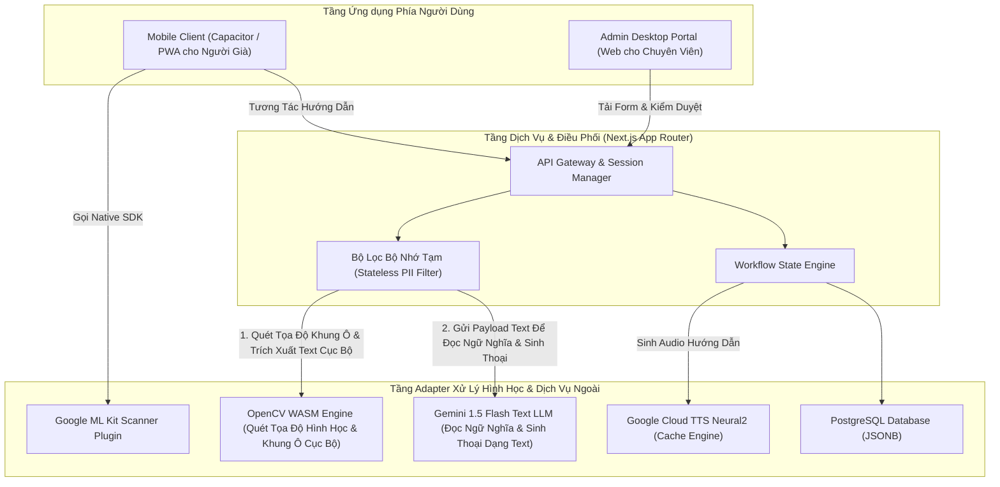
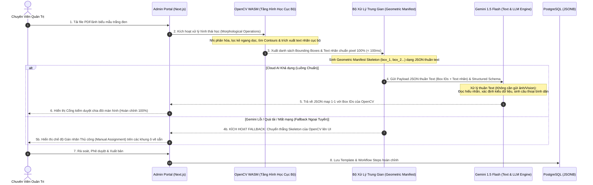

# Khung Kiến trúc Hệ thống (Architecture Spine) — AFL Platform

## 1. Mô hình Kiến trúc Cốt lõi (Design Paradigm)

Hệ thống tuân thủ mô hình **Kiến trúc Lục giác (Hexagonal Architecture / Ports & Adapters)** kết hợp với **Máy trạng thái Quy trình hướng Sự kiện (Event-driven Workflow State Machine)**:

* **Core Domain:** Chứa logic thuần túy về cấu trúc Biểu mẫu (Form Schema), Các bước quy trình (Workflow Steps), Tọa độ Bounding Box, và Quy tắc Ánh xạ Liên chứng từ (Dependency Rules). Không phụ thuộc vào bất kỳ thư viện giao diện hay cơ sở dữ liệu nào.
* **Ports (Giao tiếp nghiệp vụ):**
  * `FormScannerPort`: Nhận diện và nắn thẳng ảnh chụp tài liệu trên thiết bị.
  * `GeometricCVPort`: Thuật toán xử lý ảnh hình học (OpenCV WASM) quét đường kẻ, khung bảng, trích xuất tọa độ ô và nhãn văn bản trên giấy trắng mực đen.
  * `SemanticLLMPort`: Đọc hiểu ngữ nghĩa nhãn trường, cấu trúc điều kiện rẽ nhánh và tự động sinh kịch bản câu thoại tiếng Việt từ dữ liệu dạng Text/JSON (Pure Text LLM).
  * `VoiceEnginePort`: Tạo giọng nói (TTS) và nhận diện giọng nói (STT).
  * `WorkflowRepositoryPort`: Lưu trữ và truy xuất các quy trình biểu mẫu đã phê duyệt.
* **Adapters (Hạ tầng công nghệ cụ thể):**
  * *Scanner Adapter:* Google ML Kit Document Scanner (qua Capacitor) với fallback Web Camera.
  * *Geometric CV Adapter:* OpenCV (`@techstark/opencv-js` / OpenCV WASM) trích xuất tọa độ bounding box hình học pixel-perfect và vùng văn bản.
  * *LLM Semantic Adapter:* Google Gemini 1.5 Flash (Text API với Structured JSON Schema - không dùng Vision) kèm Fallback Manual Assignment khi quá tải/mất mạng.
  * *Voice Adapter:* Google Cloud TTS Neural2 vi-VN (kèm cache) + Web Speech API on-device.
  * *Persistence Adapter:* PostgreSQL (JSONB) kết hợp Prisma ORM / Supabase.

---

## 2. Các Quyết định Bất biến & Quy tắc (Invariants & Rules)



### AD-1: Cấu trúc Fullstack Monorepo kết hợp Vỏ bọc Capacitor
* **Ràng buộc (Binds):** Toàn bộ mã nguồn Frontend (Mobile Client, Admin Portal) và Backend API.
* **Ngăn chặn (Prevents):** Phân mảnh codebase, trùng lặp định nghĩa kiểu dữ liệu (DTO/Types), và độ trễ khi chuyển đổi từ bản Web sang Native App.
* **Quy tắc (Rule):**
  1. Sử dụng **Next.js 14+ (App Router)** trong một monorepo duy nhất bằng TypeScript.
  2. Giao diện người già được đóng gói bằng **Capacitor** để gọi trực tiếp plugin **Google ML Kit Document Scanner** trên thiết bị di động.
  3. Mọi định nghĩa dữ liệu (Form Schema, Bounding Box, Workflow Step) phải dùng chung từ thư mục `@/shared/types`.

### AD-2: Bóc tách Biểu mẫu Tuần tự Hai Tầng (Sequential Pipeline: OpenCV First → AI Semantic Mapping)
* **Ràng buộc (Binds):** FR-1, FR-6, FR-7, FR-8, NFR-4.
* **Ngăn chặn (Prevents):** Sai lệch tọa độ không gian (spatial drift) khi để Vision LLM tự đoán bounding box trên toàn bộ trang A4, giảm tải token và chi phí AI, đồng thời loại bỏ rủi ro tắc nghẽn khi Cloud AI quá tải/mất mạng.
* **Sơ đồ Xử lý Tuần tự Hai Tầng (Sequential Pipeline Flow):**

* **Cấu trúc Dữ liệu Trung gian (Geometric Manifest Schema):**
```typescript
interface FormGeometricManifest {
  formTemplateId: string;
  imageDimensions: { width: number; height: number };
  detectedBoxes: Array<{
    id: string; // Định danh: "box_01", "box_02", ...
    coordinates: [number, number, number, number]; // [ymin, xmin, ymax, xmax] thang chuẩn hóa 0-1000
    rawLabelText?: string; // Nhãn văn bản thô bóc tách được tại vùng lân cận ô
    type: 'input_cell' | 'checkbox' | 'table_cell';
    spatialOrder: number; // Thứ tự quét từ trên xuống dưới, trái qua phải
  }>;
}
```
* **Quy tắc Kỹ thuật (Rules):**
  1. **Tầng 1 - Định vị hình học & trích xuất text cục bộ (OpenCV First):** OpenCV WASM thực thi trước tiên. Sử dụng toán tử hình thái học lọc đường kẻ bảng và ô vuông, trích xuất bounding boxes chuẩn xác pixel ($\ge 98\%$) kèm nhãn văn bản thô, gán định danh duy nhất `box_01`, `box_02`,...
  2. **Tầng 2 - Đóng gói Payload Trung gian Dạng Text:** Hệ thống đóng gói danh sách Box IDs kèm văn bản nhãn thô thành Payload JSON thuần Text gửi sang Gemini (hoàn toàn không gửi file ảnh, không gọi Vision API).
  3. **Tầng 3 - Đọc hiểu ngữ nghĩa & Sinh thoại (Gemini Text LLM Mapping):** Gemini 1.5 Flash hoạt động ở chế độ Text LLM, phân tích ngữ nghĩa các trường hành chính, suy ra kiểu dữ liệu và tự động sinh câu thoại hướng dẫn bình dân cùng chữ mẫu đỏ (`#D32F2F`) với thời gian phản hồi siêu tốc ($< 500\text{ms}$).
  4. **Cơ chế Dự phòng Hoàn hảo (Instant Fallback):** Do OpenCV đã sinh xong toàn bộ Bounding Boxes ở Tầng 1, nếu Tầng 3 (Gemini) thất bại sau 2 lần retry, hệ thống chuyển sang chế độ gán nhãn thủ công ngay tức khắc trên khung ô đã vẽ sẵn mà không làm gián đoạn bất kỳ thao tác nào của chuyên viên.

### AD-3: Kiến trúc Giọng nói Hai Tầng (Hybrid Voice Pipeline)
* **Ràng buộc (Binds):** FR-3, FR-4, NFR-2.
* **Ngăn chặn (Prevents):** Chi phí phát sinh quá mức do gọi API TTS lặp đi lặp lại, độ trễ mạng khi phát hướng dẫn và phụ thuộc hoàn toàn vào kết nối Internet khi đọc form.
* **Quy tắc (Rule):**
  1. **Tầng hướng dẫn tĩnh (90% thời lượng):** Các câu thoại hướng dẫn từng bước của biểu mẫu được sinh sẵn một lần duy nhất khi Admin duyệt form bằng **Google Cloud TTS Neural2** (`vi-VN-Neural2-A` và `vi-VN-Neural2-D`), lưu thành file MP3 trên kho lưu trữ (Storage) và phát lại ở tốc độ chậm rãi **0.9x**.
  2. **Tầng hỏi đáp động (10% thời lượng):** Các câu hỏi thắc mắc ngữ cảnh tức thời của người già được thu âm qua **Web Speech API on-device**, gửi text tới Gemini để nhận câu trả lời ngắn gọn (tối đa 2 câu) và phát âm bằng Web Speech Synthesis.
  3. Mọi thao tác bấm nút Mic của người dùng phải lập tức kích hoạt sự kiện ngắt âm thanh đang phát (`voicePlayer.pause()`).

### AD-4: Lưu trữ Sơ đồ Quy trình động trên PostgreSQL với JSONB
* **Ràng buộc (Binds):** FR-9, FR-10, FR-11.
* **Ngăn chặn (Prevents):** Sự gò bó của bảng CSDL quan hệ truyền thống khi mỗi biểu mẫu hành chính có cấu trúc dòng, cột và chứng từ phụ thuộc hoàn toàn khác nhau.
* **Quy tắc (Rule):**
  1. Bảng `form_templates` chứa metadata chung và định danh văn bản.
  2. Toàn bộ chuỗi các bước hướng dẫn, tọa độ highlight, kịch bản giọng nói và quy tắc ánh xạ chứng từ tiên quyết (Biên bản phạt, Sổ đỏ) được lưu dưới dạng trường `workflow_steps` (kiểu dữ liệu `JSONB`) trong PostgreSQL, truy vấn qua Prisma ORM.

### AD-5: Xử lý Phi lưu trữ Tuyệt đối đối với Dữ liệu Nhạy cảm (Nghị định 13/2023/NĐ-CP)
* **Ràng buộc (Binds):** NFR-3.
* **Ngăn chặn (Prevents):** Nguy cơ rò rỉ dữ liệu nhân thân, hình ảnh CCCD, thông tin xử phạt vi phạm và vi phạm pháp luật về bảo vệ dữ liệu cá nhân tại Việt Nam.
* **Quy tắc (Rule):**
  1. Ảnh chụp giấy tờ tùy thân của người dân (CCCD, Biên bản phạt) chỉ được lưu tạm thời trên bộ nhớ RAM của phiên làm việc (In-memory Session) trong thời gian phục vụ bóc tách thông tin.
  2. Không được phép ghi ảnh chứa thông tin định danh cá nhân xuống ổ cứng cố định (Database Disk / Persistent Object Storage) của hệ thống.
  3. Toàn bộ bộ nhớ đệm của phiên phải được giải phóng hoàn toàn ngay khi người dùng bấm hoàn tất hoặc sau khi phiên làm việc hết hạn (Timeout 15 phút).

---

## 3. Quy ước Kỹ thuật Nhất quán (Consistency Conventions)

| Hạng mục | Quy ước Chuẩn |
|---|---|
| **Đặt tên Mã Biểu mẫu** | Dùng mã hiệu hành chính viết hoa: `MAU_01_LPTB_NHA_DAT`, `MAU_BIEN_BAN_PHAT_GT`. |
| **Định dạng Tọa độ Highlight** | Mảng 4 số nguyên `[ymin, xmin, ymax, xmax]` tương ứng tỉ lệ $[0.0, 1.0]$ của ảnh scan chuẩn. |
| **Định dạng Thời gian** | Chuẩn ISO 8601 theo múi giờ Việt Nam: `YYYY-MM-DDTHH:mm:ss+07:00`. |
| **Quy chuẩn Font & Màu sắc** | Chữ mẫu đỏ hiển thị cho người già bắt buộc dùng mã màu `#D32F2F`, font Sans-serif nét dày (Bold), cỡ chữ $\ge 18\text{pt}$. |
| **Xử lý Lỗi (Error Envelope)** | Định dạng JSON chuẩn: `{ success: boolean, error?: { code: string, message_vi: string } }`. |

---

## 4. Công nghệ Chuẩn mực (Technology Stack Seed)

| Hạng mục | Công nghệ Lựa chọn | Phiên bản Pinned | Mục đích Sử dụng |
|---|---|---|---|
| **Nền tảng Fullstack** | Next.js (App Router) + TypeScript | `^14.2.x` | Xây dựng Mobile Web, Admin Portal và Backend API trong Monorepo. |
| **Vỏ bọc Ứng dụng Di động** | Capacitor | `^6.x` | Đóng gói Web thành Native Android App và kết nối phần cứng. |
| **Máy quét Biểu mẫu** | Google ML Kit Document Scanner Plugin | `@capacitor-community/mlkit-document-scanner` | Tự động căn góc, nắn thẳng phối cảnh và lọc bóng tờ khai giấy. |
| **Trí tuệ Nhân tạo Ngôn ngữ** | Google Gemini 1.5 Flash (Text & LLM Engine) | API v1beta | Đọc hiểu ngữ nghĩa nhãn trường, phân tích logic rẽ nhánh và tự động sinh câu thoại bình dân từ dữ liệu text (không dùng Vision). |
| **Xử lý Ảnh Hình học (Computer Vision)** | OpenCV (`@techstark/opencv-js` / OpenCV WASM) | `^4.9.x` | Quét đường kẻ ngang dọc, khung bảng, ô vuông và trích xuất text nhãn cục bộ bằng Morphological Operations. |
| **Hạ tầng Giọng nói TTS** | Google Cloud Text-to-Speech | Neural2 Engine | Sinh file MP3 giọng đọc tiếng Việt ấm áp (giọng Bắc `vi-VN-Neural2-A`, Nam `vi-VN-Neural2-D`). |
| **Cơ sở Dữ liệu** | PostgreSQL + Prisma ORM | `PostgreSQL 16` / `Prisma 5.x` | Lưu trữ Thư viện Biểu mẫu và Sơ đồ Quy trình dạng JSONB. |
| **Lưu trữ File Tĩnh (Storage)** | Cloudflare R2 / Supabase Storage | S3-Compatible API | Lưu trữ file PDF biểu mẫu gốc và các file MP3 giọng đọc đã duyệt. |
| **Sơ đồ Quy trình Kéo-Thả (Workflow Canvas)** | React Flow (`@xyflow/react`) + `@dagrejs/dagre` | `^12.x` / `^1.x` | Dựng màn hình Sơ đồ Quy trình (CRM Workflow Builder), kéo-thả các khối bước và tự động xếp cây logic (Auto-layout). |
| **Giao diện & Thành phần UI** | Tailwind CSS + Radix UI (shadcn/ui) | Phiên bản mới nhất | Đảm bảo chuẩn trợ năng tương phản cao WCAG AAA và nút bấm lớn cho người cao tuổi. |

---

## 5. Cấu trúc Thư mục Nguồn (Structural Seed & Team Directory Ownership)

```text
afl-platform/
├── android/                   # Dự án Native Android được sinh bởi Capacitor
├── assets/
│   ├── mock-data/             # Dữ liệu giả lập mẫu (Pha 0 - Walking Skeleton)
│   │   ├── contracts.ts       # Hợp đồng TypeScript Ổ cắm bất biến
│   │   ├── mock-manifest.json # Tọa độ 9 ô mẫu tờ khai trước bạ (Người 3 -> 4)
│   │   ├── mock-workflow.json # Kịch bản mẫu gồm thoại 0.9x + chữ đỏ (Người 4 -> 2)
│   │   └── README.md          # Hướng dẫn sử dụng mock data cho cả nhóm
│   └── test-form.jpg          # Ảnh scan tờ khai mẫu để test OpenCV
├── docs/                      # Thư mục tài liệu dự án hoàn chỉnh
├── src/
│   ├── app/                   # Tuyến ứng dụng Next.js (App Router)
│   │   ├── (citizen)/         # Giao diện người cao tuổi (Mobile Viewport)
│   │   │   ├── scan/          # Màn hình chụp & hiển thị Visual Twin kèm highlight (FR-1)
│   │   │   └── guide/         # Màn hình dẫn dắt từng bước bằng giọng nói & chữ đỏ (FR-3, FR-5)
│   │   ├── (admin)/           # Giao diện Cán bộ Một cửa (Desktop Viewport)
│   │   │   ├── upload/        # Tải file PDF biểu mẫu mới
│   │   │   ├── review/        # Cổng kiểm duyệt chia đôi màn hình Split-screen (FR-9)
│   │   │   └── library/       # Quản lý thư viện biểu mẫu & xuất mã QR (FR-11)
│   │   └── api/               # Tuyến API trung gian kết nối AI & CSDL
│   │       ├── ingest/        # Bóc tách biểu mẫu mới (FR-7)
│   │       ├── llm/           # Gọi Gemini 1.5 Flash sinh kịch bản & hỏi đáp (FR-4, FR-8)
│   │       │   ├── prompt/
│   │       │   └── qa/
│   │       ├── tts/           # Google Cloud TTS sinh audio hướng dẫn 0.9x (FR-3)
│   │       └── workflows/     # CRUD quy trình biểu mẫu (FR-11)
│   ├── components/
│   │   ├── mobile/            # NGƯỜI 2: Visual Twin, Pulsing Highlighter, Red Text
│   │   ├── admin/             # NGƯỜI 2: Split-Screen Review Gate, React Flow Canvas
│   │   └── ui/                # Thành phần UI dùng chung chuẩn WCAG AAA (shadcn/ui)
│   ├── core/                  # Core Business Domain (Logic thuần túy, Người 1 quản lý)
│   │   ├── workflow-engine.ts # Quản lý máy trạng thái từng bước điền form
│   │   └── dependency.ts      # Xử lý quy tắc liên chứng từ (FR-6, FR-10)
│   ├── modules/
│   │   ├── opencv/            # NGƯỜI 3: Thuật toán OpenCV WASM (FR-1, FR-7)
│   │   └── voice-ai/          # NGƯỜI 4: Prompt Gemini & Trợ lý Giọng nói (FR-3, FR-4, FR-8)
│   ├── config/
│   │   └── app.config.ts      # Công tắc Mock Switcher (useMockData = true)
│   └── shared/
│       ├── contracts.ts       # Hợp đồng TypeScript Bất biến (Ổ cắm giao tiếp giữa 4 người)
│       └── types/             # TypeScript types mở rộng dùng chung
├── capacitor.config.ts        # Cấu hình Capacitor tích hợp Google ML Kit Plugin
└── package.json
```

---

## 6. Ánh xạ Năng lực Yêu cầu sang Kiến trúc (Capability Mapping)

| Mã Yêu cầu (PRD) | Vị trí Hiện thực trong Mã nguồn | Thành phần Kỹ thuật Chi phối |
|---|---|---|
| **FR-1: Nhận diện biểu mẫu** | `src/app/(citizen)/scan/` & `src/modules/opencv/` | Google ML Kit Plugin + OpenCV WASM nắn thẳng |
| **FR-2: Bản sao thị giác & Highlight** | `src/components/mobile/` | Tọa độ `bounding_box` chuẩn hóa vẽ viền nhấp nháy trên canvas/SVG |
| **FR-3: Trợ lý giọng nói từng dòng** | `src/modules/voice-ai/` & `src/app/api/tts/` | Google Cloud TTS Neural2 0.9x + Audio cache |
| **FR-4: Hỏi đáp ngữ cảnh** | `src/modules/voice-ai/` & `src/app/api/llm/qa/` | Web Speech API on-device + Gemini 1.5 Flash Text Q&A |
| **FR-5: Chữ mẫu đỏ tương phản cao** | `src/components/mobile/` & `src/app/(citizen)/guide/` | Chữ mẫu đỏ `#D32F2F`, cỡ chữ $\ge 18\text{pt}$ |
| **FR-6: Quét chứng từ tiên quyết** | `src/core/dependency.ts` & `src/modules/opencv/` | Luồng bóc tách dữ liệu gốc trước khi chạy workflow chính |
| **FR-7: Bóc tách biểu mẫu mới** | `src/modules/opencv/` & `src/app/api/ingest/` | OpenCV WASM (Hình học & nhãn thô) |
| **FR-8: Tự sinh kịch bản tiếng Việt** | `src/modules/voice-ai/` & `src/app/api/llm/prompt/` | Prompt Gemini 1.5 Flash sinh câu thoại bình dân & chữ đỏ |
| **FR-9: Cổng kiểm duyệt chia đôi** | `src/components/admin/` & `src/app/(admin)/review/` | Split-Screen Editor + Vẽ box thủ công |
| **FR-10: Cấu hình liên chứng từ** | `src/components/admin/` & `src/core/dependency.ts` | Node-based Dependency Editor (React Flow) + PostgreSQL JSONB |
| **FR-11: Quản lý thư viện & Mã QR** | `src/app/(admin)/library/` & `src/app/api/workflows/` | CRUD Biểu mẫu + QRCode Generator |

---

## 7. Các Quyết định Trì hoãn sang Giai đoạn Sau (Deferred Decisions)

* **Tích hợp Cổng Định danh Điện tử Quốc gia VNeID:** Tạm hoãn đến giai đoạn 2 khi hệ thống triển khai chính thức cấp quận/huyện để kết nối qua trục liên thông quốc gia (LGSP).
* **Chế độ Ngoại tuyến Hoàn toàn (Offline-first Mode):** Tạm hoãn; bản MVP yêu cầu thiết bị có kết nối mạng (4G/Wifi) để đảm bảo độ chính xác tối đa từ mô hình AI đám mây.
* **Thanh toán Trực tuyến:** Chưa tích hợp cổng thanh toán phí/lệ phí điện tử; tập trung giải quyết trọn vẹn khâu kê khai giấy tờ chính xác tại chỗ.
