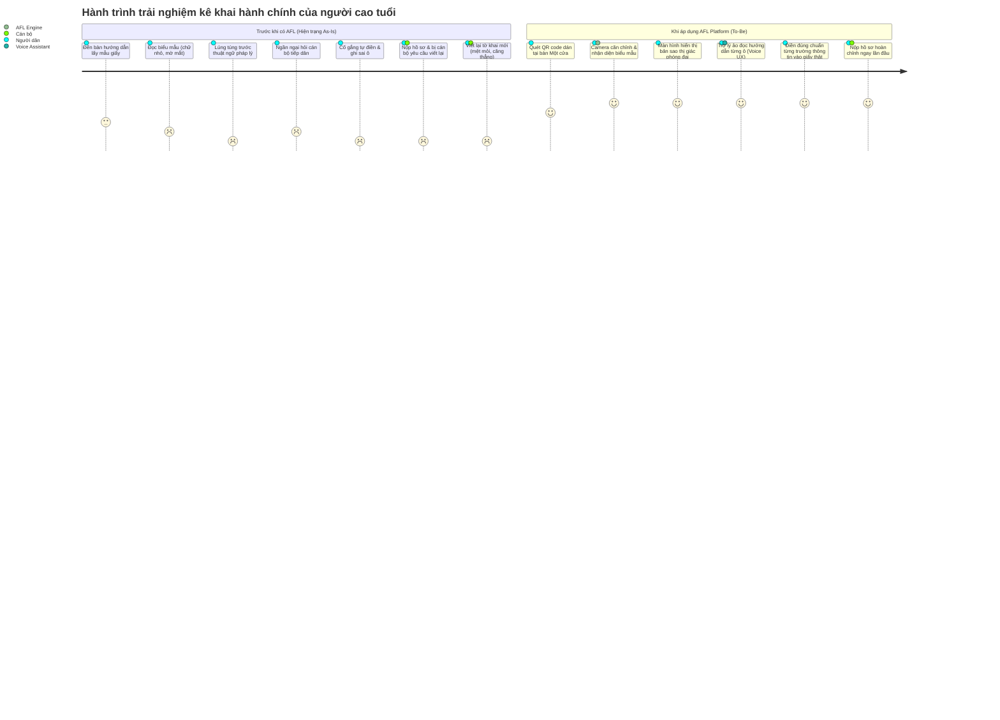
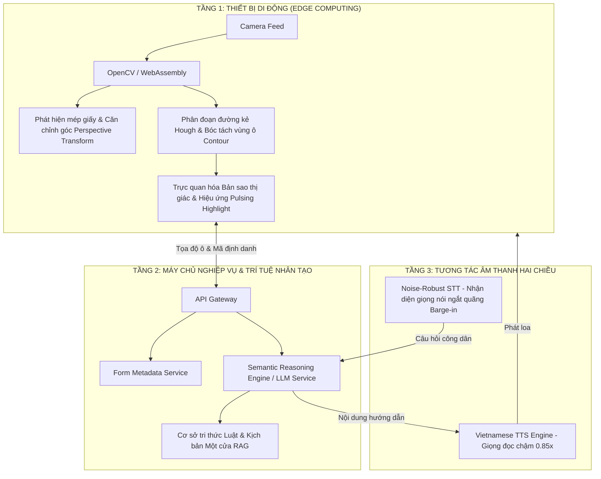
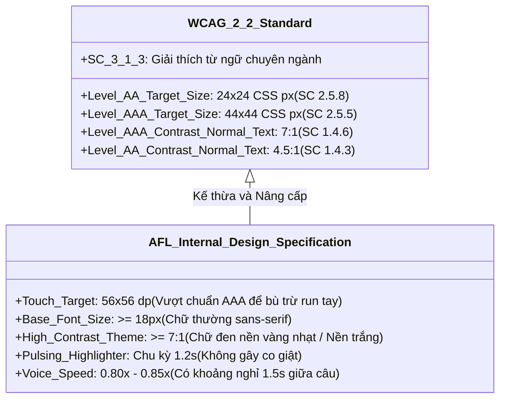
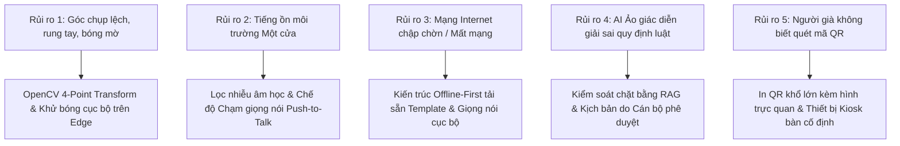
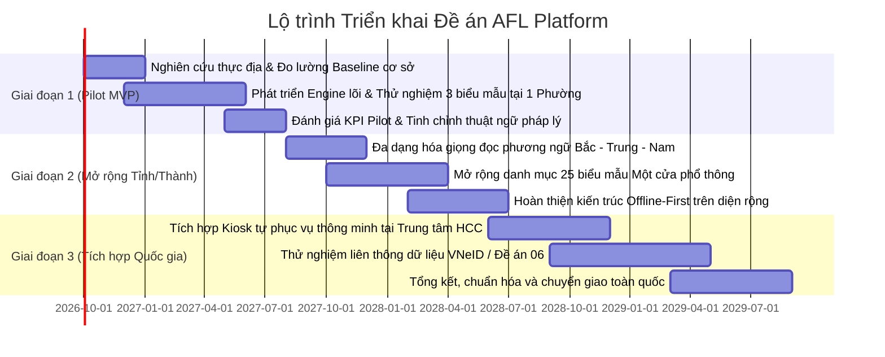

# Báo cáo Nghiên cứu Sản phẩm Chuyên sâu: AFL Platform
*(AI Form Locator & Assistant for Elderly Citizens)*

---

## TỔNG QUAN PHƯƠNG PHÁP & MA TRẬN PHÂN ĐỊNH DỮ LIỆU (EVIDENCE CLASSIFICATION)

Để đảm bảo tính trung thực học thuật và cơ sở khoa học vững chắc cho đề án phát triển nền tảng AFL Platform, toàn bộ các số liệu và nhận định trong báo cáo được đối chiếu và phân định rõ ràng theo 3 cấp độ:
1. **Dữ liệu kiểm chứng thực tế (Empirical Evidence / Verified Facts):** Số liệu thống kê chính thức được công bố từ Tổng cục Thống kê (GSO), Liên Hợp Quốc (UNFPA), Ngân hàng Thế giới (World Bank) và các văn bản quy phạm pháp luật của Nhà nước.
2. **Dự báo chính thức (Official Projections):** Mô hình hóa xu hướng nhân khẩu học từ các tổ chức nghiên cứu uy tín trong giai đoạn 2024–2040.
3. **Giả thuyết sản phẩm & Mục tiêu đo kiểm Pilot (Product Hypotheses / Pilot Baseline Targets):** Các chỉ số đo lường hiệu năng, tỷ lệ giảm tải cán bộ, tỷ lệ chính xác lần đầu cần được kiểm chứng thực tế trong giai đoạn thử nghiệm (Pilot phase) tại cơ sở, không đánh tráo thành dữ liệu thực tế đã có sẵn.

| Hạng mục chỉ số / Nhận định | Nguồn tham chiếu / Căn cứ | Phân loại trạng thái |
| :--- | :--- | :--- |
| Dân số người cao tuổi (60+) đạt 14,2 triệu (2024) | Tổng cục Thống kê (GSO) [1] | **Dữ liệu kiểm chứng (Fact)** |
| Dân số 65+ chiếm 9,3%; Chỉ số già hóa 60,2% (2024) | Tổng cục Thống kê (GSO) [1] | **Dữ liệu kiểm chứng (Fact)** |
| Dự báo nhóm 60+ đạt ~18 triệu người vào năm 2030 | Tổng cục Thống kê [1] & UNFPA [2] | **Dự báo chính thức (Projection)** |
| Dự báo nhóm 60+ đạt 22,8 triệu (2039), 31,7 triệu (2069) | UNFPA Vietnam Projections [2][3] | **Dự báo chính thức (Projection)** |
| Tốc độ già hóa nhanh, đạt "xã hội già" vào khoảng 2035–2036 | UNFPA [4] & World Bank [5][6] | **Dự báo chính thức (Projection)** |
| Chiến lược phát triển Chính phủ số đến 2025, định hướng 2030 | Quyết định 942/QĐ-TTg [7] | **Căn cứ pháp lý chính thức** |
| Quy định thực hiện TTHC trên môi trường điện tử | Nghị định 45/2020/NĐ-CP [8], sửa đổi bởi NĐ 310/2026/NĐ-CP [9] | **Căn cứ pháp lý chính thức** |
| Đề án dữ liệu dân cư, định danh và xác thực điện tử | Đề án 06/CP (Quyết định 06/QĐ-TTg) [20] | **Căn cứ pháp lý chính thức** |
| Quy chuẩn bảo vệ dữ liệu cá nhân & xử lý hình ảnh giấy tờ | Nghị định 13/2023/NĐ-CP [10] | **Căn cứ pháp lý chính thức** |
| Tiêu chuẩn trợ năng web/ứng dụng số (Target Size, Contrast) | W3C WCAG 2.2 [11][18] | **Tiêu chuẩn kỹ thuật quốc tế** |
| Khả năng nhận diện văn bản tiếng Việt của Google Lookout | Google Accessibility [12] | **Đặc tính đối thủ xác thực** |
| Khả năng xử lý thị giác/văn bản của Seeing AI, Be My AI, Adobe Scan | Microsoft [13][19], Be My Eyes [14][15], Adobe [16][17] | **Đặc tính đối thủ xác thực** |
| Tỷ lệ người cao tuổi gặp khó khăn khi kê khai TTHC | Khảo sát thực tế cơ sở / Báo cáo phân tích địa phương | **Khoảng trống bằng chứng (Evidence Gap - Cần pilot)** |
| Cán bộ mất trung bình X phút hướng dẫn mỗi tờ khai sai | Ghi nhận thực tế Một cửa | **Khoảng trống bằng chứng (Evidence Gap - Cần pilot)** |
| AFL giúp giảm >30% áp lực hướng dẫn cho cán bộ | Ước tính mô hình vận hành AFL | **Giả thuyết sản phẩm (Product Hypothesis)** |
| Tỷ lệ hoàn thành đúng ngay lần đầu (First-Time Right) >90% | Chỉ tiêu mục tiêu thiết kế hệ thống | **Chỉ số mục tiêu (Target KPI)** |

---

## PHẦN 1: NGHIÊN CỨU THỊ TRƯỜNG & ĐỘ LỚN VẤN ĐỀ

### 1. Quy mô dân số cao tuổi và tốc độ già hóa tại Việt Nam
- **Quy mô dân số cao tuổi:** Theo Tổng Cục Thống kê (2024), Việt Nam có gần **14,2 triệu** người từ 60 tuổi trở lên (chiếm ~14–15% dân số). Dự báo đến năm 2030, con số này tăng lên khoảng **18 triệu** (từ 14,2 triệu năm 2024, tức tăng ~4 triệu), và tiếp tục đạt khoảng **20% dân số vào giữa thập niên 2030** [1]. Nhóm dân số từ 65 tuổi trở lên hiện chiếm 9,3% tổng dân số cả nước, và chỉ số già hóa năm 2024 đã chạm mức 60,2% [1].
- **Dự báo trung và dài hạn:** Theo các kịch bản dự báo nhân khẩu học dài hạn của UNFPA Vietnam, nhóm dân số 60+ sẽ tiếp tục tăng vọt lên **22,8 triệu người vào năm 2039** (chiếm hơn 20% dân số) và chạm mốc **31,7 triệu người vào năm 2069** [2][3]. 
- **Đặc thù "Chưa giàu đã già":** Cả UNFPA [4] và Ngân hàng Thế giới (World Bank) [5][6] đều nhấn mạnh Việt Nam là một trong những quốc gia có tốc độ già hóa dân số nhanh nhất thế giới. Quá trình chuyển từ "xã hội già hóa" (aging society - người từ 65 tuổi chiếm 7%) sang "xã hội già" (aged society - người từ 65 tuổi chiếm 14%) của Việt Nam chỉ diễn ra trong vòng khoảng 20 năm (dự kiến hoàn tất vào năm 2035–2036) [3][5], ngắn hơn rất nhiều so với các quốc gia phát triển như Pháp (115 năm), Thụy Điển (85 năm) hay Nhật Bản (26 năm). Đáng chú ý, Việt Nam già hóa ở mức thu nhập bình quân đầu người thấp hơn đáng kể so với các nước phát triển cùng giai đoạn [5], tạo ra áp lực khổng lồ lên hệ thống an sinh xã hội và dịch vụ công.

### 2. Thực trạng rào cản tiếp cận thủ tục hành chính của người cao tuổi
- **Rào cản "3 không":** Báo cáo khảo sát thực tiễn tại nhiều địa phương ghi nhận đại bộ phận người cao tuổi, đặc biệt ở khu vực nông thôn, đang đối mặt với tình trạng "3 không": *không có điện thoại thông minh cấu hình đủ mạnh, không có tài khoản định danh số/ngân hàng, và không đủ kỹ năng thao tác công nghệ*. Thêm vào đó, tâm lý e ngại thao tác số do sợ bấm nhầm, sợ lừa đảo qua mạng hoặc vô tình làm lộ lọt thông tin cá nhân khiến người cao tuổi thường né tránh các nền tảng trực tuyến.
- **Lưu ý về phương pháp luận số liệu:** Mặc dù chưa có một điều tra thống kê quy mô quốc gia công bố con số tuyệt đối "X% người cao tuổi gặp khó khăn khi làm thủ tục hành chính", các khảo sát định tính và quan sát thực địa tại các Trung tâm Phục vụ Hành chính công đều chỉ ra rằng phần lớn người trên 65 tuổi khi đến giao dịch trực tiếp đều phải nhờ cậy sự hỗ trợ từ cán bộ tiếp nhận hoặc người thân đi cùng. Đây chính là *khoảng trống bằng chứng (evidence gap)* mà các đợt nghiên cứu thực địa chuyên sâu (primary research) và giai đoạn chạy thử nghiệm (pilot) của dự án AFL cần tiến hành đo lường định lượng chi tiết.

### 3. Ba "nỗi đau" (Pain Points) cốt lõi của người cao tuổi tại Bộ phận Một cửa
1. **Suy giảm chức năng thị giác và vận động tinh (Khó nhìn & Khó viết):** Quá trình lão hóa tự nhiên làm giảm thị lực (viễn thị, đục thủy tinh thể, suy giảm độ nhạy tương phản), khiến người cao tuổi gặp khó khăn lớn khi đọc các biểu mẫu hành chính in chữ nhỏ (thường cỡ 9–10pt). Hiện tượng run tay sinh lý (essential tremor) và viêm khớp thoái hóa khiến việc viết tay đúng dòng, nắn nót trong các ô kẻ chật hẹp trở thành một gánh nặng thể chất.
2. **Rào cản ngôn ngữ hành chính và thuật ngữ pháp lý:** Các tờ khai hành chính (khai sinh, đăng ký kết hôn, sang tên quyền sử dụng đất, khai nhận thừa kế...) chứa nhiều thuật ngữ pháp lý cô đọng, dễ gây hiểu nhầm (ví dụ: phân biệt "nơi đăng ký hộ khẩu thường trú", "nơi tạm trú", "nơi cư trú", "người yêu cầu", "người được khai"). Người cao tuổi rất dễ điền sai thông tin do không hiểu bản chất ngữ nghĩa quy định.
3. **Tâm lý sợ sai và ngại phiền hà:** Đa số người cao tuổi có tâm lý e ngại bị coi là phiền toái, sợ làm mất thời gian của công chức tiếp dân hoặc sợ bị quở trách nơi đông người khi hỏi đi hỏi lại nhiều lần. Sự e dè này dẫn đến hành vi "đoán mò" và tự ý điền thông tin, dẫn tới tỷ lệ khai sai sót rất cao.

### 4. Nỗi đau và áp lực vận hành của cán bộ Bộ phận Một cửa
- **Tình trạng quá tải cục bộ:** Các điểm tiếp nhận Một cửa cấp xã/phường và quận/huyện thường xuyên tiếp nhận số lượng hồ sơ lớn mỗi ngày (trung bình 30–50 lượt tiếp dân/cán bộ/ngày). Khi tiếp đón công dân cao tuổi, cán bộ buộc phải dành từ 15–25 phút chỉ để đọc từng câu, giải thích từng từ và chỉ tay vào từng ô trên giấy.
- **Vòng lặp sửa đổi tốn kém nguồn lực:** Mỗi khi tờ khai bị ghi sai hoặc bôi xóa không hợp lệ, quy trình buộc cán bộ phải phát phôi giấy mới, hướng dẫn công dân viết lại từ đầu, làm kéo dài thời gian chờ đợi của hàng đợi phía sau (bottleneck), gia tăng sự căng thẳng trong không gian hành chính công.

### 5. Căn cứ chính sách và Khung thể chế quốc gia
AFL Platform được định vị hoàn toàn phù hợp và là mắt xích hỗ trợ đắc lực cho các chiến lược quốc gia trọng điểm của Chính phủ Việt Nam:
- **Chiến lược phát triển Chính phủ số giai đoạn 2021–2025, định hướng đến năm 2030 (Quyết định số 942/QĐ-TTg ngày 15/06/2021 của Thủ tướng Chính phủ):** Chiến lược xác định quan điểm "Chuyển đổi số để phục vụ người dân, lấy người dân và doanh nghiệp làm trung tâm", nhấn mạnh mục tiêu bao trùm xã hội, đảm bảo mọi tầng lớp nhân dân đều được thụ hưởng thành quả của dịch vụ công hiện đại, không ai bị bỏ lại phía sau [7].
- **Quy định về thực hiện thủ tục hành chính trên môi trường điện tử (Nghị định số 45/2020/NĐ-CP [8] và Nghị định số 310/2026/NĐ-CP [9]):** Mặc dù Nhà nước đẩy mạnh đưa 100% thủ tục đủ điều kiện lên trực tuyến, thực tế pháp lý và xã hội thừa nhận việc chuyển dịch phương thức thực hiện TTHC sang môi trường điện tử không đồng nghĩa với việc mọi công dân đều có đủ năng lực công nghệ để tự thao tác trực tiếp [8][9]. Do đó, AFL đóng vai trò là một **lớp trợ năng tiếp cận (Accessibility Layer)** trung gian, giúp bắc cầu giữa tài liệu giấy truyền thống và luồng dữ liệu số hóa.
- **Đề án phát triển ứng dụng dữ liệu về dân cư, định danh và xác thực điện tử (Đề án 06/CP - Quyết định số 06/QĐ-TTg):** Định hướng kết nối liên thông dữ liệu dân cư, làm sạch dữ liệu từ gốc và giảm thiểu việc công dân phải mang theo quá nhiều giấy tờ chứng thực [20].
- **Tiêu chuẩn thiết kế hòa nhập số:** Tuân thủ theo các hướng dẫn chuẩn hóa quốc tế như W3C WCAG 2.2 [11] và định hướng quy chuẩn kỹ thuật quốc gia về khả năng tiếp cận của người khuyết tật và người cao tuổi đối với cổng/trang thông tin điện tử và ứng dụng di động.

---

## PHẦN 2: PHÂN TÍCH CHÂN DUNG NGƯỜI DÙNG & BẢN ĐỒ HÀNH TRÌNH

### 1. Chân dung người dùng (User Personas)

#### Persona 1: Công dân cao tuổi (Primary End-User)
- **Họ và tên:** Bác Trần Văn An (70 tuổi, cán bộ hưu trí).
- **Bối cảnh thể chất & kỹ năng:** Thị lực suy giảm (đeo kính lão viễn thị nặng), bàn tay hơi run khi cầm bút viết lâu; đang sử dụng điện thoại thông minh phổ thông màn hình lớn nhưng chỉ quen nghe gọi, đọc báo mạng và gọi video cho con cháu.
- **Mục tiêu:** Tự mình hoàn thành Tờ khai đăng ký khai sinh cho cháu nội tại UBND phường một cách nhanh chóng, đúng quy định, không phải viết lại nhiều lần.
- **Nỗi sợ & Trở ngại:** Sợ làm sai thông tin ảnh hưởng đến giấy tờ hộ tịch của cháu; sợ thuật ngữ hành chính khó hiểu; ngại hỏi cán bộ nhiều lần vì sợ bị đánh giá là phiền phức.

#### Persona 2: Cán bộ tiếp nhận Một cửa (Secondary User / Administrator)
- **Họ và tên:** Đồng chí Lê Thu Trang (31 tuổi, công chức Tư pháp - Hộ tịch).
- **Bối cảnh & Áp lực:** Phải xử lý từ 35–45 bộ hồ sơ mỗi ngày; vừa phải giải quyết thủ tục trên phần mềm Một cửa điện tử, vừa phải trực tiếp tiếp công dân tại quầy tiếp đón.
- **Mục tiêu:** Hồ sơ nộp vào đạt chuẩn tính pháp lý ngay lần đầu (First-time-right); giải tỏa áp lực hàng đợi tại quầy tiếp đón; giảm thiểu thời gian phải trực tiếp ngồi giải thích từng ô tờ khai.
- **Trở ngại:** Mất quá nhiều thời gian giải thích cho các bác lớn tuổi; căng thẳng tâm lý khi người dân bực bội vì phải chờ đợi lâu.

---

### 2. Bản đồ hành trình trải nghiệm (Customer Journey Map: As-Is vs. To-Be)

### 3. Đánh giá tác động thay đổi trải nghiệm
- **Hiệu quả định lượng kỳ vọng (Pilot Hypothesis):**
  - **Tỷ lệ đúng ngay từ lần đầu (First-Time Right Rate):** Đặt mục tiêu nâng từ mức ước tính hiện nay (~60%) lên **>90%** trong môi trường thử nghiệm.
  - **Thời gian hoàn thành biểu mẫu:** Rút ngắn thời gian trung bình từ 18–25 phút xuống còn **10–12 phút/hồ sơ**.
- **Hiệu quả tâm lý & xã hội:** 
  - Công dân cao tuổi lấy lại sự tự tin, giảm bớt căng thẳng thể chất và cảm giác phụ thuộc vào người khác khi thực hiện quyền công dân.
  - Cán bộ Một cửa giải phóng được ít nhất **30% thời gian** hướng dẫn cơ học, tập trung nguồn lực thẩm định nghiệp vụ và nâng cao chỉ số hài lòng của nền hành chính (SIPAS).

---

## PHẦN 3: PHÂN TÍCH ĐỐI THỦ CẠNH TRANH & ĐỊNH VỊ GIẢI PHÁP

### 1. Đánh giá các nhóm giải pháp tương đương hiện nay

#### A. Cổng Dịch vụ công Quốc gia & Hệ thống VNeID
- **Bản chất:** Hệ thống dịch vụ công trực tuyến cấp quốc gia, yêu cầu người dân nhập liệu hoàn toàn trên giao diện web/ứng dụng di động và thực hiện ký số/xác thực tài khoản định danh điện tử cấp độ 2 [8][20].
- **Ưu điểm:** Chính thống, dữ liệu liên thông tập trung, mức độ an toàn bảo mật cao.
- **Hạn chế đối với người cao tuổi:** Rào cản bàn phím ảo (virtual keyboard) trên màn hình nhỏ; thao tác nhập liệu phức tạp; các bước xác thực OTP, chữ ký số gây lúng túng; người cao tuổi thường thiếu kỹ năng gõ bàn phím tiếng Việt có dấu.

#### B. Điền biểu mẫu giấy truyền thống có bảng mẫu hướng dẫn tại chỗ
- **Bản chất:** Đặt các bảng mica chứa tờ khai mẫu đã điền sẵn chữ đỏ tại bàn hướng dẫn của cơ quan Một cửa.
- **Ưu điểm:** Không yêu cầu thiết bị công nghệ, chi phí đầu tư ban đầu thấp.
- **Hạn chế:** Thiếu tính tương tác; người già thị lực kém vẫn không thể đọc được chữ nhỏ trên bảng mica; không thể giải đáp ngữ cảnh cá nhân của từng trường hợp cụ thể; dẫn đến tỷ lệ điền sai sót vẫn ở mức cao.

#### C. Các ứng dụng trợ năng thị giác quốc tế (Lookout, Seeing AI, Be My Eyes)
- **Google Lookout [12]:** Ứng dụng trợ năng của Google trên nền tảng Android dành cho người khiếm thị/thị lực kém, sử dụng camera và thị giác máy tính để đọc văn bản, quét tài liệu, nhận dạng vật thể và hỗ trợ điều chỉnh tốc độ đọc, cỡ chữ, độ tương phản. *Đáng lưu ý:* Google Lookout đã hỗ trợ nhận diện và đọc văn bản tiếng Việt [12].
- **Microsoft Seeing AI [13][19]:** Giải pháp AI thị giác của Microsoft hỗ trợ đọc văn bản in, nhận diện chữ viết tay (handwritten text recognition), quét mã vạch và mô tả không gian xung quanh cho người khiếm thị [13][19].
- **Be My Eyes & Be My AI [14][15]:** Ứng dụng kết nối tình nguyện viên hỗ trợ thị giác từ xa, tích hợp mô hình Be My AI (ứng dụng mô hình đa phương thức GPT-4 Vision) để đọc tài liệu, mô tả hình ảnh và giải đáp câu hỏi ngữ cảnh sâu [14][15].
- **Hạn chế chung của nhóm này:** Được phát triển cho mục đích trợ năng thị giác tổng quát (general-purpose accessibility), hoàn toàn không được thiết kế cho quy trình nghiệp vụ hành chính công; không có tính năng định vị tọa độ từng trường của biểu mẫu (field-level localization); không hiểu được quy định pháp luật và ngữ nghĩa thủ tục hành chính Việt Nam; thiếu cơ chế điều hướng thị giác theo từng bước viết tay.

#### D. Ứng dụng quét tài liệu OCR truyền thống (Adobe Scan, CamScanner)
- **Adobe Scan [16][17] & CamScanner:** Các ứng dụng di động hàng đầu về số hóa tài liệu, tích hợp các thuật toán tự động nhận diện mép giấy (edge detection), nắn thẳng phối cảnh (perspective correction), khử bóng đổ/loá sáng (shadow/glare removal) và bóc tách chữ in/viết tay thành PDF/Text [16][17].
- **Hạn chế:** Chỉ phục vụ tác vụ tĩnh (quét và lưu trữ sau khi đã viết xong), hoàn toàn không hỗ trợ người dùng *trong quá trình đang đặt bút viết*; không có giao diện giọng nói hướng dẫn tương tác; đòi hỏi thao tác căn chỉnh phức tạp.

---

### 2. Bảng so sánh cạnh tranh trực diện

| Tiêu chí so sánh | Cổng DVC / VNeID | Điền giấy thủ công | Google Lookout [12] | Seeing AI [13][19] | Be My AI [15] | Adobe Scan [16][17] | **AFL Platform** |
| :--- | :---: | :---: | :---: | :---: | :---: | :---: | :---: |
| **Bảo tồn thói quen viết tay của người già** | ✗ | ✓ | ✓ | ✓ | ✓ | ✗ | **✓ (Trọng tâm)** |
| **Trợ lý giọng nói tiếng Việt chuyên sâu** | ✗ | ✗ | Có (TTS đọc chữ) | Hạn chế | Có (Hỏi đáp) | ✗ | **✓ (Voice UX chuyên biệt)** |
| **Bản sao thị giác phóng đại (Visual Twin)** | ✗ | ✗ | ✗ | ✗ | ✗ | ✗ | **✓ (Công nghệ lõi)** |
| **Định vị & dẫn hướng từng ô (Field-by-field)** | ✗ | ✗ | ✗ | ✗ | ✗ | ✗ | **✓ (Core Workflow)** |
| **Hiểu sâu quy định pháp lý TTHC Việt Nam** | ✗ (Chỉ có mẫu) | ✗ | ✗ | ✗ | ✗ | ✗ | **✓ (Knowledge Base RAG)** |
| **Cổng quản trị (Admin Portal) cho cán bộ** | ✓ | ✗ | ✗ | ✗ | ✗ | ✗ | **✓ (Cấu hình kịch bản)** |
| **Điểm chạm tiếp cận bằng QR tại bàn Một cửa** | ✗ | ✗ | ✗ | ✗ | ✗ | ✗ | **✓ (Zero-install web/app)** |

---

### 3. Phân tích đối sánh chuyên sâu: Be My AI vs. AFL Platform

Nhận diện rõ ranh giới năng lực giữa mô hình AI thị giác tiên tiến nhất hiện nay (Be My AI) và AFL Platform giúp xác định chính xác giá trị khác biệt:

| Năng lực công nghệ / Nghiệp vụ | Be My AI (OpenAI GPT-4V based) [14][15] | AFL Platform (Chuyên biệt hóa) |
| :--- | :--- | :--- |
| **Thấu hiểu hình ảnh và văn bản tổng quát** | **Rất mạnh (Global Benchmark)** | Đạt mức tốt (Chuyên sâu tài liệu hành chính) |
| **Hỏi đáp tự do theo ngữ cảnh hình ảnh** | **Rất mạnh (Tương tác tự do)** | Giới hạn trong phạm vi nghiệp vụ biểu mẫu để chống ảo giác |
| **Nhận diện phân vùng từng ô biểu mẫu (Segmentation)** | Xử lý ngầm qua LLM, không sinh tọa độ trực quan | **Bóc tách tọa độ pixel chính xác bằng Edge Computer Vision** |
| **Dẫn đường thị giác (Visual Guidance Overlay)** | Không có (Chỉ trả lời bằng âm thanh hoặc chữ) | **Hiển thị viền sáng nhấp nháy (Pulsing Box) trực tiếp trên ô** |
| **Kiến thức quy trình hành chính công địa phương** | Kiến thức chung chung, không cập nhật quy định xã/phường | **Được chuẩn hóa và kiểm duyệt bởi cán bộ qua Admin Portal** |
| **Cơ chế hoạt động ngoại tuyến (Offline Resilience)** | Hoàn toàn phụ thuộc Internet và Cloud API | **Chế độ lai: Hỗ trợ dẫn đường cơ bản kể cả khi mất mạng** |

---

### 4. Định vị Lợi thế Cạnh tranh & Rào cản Phòng thủ (Moat)

> **Nhận thức sống còn về rào cản công nghệ:** Các năng lực như *Chụp ảnh căn chỉnh góc (Perspective Transform)*, *Khử bóng/nhiễu* hay *Nhận dạng ký tự quang học (OCR)* đã được các tập đoàn như Adobe [16][17] và Google giải quyết hoàn hảo. Do đó, **công nghệ quét ảnh và OCR đơn thuần KHÔNG THỂ là con hào kinh tế (Moat) của AFL Platform.**

Con hào phòng thủ thực sự của AFL Platform chỉ được hình thành sau quá trình tích lũy tài nguyên nghiệp vụ độc quyền:
1. **Thư viện biểu mẫu chuẩn hóa (Form Library & Ground Truth Data):** Kho dữ liệu biểu mẫu hành chính các cấp đã được gán nhãn tọa độ ô khai chính xác, bao quát các biến thể sai lệch in ấn thực tế tại các địa phương Việt Nam.
2. **Siêu dữ liệu quy trình & Quy tắc nghiệp vụ (Workflow Metadata):** Hệ thống kịch bản giải nghĩa ngôn ngữ bình dân đã được chuẩn hóa, giúp công dân hiểu đúng luật mà không bị lạc vào mê cung thuật ngữ.
3. **Cơ sở dữ liệu các mẫu lỗi sai phổ biến (Error Pattern Dataset):** Thu thập qua thực tiễn triển khai để chủ động cảnh báo sớm trước khi người dân đặt bút viết vào ô dễ nhầm.
4. **Chi phí chuyển đổi và Tích hợp quy trình công quyền (Institutional Switching Cost):** Khi AFL đã được đào tạo tập huấn cho cán bộ Một cửa và tích hợp vào quy trình tiếp dân tại địa phương, giải pháp sẽ có độ bám dính vận hành rất cao, ngăn chặn các đối thủ tổng quát xâm nhập.

---

## PHẦN 4: TÍNH KHẢ THI KỸ THUẬT & KIẾN TRÚC HỆ THỐNG

### 1. Kiến trúc Lai 3 Tầng (Hybrid Edge-Cloud Architecture)

Hệ thống được thiết kế theo kiến trúc 3 tầng nhằm tối ưu hóa độ trễ, chi phí hạ tầng và đảm bảo an toàn bảo mật:

- **Tầng 1 - Xử lý thị giác cục bộ (Local Edge Vision):** Sử dụng thư viện OpenCV (chạy trên WebAssembly đối với nền tảng Web hoặc native C++ trên Mobile App) [17]. Thuật toán xử lý ảnh cục bộ chịu trách nhiệm tìm đường biên tài liệu, áp dụng phép biến đổi phối cảnh 4 điểm (4-point perspective transform) để nắn thẳng tờ khai trong thời gian thực (≤100ms), khử bóng cục bộ và xác định vùng ô hiện hành. Toàn bộ quá trình diễn ra trên RAM của máy khách.
- **Tầng 2 - Phân tích ngữ nghĩa & Kịch bản nghiệp vụ (Cloud Semantic Core):** Máy chủ lưu trữ siêu dữ liệu mẫu (metadata) đã được số hóa trước. Khi nhận được mã biểu mẫu hoặc đoạn text nhận diện ban đầu, hệ thống tải kịch bản hướng dẫn tương ứng. Mô hình ngôn ngữ lớn (LLM) được kiểm soát nghiêm ngặt bằng kỹ thuật RAG (Retrieval-Augmented Generation) dựa trên cẩm nang thủ tục hành chính, tuyệt đối không suy diễn tự do.
- **Tầng 3 - Trợ lý âm thanh thích ứng (Adaptive Voice UX):** Bộ công cụ tổng hợp giọng nói tiếng Việt (TTS) với âm điệu vùng miền tự nhiên, tốc độ điều chỉnh chậm (~0.85x) và tần số âm thanh phù hợp với độ nhạy thính giác của người già. Bộ nhận dạng giọng nói (STT) tích hợp bộ lọc tiếng ồn âm học và cơ chế phát hiện ngắt lời (Barge-in / Interruption handling) cho phép công dân cất tiếng hỏi bất cứ lúc nào.

### 2. So sánh: Gọi toàn phần Cloud Vision API vs. Bóc tách cục bộ (Local Contour)

| Tiêu chí kỹ thuật | Gửi toàn bộ ảnh lên Cloud Vision API | Xử lý ảnh cục bộ (Kiến trúc đề xuất của AFL) |
| :--- | :--- | :--- |
| **Độ trễ phản hồi (Latency)** | 800ms – 2500ms (phụ thuộc tốc độ upload 4G/Wifi) | **≤100ms** (căn chỉnh tức thì ngay trên thiết bị) |
| **Chi phí API / Hạ tầng** | Tốn kém ($1.50 – $3.50/1000 lượt gọi xử lý ảnh) | **Gần như bằng 0** cho tầng xử lý ảnh trên Edge |
| **Bảo mật dữ liệu cá nhân** | Rủi ro cao: Ảnh CCCD, hồ sơ nhạy cảm truyền qua Internet | **An toàn tuyệt đối:** Ảnh chỉ nằm trong RAM của máy cá nhân |
| **Độ bền vững khi mất mạng** | Ứng dụng ngừng hoạt động hoàn toàn | **Tiếp tục điều hướng thị giác** theo template đã tải về |

---

## PHẦN 5: TIÊU CHUẨN THIẾT KẾ TRỢ NĂNG (ACCESSIBILITY COMPLIANCE - WCAG 2.2)

### 1. Chuẩn hóa Quy cách Kỹ thuật UI theo WCAG 2.2

Để đảm bảo tính khả dụng cao nhất cho người cao tuổi, AFL áp dụng nghiêm ngặt các nguyên tắc thiết kế trợ năng quốc tế, đồng thời làm rõ sự khác biệt giữa chuẩn quốc tế và yêu cầu nội bộ [11][18]:

- **Kích thước vùng chạm cảm ứng (Target Size):**
  - *Quy định chính thức của W3C WCAG 2.2:* Tiêu chuẩn **Level AA** (Tiêu chí thành công SC 2.5.8 - Target Size Minimum) yêu cầu kích thước mục tiêu tối thiểu là **24×24 CSS pixels** [18]. Tiêu chuẩn nâng cao **Level AAA** (Tiêu chí thành công SC 2.5.5 - Target Size Enhanced) yêu cầu tối thiểu **44×44 CSS pixels** [11].
  - *Quy chuẩn thiết kế nội bộ của AFL:* **56×56dp (hoặc 56×56 CSS px) KHÔNG PHẢI là yêu cầu của WCAG AAA**, mà là **chuẩn thiết kế nội bộ nâng cao do AFL tự quy định**. Thiết kế này cao hơn chuẩn tối thiểu WCAG 2.2 AAA nhằm triệt tiêu các lỗi chạm nhầm xuất phát từ hiện tượng run tay sinh lý và suy giảm độ chính xác vận động cơ học của người từ 65 tuổi trở lên.
- **Độ tương phản màu sắc (Contrast Ratio):**
  - Áp dụng Tiêu chí thành công SC 1.4.6 (Contrast Enhanced - Level AAA): Độ tương phản giữa chữ và nền đạt tối thiểu **7:1** đối với văn bản thông thường (normal text) và tối thiểu **4.5:1** đối với văn bản kích thước lớn (large text) [11].
  - Giao diện cung cấp chế độ "Độ tương phản cao" chuyên dụng: Chữ đen tuyền `#000000` trên nền giấy vàng chống lóa `#FFFDF0`, loại bỏ hoàn toàn các màu xám mờ nhạt gây khó đọc.
- **Cỡ chữ và khoảng cách dòng:** Cỡ chữ nội dung tối thiểu từ **18px – 20px**, tiêu đề từ **24px – 28px**. Khoảng cách dòng (line-height) được nới rộng đạt mức 1.6x để tránh hiện tượng mắt nhảy dòng.

### 2. Bản sao Thị giác (Visual Twin) & Cơ chế Dẫn đường Quang học (Pulsing Highlighter)
- **Mô phỏng 1:1 tờ khai thật:** Thay vì buộc người già nhìn vào một form số xa lạ, ứng dụng hiển thị chính hình ảnh trực quan của tờ khai giấy mà họ đang cầm trên tay.
- **Hiệu ứng thu hút thị giác nhẹ nhàng:** Ô cần điền hiện hành được tự động phóng to gấp 2.5 lần ở vị trí trung tâm màn hình, kèm theo khung viền màu cam/xanh dạ quang nhấp nháy nhịp điệu chậm (chu kỳ 1.2s, tuân thủ tiêu chuẩn an toàn quang học không gây kích ứng co giật SC 2.3.1). Nhờ đó, ánh mắt người già được điều hướng chuẩn xác từ màn hình điện thoại hạ xuống đúng vị trí ô trên tờ giấy thật.

### 3. Thiết kế Tương tác Giọng nói Trợ năng (Voice UX)
- **Tốc độ đọc chuyên biệt:** Tốc độ phát âm được thiết lập sẵn ở mức **0.80x – 0.85x** so với tốc độ người dẫn bản tin thông thường, phát âm tròn vành rõ chữ bằng ngôn ngữ tiếng Việt tự nhiên.
- **Chia nhỏ luồng thông tin (Chunking):** Lời chỉ dẫn được phân tách thành từng mệnh lệnh ngắn gọn, không phát quá 15 từ trong một lượt nói. Kết thúc mỗi câu, hệ thống dừng lại 1.5 giây để người dùng tiếp nhận.
- **Giải thích thuật ngữ tự động (Tuân thủ WCAG 2.2 SC 3.1.3):** Khi gặp các trường thông tin có tính pháp lý cao, hệ thống chủ động bổ sung ví dụ minh họa bằng giọng nói: *"Ví dụ: Nơi sinh của cháu, bác ghi đúng theo Giấy chứng sinh của Bệnh viện Phụ sản Hà Nội"*.

---

## PHẦN 6: BẢO MẬT & PHÁP LÝ BẢO VỆ DỮ LIỆU CÁ NHÂN

### 1. Khung Tuân thủ Toàn diện theo Nghị định số 13/2023/NĐ-CP

Dữ liệu xử lý qua AFL Platform liên quan trực tiếp đến **dữ liệu cá nhân cơ bản và dữ liệu cá nhân nhạy cảm** (theo Điều 2, Điều 9, Điều 10 Nghị định 13/2023/NĐ-CP) [10], bao gồm họ tên, ngày tháng năm sinh, số CCCD, hình ảnh giấy tờ tùy thân, thông tin tình trạng hôn nhân, thông tin nơi cư trú và huyết thống.

> **Đính chính quan trọng về pháp lý:** Quan điểm cho rằng *"Ứng dụng chỉ cần xóa ảnh sau 15 phút là đã mặc nhiên tuân thủ đầy đủ Nghị định 13"* là một nhận thức chưa chuẩn xác và thiếu căn cứ pháp lý. Quy định lưu giữ/xóa bỏ dữ liệu (Data Retention) chỉ là **một trong nhiều biện pháp kiểm soát kỹ thuật** thuộc vòng đời dữ liệu (Data Lifecycle Controls).

Để đảm bảo tính pháp lý tuyệt đối trước các đợt thanh tra chuyên ngành, AFL Platform thiết lập hệ sinh thái tuân thủ đa tầng theo Nghị định 13/2023/NĐ-CP [10]:
1. **Quản lý sự đồng thuận của Chủ thể dữ liệu (Consent Management - Điều 11, 12, 13):**
   - Trước khi kích hoạt camera hoặc xử lý bất kỳ biểu mẫu nào, ứng dụng hiển thị thông báo chấp thuận ngắn gọn, chữ to, rõ ràng: giải thích rõ mục đích xử lý dữ liệu (chỉ để phóng đại hình ảnh và hướng dẫn điền đơn), phạm vi xử lý và quyền của công dân.
   - Cơ chế chấp thuận bằng giọng nói: Người cao tuổi có thể nói *"Tôi đồng ý"* để xác nhận mà không cần tìm nút bấm nhỏ.
2. **Quyền của Chủ thể dữ liệu (Data Subject Rights - Điều 9):**
   - Đảm bảo đầy đủ các quyền: Quyền được biết, quyền đồng ý, quyền truy cập, quyền rút lại sự đồng thuận, và quyền yêu cầu xóa dữ liệu bất kỳ lúc nào. Nút "Hủy phiên & Xóa ngay dữ liệu" luôn hiện diện nổi bật trên giao diện.
3. **Đánh giá tác động xử lý dữ liệu cá nhân (DPIA - Điều 24):**
   - Hoàn thiện Hồ sơ đánh giá tác động xử lý dữ liệu cá nhân gửi Cục An ninh mạng và phòng, chống tội phạm sử dụng công nghệ cao (A05) - Bộ Công an theo đúng quy định hiện hành.

### 2. Giải pháp Kỹ thuật Bảo vệ Dữ liệu Thực thi (Security Controls)
- **Kiến trúc Xử lý Nội bộ trong Bộ nhớ RAM (In-Memory Processing):**
  - Dữ liệu khung hình camera và kết quả bóc tách chỉ tồn tại trong bộ nhớ đệm (RAM) của thiết bị trong suốt phiên làm việc.
  - Tuyệt đối không ghi tệp hình ảnh xuống bộ nhớ lưu trữ cố định (Flash Storage/SSD) của điện thoại hoặc máy chủ dịch vụ.
  - Ngay khi người dùng nhấn nút "Hoàn thành", hoặc đóng ứng dụng, hoặc sau thời gian chờ không tương tác 10 phút (Inactivity Timeout), hàm dọn dẹp vùng nhớ (Zero-fill Memory Wipe) sẽ được kích hoạt tự động để xóa sạch mọi byte dữ liệu hình ảnh.
- **Bảo mật kênh truyền và Ẩn danh hóa (Data Anonymization):**
  - Mọi gói tin trao đổi giữa ứng dụng và máy chủ phân tích ngữ nghĩa đều được mã hóa chuẩn TLS 1.3.
  - Trước khi gửi các chuỗi văn bản OCR lên mô hình ngôn ngữ để giải thích, thuật toán phía máy khách sẽ tự động ẩn danh hóa các thông tin nhận dạng cá nhân (PII) như che mờ số CCCD, chỉ giữ lại định dạng cấu trúc trường.

---

## PHẦN 7: PHÂN TÍCH RỦI RO & PHƯƠNG ÁN PHÒNG VỆ (PRE-MORTEM)

### 1. Rủi ro 1: Góc chụp lệch, rung tay, giấy gấp nhăn và bóng sấp
- **Nguy cơ:** Người già khó giữ điện thoại thăng bằng cố định trên mặt giấy, bóng của tay hoặc người che khuất luồng sáng làm camera bắt sai biên độ đường kẻ.
- **Biện pháp phòng vệ:** Thuật toán tiền xử lý ảnh thích ứng tự động (Adaptive Thresholding) giúp tách nền chữ khỏi bóng mờ; sử dụng khung định vị thông minh trên màn hình (Guide Box) với phản hồi rung (Haptic Feedback) báo hiệu khi góc chụp đã đạt độ vuông góc tiêu chuẩn; cơ chế chống rung điện tử (EIS) tích hợp để chụp khung hình sắc nét nhất.

### 2. Rủi ro 2: Tiếng ồn môi trường Bộ phận Một cửa
- **Nguy cơ:** Hội trường tiếp dân đông đúc, tiếng loa gọi số và tiếng trò chuyện làm nhiễu micro, khiến hệ thống nhận dạng sai khẩu lệnh của người già.
- **Biện pháp phòng vệ:** Ứng dụng công nghệ lọc nhiễu âm thanh học sâu (Deep Noise Suppression); chuyển đổi linh hoạt giữa cơ chế lắng nghe liên tục và chế độ "Chạm để nói" (Push-to-Talk) với nút mic khổng lồ chiếm 1/3 màn hình dưới; trang bị tai nghe trợ thính bọc mút mềm tại bàn hướng dẫn Một cửa.

### 3. Rủi ro 3: Mạng Internet chập chờn tại các địa bàn vùng sâu vùng xa
- **Nguy cơ:** Đứt gãy kết nối mạng khiến việc gọi API mô hình ngôn ngữ lớn trên đám mây bị đình trệ.
- **Biện pháp phòng vệ:** Thiết kế theo mô hình **Ngoại tuyến trước tiên (Offline-First)**. Toàn bộ kịch bản bóc tách và giọng đọc của các biểu mẫu phổ biến (khai sinh, kết hôn, trước bạ) được đóng gói sẵn trong gói dữ liệu ban đầu. Khi mất mạng, hệ thống vẫn duy trì 100% tính năng dẫn đường thị giác và phát âm hướng dẫn cơ bản.

### 4. Rủi ro 4: Hiện tượng "Ảo giác" (Hallucination) diễn giải sai lệch quy định pháp lý
- **Nguy cơ:** LLM tạo ra câu trả lời sai lệch về giấy tờ cần nộp, dẫn đến việc người dân bị từ chối hồ sơ.
- **Biện pháp phòng vệ:** Triệt tiêu hoàn toàn quyền sáng tạo tự do của LLM trong luồng hướng dẫn chính. Nội dung giải thích từng ô biểu mẫu được khóa cứng bởi kịch bản do chính cơ quan tư pháp địa phương phê duyệt qua Admin Portal. LLM chỉ được dùng để phân tích câu hỏi ngữ cảnh phát sinh, và mọi câu trả lời đều phải đính kèm ghi chú cảnh báo: *"Hướng dẫn mang tính hỗ trợ tham khảo - Ý kiến của công chức Một cửa là căn cứ pháp lý quyết định"*.

### 5. Rủi ro 5: Rào cản quét mã QR đối với người dùng chưa từng dùng camera quét
- **Nguy cơ:** Người già lúng túng không biết mở camera quét mã QR dán tại quầy.
- **Biện pháp phòng vệ:** Bố trí bảng hướng dẫn khổ lớn A3 có hình minh họa trực quan sinh động tại bàn Một cửa; dán thẻ chip NFC bên cạnh mã QR để người dân chỉ cần chạm lưng điện thoại vào là tự động mở ứng dụng; bố trí đoàn viên thanh niên thanh niên tình nguyện hỗ trợ mở ứng dụng trong những ngày đầu triển khai.

---

## PHẦN 8: CHỈ SỐ THÀNH CÔNG (KPIS) & LỘ TRÌNH TRIỂN KHAI

### 1. Hệ thống Chỉ số Đo lường Hiệu quả (Target KPIs)

Các chỉ số dưới đây là **mục tiêu vận hành của dự án (Target KPIs / Hypotheses)**, được thiết kế để thẩm định thực nghiệm trong giai đoạn chạy thử nghiệm Pilot:

| Chỉ số đo lường (Metric) | Mức cơ sở hiện trạng (Baseline ước tính) | Chỉ số mục tiêu với AFL Platform | Phương pháp đo lường |
| :--- | :---: | :---: | :--- |
| **Tỷ lệ đúng ngay lần đầu (First-Time Right Rate)** | ~55% – 60% | **≥ 90%** | Thống kê số lượng tờ khai phải viết lại tại quầy tiếp nhận |
| **Thời gian trung bình hoàn thành tờ khai** | 18 – 25 phút | **10 – 12 phút** | Bấm giờ thực tế từ lúc lấy giấy đến khi hoàn thành chữ ký |
| **Tần suất cán bộ phải hướng dẫn trực tiếp** | 100% người cao tuổi | **Giảm ≥ 35%** | Số lượt người già cần cán bộ ngồi kèm chỉ từng ô |
| **Tỷ lệ hồ sơ hư hỏng phôi giấy in** | 20% – 30% | **≤ 5%** | Thống kê số lượng biểu mẫu giấy bị hủy do viết sai bôi xóa |
| **Mức độ hài lòng của công dân cao tuổi** | Đạt mức trung bình | **≥ 85% Hài lòng rất cao** | Phiếu khảo sát nhanh 3 câu hỏi mặt cười tại kiosk sau khi nộp |

---

### 2. Lộ trình Triển khai 3 Giai đoạn

- **Giai đoạn 1: Thử nghiệm thực địa cấp cơ sở (Pilot MVP - 12 tháng):**
  - Địa bàn triển khai: Thí điểm tại 01 Trung tâm Phục vụ Hành chính công cấp xã/phường có mật độ dân số cao tuổi lớn.
  - Phạm vi biểu mẫu: Tập trung vào **03 biểu mẫu cốt lõi có tần suất cao nhất**: (1) Tờ khai đăng ký khai sinh, (2) Tờ khai đăng ký kết hôn, (3) Tờ khai lệ phí trước bạ xe máy/nhà đất.
  - Nhiệm vụ trọng tâm: Đo lường chính xác các chỉ số Baseline; tinh chỉnh giao diện trợ năng thực tế; tối ưu thuật toán căn chỉnh biên độ giấy trong điều kiện ánh sáng phòng Một cửa.
- **Giai đoạn 2: Chuẩn hóa & Mở rộng quy mô (Scale-up - 18 tháng):**
  - Mở rộng phạm vi lên 25 biểu mẫu hành chính cấp xã và cấp huyện.
  - Phát triển tùy chọn giọng đọc TTS theo ngữ điệu phương ngữ (Hà Nội, Nghệ An/Huế, TP. Hồ Chí Minh) để tạo sự thân thuộc và giúp công dân lớn tuổi ở các vùng miền tiếp nhận thông tin dễ dàng nhất.
  - Nâng cấp khả năng lưu trữ đệm cục bộ, cho phép hoạt động ổn định trong điều kiện mạng viễn thông yếu.
- **Giai đoạn 3: Tích hợp hệ sinh thái Kiosk & Dịch vụ công thông minh (National Rollout - 24 tháng):**
  - Chuyển giao ứng dụng lên các thiết bị Kiosk màn hình cảm ứng chuyên dụng đặt cố định tại các sảnh tiếp công dân của Trung tâm Hành chính công cấp tỉnh/huyện.
  - Nghiên cứu tích hợp liên thông với hệ sinh thái cơ sở dữ liệu định danh của Đề án 06/CP [20], hỗ trợ công dân quét mã CCCD để tự động điền các trường nhân thân căn bản.

---

## TÀI LIỆU THAM KHẢO & CĂN CỨ TRÍCH DẪN (BIBLIOGRAPHY)

Toàn bộ các số liệu, nhận định và căn cứ kỹ thuật trong báo cáo được trích dẫn trực tiếp từ các văn bản chính thống và tài liệu kỹ thuật sau:

[1] **Tổng cục Thống kê (GSO).** *Thông cáo báo chí Kết quả Điều tra dân số và nhà ở giữa kỳ năm 2024.* Cổng thông tin điện tử Tổng cục Thống kê, Bộ Kế hoạch và Đầu tư (công bố 01/2025).  
*Truy cập tại:* https://www.gso.gov.vn/du-lieu-va-so-lieu-thong-ke/2025/01/thong-cao-bao-chi-ket-qua-dieu-tra-dan-so-va-nha-o-giua-ky-nam-2024/

[2] **UNFPA Vietnam.** *Population Projections for Viet Nam 2019 – 2069 (Factsheet on Population Projections).* United Nations Population Fund in Viet Nam.  
*Truy cập tại:* https://vietnam.unfpa.org/sites/default/files/resource-pdf/factsheet_on_pop_projections_en_final_for_posting_1.pdf

[3] **UNFPA Vietnam.** *Ageing Report from Census 2019: Dynamics of Population Ageing in Viet Nam.* United Nations Population Fund in Viet Nam.  
*Truy cập tại:* https://vietnam.unfpa.org/sites/default/files/pub-pdf/ageing_report_from_census_2019_eng_final27082021.pdf

[4] **UNFPA Vietnam.** *Population Ageing in Viet Nam: From Demographic Transition to Development Opportunity.* United Nations Population Fund in Viet Nam (Cập nhật 2026).  
*Truy cập tại:* https://vietnam.unfpa.org/en/news/population-ageing-viet-nam-demographic-transition-development-opportunity

[5] **World Bank.** *Vietnam: Adapting to an Aging Society.* World Bank Group Flagship Report, Washington, D.C.  
*Truy cập tại:* https://www.worldbank.org/en/country/vietnam/publication/vietnam-adapting-to-an-aging-society

[6] **World Bank.** *Reforms Could Ensure Higher Growth Rates as Vietnam’s Population Ages.* Press Release, World Bank Vietnam.  
*Truy cập tại:* https://www.worldbank.org/en/news/press-release/2021/09/30/reforms-could-ensure-higher-growth-rates-as-vietnam-s-population-ages

[7] **Thủ tướng Chính phủ.** *Quyết định số 942/QĐ-TTg ngày 15/06/2021: Phê duyệt Chiến lược phát triển Chính phủ điện tử hướng tới Chính phủ số giai đoạn 2021 - 2025, định hướng đến năm 2030.* Cổng thông tin điện tử Chính phủ nước CHXHCN Việt Nam.  
*Truy cập tại:* https://vanban.chinhphu.vn/?docid=203403&pageid=27160

[8] **Chính phủ.** *Nghị định số 45/2020/NĐ-CP ngày 08/04/2020: Về thực hiện thủ tục hành chính trên môi trường điện tử.* Cổng thông tin điện tử Chính phủ nước CHXHCN Việt Nam.  
*Truy cập tại:* https://vanban.chinhphu.vn/?docid=199753&pageid=27160

[9] **Chính phủ.** *Nghị định số 310/2026/NĐ-CP: Sửa đổi, bổ sung một số điều của Nghị định số 45/2020/NĐ-CP về thực hiện thủ tục hành chính trên môi trường điện tử.* Cổng thông tin điện tử Chính phủ nước CHXHCN Việt Nam.  
*Truy cập tại:* https://vanban.chinhphu.vn/?classid=1&docid=219101&pageid=27160

[10] **Chính phủ.** *Nghị định số 13/2023/NĐ-CP ngày 17/04/2023: Về bảo vệ dữ liệu cá nhân.* Cổng thông tin điện tử Chính phủ nước CHXHCN Việt Nam.  
*Truy cập tại:* https://vanban.chinhphu.vn/default.aspx?docid=207759&pageid=27160

[11] **W3C (World Wide Web Consortium).** *Web Content Accessibility Guidelines (WCAG) 2.2.* W3C Recommendation 05 October 2023.  
*Truy cập tại:* https://www.w3.org/TR/WCAG22/

[12] **Google Accessibility.** *Use Lookout to explore your surroundings - Android Accessibility Help.* Google Support Documentation.  
*Truy cập tại:* https://support.google.com/accessibility/android/answer/9031274?hl=en

[13] **Microsoft Accessibility Blog.** *What’s new with Seeing AI.* Official Microsoft Blog.  
*Truy cập tại:* https://blogs.microsoft.com/accessibility/seeing-ai-2/

[14] **Be My Eyes.** *Getting started with Be My Eyes.* Be My Eyes Help Center & Documentation.  
*Truy cập tại:* https://support.bemyeyes.com/hc/en-us/articles/360005528557-Getting-started-with-Be-My-Eyes

[15] **Be My Eyes.** *Be My AI: Next-generation visual assistance powered by OpenAI.* Official Product Specification.  
*Truy cập tại:* https://www.bemyeyes.com/bme-ai/

[16] **Adobe Acrobat.** *Quét thành PDF: Quét tài liệu với ứng dụng quét miễn phí Adobe Scan.* Adobe Official Portal.  
*Truy cập tại:* https://www.adobe.com/vn_vi/acrobat/mobile/scanner-app.html

[17] **Adobe Experience League.** *Paper to PDF: Scan and OCR Documentation & Workflow.* Adobe Learning Resources.  
*Truy cập tại:* https://experienceleague.adobe.com/en/docs/document-cloud-learn/acrobat-learning/get-started/create/scan-and-ocr

[18] **W3C WAI.** *Understanding Success Criterion 2.5.8: Target Size (Minimum).* Web Accessibility Initiative (WAI).  
*Truy cập tại:* https://www.w3.org/WAI/WCAG22/Understanding/target-size-minimum

[19] **Microsoft Accessibility Blog.** *Seeing AI App Launches on Android – Including new and updated features and new languages.* Official Microsoft Blog.  
*Truy cập tại:* https://blogs.microsoft.com/accessibility/seeing-ai-app-launches-on-android-including-new-and-updated-features-and-new-languages/

[20] **Thủ tướng Chính phủ.** *Quyết định số 06/QĐ-TTg ngày 06/01/2022: Phê duyệt Đề án phát triển ứng dụng dữ liệu về dân cư, định danh và xác thực điện tử phục vụ chuyển đổi số quốc gia giai đoạn 2022 - 2025, tầm nhìn đến năm 2030 (Đề án 06/CP).* Cổng thông tin điện tử Chính phủ nước CHXHCN Việt Nam.  
*Truy cập tại:* https://vanban.chinhphu.vn/?docid=205213&pageid=27160

[1]: https://www.gso.gov.vn/du-lieu-va-so-lieu-thong-ke/2025/01/thong-cao-bao-chi-ket-qua-dieu-tra-dan-so-va-nha-o-giua-ky-nam-2024/ "Tổng cục Thống kê - Kết quả Điều tra dân số và nhà ở giữa kỳ 2024"
[2]: https://vietnam.unfpa.org/sites/default/files/resource-pdf/factsheet_on_pop_projections_en_final_for_posting_1.pdf "UNFPA Vietnam - Population Projections for Viet Nam"
[3]: https://vietnam.unfpa.org/sites/default/files/pub-pdf/ageing_report_from_census_2019_eng_final27082021.pdf "UNFPA Vietnam - Dynamics of Population Ageing in Viet Nam"
[4]: https://vietnam.unfpa.org/en/news/population-ageing-viet-nam-demographic-transition-development-opportunity "UNFPA Vietnam - Population Ageing in Viet Nam"
[5]: https://www.worldbank.org/en/country/vietnam/publication/vietnam-adapting-to-an-aging-society "World Bank - Vietnam: Adapting to an Aging Society"
[6]: https://www.worldbank.org/en/news/press-release/2021/09/30/reforms-could-ensure-higher-growth-rates-as-vietnam-s-population-ages "World Bank - Reforms Could Ensure Higher Growth Rates as Vietnam's Population Ages"
[7]: https://vanban.chinhphu.vn/?docid=203403&pageid=27160 "Quyết định 942/QĐ-TTg của Thủ tướng Chính phủ"
[8]: https://vanban.chinhphu.vn/?docid=199753&pageid=27160 "Nghị định 45/2020/NĐ-CP của Chính phủ"
[9]: https://vanban.chinhphu.vn/?classid=1&docid=219101&pageid=27160 "Nghị định 310/2026/NĐ-CP của Chính phủ"
[10]: https://vanban.chinhphu.vn/default.aspx?docid=207759&pageid=27160 "Nghị định 13/2023/NĐ-CP của Chính phủ về bảo vệ dữ liệu cá nhân"
[11]: https://www.w3.org/TR/WCAG22/ "W3C - Web Content Accessibility Guidelines (WCAG) 2.2"
[12]: https://support.google.com/accessibility/android/answer/9031274?hl=en "Google Accessibility - Use Lookout to explore your surroundings"
[13]: https://blogs.microsoft.com/accessibility/seeing-ai-2/ "Microsoft Accessibility Blog - What’s new with Seeing AI"
[14]: https://support.bemyeyes.com/hc/en-us/articles/360005528557-Getting-started-with-Be-My-Eyes "Be My Eyes - Getting started with Be My Eyes"
[15]: https://www.bemyeyes.com/bme-ai/ "Be My Eyes - Be My AI"
[16]: https://www.adobe.com/vn_vi/acrobat/mobile/scanner-app.html "Adobe Acrobat - Ứng dụng Adobe Scan"
[17]: https://experienceleague.adobe.com/en/docs/document-cloud-learn/acrobat-learning/get-started/create/scan-and-ocr "Adobe Experience League - Scan and OCR Documentation"
[18]: https://www.w3.org/WAI/WCAG22/Understanding/target-size-minimum "W3C WAI - Understanding Success Criterion 2.5.8: Target Size (Minimum)"
[19]: https://blogs.microsoft.com/accessibility/seeing-ai-app-launches-on-android-including-new-and-updated-features-and-new-languages/ "Microsoft Accessibility Blog - Seeing AI App Launches on Android"
[20]: https://vanban.chinhphu.vn/?docid=205213&pageid=27160 "Quyết định 06/QĐ-TTg của Thủ tướng Chính phủ: Phê duyệt Đề án 06/CP"
