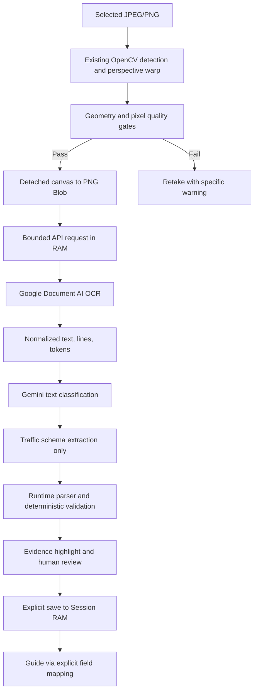

# Document OCR and review

## Image to Markdown: Google Enterprise OCR

Required pipeline: **OpenCV deskewed image -> Google Document AI Enterprise OCR -> deterministic Markdown assembler -> validation -> human review -> download .md**.

### Configuration

Create an **Enterprise Document OCR** processor (type `OCR_PROCESSOR`, not a generative layout parser). Set server-only variables in `.env.local` and restart the application:

```dotenv
DOCUMENT_OCR_PROVIDER=google-document-ai
GOOGLE_CLOUD_PROJECT_ID=your-project-id
GOOGLE_CLOUD_LOCATION=us
GOOGLE_DOCUMENT_AI_PROCESSOR_ID=your-processor-id
# Optional: pin an Enterprise OCR version; otherwise use the processor default.
GOOGLE_DOCUMENT_AI_PROCESSOR_VERSION=
# Optional service-account file OUTSIDE the repository; otherwise use ADC/workload identity.
GOOGLE_APPLICATION_CREDENTIALS=
```

Enable the Document AI API, billing and OCR quota. Give the runtime identity Document AI API User access. For local ADC use `gcloud auth application-default login`; do not commit credentials. Markdown conversion needs **no Gemini API key**.

Official references: [Enterprise OCR](https://docs.cloud.google.com/document-ai/docs/enterprise-document-ocr), [processor creation](https://docs.cloud.google.com/document-ai/docs/create-processor), [Document response](https://docs.cloud.google.com/document-ai/docs/reference/rest/v1/Document).

### Use

Open `/scan-document`, choose a JPEG/PNG up to 8 MB and the matching photo/clean-scan mode, then select the Markdown conversion button. The exact OpenCV-processed PNG is displayed alongside the draft. Compare the raw OCR text, edit the Markdown if necessary, confirm review, and download the UTF-8 `.md`. Editing invalidates confirmation; changing the image, rerunning, clearing the session or its 15-minute expiry clears the draft. `/document-test` uses the same review component; its explicitly selected offline examples are synthetic, not OCR results.

### Assembly and validation

`Document.text` is the source of truth. Raw text is retained verbatim in `rawText`. The assembler adds Markdown syntax, escapes literal punctuation/HTML and retains line order and breaks. Conservative rules recognize short uppercase document titles and existing bullet markers. Numbered markers are escaped to prevent Markdown renderers from silently renumbering them. Names, numbers, dates and leading zeros are never rewritten.

GFM tables are assembled only from provider-supplied cell text anchors when they are exact, ordered, non-overlapping, cover a complete block, have one header row, equal column counts and no merged cells. Non-whitespace gaps between cells invalidate the conversion. Ambiguous or overlapping tables fall back to the complete raw text in source order with a review warning. Enterprise OCR does not guarantee table structures; the assembler does not guess tables from multi-column prose or invent missing cells. This text export does not reconstruct logos, stamps or embedded document images.

Validation checks empty/oversized output, control characters, unclosed code fences, inconsistent table columns and active content. Heading jumps and replacement characters trigger warnings. The original raw OCR stays available for comparison. Preview uses React Markdown/GFM, never executes source HTML and never fetches remote images. Validation is conservative lint, not proof of OCR accuracy. Human edits require renewed confirmation before download.

Literal heading suffixes and strikethrough punctuation are escaped so source characters remain visible. Multiline table cells use `<br>`; the preview recognizes only this exact tag as a line break. Other HTML stays inert, including tags with attributes. A literal `<br>` in OCR is escaped and remains visible as source text.

### Gemini boundary

The Markdown pipeline makes **no Gemini calls**. The separate structured business-field pipeline may classify the document and select evidence from raw OCR text. Its schema requires `value` to be a verbatim string identical to `rawText`, or `null` if unsupported. Runtime checks reject fabricated evidence and any rewrite, including numerically equivalent amount/date reformatting. Only deterministic application code normalizes verified business values into separate typed fields; it never mutates raw OCR text or Markdown. Gemini receives no images for this path and is never asked to transcribe the full document or produce Markdown. Optional structural assistance is not implemented; uncertain structure stays available for human review.

### API and limits

`POST /api/documents/markdown` accepts multipart `file` or JSON `imageBase64`. It returns `{success:true,data:{contractVersion:1,status:"review_required",provider:"google-document-ai",rawText,markdown,validation,pageCount,confidence,warnings}}`, not an attachment. Both in-repository clients create the final file only after validation and review. Third-party callers must implement their own human-review step. Confidence is the lowest available token score (line scores only when tokens are absent), or null when incomplete; it is not measured accuracy.

One JPEG/PNG page per request; 8 MB input, 12 MB request body, 120,000 raw text characters and 4,000 raw lines. Markdown has a separate expansion limit for escape characters and table syntax. Each Google request has a 30-second deadline, no automatic retries, and cancellation propagation. Provider failures return safe error codes with no fabricated content. Responses are `no-store`; images and OCR text are not written to disk, database or browser storage by this pipeline. Google receives the processed image; application non-persistence does not control provider retention.

Unit tests inject OCR fixtures; browser tests use real OpenCV on synthetic images and intercepted API responses. **No live OCR accuracy benchmark has been run.** Configure Google credentials and evaluate representative Vietnamese documents against manually verified transcriptions before claiming accuracy.

### Verification — 2026-10-02

- `npm run test:supervise`: 41 OpenCV tests, 57 document tests, integration checks and TypeScript passed.
- `npm run build`: production build, lint and type validation passed.
- `npm run test:documents:browser`: 7 tests passed against the production server, including review before download, edits invalidating confirmation, exact downloaded content, API failure and replacing the source image.
- Windows sandbox restrictions blocked child processes (`spawn EPERM`); these checks passed when rerun with permission outside the sandbox. OCR responses remained fixtures; no live OCR benchmark was performed.

## Audit before implementation

The previous scan page did encode `deskewedCanvas.toDataURL()` and send it as `imageBase64` after a successful `runLineDetectionDebug()` / `warpDocument()`. It did **not** always send the original File. However, its catch block bypassed document rejection and continued with the original preview URL, sometimes a `blob:` URL that the backend treated as base64. Geometric quality assessed corners, area, borders and output size; it did not assess blur/glare. The input was downscaled to 1600 px.

The backend used one Gemini Vision prompt to classify, transcribe, extract every field and every table. JSON.parse plus loose array checks provided no evidence validation. Offline/API-error fallback generated fixed names, IDs, dates, fine amounts and text. Its tests asserted those samples without contacting OCR. The save button copied all returned fields into sessionStorage regardless of confidence. There was no 15-minute expiry in that path. Guide guessed mappings from box IDs/labels and could inject fine amounts into unrelated prerequisite steps.

README/architecture descriptions of ML Kit and local OpenCV OCR differ from the implementation: this web path uses OpenCV WASM for geometry only. Existing shared coordinates are `[ymin,xmin,ymax,xmax]` in `[0,1]`; the older architecture snippet mentioning 0–1000 is not this contract. Existing PRD percentages are targets, not measured extraction results.

## Implemented path



`DocumentOcrProvider` and `StructuredExtractionProvider` are injected into `DocumentExtractionService`. `server.ts` has Next's `server-only` boundary and constructs real providers only in the route; provider methods also reject browser execution. Google SDK responses stay inside the adapter. Gemini receives OCR text and line metadata, never image bytes. Classification and schema extraction are separate calls. Unsupported documents return unknown/manual review with no sample fields.

Google adapter maps text anchors, normalized/pixel polygons (using page dimensions), confidence, token membership and page numbers. Missing geometry uses a degenerate `[0,0,0,0]` sentinel plus warning, never a fabricated source region. Missing confidence is null. Each provider stage has a 30-second deadline; abort/deadline propagates to supported transports, Google RPC has its own timeout and retries disabled. Error messages are mapped to safe codes, with no provider exception/stack in the response.

## Google setup

1. Create/select a Google Cloud project with billing and enable the Document AI API.
2. In Document AI, create an **Enterprise Document OCR** processor in a supported location. Record project ID, processor ID and location exactly. This adapter uses the regional endpoint and the processor's default version.
3. Give the runtime identity Document AI API User permission (`roles/documentai.apiUser`) for the required resources. Use an attached service account/workload identity in deployment.
4. For local development, use Application Default Credentials (`gcloud auth application-default login`), or set `GOOGLE_APPLICATION_CREDENTIALS` to a credential file outside the repository. Do not paste JSON into source or public environment variables.
5. Configure the server variables from `.env.example` in `.env.local`: `DOCUMENT_OCR_PROVIDER`, `GOOGLE_CLOUD_PROJECT_ID`, `GOOGLE_CLOUD_LOCATION`, `GOOGLE_DOCUMENT_AI_PROCESSOR_ID`, optional credential path, `GEMINI_API_KEY`, `GEMINI_DOCUMENT_MODEL`, `DOCUMENT_ACCEPTANCE_THRESHOLD`.
6. Run `npm install`, then `npm run dev`; visit `/scan-document`. With missing credentials, the UI shows manual review, not manufactured data.

References: [Google client setup](https://docs.cloud.google.com/document-ai/docs/libraries), [create a processor](https://docs.cloud.google.com/document-ai/docs/create-processor), [Document response schema](https://docs.cloud.google.com/document-ai/docs/reference/rest/v1/Document), [Gemini structured output](https://ai.google.dev/gemini-api/docs/generate-content/structured-output).

New runtime dependencies: `@google-cloud/documentai` for official ADC/regional OCR RPC and `server-only` for the Next bundle boundary. The existing `@google/genai` SDK is reused. Playwright is a development dependency for browser regressions. ESLint and eslint-config-next match Next 14 so the existing lint script can run without its initial interactive setup prompt.

## Contract and validation

API v2 keeps `{success,data}` for successfully processed requests; `data.contractVersion=2`, `data.fields` is a keyed object. Provider unavailability returns `status:manual_review_required`, empty fields, warnings and `requiresReview:true` (HTTP 200 is transport completion, not extraction acceptance). Invalid requests return `{success:false,error:{code,message_vi}}` with 400/413/415. Responses use `Cache-Control:no-store`. The old arbitrary field/table array contract is deliberately retired; all in-repo consumers migrate together. JSON data URLs remain supported for JPEG/PNG callers; the UI uses multipart.

The only implemented business schema is `traffic_violation_record`, with recordNumber, recordDate, citizenName, citizenId, address, vehiclePlate, violationDescription, decisionNumber, fineAmount, paymentDeadline. No field missing from OCR is filled from a template. No generic "extract everything" call exists.

Each field retains raw text separately from deterministic normalization, source line IDs and provider-derived boxes. Runtime parsing rejects wrong JSON shape or unknown field keys. Evidence must match cited OCR lines; the model's value must equal its raw excerpt exactly. Even equivalent model-generated date/amount reformatting is rejected. Only application code normalizes verified raw values. Unsubstantiated values are set to null. Dates must be calendar-valid; money must be a safe non-negative VND integer with consistent grouping. CCCD is 12 digits (the old contract supplied no validator); legacy 9-digit CMND requires manual handling. Plate checking is intentionally soft and allows human confirmation of unfamiliar formats.

Automatic acceptance requires valid source, evidence, geometry, validation, agreement and confidence at least `DOCUMENT_ACCEPTANCE_THRESHOLD` (default 0.95). Confidence is capped by OCR evidence confidence, never Gemini alone. Critical fields also require review if the OCR result has warnings. Thresholds are configuration defaults, not calibrated probabilities.

## Review and privacy

The preview is the exact processed Blob sent to OCR. Selecting a field overlays its normalized source boxes on that image, preserving its natural aspect ratio. Users can edit and confirm each field or explicitly leave it blank. Editing invalidates the previous confirmation. Outstanding needs_review fields block saving; unreadable fields never autofill unless manually supplied and confirmed. Saving is an explicit action. Only accepted or human-confirmed non-null values enter the module's memory store, with a 15-minute absolute TTL. Reloading loses them. Changing image/type clears the old result/session and invalidates pending requests. Guide uses `sourceFieldFromPrerequisite`, including explicit legacy key aliases, never guesses from box IDs or labels. Finish/reset clears memory; expiry notifies mounted consumers.

No images/raw OCR are written to database, filesystem or browser storage by this path. Image object URLs and detached canvases are released on replacement/unmount/expiry, and the existing OpenCV coordinator deletes its Mats in finally. The server retains document bytes only during processing; no payload logging or caching is used. JavaScript garbage collection/OS memory behavior cannot guarantee physical erasure. Google receives images and Gemini receives OCR text; deployment must assess the providers' data handling and configure access/region accordingly. Application non-persistence does not claim control of provider retention. Older unrelated scanner/admin storage is outside this change.

## Tests and benchmark

```sh
npm run test:opencv
npx tsx --test src/modules/documents/tests/*.test.ts
npm run test:local
npx tsc --noEmit
npm run build
npm run lint
git diff --check
```

Unit tests inject fake providers and never call paid services. Browser tests use synthetic images and intercepted extraction responses. With Google Chrome installed, run `npm run build`, `npm run start -- --port 3100`, then `npx playwright test --config playwright.documents.config.ts`. Set `DOCUMENT_TEST_URL` for another local port. These validate wiring/review, not cloud accuracy. Do not run build and dev concurrently against the same .next directory.

See [private dataset instructions](../tests/fixtures/documents/README.md) for the opt-in benchmark. No real images or personal data are included. The harness counts exact/normalized field matches, missing/false values, review fields, per-field accuracy and incorrect automatic acceptances. It evaluates already deskewed images; it cannot measure client gate recall. **No real-data benchmark has been run.**

## Limits and next evaluation

- OCR accuracy measures text fidelity (CER/WER against transcripts). Field extraction accuracy measures mapping and normalized values. Business-safe processing measures incorrect automatic acceptance, review handling and correct downstream placement. None implies the others.
- JPEG/PNG, one page per request, 8 MB file / 12 MB body; PDF had no safe rendering path in the old scan UI and is explicitly rejected here. A future multipage adapter needs page-aware review.
- Geometry cannot infer semantic upright orientation or guarantee that a rectangle is a document. The extra blur/glare gates are conservative heuristics requiring real-photo calibration; partial glare or blurred text in otherwise sharp images can be missed.
- The existing 1600 px client cap protects weaker devices but can lose small Vietnamese marks. Evaluate its recall before tuning resolution.
- Source substring grounding cannot prove correct semantic assignment when multiple similar values exist. Handwriting, stamps and OCR mistakes still require human review. An absent fine/decision/deadline remains null even when another document might contain it.
- Missing cloud credentials, unavailable service or invalid model output produces manual review. Retry, retake, or ask a human to read the document; there is no fabricated fallback.
- The repository initially had a lint script but no ESLint configuration; a minimal Next configuration now enables it. Existing unrelated changes from another process must not be included in this feature commit.
