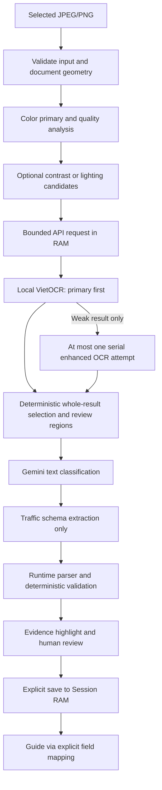

# Document OCR and review

## Adaptive preprocessing and bounded OCR (2026-10-04)

The active `/scan-document` path now performs **quality analysis -> color primary
image -> at most two optional enhanced candidates -> primary OCR -> one optional
sequential enhanced OCR -> deterministic comparison -> human review**. Blur, low
contrast, small images, shadows and possible glare are soft warnings. A white
page is not proof of glare or of missing text. The older quality-gate description
below is historical; it no longer describes this page's text-quality policy.

OCR now uses **VietOCR only**, through the local Python microservice at
`VIETOCR_ENDPOINT`. `DOCUMENT_OCR_PROVIDER` defaults to `vietocr`; other values are
rejected as invalid configuration. The former cloud OCR adapter and dependency have
been removed. **Gemini text** remains separate for structured classification and
field extraction, and Google Cloud Text-to-Speech remains separate for voice.
JSON export makes no Gemini calls. Citizen document processing disables VietOCR's
test-only synthesizer; absent OCR confidence remains null. Reports under
`docs/reports/` record earlier implementation states and are superseded by this
document for current runtime configuration.

Contrast candidates use grayscale, mild bilateral denoise (Gaussian fallback),
CLAHE when available (mild linear contrast fallback), and a mild unsharp mask.
Lighting candidates use grayscale, Gaussian background estimation and bounded
floating-point background normalization with a denominator floor. Filters never
overwrite the primary; no morphology, threshold-only input, generative restoration
or invented characters are used. Runtime capability checks precede optional APIs.
The installed OpenCV 5 WASM exposes and successfully runs CLAHE/bilateralFilter.
If an unexpectedly weak OCR result has no client candidate, the server builds one
grayscale/blur/mild linear contrast/unsharp candidate with Sharp, after the first
result, without changing the OCR provider. This fallback is not OpenCV CLAHE.

Detection alone uses a reduced resolution. OCR no longer inherits the old 1600px
preview cap. The source is bounded to 12 million pixels / 8192px per axis. Warp
output retains its explicit 4096px/12-million-pixel safety caps; enhanced images
preserve the primary frame and upscale by at most 2x within 8192px/12 million pixels.
Rounded scaleX/scaleY are derived independently from actual decoded dimensions.
Normalized evidence coordinates refer to the processed primary frame, not the
original pre-warp photograph. Encoding uses PNG, with JPEG quality 0.95 if PNG
exceeds 8 MB; each transmitted file still has an 8 MB cap. A request containing
primary plus up to two candidates is capped at 26 MB. Mats are freed sequentially
in finally; object URLs are revoked on replacement, failure, expiry and unmount.

No low-confidence quad is cropped. Upload photos may fall back to the full image
with `documentDetectionFailed=true`, `deskewApplied=false` and review required.
Camera mode preserves the preview and requires the explicit **Thử đọc toàn ảnh**
action. Corrupt/unsupported/empty-dimension/oversized inputs and non-finite,
singular or horizon-crossing warps remain hard errors. The server fully decodes
all transmitted images in bounded RAM before OCR; headers/signatures alone are
insufficient. It rejects mismatched enhanced coordinate frames.

OCR retry is triggered by empty/non-readable text, missing lines/geometry/confidence,
malformed text, provider quality warnings or a low-confidence fraction. Starting
values are retryConfidence=0.8, lowConfidenceFraction=0.2, alignmentIoU=0.65; they
require calibration and are not accuracy guarantees. Two attempts share the
configured `DOCUMENT_OCR_TIMEOUT_MS` budget (default 60 seconds); calls are serial.
Errors, credentials/configuration failures, quota and timeout are not retried.
VietOCR transport errors are not retried. Gemini transport retries are also disabled:
at most 2 OCR + 1 classification + 1 schema call for a supported page; Markdown
uses at most 2 OCR calls. Cancellation prevents subsequent calls.

Each attempt retains exact raw OCR, variant, provider, timing and axis scales in
RAM. Primary is retained by default. Only empty/non-readable primary or damaged
primary with identical numeric strings can be replaced by the whole readable
enhanced result. More text or higher confidence alone never wins. No regional
merge or concatenation occurs. Only mutually unique high-IoU line matches are
considered aligned; unaligned disagreement remains a whole-page review warning.
Changed amounts, IDs, dates, record numbers or plates require review. Gemini sees
only the already selected OCR and never arbitrates between competing values.
Uncertain fields cannot be saved to Session RAM/guide without manual confirmation.

After reading, the page exposes raw attempts, source-region overlays, editable
fields and primary/enhanced previews. Unknown coordinates require checking the
whole source page; they never become invented boxes. Empty OCR shows **Chưa đọc
được vùng này**, retains the source and cannot be extraction success or a valid
empty JSON download. Possible blankness also forces manual review, even if
the provider returns text. Retaking is optional. Request IDs plus AbortController
prevent stale responses from overwriting new output; replacing image/mode clears
all prior output and review state.

Fixtures under `tests/fixtures/documents/` are fictional synthetic pixels generated
by `node scripts/generate-document-image-fixtures.mjs`. Tests separate fake providers,
real local OpenCV WASM and browser interception. Live OCR remains opt-in via
`scripts/evaluate-document-extraction.ts --live` with consented, redacted images.
Synthetic tests do not measure camera OCR accuracy. The prior adaptive-preprocessing
implementation and its historical verification evidence are recorded in
[the delivery report](reports/person-3-opencv/step-06-adaptive-ocr/ADAPTIVE-OCR-REPORT.md).

## Image to grounded JSON: VietOCR (2026-10-06)

Document export now uses **OpenCV-prepared primary image → local VietOCR → bounded
adaptive attempt selection → immutable source/classification → JSON assembly → Ajv
runtime validation → human review → download .json**. The Markdown route and its
export-only formatting/preview code have been removed after migrating scan,
workbench, candidate debug, scripts and tests. No parallel export pipeline remains.

See [the versioned contract, coordinates, API, review and limits](DOCUMENT-JSON-EXPORT.md).
Export coordinates are normalized XYXY; existing business extraction/form
coordinates stay YXYX. Export does not call Gemini or write Session RAM/guide.
The independent report contains actual synthetic local OCR measurements and
separates those from source preservation and from browser checks still blocked.

## Audit before implementation

The previous scan page did encode `deskewedCanvas.toDataURL()` and send it as `imageBase64` after a successful `runLineDetectionDebug()` / `warpDocument()`. It did **not** always send the original File. However, its catch block bypassed document rejection and continued with the original preview URL, sometimes a `blob:` URL that the backend treated as base64. Geometric quality assessed corners, area, borders and output size; it did not assess blur/glare. The input was downscaled to 1600 px.

The backend used one Gemini Vision prompt to classify, transcribe, extract every field and every table. JSON.parse plus loose array checks provided no evidence validation. Offline/API-error fallback generated fixed names, IDs, dates, fine amounts and text. Its tests asserted those samples without contacting OCR. The save button copied all returned fields into sessionStorage regardless of confidence. There was no 15-minute expiry in that path. Guide guessed mappings from box IDs/labels and could inject fine amounts into unrelated prerequisite steps.

README/architecture descriptions of ML Kit and local OpenCV OCR differ from the implementation: this web path uses OpenCV WASM for geometry only. Existing shared coordinates are `[ymin,xmin,ymax,xmax]` in `[0,1]`; the older architecture snippet mentioning 0–1000 is not this contract. Existing PRD percentages are targets, not measured extraction results.

## Implemented path



`DocumentOcrProvider` and `StructuredExtractionProvider` are injected into `DocumentExtractionService`. `server.ts` has Next's `server-only` boundary and constructs the VietOCR adapter for both routes; provider methods also reject browser execution. Gemini receives OCR text and line metadata, never image bytes. Classification and schema extraction are separate calls. Unsupported documents return unknown/manual review with no sample fields.

The VietOCR adapter maps segmented line text, normalized source coordinates and actual confidence when supplied. Missing confidence stays null, and missing or invalid geometry requires source review rather than an invented region. OCR attempts share the configured deadline; abort propagates to the microservice request. Error messages are mapped to safe codes, with no provider exception/stack in the response.

## Local OCR and separate text/voice configuration

1. Follow [VietOCR service setup](../services/vietocr-service/README.md), including dependency/import checks and model loading. Setup may download model weights; no citizen image is needed for setup.
2. Set `DOCUMENT_OCR_PROVIDER=vietocr`, `VIETOCR_ENDPOINT=http://127.0.0.1:8000/predict` and `DOCUMENT_OCR_TIMEOUT_MS=60000` in the server environment. Restart after changes.
3. Run `npm run dev:all`; verify `/health` on port 8000 and open `/scan-document` on port 3001. A failed model/import keeps OCR unavailable even if Web starts.
4. JSON export requires no Gemini key. For separate structured extraction, configure `GEMINI_API_KEY` and `GEMINI_DOCUMENT_MODEL`; verify evidence before saving. For Google Cloud TTS only, `GOOGLE_APPLICATION_CREDENTIALS` may point to a credential file outside the repository. Never place credentials in public environment variables or source files.

The Next server uses `server-only`, the existing `@google/genai` SDK for text, and the separate `@google-cloud/text-to-speech` SDK for voice. Playwright is a development dependency for browser regressions. OCR cloud credentials, regional processors and cloud OCR billing are no longer part of this project.

## Contract and validation

API v2 keeps `{success,data}` for successfully processed requests; `data.contractVersion=2`, `data.fields` is a keyed object. Provider unavailability returns `status:manual_review_required`, empty fields, warnings and `requiresReview:true` (HTTP 200 is transport completion, not extraction acceptance). Invalid requests return `{success:false,error:{code,message_vi}}` with 400/413/415. Responses use `Cache-Control:no-store`. The old arbitrary field/table array contract is deliberately retired; all in-repo consumers migrate together. JSON data URLs remain supported for JPEG/PNG callers; the UI uses multipart.

The only implemented business schema is `traffic_violation_record`, with recordNumber, recordDate, citizenName, citizenId, address, vehiclePlate, violationDescription, decisionNumber, fineAmount, paymentDeadline. No field missing from OCR is filled from a template. No generic "extract everything" call exists.

Each field retains raw text separately from deterministic normalization, source line IDs and provider-derived boxes. Runtime parsing rejects wrong JSON shape or unknown field keys. Evidence must match cited OCR lines; the model's value must equal its raw excerpt exactly. Even equivalent model-generated date/amount reformatting is rejected. Only application code normalizes verified raw values. Unsubstantiated values are set to null. Dates must be calendar-valid; money must be a safe non-negative VND integer with consistent grouping. CCCD is 12 digits (the old contract supplied no validator); legacy 9-digit CMND requires manual handling. Plate checking is intentionally soft and allows human confirmation of unfamiliar formats.

Automatic acceptance requires valid source, evidence, geometry, validation, agreement and confidence at least `DOCUMENT_ACCEPTANCE_THRESHOLD` (default 0.95). Confidence is capped by OCR evidence confidence, never Gemini alone. Critical fields also require review if the OCR result has warnings. Thresholds are configuration defaults, not calibrated probabilities.

## Review and privacy

The preview is the exact processed Blob sent to OCR. Selecting a field overlays its normalized source boxes on that image, preserving its natural aspect ratio. Users can edit and confirm each field or explicitly leave it blank. Editing invalidates the previous confirmation. Outstanding needs_review fields block saving; unreadable fields never autofill unless manually supplied and confirmed. Saving is an explicit action. Only accepted or human-confirmed non-null values enter the module's memory store, with a 15-minute absolute TTL. Reloading loses them. Changing image/type clears the old result/session and invalidates pending requests. Guide uses `sourceFieldFromPrerequisite`, including explicit legacy key aliases, never guesses from box IDs or labels. Finish/reset clears memory; expiry notifies mounted consumers.

No images/raw OCR are written to database, filesystem or browser storage by this path. Image object URLs and detached canvases are released on replacement/unmount/expiry, and the existing OpenCV coordinator deletes its Mats in finally. The server and local VietOCR retain document bytes only during processing; no payload logging or caching is used. JavaScript garbage collection/OS memory behavior cannot guarantee physical erasure. Structured extraction sends selected OCR text to Gemini, so users' consent and the provider's data handling still matter even though image OCR is local. JSON export does not send text to Gemini. Application non-persistence does not claim control of cloud text-provider retention. Older unrelated scanner/admin storage is outside this change.

## Tests and benchmark

```sh
npm run test:opencv
npx tsx --test src/modules/documents/tests/*.test.ts
npm run test:local
npx tsc --noEmit
npm run build
npm run lint
git diff --check
```

Unit tests inject fake providers and never call paid services. Browser tests use synthetic images and intercepted extraction responses. With Google Chrome installed, run `npm run build`, `npm run start -- --port 3100`, then `npx playwright test --config playwright.documents.config.ts`. Set `DOCUMENT_TEST_URL` for another local port. These validate wiring/review, not OCR accuracy. Do not run build and dev concurrently against the same .next directory.

If an existing development server must stay running, select a separate generated
directory for production verification in PowerShell:

```powershell
$env:AFL_BUILD_DIR = 'test-results/next-vietocr-build'
npm run build
# Use the same AFL_BUILD_DIR for any production start using this build.
# Remove it before starting a new ordinary development server.
Remove-Item Env:AFL_BUILD_DIR
```

The default output directory remains `.next`. `test-results/` is ignored; keep the
override limited to a generated build directory, not a source or data directory.

With both local servers running, `npx tsx scripts/test-vietocr-integration.ts` checks
`/health` and sends a neutral synthetic text image, generated in RAM, through the real
HTTP JSON route. It requires ready health, VietOCR provenance, non-empty readable
output and a human-review draft. Endpoints must be loopback HTTP and redirects are
rejected. It logs only character count, attempts and timing; it does not log OCR text
or estimate camera-image accuracy. `DOCUMENT_TEST_URL` selects another local Web port.

See [private dataset instructions](../tests/fixtures/documents/README.md) for the opt-in benchmark. No real images or personal data are included. The harness counts exact/normalized field matches, missing/false values, review fields, per-field accuracy and incorrect automatic acceptances. It evaluates already deskewed images; it cannot measure client gate recall. **No real-data benchmark has been run.**

## Limits and next evaluation

- OCR accuracy measures text fidelity (CER/WER against transcripts). Field extraction accuracy measures mapping and normalized values. Business-safe processing measures incorrect automatic acceptance, review handling and correct downstream placement. None implies the others.
- JPEG/PNG, one page per request, 8 MB file / 26 MB body including optional candidates; PDF has no safe rendering path in the scan UI and is explicitly rejected here. A future multipage adapter needs page-aware review.
- Geometry cannot infer semantic upright orientation or guarantee that a rectangle is a document. Blur/glare analysis uses conservative soft-warning heuristics requiring real-photo calibration; partial glare or blurred text in otherwise sharp images can be missed.
- OCR retains full source pixels within the explicit limits; detector downsampling does not cap OCR at 1600 px. Upscaling does not recover lost information. Evaluate small Vietnamese marks on real photos before tuning resolution.
- Source substring grounding cannot prove correct semantic assignment when multiple similar values exist. Handwriting, stamps and OCR mistakes still require human review. An absent fine/decision/deadline remains null even when another document might contain it.
- Unavailable VietOCR, invalid model output or missing credentials for the separate Gemini text stage produces manual review. Retry, retake, or ask a human to read the document; there is no fabricated fallback.
- The repository initially had a lint script but no ESLint configuration; a minimal Next configuration now enables it. Existing unrelated changes from another process must not be included in this feature commit.
