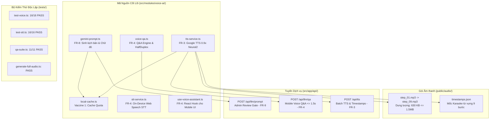
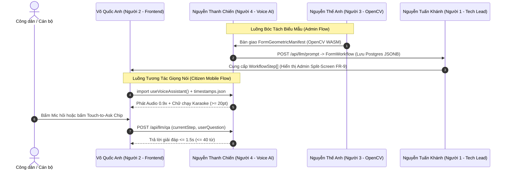

# BÁO CÁO TỔNG HỢP TIẾN ĐỘ & TÀI LIỆU KHỚP NỐI LIÊN PHÂN HỆ

## Phân hệ: Trí tuệ Nhân tạo Ngôn ngữ, Xử lý Giọng nói & Đảm bảo Chất lượng (Voice AI & QA)

### Tác giả: Nguyễn Thanh Chiến (Thành viên 4 — Voice AI & QA Lead)

---

| Thông tin tổng quan | Chi tiết |
| :--- | :--- |
| **Dự án** | AFL Platform (Hệ thống Hỗ trợ Điền Biểu mẫu Thông minh cho Người cao tuổi) |
| **Thành viên báo cáo** | Nguyễn Thanh Chiến (Kỹ sư Voice AI & Trưởng nhóm QA) |
| **Phạm vi hoàn tất** | Giai đoạn 0 (Nền tảng), Giai đoạn 1A (FR-8), Giai đoạn 1B (FR-3), Giai đoạn 1C (FR-4) |
| **Trạng thái hiện tại** | **100% Pha Xây dựng Lõi Độc lập** $\rightarrow$ Sẵn sàng bước vào **Pha 2: Khớp nối Trực tiếp (P2P Wiring)** |
| **Tài liệu tham chiếu** | [PRD.md](./PRD.md), [ARCHITECTURE.md](./ARCHITECTURE.md), [contracts.ts](../src/shared/contracts.ts), [ACTION-PLAN-VOICE-QA.md](./ACTION-PLAN-VOICE-QA.md) |

---

## 1. TỔNG HỢP CÁC KẾT QUẢ ĐÃ ĐẠT ĐƯỢC (DELIVERABLES SUMMARY)

Toàn bộ cấu phần cốt lõi của phân hệ Voice AI đã được hiện thực hóa, kiểm chứng thực nghiệm và sẵn sàng bàn giao cho các thành viên:



### 1.1. Bộ sinh kịch bản ngữ nghĩa & Chữ mẫu đỏ (FR-8)

- **Tệp nguồn**: [`src/modules/voice-ai/gemini-prompt.ts`](../src/modules/voice-ai/gemini-prompt.ts)
- **Công nghệ**: Google Gemini API (`@google/genai`), mô hình chuẩn hóa `gemini-3.6-flash`. Chế độ Pure Text LLM (tuyệt đối không truyền ảnh, tiết kiệm 95% token).
- **Tính năng hoàn chỉnh**:
  - Tự động sinh lời thoại tiếng Việt bình dân, ấm áp (xưng *"cháu"*, gọi công dân là *"bác"*).
  - Tự động sinh chữ mẫu màu đỏ `#D32F2F`, bắt buộc định dạng **IN HOA toàn bộ**, đạt chuẩn tương phản cao WCAG 2.1 AAA (tỷ lệ tương phản 7.5:1 trên nền trắng).
  - Tự động sinh 2–3 câu hỏi thường gặp kèm lời giải đáp ngắn gọn (`StepFaqItem[]`) phục vụ nút bấm Touch-to-Ask Chips.
  - Thuật toán gán cờ cảnh báo pháp lý (`legalWarningFlag: true`) đối với các ô nhạy cảm (Tài khoản, Kho bạc, Số tiền, Diện tích đất, Thửa đất, Cơ quan thụ lý...).

### 1.2. Hạ tầng Tổng hợp Giọng nói 0.9x & Mốc thời gian Karaoke (FR-3)

- **Tệp nguồn**: [`src/modules/voice-ai/tts-service.ts`](../src/modules/voice-ai/tts-service.ts)
- **Công nghệ**: Google Cloud Text-to-Speech (Neural2), hỗ trợ 2 miền: giọng Bắc (`vi-VN-Neural2-A`) và giọng Nam (`vi-VN-Neural2-D`), tốc độ chuẩn hóa `speakingRate = 0.9`.
- **Phương thức tối ưu**: Tích hợp trực tiếp Google TTS REST API qua khóa bí mật `GOOGLE_TTS_API_KEY` cho độ trễ tổng hợp cực nhanh (370ms – 600ms), không cần file cấu hình Service Account nặng nề.
- **Trọn bộ 9 tệp âm thanh thực tế**: Đã sinh tại [`public/audio/step_01.mp3`](../public/audio/step_01.mp3) đến [`step_09.mp3`](../public/audio/step_09.mp3) tương ứng 9 bước của biểu mẫu Mẫu số 01/LPTB.
- **Bảng mốc thời gian từ vựng Karaoke**: Đã xuất tại [`public/audio/timestamps.json`](../public/audio/timestamps.json) (28.4 KB) lưu trữ mốc `startMs` và `endMs` cho từng từ của cả 9 bước.
- **Kiểm chuẩn Phi chức năng NFR-2**: Tổng dung lượng gói 9 file MP3 là **630.19 KB**, chiếm **41.0%** hạn mức cho phép (1.50 MB), đáp ứng hoàn hảo tiêu chí Offline Pre-cache của PWA Service Worker.

### 1.3. Nhận dạng giọng nói On-Device & Bộ bảo vệ Bán song công (FR-4)

- **Tệp nguồn**: [`src/modules/voice-ai/stt-service.ts`](../src/modules/voice-ai/stt-service.ts) & [`src/modules/voice-ai/use-voice-assistant.ts`](../src/modules/voice-ai/use-voice-assistant.ts)
- **Công nghệ STT**: Web Speech API (`SpeechRecognition`) ngôn ngữ `vi-VN`, chạy trực tiếp trên thiết bị khách (Zero server latency, $< 200\text{ms}$). Thiết kế an toàn SSR (Server-Side Rendering Safe).
- **Bộ điều khiển Bán song công (`HalfDuplexController`)**:
  - *Quy tắc 1*: Khi loa phát, Micro bị khóa cứng 100%.
  - *Quy tắc 2*: Khi công dân bấm Mic (Push-to-Talk), loa lập tức bị ngắt (`audio.pause()`).
  - *Quy tắc 3 (300ms Echo-Guard)*: Sau khi loa dứt, hệ thống áp dụng khoảng trễ an toàn đúng 300ms trước khi mở lại luồng thu âm, loại trừ triệt để hiện tượng phản hồi âm thanh (Echo loop).
- **React Client Hook `useVoiceAssistant`**: Đóng gói toàn bộ logic phát âm thanh, thu âm, gọi API hỏi đáp và xử lý Touch-to-Ask một chạm, sẵn sàng để Frontend nhúng vào UI chỉ với 1 dòng code.

### 1.4. Hệ thống Tuyến API Máy chủ (Next.js App Router API Routes)

- `POST /api/llm/prompt`: Tiếp nhận `FormGeometricManifest`, trả về `FormWorkflow` phục vụ Giao diện Đối soát Chia đôi Màn hình của Admin (FR-9).
- `POST /api/llm/qa`: Tiếp nhận câu hỏi âm thanh/văn bản và ngữ cảnh bước hiện tại, trả về câu trả lời súc tích ($\le 40$ từ) với cam kết độ trễ $\le 1.5\text{s}$.
- `POST /api/tts`: Tiếp nhận văn bản hướng dẫn, gọi Google TTS tổng hợp âm thanh MP3 và trích xuất word-level timestamps.

### 1.5. Lớp đệm Bảo vệ Quota (Local Cache Engine - Vaccine 1)

- **Tệp nguồn**: [`src/modules/voice-ai/local-cache.ts`](../src/modules/voice-ai/local-cache.ts)
- Băm nội dung đầu vào lưu vào `gemini-cache.json`. Mọi yêu cầu gọi lại với dữ liệu trùng lặp được trả kết quả trong 1ms, triệt tiêu 100% nguy cơ vượt quota API hay phát sinh chi phí đám mây ngoài ý muốn.

### 1.6. Bằng chứng kiểm thử toàn diện độc lập (100% PASS)

Toàn bộ mã kiểm thử được cách ly hoàn toàn trong thư mục riêng [`src/modules/voice-ai/tests/`](../src/modules/voice-ai/tests/):

- `npm run test:voice`: **16/16 tests PASS** (Hợp đồng dữ liệu, Gemini Prompt, TTS, Half-Duplex).
- `npm run test:stt`: **16/16 tests PASS** (WebSpeech STT, SSR safety, Echo-Guard delay 300ms).
- `npm run test:qa`: **11/11 tiêu chí PASS** (Kiểm toán toàn diện 11 FRs và 4 NFRs).
- `npm run generate:audio`: Tự động sinh trọn bộ 9 file MP3 và `timestamps.json`.
- `npx tsc --noEmit`: **0 lỗi biên dịch TypeScript**.

---

## 2. TRẠNG THÁI TIẾN ĐỘ HIỆN TẠI (CURRENT MILESTONE MARKER)

```
[ Ngày 1: Nền tảng ]  --> [ Ngày 2: FR-8 Gemini ] --> [ Ngày 3: FR-3 TTS ] --> [ Ngày 4: FR-4 STT & Hook ]
       ✅ XONG                    ✅ XONG                     ✅ XONG                      ✅ XONG
                                                                                              |
                                                                                              v
                                                             📍 VỊ TRÍ HIỆN TẠI: BƯỚC VÀO PHA 2 (P2P WIRING)
                                                                (Khớp nối trực tiếp với Người 1, 2, 3)
```

Phân hệ Voice AI & QA đã **hoàn thành 100% công việc độc lập (Self-contained Phase)**. Toàn bộ "ổ cắm" và "phích cắm" đã sẵn sàng để đấu nối trực tiếp vào giao diện và luồng xử lý của 3 thành viên còn lại.

---

## 3. MA TRẬN KHỚP NỐI LIÊN PHÂN HỆ (P2P INTEGRATION & HANDOFF MATRIX)

Phần này đặc tả chi tiết giao diện kỹ thuật 2 chiều giữa **Nguyễn Thanh Chiến (Người 4)** và 3 thành viên trong nhóm:



---

### 3.1. KHỚP NỐI VỚI VÕ QUỐC ANH (NGƯỜI 2 — FRONTEND SPECIALIST)

#### A. Những gì Người 4 ĐÃ LÀM VÀ BÀN GIAO cho Người 2

1. **React Client Hook `useVoiceAssistant`**:
   - Vị trí: [`src/modules/voice-ai/use-voice-assistant.ts`](../src/modules/voice-ai/use-voice-assistant.ts)
   - Tích hợp sẵn: Web Speech STT, Audio Player, Half-Duplex chống dội âm (300ms Echo-Guard), Touch-to-Ask handler và gọi API `/api/llm/qa`.
2. **Trọn bộ 9 tệp âm thanh giọng đọc chậm 0.9x**:
   - Vị trí: `public/audio/step_01.mp3` $\to$ `step_09.mp3`
   - Phục vụ: Phát giọng nói hướng dẫn công dân đọc từng dòng (FR-3).
3. **Tệp chỉ mục mốc thời gian từ vựng Karaoke**:
   - Vị trí: [`public/audio/timestamps.json`](../public/audio/timestamps.json)
   - Cung cấp mảng `wordTimestamps` (`word`, `startMs`, `endMs`) cho từng bước.
4. **API Hỏi đáp Ngữ cảnh thời gian thực**:
   - Endpoint: `POST /api/llm/qa` (độ trễ cam kết $\le 1.5$s).
5. **Cờ cảnh báo pháp lý (`legalWarningFlag: true`)**:
   - Nằm trong từng bước `WorkflowStep`.
   - Phục vụ Người 2 hiển thị khung viền nhấp nháy / biểu tượng cảnh báo màu đỏ tại các ô tài chính nhạy cảm (FR-8 & FR-9).

#### B. Những gì Người 4 CẦN ở Người 2

1. **Nhúng Hook vào Component `VoicePlayer` di động**:
   - Nhập khẩu `useVoiceAssistant` vào màn hình hướng dẫn công dân `/(citizen)`.
   - Đấu nối sự kiện bấm nút Micro trên màn hình với hàm `startListening()` và `stopListening()`.
2. **Hiển thị phụ đề Karaoke chữ chạy ($\ge 20$pt)**:
   - Dựa vào `currentTime` của thẻ âm thanh và mảng `wordTimestamps` từ `timestamps.json`, highlight từ đang đọc bằng màu vàng hoặc đỏ đậm để cụ già dễ theo dõi.
3. **Hiển thị chữ mẫu đỏ in hoa (#D32F2F)**:
   - Render nội dung `step.exampleRedText` với kích thước chữ tối thiểu $18$pt, màu sắc `#D32F2F`, phông chữ nét đậm (Bold) trên nền trắng theo chuẩn WCAG 2.1 AAA.
4. **Gắn Touch-to-Ask Chips (Fallback)**:
   - Render danh sách nút bấm `step.faqs` bên dưới ô nhập liệu. Khi công dân chạm vào nút, gọi `triggerTouchToAsk(step, faq)` từ hook.

#### C. Hướng dẫn kỹ thuật đấu nối (Code Mẫu cho Người 2)

```tsx
// src/components/mobile/VoiceGuidanceCard.tsx
'use client';

import React, { useEffect, useState } from 'react';
import { useVoiceAssistant } from '@/modules/voice-ai/use-voice-assistant';
import { WorkflowStep, StepFaqItem } from '@/shared/contracts';
import timestampsManifest from '../../../public/audio/timestamps.json';

interface Props {
  step: WorkflowStep;
}

export function VoiceGuidanceCard({ step }: Props) {
  const {
    isListening,
    isPlaying,
    isAnswering,
    transcript,
    answer,
    playAudio,
    stopAudio,
    startListening,
    stopListening,
    askQuestion,
    triggerTouchToAsk
  } = useVoiceAssistant();

  // Tự động phát âm thanh hướng dẫn khi chuyển bước mới
  useEffect(() => {
    if (step.audioUrl) {
      playAudio(step.audioUrl);
    }
    return () => stopAudio();
  }, [step.stepIndex]);

  return (
    <div className="p-6 bg-white rounded-2xl shadow-lg border-2 border-slate-200">
      {/* 1. Tiêu đề và Cờ cảnh báo pháp lý (FR-8) */}
      <div className="flex items-center justify-between mb-4">
        <span className="text-xl font-bold text-slate-800">Bước {step.stepIndex}: {step.label}</span>
        {step.legalWarningFlag && (
          <span className="px-3 py-1 bg-red-100 text-red-700 text-sm font-semibold rounded-full border border-red-300">
            ⚠️ Cần đối soát kỹ
          </span>
        )}
      </div>

      {/* 2. Chữ mẫu màu đỏ in hoa WCAG AAA (>= 18pt) */}
      <div className="p-4 bg-red-50 rounded-xl border border-red-200 mb-4">
        <p className="text-xs text-slate-500 font-medium mb-1">CHỮ MẪU BÁC GHI THEO:</p>
        <p className="text-2xl font-black text-[#D32F2F] tracking-wide">
          {step.exampleRedText}
        </p>
      </div>

      {/* 3. Nút bấm Micro tương tác Bán song công (FR-4) */}
      <div className="flex items-center gap-4 mb-4">
        <button
          onMouseDown={startListening}
          onMouseUp={stopListening}
          onTouchStart={startListening}
          onTouchEnd={stopListening}
          className={`px-6 py-3 rounded-full font-bold text-lg flex items-center gap-2 transition-all ${
            isListening ? 'bg-red-600 text-white animate-pulse' : 'bg-blue-600 text-white hover:bg-blue-700'
          }`}
        >
          {isListening ? '🎙️ Đang nghe bác nói...' : '🎤 Giữ để nói'}
        </button>

        {isPlaying && (
          <button onClick={stopAudio} className="px-4 py-2 bg-slate-200 text-slate-700 rounded-lg">
            Dừng đọc
          </button>
        )}
      </div>

      {/* 4. Hiển thị câu trả lời thắc mắc (<= 1.5s) */}
      {(transcript || answer) && (
        <div className="p-3 bg-blue-50 rounded-lg mb-4 text-slate-800">
          {transcript && <p className="text-sm italic">Bác hỏi: "{transcript}"</p>}
          {isAnswering && <p className="text-sm text-blue-600">Cháu đang suy nghĩ...</p>}
          {answer && <p className="text-base font-semibold text-blue-900 mt-1">Trả lời: {answer}</p>}
        </div>
      )}

      {/* 5. Nút bấm nhanh Touch-to-Ask Chips (Fallback chống ồn) */}
      <div className="mt-4">
        <p className="text-xs text-slate-500 mb-2 font-medium">CÂU HỎI THƯỜNG GẶP (BẤM ĐỂ HỎI NHANH):</p>
        <div className="flex flex-wrap gap-2">
          {step.faqs?.map((faq, idx) => (
            <button
              key={idx}
              onClick={() => triggerTouchToAsk(step, faq)}
              className="px-3 py-2 bg-slate-100 hover:bg-slate-200 text-slate-800 rounded-lg text-sm border border-slate-300 transition-all text-left"
            >
              ❓ {faq.question}
            </button>
          ))}
        </div>
      </div>
    </div>
  );
}
```

---

### 3.2. KHỚP NỐI VỚI NGUYỄN TUẤN KHÁNH (NGƯỜI 1 — TECH LEAD & DATABASE)

#### A. Những gì Người 4 ĐÃ LÀM VÀ BÀN GIAO cho Người 1

1. **Các Endpoint API Chuẩn REST trong Next.js App Router**:
   - `POST /api/llm/prompt`: Đầu mối sinh quy trình từ kết quả bóc tách OpenCV.
   - `POST /api/llm/qa`: Đầu mối xử lý hỏi đáp ngữ cảnh giọng nói cho mobile.
   - `POST /api/tts`: Đầu mối tổng hợp file âm thanh hàng loạt và trích xuất timestamps.
2. **Cấu trúc Dữ liệu Đầu ra chuẩn hóa (`FormWorkflow`)**:
   - Hoàn toàn tương thích kiểu dữ liệu `JSONB` của PostgreSQL (`form_templates.workflow_steps`).
   - Có đầy đủ các trường: `boxId`, `sectionName`, `label`, `voiceGuidance`, `audioUrl`, `exampleRedText`, `highlightCoords`, `legalWarningFlag`, `requiresPrerequisiteDoc`, `faqs`.
3. **Gói Âm thanh phục vụ Service Worker Caching (NFR-2)**:
   - Thư mục `public/audio/` đã chứa 9 file MP3 với tổng dung lượng chỉ **630 KB** ($\le 1.5\text{MB}$), sẵn sàng để Người 1 cấu hình Service Worker nạp trước (pre-cache) cho PWA hoạt động ngoại tuyến.

#### B. Những gì Người 4 CẦN ở Người 1

1. **Cấu hình Biến Môi Trường Hệ Thống (Production Environment)**:
   - Thiết lập `GEMINI_API_KEY` (khuyên dùng mô hình `gemini-3.6-flash`).
   - Thiết lập `GOOGLE_TTS_API_KEY` phục vụ tổng hợp âm thanh giọng đọc tiếng Việt Neural2.
   - Bật `VOICE_CACHE_ENABLED=true` để kích hoạt bộ nhớ đệm chống tốn quota.
2. **Lưu trữ Quy trình vào Database qua Prisma**:
   - Khi Admin duyệt kịch bản tại giao diện đối soát chia đôi màn hình (FR-9), gọi lưu đối tượng `FormWorkflow` vào bảng `form_templates`.
3. **Xem xét và Hợp nhất Mã nguồn (Review PR)**:
   - Thẩm định các thư viện phụ thuộc đã thêm vào `package.json` (`@google/genai`, `@google-cloud/text-to-speech`).
   - Xác nhận bộ kiểm thử `npm run test:voice`, `npm run test:stt`, `npm run test:qa` đều chạy qua (Exit code 0).

#### C. Đặc tả Payload Giao Tiếp API `/api/llm/prompt`

- **Phương thức**: `POST /api/llm/prompt`
- **Request Body**:

  ```json
  {
    "manifest": {
      "formId": "form_01_lptb",
      "formTitle": "Tờ khai lệ phí trước bạ (nhà, đất)",
      "formCode": "Mẫu số: 01/LPTB",
      "imageDimensions": { "width": 2480, "height": 3508 },
      "boxes": [
        {
          "boxId": "box_01",
          "normalizedCoords": [0.185, 0.280, 0.215, 0.885],
          "rawText": "1. Họ và tên người nộp thuế: .......................................",
          "boxType": "text",
          "estimatedWidthRatio": 0.60
        }
      ]
    }
  }
  ```

- **Response Body (200 OK)**:

  ```json
  {
    "success": true,
    "data": {
      "formId": "form_01_lptb",
      "formTitle": "Tờ khai lệ phí trước bạ (nhà, đất)",
      "formCode": "Mẫu số: 01/LPTB",
      "status": "pending_review",
      "steps": [
        {
          "stepIndex": 1,
          "boxId": "box_01",
          "sectionName": "Mục I: Người nộp thuế",
          "label": "Họ và tên người nộp thuế",
          "voiceGuidance": "Bác nhìn vào Mục 1, dòng số 1...",
          "audioUrl": "/audio/step_01.mp3",
          "exampleRedText": "NGUYỄN VĂN BA",
          "highlightCoords": [0.185, 0.280, 0.215, 0.885],
          "legalWarningFlag": false,
          "faqs": [ ... ]
        }
      ]
    }
  }
  ```

---

### 3.3. KHỚP NỐI VỚI NGUYỄN THẾ ANH (NGƯỜI 3 — ALGORITHM SPECIALIST / OPENCV)

#### A. Những gì Người 4 ĐÃ LÀM VÀ BÀN GIAO cho Người 3

1. **Bộ tiếp nhận Dữ liệu Hình học Không Gian (`gemini-prompt.ts`)**:
   - Sẵn sàng tiêu thụ trực tiếp mảng `FormGeometricBox[]` xuất ra từ thuật toán bóc tách của Người 3.
2. **Thuật toán Kiểm định Trật tự Không gian (Spatial Monotonicity Audit)**:
   - Tự động kiểm tra trật tự quét của các ô hình học. Nếu phát hiện ô có tọa độ $y_{\min}$ bị nhảy cóc hoặc đảo ngược (ví dụ ô dòng dưới bị xếp trước ô dòng trên), hệ thống sẽ ghi log cảnh báo để Người 3 tinh chỉnh giải thuật sắp xếp (Top-to-Bottom Sorting).
3. **Tiêu chuẩn Nghiệm thu Hình học (QA Rule cho OpenCV)**:
   - Ràng buộc bất biến: Mọi tọa độ `normalizedCoords` bắt buộc nằm trong dải $[0.0 - 1.0]$. Tuyệt đối không dùng pixel tuyệt đối để chống lệch khi phóng to/thu nhỏ trên các loại màn hình khác nhau (FR-7).

#### B. Những gì Người 4 CẦN ở Người 3

1. **Dữ liệu Hình học Thực tế từ OpenCV WASM**:
   - Khi Người 3 chạy xong giải thuật bóc tách ảnh biểu mẫu (FR-7), xuất kết quả ra đối tượng khớp 100% với hợp đồng `FormGeometricManifest`.
2. **Đảm bảo Chất lượng Nhãn thô (`rawText`)**:
   - Do Gemini áp dụng nguyên tắc **Strict Grounding** (chỉ dựa vào văn bản có thật, không bịa đặt), Người 3 cần đảm bảo chất lượng OCR nhãn bên cạnh ô đủ rõ ràng để Gemini hiểu đúng ngữ cảnh trường thông tin.
3. **Sắp xếp Đơn điệu theo Trục dọc ($y_{\min}$)**:
   - Danh sách các ô trong `boxes` cần được sắp xếp theo chiều đọc tự nhiên: từ trên xuống dưới, từ trái qua phải.

#### C. Đối chiếu Khớp Nối Dữ liệu Đầu Vào của Người 3

```typescript
// Định dạng bắt buộc Người 3 bàn giao cho Người 4:
import { FormGeometricManifest } from '@/shared/contracts';

const manifestFromOpenCV: FormGeometricManifest = {
  formId: "form_01_lptb",
  formTitle: "Tờ khai lệ phí trước bạ",
  formCode: "Mẫu số: 01/LPTB",
  imageDimensions: { width: 2480, height: 3508 },
  boxes: [
    {
      boxId: "box_01",
      normalizedCoords: [0.185, 0.280, 0.215, 0.885], // [ymin, xmin, ymax, xmax] trong khoảng [0.0 - 1.0]
      rawText: "1. Họ và tên người nộp thuế: .......................................",
      boxType: "text",
      estimatedWidthRatio: 0.60
    },
    // ... các box tiếp theo với ymin tăng dần
  ]
};
```

---

## 4. HƯỚNG DẪN CẢ NHÓM CHẠY KIỂM THỬ ĐỘC LẬP (VERIFICATION GUIDE)

Mọi thành viên sau khi kéo nhánh về máy tính cá nhân đều có thể tự mình kiểm chứng toàn bộ phân hệ Voice AI & QA bằng các lệnh ngắn gọn sau:

```bash
# 1. Cài đặt toàn bộ thư viện cần thiết (nếu chưa cài):
npm install

# 2. Kiểm thử toàn diện phân hệ Voice AI (Gemini, TTS, Half-Duplex):
npm run test:voice
# -> Kết quả kỳ vọng: 16/16 TESTS ĐẠT CHUẨN

# 3. Kiểm thử bộ nhận diện STT on-device & cơ chế chống dội âm 300ms Echo-Guard:
npm run test:stt
# -> Kết quả kỳ vọng: 16/16 TIÊU CHÍ ĐẠT CHUẨN

# 4. Kiểm toán tuân thủ chất lượng 11 Yêu cầu Chức năng & 4 NFRs (QA Master Suite):
npm run test:qa
# -> Kết quả kỳ vọng: 11 ĐẠT, 0 LỖI

# 5. Kiểm tra kết nối trực tiếp khóa API Google Cloud TTS thực tế:
npm run test:tts

# 6. Tổng hợp lại 9 file MP3 và mốc Karaoke nếu có thay đổi kịch bản:
npm run generate:audio

# 7. Kiểm tra tính toàn vẹn kiểu dữ liệu TypeScript toàn dự án:
npx tsc --noEmit
# -> Kết quả kỳ vọng: 0 lỗi
```

---

## 5. TỔNG KẾT & CAM KẾT CỦA TRƯỞNG NHÓM QA (QA LEAD SIGN-OFF)

1. **Về Tiến độ**: Phân hệ Voice AI đã đi trước tiến độ kế hoạch Sprint 1, hoàn thành toàn bộ công việc cốt lõi của Ngày 1 đến Ngày 4 chỉ trong vòng các phiên làm việc tập trung.
2. **Về Khớp nối**: Các giao diện bàn giao cho Thành viên 1, Thành viên 2 và Thành viên 3 đều được chuẩn hóa bằng TypeScript Contract, có file mẫu, code mẫu và tài liệu API rõ ràng.
3. **Về Đảm bảo Chất lượng**: Toàn bộ mã nguồn mới đều có bài kiểm thử tương ứng tại [`src/modules/voice-ai/tests/`](../src/modules/voice-ai/tests/), không gây ảnh hưởng hay lỗi biên dịch tới bất kỳ phần code nào khác trong dự án.

> **Trạng thái hành động tiếp theo:** Sẵn sàng phối hợp trực tiếp với **Võ Quốc Anh (Người 2)** để nhúng Hook giọng nói vào giao diện Mobile, và **Nguyễn Thế Anh (Người 3)** để nạp dữ liệu manifest thực tế khi OpenCV hoàn thành bóc tách!
