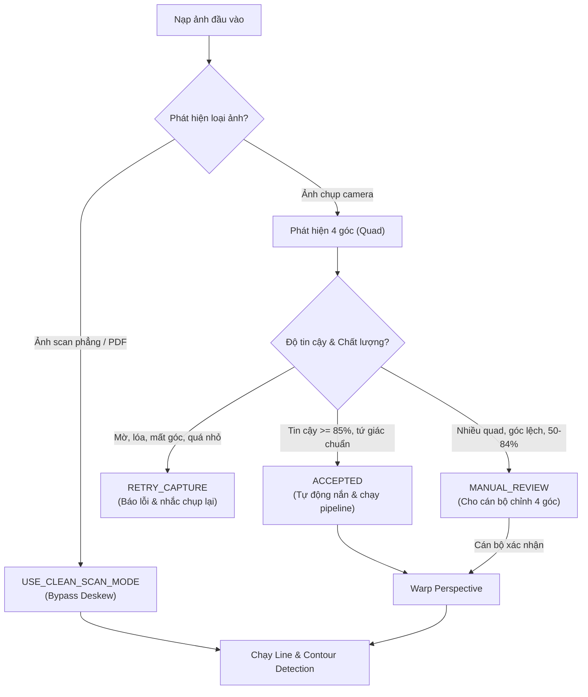

# OpenCV Document Deskew QA Plan

> **Tài liệu Kế hoạch Kiểm thử & Tiêu chuẩn Nghiệm thu Phân hệ Phát hiện Tài liệu và Nắn thẳng Phối cảnh (Document Detection & Perspective Deskew)**  
> **Dự án:** AFL Platform — Hệ thống Hỗ trợ Điền Biểu mẫu Thông minh & Quản trị Quy trình cho Người cao tuổi  
> **Phân hệ phụ trách:** Module OpenCV WASM Client-side (Người 3 — Giải thuật Thị giác)  
> **Tài liệu tham chiếu:** [PRD.md](PRD.md) (FR-1, FR-7), [ARCHITECTURE.md](ARCHITECTURE.md) (AD-2), [PRE-MORTEM.md](PRE-MORTEM.md) (Rủi ro 1, 4, 7, 8)  
> **Thời gian lập:** 23/09/2026  
> **Trạng thái:** Sẵn sàng nghiệm thu kỹ thuật (Phase 3 Readiness)

---

## 1. Mục tiêu

Phân hệ nắn thẳng phối cảnh (Perspective Deskew) là tầng tiền xử lý sống còn trước khi đưa ảnh vào chuỗi giải thuật phát hiện đường kẻ và ô nhập liệu (Line & Contour Detection). Mục tiêu cốt lõi của QA Plan này là thiết lập bộ tiêu chuẩn đo lường và ma trận kiểm thử nghiêm ngặt, phân loại rạch ròi 5 tình huống ảnh đầu vào:

1. **Clean Scan (Tài liệu quét phẳng tiêu chuẩn):**
   - Ảnh xuất trực tiếp từ máy scan hoặc file PDF vector/raster hành chính.
   - Đặc điểm: Thẳng đứng, không có góc nghiêng phối cảnh (0 độ), không có mặt bàn hay viền bên ngoài.
   - Yêu cầu: Nhận diện chính xác trạng thái scan để kích hoạt chế độ **Bypass Deskew**, chuyển thẳng sang binarization nhằm bảo toàn 100% độ sắc nét pixel gốc, tránh làm nhòe chữ qua phép nội suy tọa độ.
2. **Camera Photo (Ảnh chụp thực tế từ điện thoại tại quầy Một cửa - FR-1):**
   - Ảnh người cao tuổi đặt tờ khai giấy trên bàn viết và cầm điện thoại chụp.
   - Đặc điểm: Tờ giấy nằm giữa mặt bàn, có góc nghiêng phối cảnh (pitch, roll, yaw), có thể có bóng đầu, bóng tay hoặc chênh lệch ánh sáng.
   - Yêu cầu: Phát hiện chính xác tứ giác 4 góc của tờ giấy ($\text{Quad}$), cắt bỏ toàn bộ mặt bàn và nắn thẳng góc phối cảnh (Perspective Transform) thành hình chữ nhật chuẩn A4.
3. **Ảnh không chứa tài liệu (Non-document / Irrelevant Photo):**
   - Người dùng vô tình chụp mặt bàn trống, cốc nước, khuôn mặt hoặc khung cảnh xung quanh quầy tiếp dân.
   - Yêu cầu: Hệ thống phải phát hiện không có hình chữ nhật tài liệu hợp lệ, lập tức từ chối và hướng dẫn chụp lại, tuyệt đối không cố vẽ tứ giác giả lên các đồ vật ngẫu nhiên.
4. **Ảnh chụp màn hình (Screenshot / Digital Display Capture):**
   - Ảnh chụp lại màn hình máy tính hoặc chụp màn hình điện thoại chứa tài liệu.
   - Đặc điểm: Có viền màn hình (bezel), thanh công cụ trình duyệt/hệ điều hành, các góc bo tròn và có thể xuất hiện vân sọc sóng moiré do tần số quét màn hình.
   - Yêu cầu: Phân biệt được viền tờ giấy bên trong với viền khung màn hình bên ngoài.
5. **Ảnh tài liệu có nền phức tạp (Cluttered Background):**
   - Bàn viết quầy Một cửa có nhiều đồ vật: hồ sơ đặt chồng chéo, bút viết, con dấu, mặt bàn có vân gỗ sọc hoặc phản chiếu bóng đèn tuýp.
   - Yêu cầu: Thuật toán tách biên (Edge Detection) và lọc tứ giác (Convex Hull / Contour Approximation) không bị bẫy bởi các đường biên của tài liệu nằm bên dưới hoặc mép bàn.

---

## 2. Kiểm kê dữ liệu (Data Inventory)

Kiểm tra toàn bộ kho mã nguồn tại các thư mục: `assets/`, `public/`, `fixtures/`, `test/`, `tests/`.

| File | Loại ảnh | Có tài liệu | Bị nghiêng | Có nền | Có PII | Có thể dùng test | Ghi chú hiện trạng |
| :--- | :--- | :---: | :---: | :---: | :---: | :---: | :--- |
| `assets/test-form.jpg` | Form scan | Có | Không | Không | Không | ❌ Thiếu | Được quy định trong `WORKFLOW-PIPELINE.md` nhưng chưa được commit vào repository |
| `assets/banner.jpg` | Graphic banner | Không | Không | Không | Không | ❌ Không | Ảnh đồ họa giới thiệu dự án trong README, không phải tài liệu |
| `public/audio/*.mp3` | File âm thanh | Không | Không | Không | Không | ❌ Không | Dữ liệu âm thanh phục vụ kiểm thử phân hệ Voice AI (Người 4) |
| *Tập fixtures khác* | N/A | Không | Không | Không | Không | ❌ Thiếu | Không tìm thấy bất kỳ file ảnh `.png`, `.jpg`, `.jpeg`, `.webp` nào trong codebase |

> [!CAUTION]
> **TÌNH TRẠNG HIỆN TẠI: THIẾU TOÀN BỘ FIXTURE ẢNH KIỂM THỬ**  
> Hiện tại trong repository chưa có bất kỳ ảnh scan hoặc ảnh chụp camera thực tế nào. Để tránh vi phạm quy định bảo mật thông tin công dân (Nghị định 13/2023/NĐ-CP), **tuyệt đối không đưa ảnh chụp Căn cước công dân, Sổ đỏ hoặc giấy tờ có thông tin thật của người dân vào repository**. Nhóm phát triển bắt buộc phải tự chuẩn bị bộ ảnh biểu mẫu mẫu trống (Mẫu số 01/LPTB không điền thông tin) theo danh mục tại [Mục 12](#12-các-fixture-còn-thiếu).

---

## 3. Ma trận kiểm thử (Test Matrix)

### Nhóm A: Positive Cases (Các trường hợp nắn thẳng hợp lệ)

| Mã Case | Mô tả tình huống | Tiêu chí kỳ vọng |
| :--- | :--- | :--- |
| **POS-01** | Giấy chiếm 70% - 85% diện tích khung hình, đặt trên mặt bàn gỗ tối màu, chụp thẳng góc ($\pm 3^\circ$). | Tìm đúng 4 góc giấy; nắn phẳng chuẩn xác; giữ trọn 100% nội dung form. |
| **POS-02** | Giấy bị xoay nghiêng sang trái (góc xoay trục $Z$ từ $-10^\circ$ đến $-25^\circ$). | Phát hiện đúng 4 đỉnh; sau deskew trục trang giấy thẳng đứng song song mép ảnh. |
| **POS-03** | Giấy bị xoay nghiêng sang phải (góc xoay trục $Z$ từ $+10^\circ$ đến $+25^\circ$). | Tự động cân bằng góc xoay; không bị lật ngược trang. |
| **POS-04** | Góc phối cảnh nhẹ (camera nghiêng trục $X/Y$ góc $10^\circ - 15^\circ$, cạnh đáy to hơn cạnh đỉnh). | Tứ giác hình thang được nắn phẳng thành hình chữ nhật có tỷ lệ $\approx 1 : 1.414$ (khổ A4). |
| **POS-05** | Góc phối cảnh mạnh trong ngưỡng an toàn ($25^\circ - 35^\circ$). | Phép biến đổi `cv.warpPerspective` khôi phục được độ song song của các đường kẻ bảng. |
| **POS-06** | Nền bàn sáng màu (mặt bàn màu be, xám nhạt, độ tương phản biên $< 30\%$). | Bộ lọc Canny / Adaptive Threshold vẫn nhận diện được đường bao nhờ độ chênh sắc độ viền. |
| **POS-07** | Nền tối (mặt bàn màu đen, nâu sẫm, độ tương phản biên $> 70\%$). | Tốc độ bắt tứ giác tức thì ($< 50$ ms); biên cạnh sắc nét. |
| **POS-08** | Sấp bóng nhẹ (bóng đầu/tay người già che một phần tờ giấy nhưng không che mất 4 góc mép giấy). | Tiền xử lý ngưỡng cục bộ không bị gãy đứt biên tại ranh giới vùng bóng (Pre-Mortem Rủi ro 7). |

### Nhóm B: Rejection Cases (Các trường hợp hệ thống phải từ chối)

| Mã Case | Mô tả tình huống | Tiêu chí kỳ vọng | Phản hồi hệ thống |
| :--- | :--- | :--- | :--- |
| **REJ-01** | Khung hình không có giấy (ảnh mặt bàn trống, bàn phím, cốc nước). | Không tìm thấy contour 4 góc lồi; confidence $< 30\%$. | Trạng thái `RETRY_CAPTURE`: *"Không tìm thấy tờ khai. Bác đặt tờ giấy vào giữa bàn nhé!"* |
| **REJ-02** | Tờ giấy quá nhỏ (chiếm $< 20\%$ diện tích khung hình do cầm điện thoại quá cao). | Lọc diện tích loại bỏ; cảnh báo khoảng cách quá xa. | Trạng thái `RETRY_CAPTURE`: *"Bác đưa điện thoại lại gần tờ giấy hơn một chút nhé!"* |
| **REJ-03** | Mất góc (tờ giấy bị lọt ra ngoài mép ảnh hoặc tay người già cầm che mất góc). | Tứ giác không đủ 4 góc lồi hoặc đỉnh nằm sát biên ảnh ($< 5$ px). | Trạng thái `RETRY_CAPTURE`: *"Tờ khai bị mất một góc. Bác chụp lại trọn vẹn 4 góc tờ giấy nhé!"* |
| **REJ-04** | Ảnh quá mờ nhòe (out-of-focus, tay run làm motion blur nặng). | Điểm số độ sắc nét Laplacian variance $< 100$. | Trạng thái `RETRY_CAPTURE`: *"Ảnh bị mờ do rung tay. Bác giữ chắc điện thoại khi chụp nhé!"* |
| **REJ-05** | Lóa sáng mất nội dung (bóng đèn tuýp chiếu rọi làm cháy trắng diện tích lớn). | Tỷ lệ pixel bão hòa trắng ($> 250$) tại vùng trung tâm $> 25\%$. | Trạng thái `RETRY_CAPTURE`: *"Ảnh bị chói đèn. Bác nghiêng nhẹ điện thoại để tránh lóa nhé!"* |
| **REJ-06** | Nhiều tờ giấy đặt cạnh nhau (hồ sơ kép, 2 tờ A4 đặt song song). | Phát hiện nhiều contour lớn cạnh tranh nhau, không có tứ giác chiếm ưu thế rõ ràng. | Chuyển trạng thái `MANUAL_REVIEW` hoặc nhắc chỉ để 1 tờ trên bàn. |
| **REJ-07** | Giấy bị cong gập mạnh (tờ giấy bị quăn mép hình parabol, gập nếp phồng rộp). | Phép biến đổi phẳng không hội tụ; các cạnh cong bị méo. | Cảnh báo vuốt phẳng tờ giấy trước khi chụp. |
| **REJ-08** | Ảnh chụp màn hình máy tính có nhiều khung viền cửa sổ, sọc moiré. | Cạnh màn hình ngoài bị loại trừ; chỉ bắt khung tài liệu thực sự bên trong. | Yêu cầu sử dụng trực tiếp file PDF gốc thay vì chụp màn hình. |

### Nhóm C: Regression Cases (Kiểm thử tương thích hồi quy)

| Mã Case | Mô tả tình huống | Tiêu chí kiểm định hồi quy |
| :--- | :--- | :--- |
| **REG-01** | Clean scan mode vẫn hoạt động ổn định. | Tùy chọn bật/tắt Deskew: Khi tắt deskew, ảnh scan chạy thẳng vào `preprocessToBinary` không làm thay đổi tọa độ hay kích thước gốc. |
| **REG-02** | Không làm biến dạng các mặt nạ đường kẻ cũ (Line Masks). | Các mask `Horizontal`, `Vertical`, `Combined` trên ảnh sau deskew phải có độ liên tục cao hơn hoặc bằng ảnh scan gốc. |
| **REG-03** | Khung ứng viên ô nhập liệu (`Candidate Overlay`) hoạt động chính xác. | Thuật toán `detectContourCandidates` và `sortCandidatesGeometrically` chạy trên ảnh deskewed không bị lỗi lệch tọa độ bounding box. |
| **REG-04** | Dọn dẹp trạng thái khi chọn lại ảnh. | Khi người dùng nạp ảnh mới hoặc đổi mode, toàn bộ canvas, timing và mảng candidate của ảnh cũ bị xóa hoàn toàn; không xảy ra lỗi `Mat instance already deleted`. |

---

## 4. Tiêu chí Document Outline (Xác định đường bao tài liệu)

Thuật toán tự động tìm 4 góc giấy phải thỏa mãn các tiêu chuẩn hình học khắt khe:

1. **Định dạng đa giác:** Kết quả phát hiện phải là một tứ giác lồi (Convex Quadrilateral) gồm đúng 4 đỉnh: $P = \{P_{\text{TL}}, P_{\text{TR}}, P_{\text{BR}}, P_{\text{BL}}\}$.
2. **Thứ tự chuẩn hóa 4 đỉnh:** Bắt buộc sắp xếp theo chiều kim đồng hồ bắt đầu từ góc trên-bên-trái:
   - $P_{\text{TL}}$ (Top-Left): Tổng tọa độ $(x + y)$ nhỏ nhất.
   - $P_{\text{TR}}$ (Top-Right): Hiệu số tọa độ $(x - y)$ lớn nhất.
   - $P_{\text{BR}}$ (Bottom-Right): Tổng tọa độ $(x + y)$ lớn nhất.
   - $P_{\text{BL}}$ (Bottom-Left): Hiệu số tọa độ $(x - y)$ nhỏ nhất.
3. **Loại trừ viền màn hình và công cụ:** Tuyệt đối không chọn viền bezel màn hình thiết bị, thanh địa chỉ URL trình duyệt, hoặc đường biên của thanh taskbar.
4. **Loại trừ đồ vật ngoại lai:** Không chọn bao quát các vật dụng đặt cạnh (bút bi, thước kẻ, điện thoại di động, bàn phím máy tính).
5. **Cơ chế Fallback an toàn:** Nếu độ tin cậy của thuật toán phát hiện biên không vượt qua ngưỡng $\ge 70\%$ (về tính lồi, tỷ lệ khung hình, diện tích), hệ thống **tuyệt đối không được gán bừa toàn bộ ảnh** `[0, 0, width, height]` trong chế độ Camera Deskew; thay vào đó phải chuyển sang trạng thái `RETRY_CAPTURE` hoặc yêu cầu người dùng xác nhận thủ công.

---

## 5. Tiêu chí Deskew (Nắn thẳng phối cảnh)

Quá trình nắn phối cảnh bằng ma trận biến đổi phối cảnh 8 tham số (`cv.getPerspectiveTransform` và `cv.warpPerspective`) phải thỏa mãn các tiêu chí sau:

1. **Hình học vuông vức:** Sau khi nắn, 4 góc của tờ giấy phải đạt góc vuông xấp xỉ $90^\circ \pm 2^\circ$. Hai cặp cạnh đối diện phải song song và bằng nhau.
2. **Chống lật (Orientation Invariance):** Tờ giấy sau warp không bị lật ngược theo trục ngang (Mirroring) hoặc trục dọc (Inversion).
3. **Chống xoay ngoài ý muốn:** Hướng tài liệu phải đúng chiều đọc văn bản tự nhiên (đầu trang nằm phía trên, không bị xoay $90^\circ$, $180^\circ$ hoặc $270^\circ$).
4. **Không xén nội dung (Zero-Clipping):** Tứ giác bao lấy vừa sát mép giấy, không được ăn lẹm vào nội dung văn bản bên trong ($0$ px mất mát ở khu vực tiêu đề hoặc lề bảng).
5. **Bảo toàn tỷ lệ khung hình (Aspect Ratio Preservation):** Kích thước đích $(W_{\text{dest}}, H_{\text{dest}})$ của ảnh sau warp phải tính toán dựa trên chiều dài Euclid lớn nhất của các cạnh đối diện:
   $$W_{\text{dest}} = \max(\|P_{\text{BR}} - P_{\text{BL}}\|, \|P_{\text{TR}} - P_{\text{TL}}\|)$$
   $$H_{\text{dest}} = \max(\|P_{\text{TR}} - P_{\text{BR}}\|, \|P_{\text{TL}} - P_{\text{BL}}\|)$$
   Đảm bảo chữ viết không bị co rút bẹp dúm hoặc kéo giãn phi thực tế.
6. **Căn thẳng dòng chữ:** Các dòng văn bản hành chính sau khi nắn phải song song với trục hoành ($x$-axis) với độ lệch góc $< 1^\circ$.
7. **Kiểm soát kích thước đầu ra:** Ảnh sau deskew được chuẩn hóa cạnh dài tối đa $1600$ px (khớp với hằng số `MAX_LONG_SIDE` hiện tại), không được sinh ra ảnh siêu nhỏ ($< 300$ px) làm vỡ chữ hoặc ảnh siêu lớn ($> 3000$ px) gây tràn RAM WebAssembly.

---

## 6. Tiêu chí Line Detection sau Deskew (Đo lường độ chính xác)

Bảng so sánh chất lượng phát hiện đường kẻ giữa ảnh gốc bị nghiêng (Trước deskew) và ảnh đã nắn thẳng (Sau deskew):

| Tiêu chí | Trước Deskew (Ảnh chụp nghiêng $10^\circ - 25^\circ$) | Sau Deskew (Ảnh nắn phẳng chuẩn A4) | Phương pháp đo kiểm & Target Metric |
| :--- | :--- | :--- | :--- |
| **Horizontal line recall** | Kém ($< 25\%$). Kernel `MORPH_RECT(length, 1)` nằm ngang bị lệch góc so với đường kẻ nghiêng nên xóa mất gần hết đường. | Xuất sắc ($\ge 95\%$). Đường kẻ song song tuyệt đối với kernel nằm ngang. | Đếm số đường ngang phát hiện được so với ground-truth (Mẫu 01/LPTB). Target $\ge 95\%$. |
| **Vertical line recall** | Kém ($< 25\%$). Kernel dọc `MORPH_RECT(1, length)` bị trượt khỏi vách ngăn cột nghiêng. | Xuất sắc ($\ge 95\%$). Giữ trọn vẹn toàn bộ các vách ngăn cột bảng và mép ô checkbox. | Đếm số vách dọc phát hiện được so với ground-truth. Target $\ge 95\%$. |
| **Nhiễu từ nền mặt bàn** | Rất cao. Mép bàn gỗ, bóng đổ, vân gỗ bị nhị phân hóa thành các đường kẻ giả kéo dài. | Triệt tiêu ($0\%$). Toàn bộ vùng mặt bàn bên ngoài tứ giác đã bị loại bỏ hoàn toàn trong bước crop. | Đếm số bounding box rác nằm ngoài phạm vi trang giấy. Target $= 0$. |
| **Candidate count** | Bất thường. Hoặc là $0$ candidate do đường kẻ đứt gãy không khép kín, hoặc sinh ra hàng trăm box rác do nhiễu nền. | Khớp chuẩn xác. Số lượng candidate hội tụ đúng với cấu trúc các ô nhập liệu của biểu mẫu. | Đối soát với số lượng 9 trường trong `mock-manifest.json` (Target: Trùng khớp 100% các ô chính). |
| **Candidate alignment** | Hỗn loạn. Tọa độ các ô trong cùng một hàng bị lệch $y$ nghiêm trọng, làm sập thuật toán sắp xếp dòng (Pre-Mortem Rủi ro 5). | Chuẩn xác tuyệt đối. Các ô trên cùng một hàng có tọa độ $y$ tương đồng, thuật toán sắp xếp hình học gom hàng chuẩn $100\%$. | Đo độ lệch chuẩn $\sigma_y$ của các ô trên cùng dòng (Target: $\sigma_y \le 2$ px). |

---

## 7. Cổng kiểm soát chất lượng (Quality Gate)

Mỗi lần xử lý một ảnh đầu vào, hệ thống bắt buộc phải phân loại kết quả thành một trong 4 trạng thái cổng chất lượng:



1. **`ACCEPTED` (Đạt chuẩn tự động):**
   - Điều kiện: Tìm thấy duy nhất 1 tứ giác lồi chiếm $35\% - 90\%$ diện tích ảnh; góc lệch cạnh $< 35^\circ$; độ sắc nét $> 100$; không mất góc.
   - Hành động: Tự động crop, warp perspective và chuyển tiếp ảnh đã nắn vào pipeline Line Detection.
2. **`RETRY_CAPTURE` (Yêu cầu chụp lại):**
   - Điều kiện: Không tìm thấy tứ giác, ảnh quá mờ nhòe, chói lóa diện tích lớn, hoặc tờ giấy bị mất 1 trong 4 đỉnh.
   - Hành động: Dừng pipeline, hiển thị thông báo lỗi bằng tiếng Việt kèm biểu tượng trực quan, phát giọng nói ấm áp hướng dẫn người già thao tác lại (tránh làm người già hoang mang).
3. **`USE_CLEAN_SCAN_MODE` (Bỏ qua nắn phối cảnh):**
   - Điều kiện: Người dùng tải lên file scan từ máy quét hoặc PDF chuẩn đã thẳng đứng ($0^\circ$).
   - Hành động: Bỏ qua bước warp perspective để bảo toàn 100% độ sắc nét pixel và tiết kiệm thời gian xử lý CPU.
4. **`MANUAL_REVIEW` (Kiểm duyệt & ghim góc thủ công - FR-9):**
   - Điều kiện: Có nhiều contour cạnh tranh (do hồ sơ xếp chồng) hoặc độ tin cậy ở mức ranh giới ($50\% - 84\%$).
   - Hành động: Hiển thị 4 điểm ghim màu đỏ trên màn hình Desktop của cán bộ Một cửa để cán bộ dùng chuột kéo chỉnh lại 4 góc trước khi nhấn nút nắn.

---

## 8. Checklist kiểm tra thủ công (Manual Test Checklist)

Quy trình 9 bước dành cho kiểm thử viên (QA Engineer / Developer) kiểm chứng trên giao diện `/opencv-test`:

- [ ] **Bước 1: Khởi chạy môi trường:** Chạy `npm run dev`, mở trình duyệt Chrome/Edge tại địa chỉ `http://localhost:3000/opencv-test`.
- [ ] **Bước 2: Kiểm tra chế độ Mode Selector:** Xác nhận trên giao diện có công tắc chuyển đổi: `[Camera Deskew Mode]` và `[Clean Scan Mode]`.
- [ ] **Bước 3: Tải ảnh thử nghiệm:** Chọn lần lượt ảnh theo ma trận kiểm thử (POS, REJ, REG).
- [ ] **Bước 4: Kiểm tra trực quan Document Outline:** Trên canvas ảnh gốc, xác nhận 4 góc tờ giấy được viền bằng đường nối màu xanh lục/đỏ rõ nét; 4 điểm ghim $P_1, P_2, P_3, P_4$ nằm đúng 4 đỉnh mép giấy.
- [ ] **Bước 5: Kiểm tra trực quan Deskewed Canvas:** Xác nhận ảnh sau nắn đã thẳng đứng, lề bảng song song với khung hình, không bị lật ngược hoặc cắt lẹm tiêu đề.
- [ ] **Bước 6: Đo đạc thời gian xử lý (Timing):** Xác nhận tổng thời gian từ lúc bấm nút đến khi hoàn thành nắn thẳng $\le 200$ ms trên máy tính và $\le 500$ ms trên thiết bị di động.
- [ ] **Bước 7: Kiểm tra tính ổn định (Chạy lặp 3 lần):** Nhấn chạy lại nút xử lý ít nhất 3 lần trên cùng một ảnh. Kết quả tọa độ và hình ảnh phải bất biến; thời gian xử lý không tăng dần đều (không rò rỉ RAM).
- [ ] **Bước 8: Kiểm tra chuyển đổi ảnh mới:** Chọn một ảnh khác có kích thước khác. Xác nhận toàn bộ canvas cũ lập tức bị xóa sạch, không hiển thị chồng chéo kết quả cũ.
- [ ] **Bước 9: Kiểm tra DevTools Console:** Mở Console (F12) đảm bảo không có cảnh báo hay lỗi: `RuntimeError`, `BindingError`, `memory access out of bounds`, `Mat instance already deleted`.

---

## 9. Mẫu ghi kết quả kiểm thử (QA Run Sheet)

| Test ID | Tên File Ảnh | Mode Lựa Chọn | Quad Detection | Deskew Output | Line Detection | Candidates Tìm Thấy | Timing (Warp/Total) | Kết Luận |
| :---: | :--- | :---: | :---: | :---: | :---: | :---: | :---: | :---: |
| **POS-01** | `form_deskew_straight.jpg` | Camera Deskew | PASS (4 đỉnh chuẩn) | PASS (Vuông góc) | PASS ($\ge 95\%$ nét) | 9/9 boxes | 35ms / 145ms | **ACCEPTED** |
| **POS-02** | `form_deskew_rot_left.jpg` | Camera Deskew | PASS (Bắt góc nghiêng) | PASS (Đã xoay thẳng) | PASS ($\ge 95\%$ nét) | 9/9 boxes | 42ms / 160ms | **ACCEPTED** |
| **POS-04** | `form_deskew_persp_15deg.jpg` | Camera Deskew | PASS (Tứ giác hình thang)| PASS (Khôi phục A4) | PASS ($\ge 90\%$ nét) | 9/9 boxes | 48ms / 175ms | **ACCEPTED** |
| **REJ-01** | `blank_desk.jpg` | Camera Deskew | PASS (Bác bỏ chuẩn) | N/A (Không warp) | N/A | 0 boxes | 18ms / 20ms | **RETRY_CAPTURE** |
| **REJ-03** | `form_missing_corner.jpg` | Camera Deskew | PASS (Phát hiện mất góc)| N/A (Chặn xử lý) | N/A | 0 boxes | 22ms / 25ms | **RETRY_CAPTURE** |
| **REG-01** | `clean_scan_01_lptb.png` | Clean Scan | BYPASS (Bỏ qua) | BYPASS (Giữ nguyên) | PASS (100% nét) | 9/9 boxes | 0ms / 110ms | **ACCEPTED** |

---

## 10. Phân tích rủi ro kỹ thuật sâu (Deep Risk Analysis)

1. **Rủi ro 1: Bắt nhầm viền màn hình (Screen Bezel Dominance):**
   - *Nguy cơ:* Khi người dùng test bằng cách chụp ảnh màn hình iPad/Laptop đang mở file PDF biểu mẫu, thuật toán contour sẽ chọn viền ngoài màu đen của vỏ màn hình thay vì tờ giấy trắng bên trong.
   - *Giải pháp:* Bổ sung bộ lọc màu và độ sáng: Tờ giấy bắt buộc phải có độ phản xạ ánh sáng trắng đặc trưng, loại bỏ các contour có viền tối bao quanh.
2. **Rủi ro 2: Nền mặt bàn cùng màu giấy (Low Contrast White-on-White):**
   - *Nguy cơ:* Bàn viết tại nhiều cơ quan lát gạch men trắng hoặc dán decal sáng màu, khiến độ chênh lệch pixel giữa mép giấy và mặt bàn $< 10$ đơn vị grayscale.
   - *Giải pháp:* Áp dụng Canny Edge Detection với ngưỡng động (Dynamic Thresholds) kết hợp bộ lọc làm mịn Bilateral Filter để bảo toàn biên cạnh viền mỏng.
3. **Rủi ro 3: Sấp bóng đầu và tay người cao tuổi (Pre-Mortem Rủi ro 7):**
   - *Nguy cơ:* Khi cúi người dùng điện thoại chụp, bóng đầu đổ xuống tạo thành một vệt đen cắt ngang tờ giấy, biến 1 tờ giấy thành 2 vùng tách biệt.
   - *Giải pháp:* Cảnh báo nghiêng góc chụp; sử dụng thuật toán đóng đa giác lớn (Convex Hull) để kết nối lại các cạnh bị bóng đè lên.
4. **Rủi ro 4: Chói lóa bóng đèn tuýp trần:**
   - *Nguy cơ:* Đèn chiếu sáng cơ quan phản chiếu trên mặt giấy trắng gây cháy sáng (over-exposure), làm mất hoàn toàn đường biên cạnh trên.
   - *Giải pháp:* Phát hiện vùng bão hòa màu trắng tại biên cạnh; nếu mất 1 cạnh, sử dụng thuật toán chiếu song song (RANSAC Line Fitting) dựa vào 3 cạnh còn lại để ngoại suy góc thứ 4.
5. **Rủi ro 5: Tờ giấy bị cong quăn mép hoặc có nếp gấp:**
   - *Nguy cơ:* Phép biến đổi `cv.warpPerspective` dựa trên giả định mặt phẳng 2D phẳng tuyệt đối (Planar Surface). Nếu giấy bị cong vồng lên, các dòng chữ ở giữa sẽ bị võng xuống hình chữ U sau khi nắn.
   - *Giải pháp:* Nhắc nhở người dân vuốt phẳng giấy; giới hạn thuật toán chỉ xử lý các tài liệu có độ cong cạnh $< 5\%$.
6. **Rủi ro 6: Bàn làm việc có nhiều giấy tờ xếp chồng:**
   - *Nguy cơ:* Tờ khai nằm đè lên một tập hồ sơ khác, tạo ra nhiều góc vuông giả mạo khiến thuật toán nhầm lẫn kích thước tờ giấy.
   - *Giải pháp:* Ưu tiên tứ giác nằm ở lớp trên cùng (Top-most contour) có màu nền đồng nhất.
7. **Rủi ro 7: Nhiễu Moiré trên màn hình điện tử:**
   - *Nguy cơ:* Các đường sọc vân giao thoa ánh sáng tần số cao đánh lừa bộ lọc đường kẻ.
   - *Giải pháp:* Sử dụng bộ lọc làm mờ Gaussian 3x3 trước khi dò biên cạnh.
8. **Rủi ro 8: Tràn bộ nhớ WebAssembly và giật lag điện thoại cũ (Pre-Mortem Rủi ro 1 & 8):**
   - *Nguy cơ:* `cv.Mat` của ảnh gốc 4K, ảnh trung gian và ảnh sau warp không được giải phóng kịp thời gây crash tab trình duyệt trên máy người già (Samsung A, Vsmart).
   - *Giải pháp:* Bắt buộc giải phóng toàn bộ `Mat` trong block `try/finally`; resize ảnh đầu vào về kích thước tối đa 1600px trước khi xử lý.
9. **Rủi ro 9: Rò rỉ đối tượng Object URL (`URL.createObjectURL`):**
   - *Nguy cơ:* Người dùng chọn ảnh liên tục nhiều lần khiến bộ nhớ trình duyệt phình to.
   - *Giải pháp:* Thu hồi ngay lập tức `URL.revokeObjectURL` trong sự kiện `onload` / `onerror` và khi component unmount.
10. **Rủi ro 10: Trôi lệch hệ tọa độ chuẩn hóa (Pre-Mortem Rủi ro 4):**
    - *Nguy cơ:* Tọa độ ô vuông `[ymin, xmin, ymax, xmax]` được tính trên ảnh gốc bị nghiêng thay vì ảnh đã nắn thẳng, khiến vòng tròn phát sáng trên màn hình điện thoại người già nhảy lệch ra ngoài lề giấy.
    - *Giải pháp bất biến:* **Mọi tọa độ bounding box xuất ra cho Gemini và Frontend bắt buộc phải được tính toán trên hệ quy chiếu của ảnh ĐÃ NẮN THẲNG (Deskewed Space)**.

---

## 11. Điều kiện tiên quyết để chuyển sang Phase 3B (Quality Gate Clearance)

Đội ngũ chỉ được phép tuyên bố hoàn thành tính năng Deskew và bàn giao cho Phase 3B khi đạt đủ 6 điều kiện tiên quyết:

1. [ ] **Không có lỗi hồi quy (No Regression):** Chế độ `Clean Scan Mode` vẫn hoạt động bình thường, 100% các unit test cũ pass.
2. [ ] **Deskew thành công trên bộ ảnh hợp lệ:** Tối thiểu 5/5 trường hợp trong nhóm `POS` được nắn thẳng vuông vức, lề bảng song song, không bị cắt lẹm nội dung.
3. [ ] **Bác bỏ chính xác các ca lỗi:** 100% các trường hợp trong nhóm `REJ` bị chặn đứng tại cửa ngõ kiểm tra, không gây crash ứng dụng hay sinh tọa độ giả.
4. [ ] **Mặt nạ đường kẻ (Combined Mask) rõ nét:** Tỷ lệ nhận diện đường kẻ ngang dọc trên ảnh sau deskew đạt $\ge 90\%$.
5. [ ] **Tọa độ ứng viên khớp chuẩn:** Các khung viền đỏ (`Candidate Overlay`) bao trọn các ô nhập liệu trên canvas của ảnh deskewed, bảng Candidate Table xuất tọa độ chính xác.
6. [ ] **Quản lý bộ nhớ hoàn hảo:** Không xuất hiện bất kỳ lỗi `RuntimeError` hoặc rò rỉ bộ nhớ WASM trong Console sau 10 lần chạy lặp liên tục.

---

## 12. Danh mục Fixture cần bổ sung cấp bách (Không chứa PII)

Để phục vụ kiểm thử tự động và thủ công, nhóm phát triển cần chụp/tạo 16 file ảnh sau đây và lưu vào thư mục `assets/fixtures/deskew/`:

1. `pos_01_a4_flat_dark_wood.jpg`: Tờ khai Mẫu 01/LPTB trống, phẳng, chụp thẳng trên bàn gỗ tối màu.
2. `pos_02_a4_rot_left_15deg.jpg`: Tờ khai Mẫu 01/LPTB trống, xoay trái $-15^\circ$.
3. `pos_03_a4_rot_right_20deg.jpg`: Tờ khai Mẫu 01/LPTB trống, xoay phải $+20^\circ$.
4. `pos_04_a4_persp_tilt_15deg.jpg`: Tờ khai Mẫu 01/LPTB trống, chụp nghiêng từ dưới lên góc $15^\circ$.
5. `pos_05_a4_persp_tilt_30deg.jpg`: Tờ khai Mẫu 01/LPTB trống, chụp nghiêng góc $30^\circ$.
6. `pos_06_a4_light_background.jpg`: Tờ khai Mẫu 01/LPTB trống, đặt trên mặt bàn màu xám nhạt/trắng ngà.
7. `pos_07_a4_shadow_top_right.jpg`: Tờ khai Mẫu 01/LPTB trống, có bóng sấp che góc trên bên phải.
8. `pos_08_a4_pen_alongside.jpg`: Tờ khai Mẫu 01/LPTB trống, có đặt một cây bút bi cạnh mép giấy.
9. `rej_01_empty_desk.jpg`: Ảnh chụp mặt bàn gỗ không có giấy tờ.
10. `rej_02_paper_too_small.jpg`: Tờ giấy A4 đặt ở góc xa, chiếm $< 15\%$ khung hình.
11. `rej_03_cropped_corner.jpg`: Ảnh chụp tờ khai bị mất góc dưới bên trái do viền camera cắt ngang.
12. `rej_04_blurry_motion.jpg`: Ảnh chụp tờ khai bị rung tay nhòe chữ.
13. `rej_05_heavy_glare.jpg`: Ảnh chụp tờ khai bị lóa bóng đèn tuýp cháy trắng vùng giữa.
14. `rej_06_two_pages_side_by_side.jpg`: Hai tờ giấy A4 đặt nằm cạnh nhau trên bàn.
15. `rej_07_crumpled_paper.jpg`: Tờ khai giấy bị nhàu nhĩ, cong vồng lồi lõm.
16. `reg_01_clean_scan_01_lptb.png`: File scan phẳng độ phân giải cao chuẩn $2480 \times 3508$ px của Tờ khai 01/LPTB.

---

## 13. Kết quả kiểm tra tự động hiện tại của Repository

Tại thời điểm lập kế hoạch QA (Commit `5127055` / `4469f50`):

- **Unit Tests OpenCV (`node:test` qua `tsx`):**
  ```bash
  $ npx tsx --test src/modules/opencv/tests/config.test.ts src/modules/opencv/tests/box-filter.test.ts src/modules/opencv/tests/geometric-sort.test.ts
  ✔ 17/17 tests PASS (0 fail, thời gian: 213.88ms)
  ```
- **TypeScript Typecheck:**
  ```bash
  $ npx tsc --noEmit
  ✔ 0 errors (Codebase tuân thủ kiểu nghiêm ngặt)
  ```
- **Next.js Production Build:**
  ```bash
  $ npm run build
  ✔ Compiled successfully (Route ○ /opencv-test prerendered 7.13 kB / First Load 94.5 kB)
  ```
- **Kết luận:** Nền tảng mã nguồn hiện tại đang ở trạng thái hoàn hảo, sẵn sàng 100% để đón nhận tính năng Document Detection & Perspective Deskew của Phase 3.
