# TÀI LIỆU YÊU CẦU SẢN PHẨM (PRD)
## Hệ thống Hỗ trợ Điền Biểu mẫu Thông minh & Quản trị Quy trình Hành chính cho Người cao tuổi

---

## 0. Mục đích Tài liệu
Tài liệu này xác định toàn bộ các yêu cầu sản phẩm (Product Requirements Document - PRD) cho giải pháp Hỗ trợ Điền biểu mẫu và Quản trị Quy trình Hành chính thông minh bằng Trí tuệ nhân tạo (AI), hướng tới đối tượng người cao tuổi và công dân chưa am hiểu thủ tục hành chính số tại Việt Nam. Tài liệu đóng vai trò chuẩn mực thống nhất cho các nhóm Thiết kế Trải nghiệm (UX/UI), Kiến trúc Hệ thống (System Architecture), và Đội ngũ Phát triển Phần mềm (Development) trong quá trình xây dựng phiên bản ban đầu (Giai đoạn thử nghiệm: Ứng dụng Web tối ưu trên Di động cho người dân & Cổng Thông tin Quản trị trên Máy tính cho Chuyên viên).

---

## 1. Tầm nhìn Sản phẩm
Việt Nam đang đẩy mạnh chuyển đổi số trong các dịch vụ công ích và thủ tục hành chính (ứng dụng VNeID, Cổng Dịch vụ công Quốc gia, Bảo hiểm Y tế điện tử, nộp phạt vi phạm hành chính trực tuyến...). Tuy nhiên, hàng triệu người cao tuổi (từ 60 tuổi trở lên) đang gặp phải rào cản rất lớn do thị lực suy giảm, tay run, xa lạ với bàn phím cảm ứng và bối rối trước các thuật ngữ pháp lý phức tạp.

**Tầm nhìn sản phẩm:** Trở thành **"Người đồng hành số kiên nhẫn và tin cậy"** túc trực bên cạnh người cao tuổi ngay tại bàn viết của các cơ quan Một cửa. Hệ thống ứng dụng **Mô hình Kết hợp Tối ưu (OpenCV WASM Geometric Extraction + Gemini 1.5 Flash Text Engine)**:
1. **Thuật toán Xử lý Ảnh Hình học Cục bộ (OpenCV Line & Contour Detection):** Xử lý trực tiếp trên máy, quét các đường kẻ ngang dọc, khung bảng và ô vuông trên giấy trắng mực đen với tốc độ mili-giây, trích xuất tọa độ pixel chính xác tuyệt đối ($\ge 98\%$) và bóc tách các vùng nhãn văn bản cục bộ.
2. **Trí tuệ Nhân tạo Ngôn ngữ (Google Gemini 1.5 Flash Text & LLM Engine):** Tiếp nhận dữ liệu dạng Text/JSON từ OpenCV đã chuẩn hóa (hoàn toàn không cần gửi ảnh qua Vision API), tập trung đọc hiểu ngữ nghĩa nhãn trường hành chính phức tạp, phân tích điều kiện rẽ nhánh và tự động sinh câu thoại hướng dẫn bình dân cùng chữ mẫu đỏ.
3. **Nền tảng Quản trị & Trợ lý Giọng nói (CRM Workflow & Human-in-the-loop):** Trợ lý giọng nói tiếng Việt hướng dẫn từng dòng và cổng đối soát kiểm duyệt của cán bộ trước khi xuất bản, đảm bảo 100% tính chính xác pháp lý.

---

## 2. Đối tượng Người dùng & Hành trình Thực tế

### 2.1 Việc Cần Làm của Người dùng (Jobs To Be Done - JTBD)
* **Người cao tuổi (Người dùng cuối):** *"Khi tôi phải điền một tờ khai hành chính hoặc tờ khai thuế phức tạp, tôi muốn có một trợ lý hướng dẫn tôi từng dòng bằng giọng nói rõ ràng, chỉ rõ vị trí cần ghi và hiển thị chữ mẫu dễ nhìn, để tôi tự tay cầm bút hoàn thành tờ giấy mà không sợ viết sai hay phải làm phiền người khác."*
* **Cán bộ tiếp dân / Quản trị viên (Chuyên viên hành chính):** *"Khi cơ quan có biểu mẫu thủ tục mới, tôi muốn tải biểu mẫu lên và có AI tự động bóc tách thành các bước hướng dẫn chuẩn mực, để tôi rà soát, phê duyệt và xuất bản ngay cho người dân sử dụng, giảm áp lực giải thích tại quầy tiếp dân."*
* **Con cháu / Người thân hỗ trợ:** *"Tôi muốn bố mẹ tôi ở quê có thể tự tin làm các thủ tục giấy tờ cần thiết mà tôi không phải xin nghỉ phép đi làm xa để về tận nơi chỉ từng ô."*

### 2.2 Đối tượng Loại trừ trong Phiên bản v1 (Non-Users)
* Chưa phục vụ các doanh nghiệp thực hiện kê khai thuế doanh nghiệp hàng loạt hoặc hồ sơ pháp nhân đa tầng phức tạp.
* Không thay thế chữ ký số pháp lý hoặc thẩm quyền thụ lý hồ sơ của cơ quan quản lý nhà nước.

### 2.3 Các Hành trình Người dùng Cốt lõi (User Journeys)

#### Hành trình 1 (UJ-1): Bác Ba (68 tuổi) tự tay cầm bút điền Tờ khai thuế trước bạ nhà đất tại Chi cục Thuế
* **Bối cảnh & Điểm bắt đầu:** Bác Ba ngồi tại bàn viết Chi cục Thuế, cầm tờ khai giấy *"Tờ khai lệ phí trước bạ (nhà, đất) - Mẫu 01/LPTB"* gồm 2 trang chi chít chữ. Bác mở trang Web ứng dụng trên điện thoại (đã lưu sẵn biểu tượng ở màn hình chính).
* **Các bước diễn ra:**
  1. Bác bấm nút tròn lớn **[Chụp biểu mẫu đang cầm]** $\rightarrow$ Camera chụp tờ khai đang đặt trên bàn.
  2. Hệ thống AI nhận diện chính xác biểu mẫu trong 3 giây. Màn hình điện thoại phóng to hình ảnh tờ khai vừa chụp và khoanh vùng phát sáng (highlight) màu xanh tại **Mục I - Dòng 1**.
  3. Trợ lý cất giọng chậm rãi: *"Bác nhìn vào Mục I, dòng số 1 [Người nộp thuế]. Bác lấy bút ghi họ tên bằng chữ in hoa, giống như chữ mẫu màu đỏ trên màn hình nhé."*
  4. Màn hình hiển thị chữ mẫu màu đỏ đậm nổi bật trên nền trắng: `NGUYỄN VĂN BA`.
  5. Bác viết xong, bấm nút **[Dòng tiếp theo]** (hoặc chỉ cần nói *"Tiếp tục"*). Điểm sáng tự động trượt sang Dòng 3.
  6. Tại phần kê khai diện tích và thông tin chủ cũ, bác bấm giữ nút mic hỏi: *"Cháu ơi, diện tích đất ghi theo sổ đỏ hay ghi theo hợp đồng?"* $\rightarrow$ AI giải thích ngay bằng lời nói: *"Dạ bác ghi theo diện tích trên Sổ đỏ bác nhé!"*.
* **Khoảnh khắc mang lại giá trị:** Bác Ba tự tay hoàn thành trọn vẹn tờ khai thuế 2 trang giấy bằng chính cây bút mực của mình mà không gạch xóa một lỗi nào.
* **Kết quả:** Bác nộp hồ sơ tại quầy một cửa và được cán bộ tiếp nhận duyệt thông qua ngay trong lần nộp đầu tiên.

#### Hành trình 2 (UJ-2): Chuyên viên Tuấn tải lên và kiểm duyệt quy trình cho biểu mẫu mới
* **Bối cảnh & Điểm bắt đầu:** Chuyên viên Tuấn đăng nhập vào Cổng Quản trị (Web Portal) trên máy tính cơ quan. Phường vừa nhận văn bản quy định thủ tục trợ cấp xã hội mới bằng file PDF.
* **Các bước diễn ra:**
  1. Tuấn kéo thả file PDF biểu mẫu vào ô **[Thêm biểu mẫu mới]**.
  2. Hệ thống bóc tách tự động: Thuật toán xử lý ảnh hình học OpenCV quét nhanh các đường kẻ ngang dọc/khung bảng trên giấy trắng mực đen để tính toán chính xác 100% tọa độ ô trong vài mili-giây ($\ge 98\%$ độ chính xác pixel) và trích xuất dữ liệu khung ô dạng Text/JSON; sau đó Gemini 1.5 Flash (Text Engine) tiếp nhận dữ liệu text để đọc hiểu nhãn trường, điều kiện rẽ nhánh và tự động sinh kịch bản hướng dẫn bình dân mà không cần gửi ảnh. (Nếu Cloud AI quá tải/mất mạng, hệ thống tự động fallback hiển thị khung ô do OpenCV vẽ sẵn để Tuấn gán nhãn thủ công không bị gián đoạn).
  3. AI tự động sinh kịch bản hướng dẫn từng bước bằng tiếng Việt đời thường, dễ hiểu cho người cao tuổi.
  4. Giao diện đối soát chia đôi màn hình (Split-screen): Bên trái là file gốc, bên phải là quy trình AI tạo. Tuấn tinh chỉnh lại 1 câu giải thích cho sát địa phương rồi bấm **[Phê duyệt & Xuất bản]**.
* **Khoảnh khắc mang lại giá trị:** Quy trình hướng dẫn biểu mẫu lập tức sẵn sàng phục vụ người dân, đi kèm mã QR để in dán tại bàn tiếp dân.
* **Kết quả:** Tuấn tiết kiệm hơn 80% thời gian soạn tài liệu hướng dẫn thủ công, hồ sơ người dân nộp lên chuẩn xác, giảm tải tiếp dân tại quầy.

#### Hành trình 3 (UJ-3): Điền biểu mẫu nộp phạt có liên chứng từ (Biên bản xử phạt vi phạm)
* **Bối cảnh & Điểm bắt đầu:** Bác Năm cần điền thủ tục nộp tiền phạt vi phạm giao thông. Số tiền và lỗi vi phạm nằm trên tờ Biên bản xử phạt do công an lập trước đó.
* **Các bước diễn ra:**
  1. Khi mở thủ tục, Trợ lý AI thông báo bằng giọng nói: *"Bác ơi, thủ tục này cần thông tin từ Biên bản xử phạt. Bác cầm tờ biên bản chụp giúp cháu nhé!"*
  2. Bác Năm chụp tờ biên bản phạt $\rightarrow$ AI tự động bóc tách: Số biên bản, Lỗi vi phạm, Số tiền phạt.
  3. Khi hướng dẫn điền từng dòng trên biểu mẫu nộp tiền, AI đưa sẵn thông tin đã bóc tách hiển thị thành chữ mẫu màu đỏ: *"Theo biên bản của bác, số tiền phạt là 800.000 đồng, bác ghi vào ô số tiền nhé"*.
* **Kết quả:** Bác Năm không phải nhọc nhằn tìm kiếm mã số giữa tờ biên bản phạt chi chít chữ.

---

## 3. Bảng Thuật ngữ Chuẩn (Glossary)

* **Biểu mẫu giấy (Physical Paper Form):** Tờ khai hành chính in sẵn trên giấy mà công dân cầm trên tay tại cơ quan nhà nước.
* **Bản sao Thị giác (Visual Twin):** Ảnh chụp tờ khai giấy của người dùng được hiển thị trực tiếp trên màn hình, có lớp đồ họa phát sáng (Highlighter) phủ lên đúng tọa độ từng ô/dòng.
* **Chữ mẫu màu đỏ (Red High-Contrast Example Text):** Đoạn chữ ví dụ mẫu hiển thị bằng màu đỏ đậm (`#D32F2F`) tương phản cao trên nền trắng để người già dễ nhìn và chép lại.
* **Liên chứng từ (Cross-Document Dependency):** Mối quan hệ dữ liệu mà trong đó một biểu mẫu cần lấy thông tin đầu vào từ một chứng từ/giấy tờ gốc khác (như Biên bản xử phạt, Sổ đỏ, Hợp đồng công chứng).
* **Cổng Kiểm duyệt (Review Gate / Human-in-the-loop):** Chốt kiểm tra bắt buộc do Quản trị viên/Chuyên viên thực hiện để xác nhận quy trình do AI sinh ra trước khi công bố ra thư viện dùng chung.
* **Sơ đồ Quy trình (Workflow Map):** Cấu trúc dữ liệu dạng chuỗi các bước (Step-by-step) định nghĩa thứ tự điền, nội dung đọc hướng dẫn của giọng nói, và tọa độ ô cần highlight.

---

## 4. Danh mục Tính năng & Yêu cầu Chức năng (FR)

### 4.1 Phân hệ 1: Trợ lý Hướng dẫn Điền Form (Ứng dụng Web Di động cho Người cao tuổi)

#### Yêu cầu FR-1: Nhận diện Biểu mẫu Giấy qua Camera & Mã Rút gọn (Form Identification & Short-Code Fallback)
* **Mô tả:** Người dùng mở ứng dụng bằng cách quét mã QR trên bàn viết, chụp ảnh tờ khai giấy, hoặc **nhập mã định danh rút gọn 3-4 chữ số (Short-Code, ví dụ: `#102`)** được in to rõ ràng tại quầy. Hệ thống tải quy trình hướng dẫn tương ứng từ thư viện.
* **Tiêu chí nghiệm thu:**
  * Nhận diện chính xác biểu mẫu qua ảnh chụp trong thời gian $\le 3$ giây với độ chính xác $\ge 95\%$.
  * Cung cấp ô nhập mã số rút gọn 3-4 chữ số cỡ lớn ($\ge 24\text{pt}$) ngay tại màn hình đón tiếp; người dùng gõ số là chuyển thẳng vào quy trình mà không cần mở camera nếu tay run hoặc camera mờ.
  * Nếu biểu mẫu chưa có trong hệ thống, phát giọng nói thông báo thân thiện và gợi ý nhờ cán bộ hỗ trợ tải mẫu lên.
* **Sơ đồ Quy trình FR-1:**
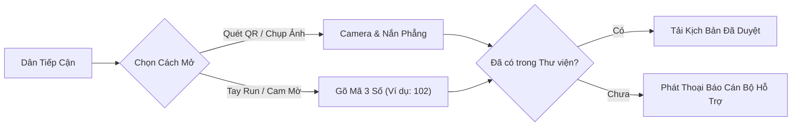

#### Yêu cầu FR-2: Bản sao Thị giác & Điểm sáng Dẫn đường (Visual Twin & Normalized Dynamic Highlighter)
* **Mô tả:** Hiển thị ảnh chụp tờ giấy của người dùng, tự động phóng to vào khu vực đang điền và hiển thị viền phát sáng nhấp nháy tại đúng dòng/ô tương ứng.
* **Tiêu chí nghiệm thu:**
  * Toàn bộ tọa độ Bounding Box bắt buộc sử dụng **Hệ tọa độ chuẩn hóa tỉ lệ (Normalized Coordinates `[ymin, xmin, ymax, xmax]` dạng số thực $0.0 \to 1.0$)** tính theo tỉ lệ chiều cao/rộng của ảnh gốc. Tuyệt đối không dùng pixel tuyệt đối để đảm bảo hiển thị chuẩn xác $100\%$ trên mọi kích thước màn hình responsive di động mà không bị lệch vệt sáng.
  * Định vị chính xác tọa độ dòng cần điền với độ sai lệch không quá 1% diện tích ô trên mọi độ phân giải màn hình.
  * Hỗ trợ nút chuyển bước [Dòng tiếp theo] và [Dòng trước đó] với diện tích chạm lớn ($\ge 56 \times 56\text{ dp}$).
* **Sơ đồ Quy trình FR-2:**
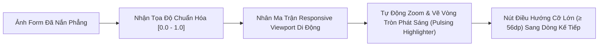

#### Yêu cầu FR-3: Trợ lý Giọng nói Đọc Hướng dẫn Từng Dòng, Phụ đề Chữ chạy & Nút Nghe lại (Half-Duplex TTS, Live Captions & Replay)
* **Mô tả:** Phát giọng đọc tiếng Việt ấm áp, tốc độ chậm rãi, phát âm tròn vành rõ chữ từng dòng. Đi kèm hệ thống phụ đề chữ chạy (Live Captions) đồng bộ thời gian thực và nút nghe lại tức thì để khắc phục triệt để tiếng ồn tại phòng Một cửa.
* **Tiêu chí nghiệm thu:**
  * Hỗ trợ tối thiểu 2 tùy chọn giọng: Giọng miền Bắc và Giọng miền Nam tốc độ 0.9x.
  * **Phụ đề Chữ chạy Đồng bộ (Karaoke Live Captions):** Mỗi từ/cụm từ phát ra từ loa đều đồng thời sáng nổi bật trên màn hình bằng chữ in hoa đậm $\ge 20\text{pt}$ (WCAG AAA), giúp người già khi không nghe rõ vẫn có thể đọc được phụ đề ngay trước mắt mà không phải dí sát tai vào điện thoại.
  * **Nút [Nghe Lại Dòng Này] Kích Thước Lớn:** Nút bấm cố định ở thanh điều hướng dưới ($\ge 56 \times 56\text{ dp}$), người dùng chỉ cần chạm 1 lần là nghe lại câu hướng dẫn của bước hiện tại.
  * **Cơ chế Bán song công (Half-Duplex Safeguard):** Khi loa Trợ lý (TTS) đang đọc hướng dẫn, Micro thu âm (STT) bắt buộc bị khóa cứng (Mute hoàn toàn) để triệt tiêu triệt để hiện tượng dội âm (Acoustic Feedback Loop / Echo).
  * Tự động dừng phát âm khi người dùng bấm nút mic để nói (Xử lý ngắt lời chủ động - Push-to-Talk Interruption handling).
* **Sơ đồ Quy trình FR-3:**
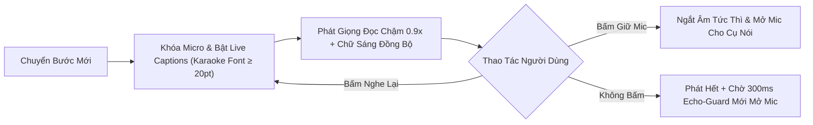

#### Yêu cầu FR-4: Hỏi đáp Tương tác Ngữ cảnh bằng Giọng nói & Nút Chạm Câu Hỏi Nhanh (Contextual Voice Q&A & Touch-to-Ask Chips)
* **Mô tả:** Người dùng có thể nhấn giữ nút mic để hỏi bằng giọng nói, **HOẶC chạm vào các nút gợi ý câu hỏi thường gặp (Touch-to-Ask Chips)** có sẵn tại mỗi ô để giải quyết triệt để rào cản tiếng địa phương và tạp âm xung quanh.
* **Tiêu chí nghiệm thu:**
  * **Bộ nút chạm câu hỏi nhanh (Touch-to-Ask Quick Action Chips):** Dưới mỗi ô/dòng luôn hiển thị sẵn 2-3 nút bấm lớn với các câu hỏi trọng tâm:
    * `[1. Xem ví dụ chữ mẫu ô này]`
    * `[2. Lấy thông tin này ở đâu trên Sổ đỏ/Biên bản?]`
    * `[3. Không có thông tin thì để trống được không?]`
    * Chạm vào nút nào, Trợ lý lập tức phát giọng đọc giải đáp ngay vấn đề đó mà không cần thu âm giọng nói.
  * Độ trễ phản hồi giọng nói khi hỏi đáp qua Mic (Voice Latency) $\le 1.5$ giây.
  * Chỉ thu âm khi người dùng chủ động nhấn giữ nút Micro (Push-to-Talk) hoặc sau khi câu đọc hướng dẫn của bước đó kết thúc và vượt qua khoảng trễ an toàn chống dội âm ($300\text{ms}$).
  * **Nguyên tắc Không Suy diễn Nghiệp vụ:** Câu trả lời của AI chỉ trích dẫn văn bản quy định hoặc chỉ đúng dòng/mục trên giấy tờ gốc, không tự ý đưa ra lời khuyên chủ quan gây rủi ro pháp lý.
* **Sơ đồ Quy trình FR-4:**
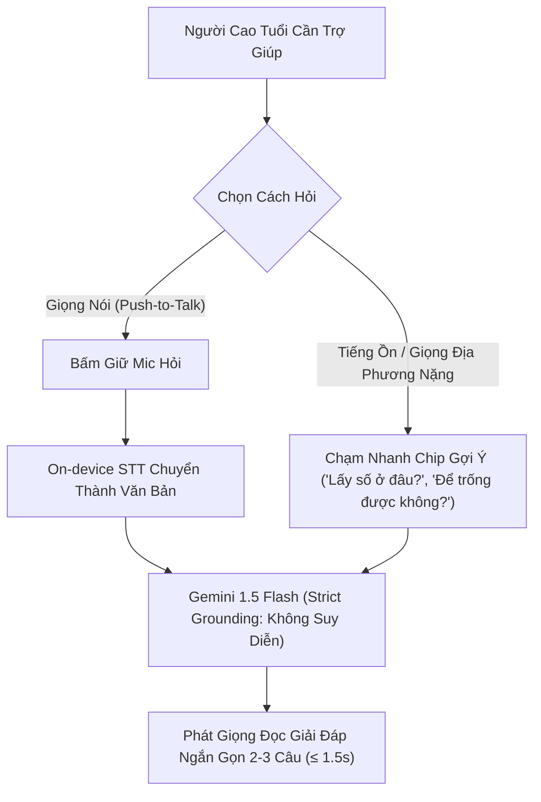

#### Yêu cầu FR-5: Minh họa Chữ Mẫu Màu Đỏ Tương Phản Cao (High-Contrast Red Text Example)
* **Mô tả:** Tại mỗi ô/dòng, hệ thống hiển thị ví dụ mẫu bằng **font chữ in hoa rõ nét, màu đỏ đậm nổi bật trên nền giấy trắng** (loại bỏ chữ viết tay uốn lượn gây rối mắt).
* **Tiêu chí nghiệm thu:**
  * Đạt tiêu chuẩn tương phản màu WCAG 2.1 AAA (tỷ lệ tương phản $\ge 7:1$).
  * Kích thước chữ tối thiểu 18pt trên màn hình di động, có nút phóng to cỡ chữ nhanh.
* **Sơ đồ Quy trình FR-5:**
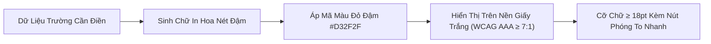

#### Yêu cầu FR-6: Quét Chứng từ Tiên quyết Thông minh (Smart Prerequisite Document Scan)
* **Mô tả:** Đối với các biểu mẫu có chứng từ phụ thuộc (Biên bản phạt, Sổ đỏ, CCCD), hệ thống cung cấp bước đầu tiên hướng dẫn người dùng chụp chứng từ gốc. AI tự bóc tách các trường khóa và giữ sẵn để đưa vào các bước hướng dẫn tiếp theo.
* **Tiêu chí nghiệm thu:**
  * Bóc tách chính xác số biên bản, ngày lập, thông tin người nộp từ ảnh chụp biên bản giấy tờ liên quan.
* **Sơ đồ Quy trình FR-6:**
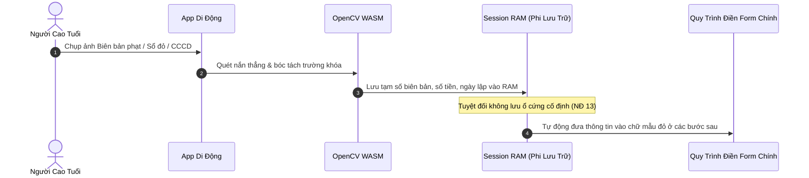

---

### 4.2 Phân hệ 2: Cổng Quản trị Quy trình & Bóc tách Form AI (Cổng Thông tin Web trên Máy tính cho Chuyên viên)

#### Yêu cầu FR-7: Tự động Bóc tách Biểu mẫu Mới (OpenCV Normalized Geometric First & Manual Override)
* **Mô tả:** Quản trị viên tải lên file PDF hoặc ảnh chụp biểu mẫu trắng. Hệ thống vận hành theo quy trình tuần tự hai tầng: (1) Thuật toán OpenCV WASM xử lý hình học trước tiên để bắt trọn tọa độ các đường kẻ, khung bảng và ô vuông với độ chính xác pixel tuyệt đối ($\ge 98\%$), chuẩn hóa thành **hệ tọa độ tỉ lệ `[ymin, xmin, ymax, xmax]` ($0.0 \to 1.0$)**, trích xuất văn bản nhãn trường cục bộ và xuất ra bộ khung dữ liệu hình học (Geometric Manifest Skeleton) gồm danh sách các `box_01`, `box_02`,... đã đánh số; (2) Gemini 1.5 Flash (Text & LLM Engine) tiếp nhận bộ khung dữ liệu dạng Text/JSON để đọc hiểu nhãn trường, xác định điều kiện rẽ nhánh và ánh xạ 1-1 vào từng Box ID (hoàn toàn xử lý dạng Text, không cần gọi Vision API); (3) **Cơ chế Can thiệp & Vẽ ô Thủ công (Manual Bounding Box Override):** Cho phép chuyên viên click & drag trực tiếp trên giao diện để bổ sung ô bị thiếu, xóa ô thừa, hoặc kéo chỉnh kích thước box độc lập không phụ thuộc thuật toán.
* **Tiêu chí nghiệm thu:**
  * Thuật toán OpenCV quét và xuất bộ khung Bounding Box Skeleton chuẩn hóa ($0.0 \to 1.0$) đạt độ chính xác tọa độ $\ge 98\%$ trong thời gian $\le 100\text{ms}$.
  * Cung cấp bộ công cụ vẽ/chỉnh Bounding Box thủ công mượt mà trên Canvas/SVG của Cổng Quản trị.
  * Gemini nhận diện chính xác nhãn ngữ nghĩa tương ứng với từng Box ID với tỷ lệ $\ge 90\%$.
  * Tự động sắp xếp thứ tự điền logic (từ trên xuống dưới, từ thông tin nhân thân đến chi tiết vụ việc).
  * Hỗ trợ chế độ dự phòng Offline/Fallback tức thì: hiển thị toàn bộ khung ô do OpenCV vẽ sẵn khi ngắt kết nối Cloud AI.
* **Sơ đồ Quy trình FR-7:**
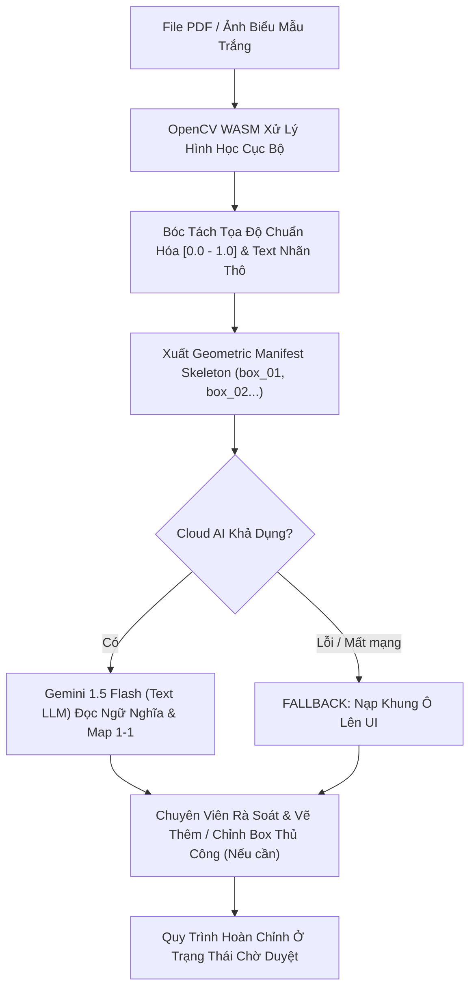

#### Yêu cầu FR-8: Tự động Sinh Kịch bản Hướng dẫn Bình dân & Chốt chặn Pháp lý (Auto-Prompting & Legal Safeguard)
* **Mô tả:** AI tự động chuyển hóa tên trường hành chính khô khan thành câu thoại hướng dẫn thân thiện và tạo sẵn ví dụ chữ mẫu màu đỏ cho từng bước. Mọi kịch bản sinh ra đều mặc định mang trạng thái cảnh báo pháp lý `DRAFT_PENDING_LEGAL_CHECK`.
* **Tiêu chí nghiệm thu:**
  * Mỗi bước đều tự động có: (1) Tọa độ chuẩn hóa ô cần highlight, (2) Câu thoại đọc cho người già, (3) Chữ mẫu màu đỏ minh họa.
  * Tự động đánh dấu cờ cảnh báo đối với các trường nhạy cảm tài chính/pháp lý (Số tài khoản kho bạc, số tiền phạt, cơ quan thụ lý) để buộc cán bộ phải đối soát kỹ lưỡng.
* **Sơ đồ Quy trình FR-8:**
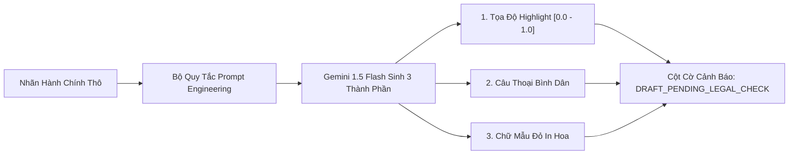

#### Yêu cầu FR-9: Cổng Kiểm duyệt Chia đôi Màn hình & Cam kết Trách nhiệm (Split-Screen Legal Review Gate)
* **Mô tả:** Giao diện đối soát: Bên trái là file biểu mẫu gốc, bên phải là danh sách các bước quy trình do AI tạo. Chuyên viên có thể chỉnh sửa câu từ, nghe thử giọng đọc, điều chỉnh khung highlight bằng tay và bấm [Phê duyệt].
* **Tiêu chí nghiệm thu:**
  * Quy trình do AI sinh ra ở trạng thái `Chờ duyệt` (Pending Review).
  * **Chốt chặn Cam kết Trách nhiệm Pháp lý (Legal Checkbox Gate):** Nút `[Phê duyệt & Xuất bản]` bị vô hiệu hóa (Disabled) cho đến khi cán bộ tích chọn xác nhận: *"Tôi đã trực tiếp đối soát số tiền, tài khoản thụ hưởng và các căn cứ pháp lý theo đúng quy định hiện hành"*.
* **Sơ đồ Quy trình FR-9:**
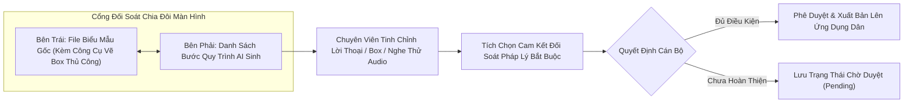

#### Yêu cầu FR-10: Cấu hình Liên chứng từ & Tra cứu Dữ liệu (Prerequisite Data Mapping)
* **Mô tả:** Admin có thể cấu hình điều kiện phụ thuộc cho biểu mẫu: Chỉ định chứng từ nguồn (Biên bản phạt, Sổ đỏ...), chọn các trường cần trích xuất và ánh xạ tự động vào các bước của biểu mẫu chính.
* **Tiêu chí nghiệm thu:**
  * Cho phép thêm một hoặc nhiều chứng từ phụ thuộc cho mỗi quy trình.
  * Hỗ trợ chức năng chạy thử nghiệm (Test Run) việc bóc tách chứng từ mẫu trước khi xuất bản.
* **Sơ đồ Quy trình FR-10:**
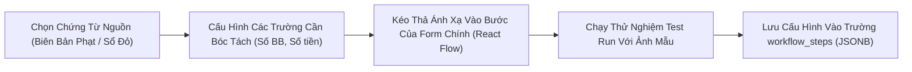

#### Yêu cầu FR-11: Quản lý Thư viện, Sinh Mã QR, Mã Rút Gọn 3 Số & Hạn Hiệu Lực (Form Library, QR, Short-Code & Expiration Guard)
* **Mô tả:** Quản lý vòng đời biểu mẫu (Bản nháp, Đang hoạt động, Hết hiệu lực, Đã lưu trữ). Tự động sinh mã QR và **Mã số truy cập nhanh 3-4 chữ số (Short-Code)** liên kết trực tiếp vào biểu mẫu đó trên Web di động để in dán tại bàn tiếp dân, kèm cơ chế kiểm soát hạn hiệu lực văn bản pháp lý.
* **Tiêu chí nghiệm thu:**
  * Mỗi biểu mẫu sau khi xuất bản được cấp một mã số duy nhất gồm 3 hoặc 4 chữ số (ví dụ: `#101`, `#102`).
  * **Cơ chế Hạn Hiệu Lực Văn Bản (`valid_until`):** Mỗi biểu mẫu gắn với ngày hết hiệu lực theo quy định pháp luật. Khi văn bản hết hiệu lực hoặc bị thay thế bằng mẫu mới, mã QR và mã số 3 số tự động hiển thị biển báo cảnh báo: *"Biểu mẫu này đã hết hiệu lực, xin vui lòng liên hệ cán bộ để nhận mẫu mới"*, ngăn chặn tuyệt đối tình trạng công dân nộp nhầm mẫu cũ.
  * **Quy chuẩn Bảng Hướng Dẫn Vật Lý Chống Tráo QR:** Cung cấp mẫu in chuẩn A5/A4 đóng khung mica cố định tại bàn tiếp dân: Hiển thị tên miền chính thống của cơ quan nhà nước, Mã QR chính thức, và dòng chữ cỡ lớn: *"HOẶC TRUY CẬP [TÊN MIỀN] VÀ NHẬP MÃ SỐ [ 1 0 2 ]"* để triệt tiêu nguy cơ dán đè mã QR lừa đảo (QR Phishing).
* **Sơ đồ Quy trình FR-11:**
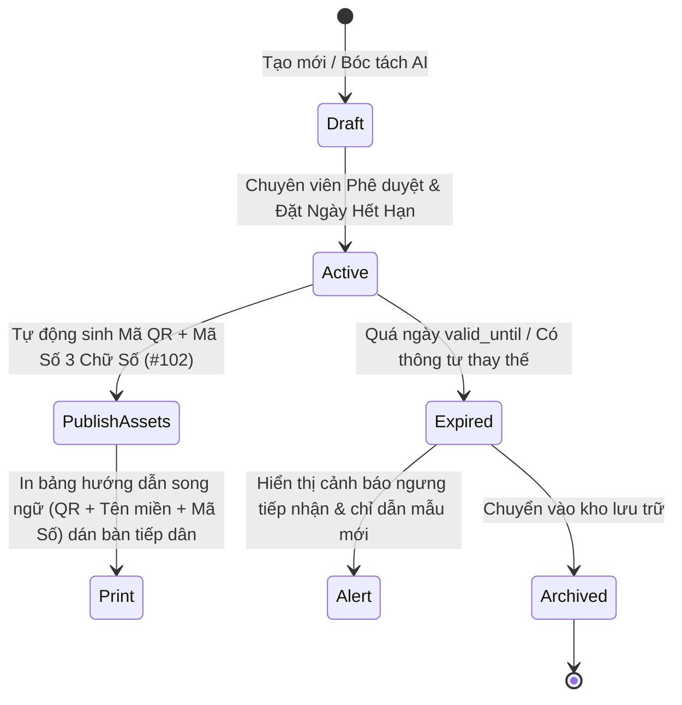

---

## 5. Mục tiêu Loại trừ trong Phiên bản Ban đầu (Non-Goals)

* **Không tự động nộp hồ sơ trực tuyến qua cổng dịch vụ công trong v1:** Trọng tâm là giải quyết dứt điểm bài toán hướng dẫn công dân tự tay điền đúng và đủ trên giấy trước mặt cán bộ tiếp nhận.
* **Không bắt buộc tạo tài khoản / đăng nhập mật khẩu:** Công dân chỉ cần quét mã QR hoặc truy cập đường dẫn là dùng được ngay, loại bỏ tối đa rào cản thao tác cho người già.
* **Không lưu trữ vĩnh viễn hình ảnh CCCD hoặc biên bản xử phạt của công dân trên máy chủ:** Tuyệt đối tuân thủ pháp luật về bảo vệ dữ liệu cá nhân.

---

## 6. Phạm vi Triển khai Bản thử nghiệm Ban đầu (MVP Scope)

### 6.1 Trong Phạm vi MVP
* Ứng dụng Web tối ưu trên Di động (Mobile-responsive Web) dành cho người cao tuổi.
* Cổng thông tin Web trên Máy tính dành cho Chuyên viên/Quản trị viên tạo và duyệt biểu mẫu.
* Thử nghiệm thực tế với 2 nhóm biểu mẫu phức tạp:
  1. *Tờ khai lệ phí trước bạ nhà, đất (Mẫu 01/LPTB)* — Có bóc tách đối chiếu từ Sổ đỏ/Hợp đồng.
  2. *Biểu mẫu nộp tiền phạt vi phạm hành chính* — Có bóc tách đối chiếu từ Biên bản xử phạt.
* Chụp ảnh nhận diện form giấy, highlight trực quan và đọc giọng nói tiếng Việt (Bắc/Nam).
* Cổng kiểm duyệt Human-in-the-loop cho cán bộ quản trị.

### 6.2 Ngoài Phạm vi MVP (Dành cho Giai đoạn Sau)
* Ứng dụng di động cài đặt trực tiếp (Native App trên iOS/Android).
* Tích hợp cổng thanh toán trực tuyến phí/lệ phí/tiền phạt qua ngân hàng.

---

## 7. Yêu cầu Phi chức năng Tổng thể (NFRs)

* **NFR-1 (Trợ năng & Chống Tắt Màn Hình - Accessibility & Screen Lock Prevention):**
  * Tuân thủ tiêu chuẩn WCAG 2.1 AAA về độ tương phản. Cỡ chữ tối thiểu 18pt trên giao diện di động. Diện tích vùng cảm ứng nút bấm tối thiểu $48 \times 48\text{ dp}$ (nút chính $\ge 56\text{ dp}$).
  * **Kích hoạt Web Wake Lock API (`navigator.wakeLock.request('screen')`):** Giữ màn hình luôn sáng trong toàn bộ phiên điền biểu mẫu, triệt tiêu tình trạng điện thoại tự động tắt màn hình (Auto-lock) sau 30 giây khi người già đang tập trung nắn nót viết chữ trên giấy.
  * **Nút Thoát Nhanh & Xóa Sạch Phiên (Quick Exit & Flush):** Nút đỏ nổi bật ở góc trên màn hình cho phép công dân 1 chạm xóa toàn bộ bộ nhớ tạm (Session Storage) ngay khi hoàn thành hoặc khi mượn máy người khác.
* **NFR-2 (Hiệu năng, Độ trễ & Chạy Mượt Ngoại Tuyến - Offline-Ready PWA):**
  * Thời gian nhận diện biểu mẫu qua ảnh chụp $\le 3.0$ giây.
  * Độ trễ phản hồi giọng nói khi hỏi đáp $\le 1.5$ giây.
  * Thời gian tải trang ban đầu $\le 2.0$ giây trên mạng di động 4G.
  * **Service Worker Caching:** Khi người dùng mở biểu mẫu, Service Worker tự động tải trước toàn bộ JSON kịch bản và các file audio MP3 ($\le 1.5\text{MB}$), cho phép tiếp tục điền form mượt mà ngay cả khi sóng 4G bị gián đoạn hoặc mất mạng hoàn toàn trong phòng Một cửa kín.
* **NFR-3 (Bảo mật, Quyền riêng tư & Phi Lưu Trữ Cố Định - In-Memory Ephemeral Data):**
  * Dữ liệu hình ảnh CCCD, Sổ đỏ, biên bản xử phạt chỉ được xử lý tạm thời trên biến bộ nhớ RAM (In-Memory Canvas/State), **tuyệt đối không ghi vào Camera Roll (Thư viện ảnh)** và **không lưu vào LocalStorage/IndexedDB**.
  * Toàn bộ dữ liệu tạm thời tự động hủy hoàn toàn sau khi bấm [Kết thúc] hoặc sau 15 phút không tương tác (Tuân thủ Nghị định 13/2023/NĐ-CP).
  * Toàn bộ dữ liệu truyền tải giữa Client và Server bắt buộc mã hóa qua giao thức TLS 1.3.
* **NFR-4 (Độ tin cậy & Cơ chế Dự phòng Toàn diện - Multi-Tier Fallback):**
  * *Dự phòng Bóc tách Biểu mẫu (Ingestion Fallback):* Nếu Cloud AI (Gemini 1.5 Flash Text API) gặp sự cố kết nối, quá tải hoặc gián đoạn mạng, hệ thống tự động fallback tức thì: sử dụng ngay toàn bộ khung ô do OpenCV WASM quét sẵn trên giấy trắng mực đen, cho phép chuyên viên gán nhãn và vẽ Bounding Box thủ công (Manual Box Override) mà không bị tắc nghẽn công việc.
  * *Dự phòng Âm thanh (Voice Fallback & Half-Duplex):* Nếu AI không nghe rõ giọng nói của người dùng (do tiếng ồn tại trụ sở), màn hình tự động hiển thị phóng to nút bấm điều hướng và chữ mẫu màu đỏ để người dùng tiếp tục thao tác bằng mắt và tay mà không bị gián đoạn. Luôn đảm bảo cơ chế ngắt mic khi loa phát để tránh echo loop.
  * *Khả năng tương thích Thiết bị Yếu (Low-End Hardware Resilience):* Render đồ họa Visual Twin bằng vector SVG nhẹ nhàng, giới hạn kích thước nén ảnh camera $\le 1600\text{px}$ để đảm bảo trình duyệt trên các dòng máy Android đời cũ không bị tràn bộ nhớ RAM dẫn đến sập ứng dụng (OOM Crash).

---

## 8. Chỉ số Đo lường Thành công (Success Metrics)

* **SM-1 (Tỷ lệ điền đúng ngay lần đầu - Chỉ số chính):** Tỷ lệ biểu mẫu giấy được nộp và cán bộ một cửa tiếp nhận thành công ngay lần đầu đạt $\ge 90\%$ (so với mức trung bình tự điền hiện nay chỉ khoảng $55\%$).
* **SM-2 (Thời gian hoàn thành biểu mẫu - Chỉ số phụ):** Giảm thời gian trung bình công dân lớn tuổi loay hoay điền một tờ khai phức tạp từ 35 phút xuống dưới 12 phút.
* **SM-3 (Thời gian xuất bản biểu mẫu của Admin - Chỉ số phụ):** Chuyên viên tạo và xuất bản một quy trình biểu mẫu mới trong thời gian $\le 5$ phút (nhờ AI bóc tách tự động).
* **SM-C1 (Chỉ số Phản nghịch - Counter-Metric):** *Không tối ưu hóa số lượng biểu mẫu được hoàn thành mà đánh đổi độ chính xác*. Tỷ lệ sai lệch trường thông tin do AI hướng dẫn sai phải duy trì ở mức $0\%$.

---

## 9. Bảng Tổng hợp Giả định (Assumptions Index)

* `[GIẢ ĐỊNH 1]`: Điện thoại thông minh của người cao tuổi hoặc người thân đi cùng có kết nối mạng di động (4G/Wifi) ổn định tại trụ sở hành chính.
* `[GIẢ ĐỊNH 2]`: Camera điện thoại có độ phân giải tối thiểu 8MP và có khả năng chụp rõ nét văn bản ở khoảng cách 30-40cm.
* `[GIẢ ĐỊNH 3]`: Cơ quan hành chính cho phép công dân đặt điện thoại trên bàn viết để hỗ trợ tra cứu trong quá trình điền hồ sơ.
* `[GIẢ ĐỊNH 4]`: Thiết bị của người cao tuổi có thể là điện thoại đời cũ, cấu hình thấp hoặc dung lượng RAM hạn chế ($\le 2\text{GB}$) $\rightarrow$ Ứng dụng Web di động phải được tối ưu hóa siêu nhẹ, tuyệt đối không rò rỉ bộ nhớ (Memory Leak) và hỗ trợ chế độ nhập mã 3 chữ số thay cho camera khi cần thiết.
