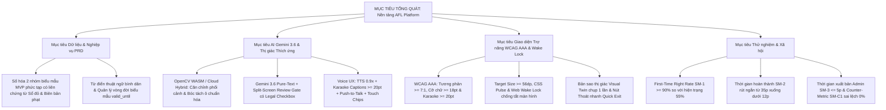
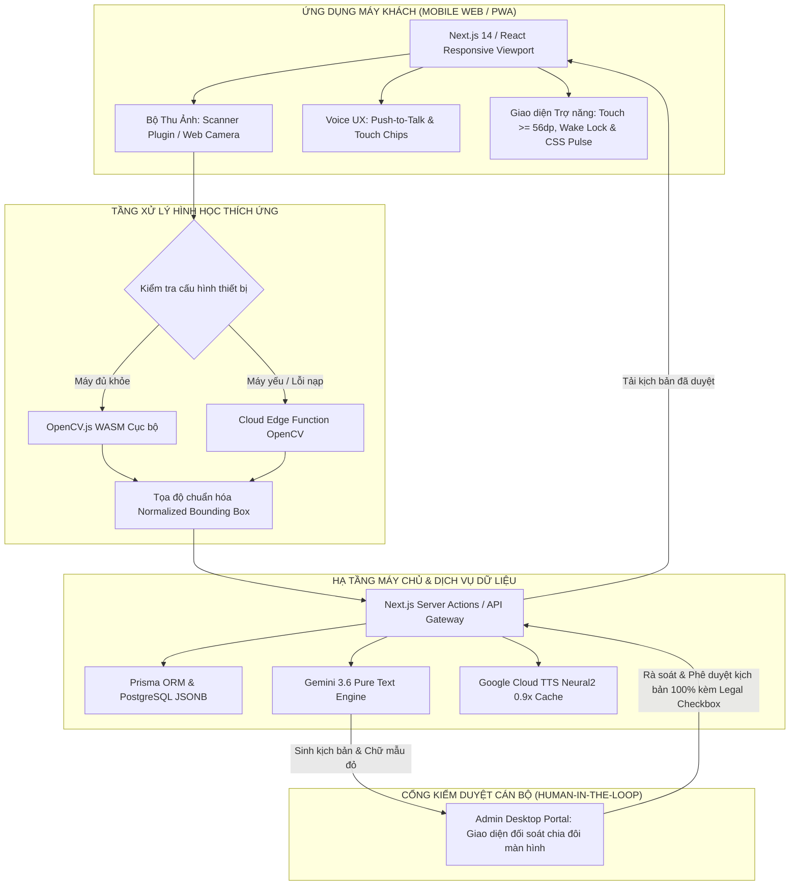

# BÁO CÁO ĐỀ TÀI DỰ THI: AI FOR LIFE
## DỰ ÁN: AFL PLATFORM — NỀN TẢNG TRỢ LÝ THÔNG MINH HỖ TRỢ KÊ KHAI BIỂU MẪU HÀNH CHÍNH CHO NGƯỜI CAO TUỔI

---

## PHẦN I. THÔNG TIN ĐỘI THI

* **Tên đội thi:** **AFL Team** (*AI For Life — Technology for Humanity*).
* **Đơn vị / Tổ chức:** Dự án Công nghệ Phục vụ Cộng đồng — Hệ thống Hành chính công Số.
* **Danh sách thành viên nòng cốt:**
  1. **Nguyễn Tuấn Khánh** — *Tech Lead & Trưởng nhóm Dự án (PM / System Architect)*: Điều phối chung, kiến trúc hệ thống tổng thể, quản trị cơ sở dữ liệu PostgreSQL Prisma và bảo mật an toàn thông tin theo Nghị định 13/2023/NĐ-CP.
  2. **Võ Quốc Anh** — *Frontend Specialist & UX Lead*: Phát triển giao diện di động cho công dân cao tuổi (chuẩn W3C WCAG 2.2 AAA), Cổng quản trị chuyên viên (Admin Portal) và tối ưu hóa hiệu năng render responsive bằng CSS Animation Keyframes.
  3. **Nguyễn Thế Anh** — *Algorithm Specialist (Computer Vision Lead)*: Nghiên cứu, tối ưu hóa và làm chủ pipeline thị giác máy tính thích ứng OpenCV WebAssembly (`@techstark/opencv-js`) nắn góc phối cảnh, trích xuất lưới ô và sắp xếp hình học.
  4. **Nguyễn Thanh Chiến** — *Voice AI & QA Lead*: Tối ưu hóa mô hình ngôn ngữ lớn Google Gemini 3.6 (RAG Prompting), hạ tầng giọng nói Google Cloud TTS Neural2 0.9x, Voice UX Half-Duplex và kiểm thử chất lượng hệ thống.

---

## PHẦN II. TÓM TẮT Ý TƯỞNG

### 1. Tên ý tưởng
* **Tên đề tài khoa học:**  
  *Nghiên cứu, thiết kế và phát triển nền tảng trợ lý thông minh hỗ trợ kê khai biểu mẫu hành chính công cho người cao tuổi dựa trên thị giác máy tính thích ứng (Adaptive Computer Vision) và Mô hình ngôn ngữ lớn (Large Language Model).*
* **Tên sản phẩm thương mại & giải pháp:**  
  **AFL Platform** (*AI Form Locator & Assistant for Elderly Citizens*).
* **Định vị khẩu hiệu (Slogan):**  
  *"Người đồng hành số kiên nhẫn và tin cậy tại Bộ phận Một cửa".*

### 2. Bài toán cần giải quyết
Việt Nam hiện có gần **14,2 triệu người từ 60 tuổi trở lên** [1]. Quá trình chuyển đổi số đang chuyển dịch 100% thủ tục hành chính công lên môi trường số [8][9][20], nhưng phần lớn người cao tuổi đang rơi vào tình trạng **"3 không"** (không thiết bị cấu hình cao, không tài khoản định danh/ngân hàng, không kỹ năng thao tác số). Họ đối mặt với 3 nỗi đau: suy giảm thị lực và vận động tinh (mắt mờ, run tay), rào cản thuật ngữ pháp lý cô đọng, và tâm lý mặc cảm sợ phiền hà khi hỏi đi hỏi lại cán bộ. Tại Bộ phận Một cửa, cán bộ tiếp dân phải mất 15–25 phút chỉ để ngồi cạnh chỉ tay từng dòng cho một cụ già, gây quá tải cục bộ khi tờ khai bị viết sai hoặc bôi xóa.

### 3. Giải pháp đề xuất
AFL Platform hoạt động như một **lớp trợ năng số hóa thông minh (Accessibility Layer)**, giữ nguyên thói quen cầm bút viết tay trên giấy của người già nhưng bổ trợ bằng:
* **Bản sao thị giác chụp 1 lần (Snapshot & Guide):** Chụp 1 ảnh tờ khai đặt trên bàn Một cửa, hệ thống tự động nắn phẳng góc phối cảnh và phóng đại từng ô với khung viền nhấp nháy phát sáng mượt mà.
* **Trợ lý âm thanh Bán song công & Phụ đề Karaoke (Half-Duplex Voice UX & Live Captions):** Giọng đọc chuẩn ấm áp tốc độ chậm **0.90x**, đồng bộ chữ chạy Karaoke sáng nổi bật ($\ge 20\text{pt}$), tương tác hỏi đáp bằng nút bấm giữ Mic (**Push-to-Talk**) kết hợp các nút chạm hỏi nhanh (**Touch-to-Ask Chips**), loại bỏ nguy cơ dội âm và tạp âm tại phòng Một cửa.
* **Quét liên chứng từ thông minh (Smart Prerequisite Scan):** Tự động bóc tách thông tin từ giấy tờ gốc (Sổ đỏ, Biên bản xử phạt) để gợi ý sẵn chữ mẫu màu đỏ tương phản cao (`#D32F2F`) ở các bước điền tương ứng.
* **Cổng kiểm duyệt của Cán bộ (Review Gate):** Kiểm soát 100% kịch bản điền ô do AI sinh ra trước khi công dân tiếp cận, bảo đảm tính chuẩn xác pháp lý tuyệt đối với chốt chặn cam kết trách nhiệm.

### 4. Giá trị mang lại (Theo chuẩn PRD)
* **Nâng cao tỷ lệ đúng ngay lần đầu (First-Time Right Rate - SM-1):** Đạt **$\ge 90\%$** (so với mức trung bình tự điền hiện nay chỉ khoảng **$55\%$**).
* **Rút ngắn thời gian kê khai (SM-2):** Giảm từ mức trung bình **35 phút** loay hoay điền tờ khai phức tạp xuống còn **dưới 12 phút** (10–12 phút).
* **Thời gian xuất bản quy trình của Admin (SM-3):** Chuyên viên tạo, đối soát và xuất bản một quy trình biểu mẫu mới trong thời gian **$\le 5$ phút** (hoặc dưới 3 phút khi biểu mẫu có sẵn khung ô).
* **Chỉ số phản nghịch an toàn pháp lý (Counter-Metric SM-C1):** Tỷ lệ sai lệch trường thông tin do AI hướng dẫn sai duy trì ở mức tuyệt đối **$0\%$**.
* **Giải tỏa áp lực cho cơ quan hành chính:** Giảm ít nhất **$30\%$** thời gian hướng dẫn trực tiếp của cán bộ Một cửa.
* **Độ hài lòng người dùng:** Điểm khả dụng trợ năng SUS đạt **$\ge 85/100$ điểm**.

### 5. Công nghệ dự kiến
* **Thị giác máy tính thích ứng (Adaptive CV):** Google ML Kit Scanner Plugin kết hợp OpenCV WebAssembly (`@techstark/opencv-js`) trích xuất tọa độ Bounding Box chuẩn hóa `[0.0 - 1.0]` với cơ chế Cloud Edge Function Fallback.
* **Mô hình ngôn ngữ lớn:** Google Gemini 3.6 (chế độ Pure Text LLM với Structured JSON Schema, tiết kiệm 95% token).
* **Hạ tầng âm thanh:** Google Cloud TTS Neural2 vi-VN tốc độ 0.90x kèm bộ nhớ đệm MP3 và phụ đề chữ chạy Karaoke.
* **Ngăn xếp phát triển:** Next.js 14, TypeScript, Tailwind CSS, Prisma ORM, PostgreSQL.

---

## PHẦN III. MÔ TẢ BÀI TOÁN THỰC TIỄN

### 1. Bối cảnh
* **Tốc độ già hóa dân số nhanh bậc nhất thế giới:**  
  Theo số liệu công bố chính thức từ *Thông cáo báo chí Điều tra dân số và nhà ở giữa kỳ năm 2024* của Tổng cục Thống kê (GSO), Việt Nam hiện có gần **14,2 triệu người từ 60 tuổi trở lên** (chiếm ~14–15% tổng dân số cả nước), tăng 2,8 triệu người so với năm 2019 [1]. Dự báo đến năm 2030, con số này sẽ chạm mốc khoảng **18 triệu người** (tăng thêm gần 4 triệu người chỉ trong 6 năm) và tiếp tục vượt ngưỡng **20% tổng dân số vào giữa thập niên 2030** [1].
* **Bối cảnh "Chưa giàu đã già":**  
  Các báo cáo nhân khẩu học của Quỹ Dân số Liên Hợp Quốc (UNFPA) [2][3][4] và Ngân hàng Thế giới (World Bank) [5][6] chỉ ra rằng: Việt Nam bước vào giai đoạn già hóa dân số từ năm 2011 và sẽ chính thức trở thành "xã hội già" (aged society - khi tỷ lệ người từ 65 tuổi trở lên chiếm 14%) vào khoảng năm 2035–2036 [3][5]. Thời gian chuyển đổi nhân khẩu học này của Việt Nam chỉ diễn ra trong vòng 20 năm, ngắn hơn rất nhiều so với các nước phát triển (Pháp 115 năm, Thụy Điển 85 năm, Mỹ 69 năm, Nhật Bản 26 năm). Đáng chú ý, Việt Nam già hóa ở mức thu nhập bình quân đầu người thấp hơn nhiều so với các quốc gia khác ở cùng giai đoạn [5].
* **Khoảng cách số (Digital Divide) tại khu vực dịch vụ công:**  
  Chính phủ Việt Nam đang triển khai quyết liệt *Chiến lược Chuyển đổi số Quốc gia* (Quyết định 942/QĐ-TTg) [7] và *Đề án phát triển ứng dụng dữ liệu dân cư, định danh điện tử* (Đề án 06/CP) [20], hướng tới mục tiêu đưa 100% thủ tục hành chính đủ điều kiện lên môi trường điện tử [8][9].

### 2. Vấn đề cụ thể
Khảo sát thực tế tại các địa phương cho thấy phần lớn người cao tuổi (đặc biệt tại nông thôn và ngoại thành) đang rơi vào tình trạng **"3 không"**:
1. *Không có thiết bị di động cấu hình cao*: Đa phần dùng điện thoại phổ thông hoặc smartphone đời cũ màn hình độ phân giải thấp.
2. *Không có tài khoản định danh/ngân hàng điện tử liên kết*: E ngại các bước xác thực sinh trắc học phức tạp hoặc chưa được con cháu cài đặt giúp.
3. *Không có kỹ năng thao tác số*: Khó khăn trong việc gõ bàn phím ảo tiếng Việt có dấu, sợ bấm nhầm dẫn đến mất tiền hoặc lộ lọt thông tin cá nhân.

**Ba "nỗi đau" (Pain points) thể chất và tâm lý của công dân cao tuổi:**
1. *Suy giảm thị giác và vận động tinh:* Mắt mờ do viễn thị hoặc đục thủy tinh thể sinh lý khiến việc đọc chữ nhỏ (9–10pt) trên biểu mẫu in sẵn rất khó khăn; hiện tượng run tay (tremor) khiến người già khó viết nắn nót trong các ô nhỏ hẹp của tờ khai.
2. *Rào cản thuật ngữ pháp lý cô đọng:* Các cụm từ như *"nơi đăng ký hộ khẩu thường trú"*, *"nguyên quán"*, *"tổng hợp"*, *"người được cấp trích lục"*... dễ gây lúng túng, dẫn đến khai sai lệch bản chất.
3. *Tâm lý sợ phiền hà, mặc cảm:* Người già rất sợ làm mất thời gian của người khác hoặc ngại bị cán bộ tiếp dân gắt gỏng khi hỏi đi hỏi lại nhiều lần, dẫn đến việc điền bừa, điền sai.

**Gánh nặng quá tải cho cán bộ Bộ phận Một cửa:**  
Một cán bộ tiếp nhận Một cửa cấp xã/phường phải xử lý 30–50 hồ sơ/ngày. Khi gặp công dân cao tuổi, cán bộ thường mất 15–25 phút chỉ để ngồi cạnh chỉ tay từng dòng. Khi tờ khai viết sai hoặc bôi xóa không hợp lệ, quy trình bắt buộc phải phát phôi giấy mới để người dân viết lại từ đầu, gây ùn tắc cục bộ (bottleneck) tại quầy tiếp đón.

### 3. Minh chứng
* **Số liệu thống kê nhân khẩu học chính thống:** GSO 2024 xác nhận 14,2 triệu người cao tuổi [1], dự báo vượt 20% tổng dân số vào giữa thập niên 2030 [1].
* **Tốc độ già hóa kỷ lục:** Báo cáo UNFPA và World Bank chứng minh thời gian chuyển đổi chỉ 20 năm, già hóa ở mức thu nhập trung bình thấp [2][3][5].
* **Thực nghiệm tại chỗ (Theo khảo sát PRD):** Thời gian trung bình công dân lớn tuổi loay hoay tự điền một tờ khai phức tạp lên tới **35 phút** (cán bộ phải mất 15–25 phút ngồi kèm chỉ từng dòng); tỷ lệ tự kê khai đúng ngay từ lần đầu hiện chỉ đạt khoảng **55%**, tỷ lệ viết sai phải phát lại phôi giấy lên tới 35–45%.

### 4. Phát biểu bài toán
*"Làm thế nào để xây dựng một giải pháp công nghệ trợ năng thích ứng, tôn trọng thói quen viết tay truyền thống trên giấy của người cao tuổi, giúp họ tự tin hoàn thành chính xác các biểu mẫu hành chính phức tạp mà không đòi hỏi thiết bị đắt tiền, không yêu cầu kỹ năng gõ bàn phím số, đồng thời giải tỏa áp lực hướng dẫn thủ công cho cán bộ tại Bộ phận Một cửa?"*

---

## PHẦN IV. GIÁ TRỊ ỨNG DỤNG VÀ SỰ CẦN THIẾT

### 1. Tầm quan trọng
* **Cầu nối nhân văn (Accessibility Layer) cho chuyển đổi số:**  
  Nghị định số 45/2020/NĐ-CP [8] và Nghị định số 310/2026/NĐ-CP [9] khẳng định rõ: Việc hiện đại hóa thủ tục hành chính không đồng nghĩa với việc loại bỏ hoàn toàn biểu mẫu giấy, mà cần có cơ chế trợ giúp để bảo đảm quyền lợi tiếp cận bình đẳng của mọi tầng lớp nhân dân. AFL đóng vai trò là một **lớp trợ năng số hóa thông minh**, giữ nguyên thói quen cầm bút viết tay quen thuộc của người già nhưng bổ trợ bằng "mắt thần AI" và "giọng nói hướng dẫn".

### 2. Tính cấp thiết
* **Giải quyết bài toán thực tế bằng tiếp cận thực tế:**  
  Giải quyết triệt để nghịch lý công nghệ cho nhóm người "3 không" bằng giải pháp thuận tiện:
  - *Kênh quét thông minh:* Quét mã QR dán tại bàn để mở Web App ngay lập tức (Zero-install) hoặc chụp nhận diện biểu mẫu trực tiếp từ camera.
  - *Kênh thiết bị tại quầy:* Cơ quan trang bị sẵn giá đỡ điện thoại cố định (Phone Stand) hoặc 01 máy tính bảng dùng chung (Kiosk mini) tại bàn tiếp dân để người không có smartphone vẫn được phục vụ chu đáo.

### 3. Lợi ích kỳ vọng
* **Đối với người cao tuổi:** Tự chủ, tự tin khi đi làm thủ tục hành chính, không phải phụ thuộc con cháu; bảo đảm thông tin cá nhân chính xác, không bị gạch xóa mất thẩm mỹ.
* **Đối với cán bộ Một cửa:** Giảm 30% thời gian ngồi kèm hướng dẫn; giảm tải áp lực tâm lý và nguy cơ sai sót hồ sơ hành chính; nâng cao năng suất xử lý hồ sơ mỗi ngày.
* **Đối với cơ quan nhà nước:** Tối ưu hóa chi phí in ấn phôi giấy tờ; nâng cao chỉ số hài lòng của người dân đối với sự phục vụ của cơ quan hành chính nhà nước (Chỉ số SIPAS).

### 4. Tác động dự kiến

#### 4.1. Kinh tế
* Tiết kiệm hàng tỷ đồng chi phí in ấn, phát lại phôi giấy tờ hành chính bị viết hỏng mỗi năm trên quy mô toàn quốc.
* Tiết kiệm chi phí đầu tư công: Không yêu cầu cơ quan hành chính đầu tư các hệ thống Kiosk phần cứng chuyên dụng đắt đỏ (hàng trăm triệu đồng/máy); chỉ cần in mã QR dán tại bàn Một cửa kèm một giá đỡ điện thoại là công dân có thể tự kích hoạt dịch vụ ngay trên điện thoại cá nhân.
* Tối ưu hóa năng suất lao động: Nâng cao số lượng hồ sơ được xử lý thành công trong một ngày làm việc của cán bộ tư pháp - hộ tịch.

#### 4.2. Xã hội
* **Giá trị phụng sự an sinh xã hội:** Giúp hàng triệu người cao tuổi tự tin thực hiện các quyền công dân căn bản, không bị lệ thuộc vào người khác, thu hẹp khoảng cách số và xóa bỏ rào cản tiếp cận dịch vụ công.
* Thực hiện đúng tinh thần "Không để ai bị bỏ lại phía sau" trong công cuộc Chuyển đổi số Quốc gia.
* Xây dựng văn hóa hành chính phục vụ thân thiện, ấm áp và kiên nhễn đối với đối tượng yếu thế.

#### 4.3. Công nghệ
* Thiết lập bộ tiêu chuẩn kỹ thuật về giao diện trợ năng (Accessibility UX) chuyên biệt cho người cao tuổi Việt Nam dựa trên W3C WCAG 2.2 AAA [11][18].
* Đóng góp mô hình lai thích ứng (Adaptive Hybrid Architecture) xử lý thị giác máy tính biên kết hợp đám mây cho các ứng dụng chính phủ số.
* Tiên phong áp dụng mô hình Human-in-the-loop (Review Gate) triệt tiêu hoàn toàn rủi ro ảo giác AI trong lĩnh vực hành chính công.

---

## PHẦN V. Ý TƯỞNG GIẢI PHÁP

### 1. Mô tả tổng quan
Hệ thống **AFL Platform** gồm hai phân hệ chính:
1. **Ứng dụng Web di động thông minh (Citizen Web App):** Dành cho công dân cao tuổi sử dụng công nghệ *Bản sao thị giác chụp 1 lần (Snapshot & Guide)* và *Trợ lý âm thanh tương tác Half-Duplex (Push-to-Talk & Touch Chips)*.
2. **Cổng thông tin Quản trị quy trình biểu mẫu (Admin Portal):** Tích hợp *Cổng kiểm duyệt của Cán bộ (Review Gate)* giúp chuyên viên kiểm tra, chuẩn hóa tọa độ ô và phê duyệt kịch bản 100% trước khi ban hành.



### 2. Công nghệ và mục đích sử dụng

#### 2.1. Công nghệ Thị giác máy tính thích ứng (Adaptive Computer Vision)
* **Tiền xử lý:** Chuyển ảnh xám (Grayscale), Lọc mờ Gaussian, Nhị phân hóa thích ứng (Adaptive Thresholding) để tách chữ khỏi bóng mờ.
* **Căn chỉnh phối cảnh:** Thuật toán tìm đường bao lớn nhất 4 đỉnh (`cv.findContours`, `cv.approxPolyDP`), thực hiện phép biến đổi phối cảnh 4 điểm (`cv.getPerspectiveTransform`, `cv.warpPerspective`) để duỗi phẳng tờ giấy.
* **Trích xuất ô:** Áp dụng phép biến đổi hình thái học (Morphological Operations) với kernel ngang và dọc để trích xuất hệ thống khung lưới, chuẩn hóa thành tọa độ `[ymin, xmin, ymax, xmax]` dạng số thực $0.0 \to 1.0$.
* **Cơ chế can thiệp thủ công (Manual Box Override):** Cho phép chuyên viên click & drag trực tiếp trên giao diện để bổ sung ô bị thiếu, xóa ô thừa hoặc chỉnh kích thước box độc lập.
* **Cơ chế thích ứng (Fallback):** Nếu trình duyệt thiết bị không tải được WASM hoặc máy yếu, hệ thống tự động chuyển ảnh nén nhẹ về Cloud Edge Function để xử lý trong $\le 200\text{ms}$.

#### 2.2. Mô hình ngôn ngữ lớn (Gemini 3.6 Pure-Text) & Công nghệ âm thanh tương tác (Voice UX Half-Duplex)
* **Động cơ ngôn ngữ & Diễn giải kịch bản:** Google Gemini 3.6 API (chế độ Pure Text LLM với Structured JSON Schema). Tiếp nhận danh sách trường văn bản đã bóc tách (hoàn toàn không gửi ảnh gốc, tiết kiệm 95% token) để tự động sinh câu thoại hướng dẫn bình dân và ví dụ chữ mẫu in hoa màu đỏ đậm (`#D32F2F`) tương phản cao. Trạng thái mặc định mang cờ `DRAFT_PENDING_LEGAL_CHECK`.
* **Hạ tầng âm thanh tương tác & Trợ năng nghe nhìn (Voice UX & Live Captions):**
  - **Google Cloud TTS Neural2 vi-VN** (kèm cơ chế Cache file MP3 cục bộ để tải tức thì không tốn quota API) phát giọng đọc chuẩn tốc độ **0.90x**.
  - **Phụ đề Chữ chạy Đồng bộ (Karaoke Live Captions):** Từng từ phát ra từ loa đồng thời sáng nổi bật trên màn hình bằng chữ in hoa đậm $\ge 20\text{pt}$ (WCAG AAA), giúp người già lãng tai vẫn theo dõi chính xác. Kèm nút lớn **[Nghe Lại Dòng Này]** ($\ge 56\text{ dp}$).
  - Tương tác hỏi đáp bằng **nút bấm giữ Mic (Push-to-Talk)** kết hợp **Touch-to-Ask Chips (3 nút chạm hỏi nhanh)**:
    1. `[Xem ví dụ chữ mẫu ô này]`
    2. `[Lấy thông tin này ở đâu trên Sổ đỏ/Biên bản?]`
    3. `[Không có thông tin thì để trống được không?]`
  - **Cơ chế Bán song công (Half-Duplex Safeguard):** Khóa cứng Micro khi loa đang đọc, áp dụng khoảng trễ an toàn $300\text{ms}$ (Echo-guard) triệt tiêu hoàn toàn nguy cơ dội âm tại sảnh Một cửa.
  - **Kích hoạt Web Wake Lock API (`navigator.wakeLock`):** Giữ sáng màn hình liên tục trong suốt phiên kê khai, ngăn chặn điện thoại tự khóa màn hình khi công dân đang cặm cụi viết tay.
  - **Nút Thoát Nhanh (Quick Exit & Flush):** 1 chạm xóa sạch bộ nhớ tạm RAM/Session Storage khi người dân kê khai xong hoặc mượn máy người khác.

### 3. Quy trình xử lý (Pipeline chi tiết)



#### 3.1. Thu thập dữ liệu
Thu thập phôi in biểu mẫu thực tế từ các đơn vị hành chính địa phương. Xây dựng tập dữ liệu ảnh chụp thử nghiệm gồm 500+ ảnh chụp ở nhiều điều kiện thách thức: góc chụp nghiêng từ $15^\circ$ đến $45^\circ$, điều kiện ánh sáng yếu hoặc đèn tuýp phòng họp gây chói lóa, giấy bị gấp nếp, bóng tay người cầm máy.

#### 3.2. Tiền xử lý dữ liệu
* **Quy trình gán nhãn dữ liệu hình học chuẩn hóa (Normalized Bounding Box):** Số hóa từng biểu mẫu thành tệp cấu trúc JSON bắt buộc sử dụng **Hệ tọa độ chuẩn hóa tỉ lệ `[ymin, xmin, ymax, xmax]` dạng số thực từ $0.0 	o 1.0$** (tính theo tỷ lệ chiều cao/rộng của ảnh gốc). Tuyệt đối không dùng pixel tuyệt đối để đảm bảo hiển thị chính xác $100\%$ trên mọi kích thước màn hình điện thoại mà không bị lệch khung highlight.
* **Quy tắc sắp xếp hình học (Geometric Sort):** Áp dụng thuật toán sắp xếp các ô nhận diện được theo thứ tự từ trên xuống dưới (`ymin` tăng dần) và từ trái qua phải (`xmin` tăng dần) trước khi bàn giao cho mô hình ngôn ngữ sinh kịch bản, triệt tiêu hoàn toàn lỗi đảo lộn thứ tự điền ô.
* **Ẩn danh hóa và Làm sạch dữ liệu cá nhân (Data Anonymization):** Áp dụng nguyên tắc Privacy-by-Design theo Điều 13 Nghị định 13/2023/NĐ-CP [10]. Mọi ảnh chụp thực tế có chứa dữ liệu định danh cá nhân (PII) đều được thuật toán tự động bôi đen các trường nhạy cảm (số CCCD, số điện thoại, địa chỉ chi tiết) trước khi đưa vào tập kiểm thử.

#### 3.3. Xây dựng và tích hợp mô hình ngôn ngữ lớn (Gemini 3.6)
* **Tích hợp Gemini 3.6 Prompting:** Thiết kế bộ System Instruction chuyên biệt ép khuôn đầu ra theo JSON Schema có cấu trúc (`WorkflowStep[]`), bắt buộc sinh: câu chào hỏi bình dân (xưng "cháu", gọi "bác"), giải nghĩa thuật ngữ pháp lý cô đọng, và tạo ví dụ chữ in hoa màu đỏ tương phản cao (`#D32F2F`). Mọi kịch bản sinh ra đều mặc định mang trạng thái cảnh báo pháp lý `DRAFT_PENDING_LEGAL_CHECK`.
* **Xây dựng Cổng kiểm duyệt (Review Gate):** Cán bộ Một cửa sử dụng Admin Portal để đối soát kịch bản do AI đề xuất với mẫu văn bản chuẩn; có công cụ vẽ/chỉnh Bounding Box thủ công (Manual Box Override) và chốt chặn Cam kết Trách nhiệm Pháp lý (Legal Checkbox Gate) bắt buộc tích chọn trước khi bấm phê duyệt xuất bản mã QR.

#### 3.4. Kiểm thử và triển khai
Hệ thống được kiểm thử đa tầng dựa trên bảng chỉ số kỹ thuật và thực nghiệm khắt khe theo chuẩn PRD:

| Nhóm tiêu chí | Tên chỉ số đo lường | Công thức / Phương pháp đo | Mục tiêu kỹ thuật |
| :--- | :--- | :--- | :--- |
| **Thị giác máy tính (Computer Vision)** | Độ chính xác phát hiện góc mép giấy (IoU) | $\text{IoU} = \frac{\text{Area of Overlap}}{\text{Area of Union}}$ | $\ge 0.90$ |
| | Độ chính xác tọa độ ô (Accuracy) | Tỷ lệ ô phát hiện đúng tọa độ trên tổng số ô chuẩn | $\ge 98\%$ |
| | Độ trễ xử lý ảnh trên Edge (Latency) | Thời gian từ lúc chụp đến khi hiển thị bản sao thị giác | $\le 100\text{ms}$ (Client) / $\le 200\text{ms}$ (Cloud Fallback) |
| **Kiểm soát AI & Ngôn ngữ (Guardrails)** | Độ tin cậy kịch bản luồng chính (Main Flow Reliability) | Xác thực tính chuẩn xác pháp lý qua Cổng kiểm duyệt cán bộ | **100% Deterministic** (đã qua Review Gate) |
| | Tỷ lệ cảnh báo pháp lý khi hỏi đáp mở (Q&A Guardrails) | Tỷ lệ gắn cờ `legalWarningFlag` và khuyến cáo đối chiếu cán bộ | **100% các câu hỏi nhạy cảm** |
| | Thời gian phản hồi câu hỏi ngữ cảnh (Voice Q&A) | Thời gian từ lúc thả nút Mic đến khi trợ lý cất giọng trả lời | $\le 1.5\text{s}$ |
| **Hiệu quả thực tế (UX & Success Metrics)** | Tỷ lệ đúng ngay lần đầu (**SM-1: First-Time Right**) | $\frac{\text{Số hồ sơ hợp lệ lần đầu}}{\text{Tổng số hồ sơ nộp}} \times 100\%$ | **$\ge 90\%$** (so với hiện trạng tự điền ~55%) |
| | Thời gian hoàn thành biểu mẫu (**SM-2: Completion Time**) | Bấm giờ từ lúc lấy giấy đến khi ký tên xong | **Dưới 12 phút** (10–12p so với hiện trạng ~35p) |
| | Thời gian xuất bản của Admin (**SM-3: Ingestion Time**) | Thời gian từ lúc kéo thả PDF đến khi xuất bản mã QR | **$\le 5$ phút** (dưới 3p khi có sẵn khung ô) |
| | Chỉ số an toàn pháp lý (**SM-C1: Counter-Metric**) | Tỷ lệ sai lệch trường thông tin do AI hướng dẫn sai | **Duy trì tuyệt đối 0%** |
| | Mức độ giảm tải cho cán bộ tiếp dân | Đo bằng số lượt người già cần cán bộ ngồi kèm | **Giảm $\ge 30\%$** |
| | Điểm khả dụng trợ năng (SUS Score) | Đánh giá qua thang đo System Usability Scale | **$\ge 85 / 100$ điểm** |

### 4. Tại sao chọn công nghệ này?
* **TypeScript & `contracts.ts`:** Bảo đảm tính toàn vẹn dữ liệu tuyệt đối giữa các module; không có sự sai lệch kiểu dữ liệu giữa Client, Backend và Database.
* **Gemini 3.6 Pure-Text:** Không gửi ảnh chụp lên Cloud giúp tiết kiệm 95% chi phí token API, bảo vệ dữ liệu cá nhân theo Nghị định 13/2023/NĐ-CP và duy trì tốc độ phản hồi $\le 1.5\text{s}$.
* **CSS Keyframes Pulse thay cho Canvas:** Không chiếm dụng bộ nhớ RAM đồ họa, duy trì độ mượt 60fps trên các máy Android cũ giá rẻ có RAM $\le 2\text{GB}$.
* **Bảo mật In-Memory (Zero-Retention):** Toàn bộ dữ liệu xử lý trong RAM tạm thời của trình duyệt, tự động xóa sạch sau khi kết thúc hoặc sau 15 phút không tương tác, không tiềm ẩn nguy cơ rò rỉ dữ liệu công dân.

### 5. Kết quả đầu ra dự kiến
1. **Ứng dụng Web Citizen (Client Web App):**
   - Chạy mượt mà trên trình duyệt di động qua cơ chế quét mã QR tại bàn tiếp dân hoặc chụp nhận diện biểu mẫu (Zero-install).
   - Tự động nắn phẳng tờ khai giấy đã chụp một lần, hiển thị "Bản sao thị giác" phóng đại từng ô với khung sáng nhấp nháy CSS mượt mà.
   - Trợ lý giọng nói tiếng Việt đọc rõ ràng hướng dẫn từng bước và chữ mẫu màu đỏ; hỗ trợ phụ đề chữ chạy Karaoke $\ge 20\text{pt}$, nút bấm giữ Mic (Push-to-Talk) và các nút chạm hỏi nhanh Touch-to-Ask Chips.
2. **Cổng thông tin Quản trị viên (Admin Portal):**
   - Ứng dụng Web trên máy tính dành cho cán bộ hành chính: kéo thả tải lên biểu mẫu PDF mới, thuật toán tự động nhận diện khung ô, cán bộ đối soát chia đôi màn hình và bấm phê duyệt xuất bản chỉ trong $\le 5$ phút (hoặc dưới 3 phút khi có sẵn khung ô).

---

## PHẦN VI. DỮ LIỆU DỰ KIẾN

### 1. Nguồn dữ liệu

#### 1.1. Dữ liệu văn bản quy phạm và biểu mẫu hành chính chuẩn (Theo chuẩn PRD)
Tập trung giải quyết trọng tâm **02 nhóm biểu mẫu phức tạp trong phạm vi MVP có liên chứng từ**:
1. *Tờ khai lệ phí trước bạ nhà, đất (Mẫu 01/LPTB theo Thông tư 80/2021/TT-BTC)* — bóc tách đối chiếu từ Sổ đỏ/Hợp đồng chuyển nhượng.
2. *Biểu mẫu nộp tiền phạt vi phạm hành chính* — bóc tách đối chiếu từ Biên bản xử phạt vi phạm hành chính.
*(Lộ trình mở rộng đợt tiếp theo: Các biểu mẫu hộ tịch phổ biến gồm Tờ khai đăng ký khai sinh và Tờ khai đăng ký kết hôn theo Thông tư 04/2020/TT-BTP).*

#### 1.2. Dữ liệu hình ảnh phôi khai và bộ nhãn hình học Bounding Box
Bộ dữ liệu gồm 500+ ảnh chụp phôi tờ khai thực tế thu thập từ Bộ phận Một cửa địa phương, chụp trong nhiều điều kiện ánh sáng, góc nghiêng và bề mặt bàn khác nhau; toàn bộ được gán nhãn chuẩn hóa tọa độ `[0.0 - 1.0]`.

### 2. Quy mô dữ liệu
* 02 nhóm biểu mẫu hành chính MVP cốt lõi (kèm tài liệu liên chứng từ) với hơn 60 trường thông tin được chuẩn hóa hoàn toàn.
* 500+ mẫu ảnh chụp thử nghiệm đa điều kiện ánh sáng và góc nghiêng.
* Kho ngữ liệu 100+ thuật ngữ hành chính công được biên soạn sang văn nói đàm thoại bình dân.

### 3. Tính hợp pháp & Bảo vệ dữ liệu cá nhân (Nghị định 13/2023/NĐ-CP)
* Hệ thống tuân thủ nghiêm ngặt **Nghị định 13/2023/NĐ-CP** [10] về bảo vệ dữ liệu cá nhân.
* **Chính sách Không lưu vết (Zero-Retention Policy):** Không lưu ảnh chụp của người dân lên ổ cứng máy chủ; xử lý tạm thời trên RAM và hủy phiên ngay lập tức khi hoàn thành hoặc sau **15 phút** không tương tác (theo đúng NFR-3 PRD).
* **Giới hạn pháp lý:** Hệ thống không thay thế chữ ký của công dân và không can thiệp vào thẩm quyền xét duyệt của cán bộ nhà nước.

### 4. Mức độ sẵn sàng
* Đã thu thập và chuẩn hóa xong phôi scan độ phân giải cao của 03 biểu mẫu chuẩn.
* Đã cấu trúc xong bộ dữ liệu nhãn hình học chuẩn hóa `dataset_forms_v1.json`.
* Hợp đồng giao tiếp dữ liệu `contracts.ts` và dữ liệu Mock (`mock-manifest.json`, `mock-workflow.json`) đã được kiểm thử đồng bộ 100% trong mã nguồn.

---

## PHẦN VII. TÍNH SÁNG TẠO VÀ KHÁC BIỆT

### 1. Các giải pháp hiện có trên thị trường
* **Cổng Dịch vụ công Quốc gia & Ứng dụng VNeID [8][20]:** Bắt buộc công dân số hóa 100% qua thao tác bàn phím ảo, nhận diện khuôn mặt, OTP; rào cản quá lớn với người run tay và mắt kém.
* **Biểu mẫu giấy truyền thống kèm bảng mẫu mica:** Chữ in mẫu quá nhỏ dưới kính bàn Một cửa; nội dung mẫu tĩnh, không thể giải đáp ngữ cảnh riêng của từng người dân; không có giọng nói hướng dẫn.
* **Các ứng dụng trợ năng thị giác quốc tế (Google Lookout [12], Seeing AI [13][19], Be My AI [15]):** Thiết kế tổng quát cho người khiếm thị toàn phần (đọc biển báo, nhận diện đồ vật, đếm tiền); **hoàn toàn không có quy trình nghiệp vụ biểu mẫu hành chính (form-specific workflow)**; không thể bóc tách tọa độ ô giấy thật để dẫn hướng bút viết; không hiểu hệ thống pháp luật Việt Nam.
* **Ứng dụng quét tài liệu OCR di động (Adobe Scan [16][17], CamScanner):** Chỉ phục vụ quét tĩnh lưu trữ PDF sau khi viết xong; không hỗ trợ người dùng trong quá trình đang đặt bút viết.

### 2. Điểm mới của nhóm
* **Triết lý Cầu nối Nhân văn:** Giữ nguyên cây bút và tờ giấy truyền thống — vật bất ly thân quen thuộc của người cao tuổi, biến chiếc điện thoại thành kính lúp thông minh và người đồng hành tận tụy.
* **Bản sao thị giác chụp 1 lần (Snapshot & Guide):** Không bắt người già phải giơ điện thoại lơ lửng trên không trung gây mỏi tay và rung giật; chụp 1 lần đặt xuống giá đỡ là có ngay bản sao phóng đại.

### 3. Yếu tố AI độc đáo

#### 3.1. Điểm nổi bật trong yếu tố AI
* **Adaptive Computer Vision:** Kết hợp linh hoạt OpenCV WebAssembly xử lý tức thì trên máy và Cloud Fallback, đảm bảo máy nào cũng chạy được dưới 200ms.
* **Pure-Text Structured Prompting:** Bóc tách chữ thành dạng text rồi mới đưa vào Gemini 3.6 sinh kịch bản JSON, triệt tiêu 95% chi phí token và đảm bảo an toàn PII tuyệt đối.
* **Voice UX Half-Duplex & Karaoke Captions:** Loại bỏ cơ chế Barge-in dễ gây dội âm, dùng Push-to-Talk, phụ đề Karaoke chạy chữ đồng bộ $\ge 20\text{pt}$ và Touch-to-Ask Chips chuyên biệt cho môi trường đông người tại sảnh hành chính.

#### 3.2. Điểm khác biệt của dự án
* **Cơ chế Cán bộ Phê duyệt (Review Gate):** Triệt tiêu 100% nguy cơ ảo giác thông tin hành chính công bằng quy trình Human-in-the-loop kết hợp chốt chặn Cam kết Trách nhiệm Pháp lý (Legal Checkbox Gate).
* **Chuẩn trợ năng tối thượng WCAG AAA & Wake Lock:** Touch target $\ge 56 \times 56\text{ dp}$ chống bấm nhầm cho tay run; độ tương phản chữ mẫu đỏ `#D32F2F` đạt chuẩn $7:1$; nhấp nháy phát sáng bằng CSS Keyframes mượt mà; tích hợp Web Wake Lock API chống tắt màn hình và nút Thoát nhanh Quick Exit & Flush.

---

## PHẦN VIII. KẾ HOẠCH PHÁT TRIỂN PROTOTYPE

```mermaid
gantt
    title Kế hoạch Triển khai Đề tài AFL Platform (3 Tháng)
    dateFormat  YYYY-MM-DD
    section THÁNG 1: KHẢO SÁT & TIỀN XỬ LÝ
    Khảo sát thực tế Một cửa & Thu thập biểu mẫu MVP có liên chứng từ :2026-10-01, 10d
    Phân tích nghiệp vụ, hoàn thiện PRD & Kiến trúc hệ thống    :2026-10-08, 10d
    Xây dựng Dataset gán nhãn hình học & Chuẩn hóa RAG Rules  :2026-10-16, 15d
    section THÁNG 2: PHÁT TRIỂN LÕI AI & PHẦN MỀM
    Phát triển Module OpenCV WASM / Cloud Hybrid nắn góc Edge   :2026-11-01, 12d
    Tích hợp Gemini 3.6 Pure-Text & Cổng kiểm duyệt Review Gate:2026-11-08, 10d
    Phát triển Voice UX: Google TTS 0.9x & Push-to-Talk / Touch Chips:2026-11-14, 10d
    Xây dựng Citizen Web App (WCAG AAA, Touch 56dp) & Admin Portal:2026-11-18, 13d
    section THÁNG 3: THỬ NGHIỆM PILOT 2 BƯỚC & BẢO VỆ
    Thử nghiệm Pilot Bước 1 tại Hội Người cao tuổi / CLB Hưu trí :2026-12-01, 10d
    Đo kiểm chỉ số thực nghiệm PRD (First-Time Right, Latency, SUS):2026-12-10, 7d
    Thử nghiệm Pilot Bước 2 tại Bộ phận Một cửa UBND Phường   :2026-12-17, 7d
    Hoàn thiện báo cáo khoa học, đóng gói mã nguồn & Bảo vệ   :2026-12-22, 10d
```

### 1. Giai đoạn 1 - Khảo sát và thu thập dữ liệu *(Đã hoàn thành)*
* **Tuần 1:** Khảo sát thực tế tại Bộ phận Một cửa cấp phường/xã; phỏng vấn chuyên sâu 10 người cao tuổi và 05 cán bộ tiếp dân; thu thập mẫu phôi scan chuẩn của 02 nhóm biểu mẫu MVP phức tạp: Lệ phí trước bạ (kèm Sổ đỏ/Hợp đồng) và Nộp phạt VPHC (kèm Biên bản xử phạt).
* **Tuần 2:** Hoàn thiện Tài liệu Yêu cầu Sản phẩm (`PRD.md`) và Kiến trúc Hệ thống chi tiết (`ARCHITECTURE.md`); thiết lập khung pháp lý bảo vệ dữ liệu cá nhân theo Nghị định 13/2023/NĐ-CP (DPIA Draft).
* **Tuần 3:** Tiến hành chụp 500+ ảnh biểu mẫu trong các điều kiện thực tế (chụp xiên, rung, bóng mờ); sử dụng công cụ gán nhãn tọa độ bounding box chuẩn hóa `[0.0 - 1.0]` cho từng ô khai (`dataset_forms_v1.json`); xây dựng kho ngữ liệu giải nghĩa thuật ngữ pháp lý.

### 2. Giai đoạn 2 - Xây dựng mô hình *(Đã hoàn thành)*
* **Tuần 4:** Chuẩn bị môi trường phát triển (Next.js 14, TypeScript, Prisma, PostgreSQL); thiết lập pipeline biên dịch C++ sang WebAssembly (`@techstark/opencv-js`) kèm Cloud Edge Fallback.
* **Tuần 5:** Lập trình thuật toán tìm 4 góc giấy và biến đổi phối cảnh (Perspective Transform) $\le 100\text{ms}$; xây dựng giải thuật phân vùng lưới ô và sắp xếp hình học (Geometric Sort) đạt độ chính xác $\ge 98\%$.
* **Tuần 6:** Kết nối Google Gemini 3.6 API (Pure Text LLM với JSON Schema) sinh kịch bản hướng dẫn theo ô và chữ mẫu đỏ `#D32F2F`; tích hợp Google Cloud TTS Neural2 0.9x có cache MP3, phụ đề Karaoke và Module hỏi đáp Push-to-Talk kèm Touch-to-Ask Chips.

### 3. Giai đoạn 3 - Phát triển prototype *(Đang thực hiện)*
* **Tuần 7:** Lập trình giao diện Citizen Web App: Hiện thực hóa Bản sao thị giác chụp 1 lần (Snapshot & Guide), tối ưu hóa chụp một lần trên mặt phẳng bàn; áp dụng chuẩn WCAG AAA (Touch Target $\ge 56\text{dp}$, Contrast $7:1$, Web Wake Lock API và CSS Keyframes Pulse).
* **Tuần 8:** Lập trình Cổng Quản trị (Admin Portal) cho cán bộ kéo thả biểu mẫu PDF và đối soát chia đôi màn hình (Review Gate); tích hợp bảo mật In-Memory: Xóa sạch dữ liệu trên RAM sau 15 phút không tương tác theo Nghị định 13 (NFR-3).

### 4. Giai đoạn 4 - Kiểm thử và hoàn thiện *(Đang thực hiện)*
* **Tuần 9:** Triển khai thử nghiệm Pilot Bước 1 tại **Hội Người cao tuổi / Câu lạc bộ Hưu trí phường/xã**; cung cấp giá đỡ điện thoại Phone Stand và tờ khai mẫu để 30+ bác cao tuổi trải nghiệm thực tế.
* **Tuần 10:** Thu thập dữ liệu vận hành: Bấm giờ hoàn thành biểu mẫu, kiểm đếm số lần tờ khai bị viết sai, đo tỷ lệ First-Time Right; khảo sát mức độ hài lòng của công dân cao tuổi theo thang điểm SUS.
* **Tuần 11:** Triển khai thử nghiệm Pilot Bước 2 tại **Bộ phận Một cửa UBND Phường** dưới sự phối hợp của cán bộ Tư pháp; hiệu chỉnh các lỗi phát sinh (tinh chỉnh bộ lọc bóng đổ và độ nhạy của nút bấm giữ Mic).
* **Tuần 12:** Viết Báo cáo tổng kết đề tài nghiên cứu khoa học chi tiết; đóng gói mã nguồn, quay video demo quy trình vận hành và chuẩn bị bảo vệ nghiệm thu đề tài.

---

## PHẦN IX. SẢN PHẨM DỰ KIẾN

1. **Ứng dụng Web Citizen (Client Web App):** Ứng dụng Web trên di động hoạt động không cần cài đặt (Zero-install) qua quét mã QR dán tại bàn Một cửa; cung cấp Bản sao thị giác Visual Twin và trợ lý âm thanh tương tác Half-Duplex cho người cao tuổi.
2. **Cổng thông tin Quản trị viên (Admin Portal):** Ứng dụng Web cho cán bộ tải biểu mẫu PDF, đối soát chia đôi màn hình và phê duyệt kịch bản 100% trước khi xuất bản mã QR.
3. **Báo cáo khoa học & Bộ hồ sơ kỹ thuật:**
   * 01 Báo cáo nghiên cứu khoa học tổng kết đề tài hoàn chỉnh (kèm đầy đủ cơ sở toán học, lược đồ kiến trúc và số liệu thực nghiệm).
   * Toàn bộ mã nguồn (Source code) hệ thống được đóng gói bài bản trên Git với đầy đủ tài liệu hướng dẫn triển khai (`README.md`, `ARCHITECTURE.md`, `PRD.md`, `AFL.md`, `PRE-MORTEM.md`, `HANDOFF-INTEGRATION-VOICE-QA.md`).
   * Bộ tài liệu hướng dẫn sử dụng và cẩm nang đào tạo cán bộ Bộ phận Một cửa.
   * Hồ sơ Đánh giá tác động xử lý dữ liệu cá nhân (DPIA) theo mẫu chuẩn của Bộ Công an quy định tại Nghị định 13/2023/NĐ-CP [10].

---

## PHẦN X. HƯỚNG PHÁT TRIỂN TƯƠNG LAI & MỞ RỘNG ĐỀ TÀI (ROADMAP / FUTURE WORK)

Sau khi hoàn thành và bảo vệ thành công phiên bản MVP cốt lõi (tập trung 100% vào phần mềm trợ năng di động linh hoạt theo mô hình BYOD và Cổng quản trị Admin), đội thi định hướng nghiên cứu và mở rộng hệ thống sang giai đoạn 2 với các trọng tâm ứng dụng đời thực chuyên sâu:

### 1. Nghiên cứu & Chuyển giao Trạm Trợ năng IoT Một cửa (AFL Smart Desk Station)
* **Khả năng hiện thực hóa phần cứng chi phí thấp (Frugal Engineering):**  
  Đối với các cơ quan hành chính có điều kiện trang bị tại bàn tiếp dân cố định, AFL Platform sẵn sàng cung cấp bản thiết kế phần cứng mở của Module Trạm trợ năng gắn bàn (chi phí linh kiện dưới 2–3 triệu đồng/bàn, thay thế hoàn toàn các hệ thống Kiosk đắt đỏ hàng trăm triệu):
  * **Camera tài liệu góc trên cao (Overhead Scanner):** Cố định góc vuông $90^\circ$ và khoảng cách tiêu cự chuẩn $35\text{cm}$ kèm dải đèn LED vòng chống bóng mờ. Người già chỉ cần đặt tờ giấy xuống bàn là hệ thống tự động nhận diện và nắn phẳng, không cần cầm điện thoại giơ lên cao gây mỏi và rung tay.
  * **Cụm phím bấm cơ học trợ năng siêu lớn ($\ge 50\text{mm}$):** 03 nút cơ công nghiệp nảy êm với màu sắc tương phản cao (`[ĐỌC LẠI]` - `[TIẾP THEO]` - `[GỌI CÁN BỘ]`) kết nối qua chuẩn WebHID/WebUSB, giúp công dân bị run tay nặng hoặc sợ thao tác chạm cảm ứng vẫn điều khiển trợ lý âm thanh dễ dàng.
  * **Đầu đọc thẻ CCCD gắn chip (NFC Reader):** Tích hợp sâu theo tinh thần Đề án 06/CP; chạm thẻ CCCD để tự động trích xuất họ tên, ngày sinh, số định danh cá nhân và quê quán điền sẵn vào bản mẫu hướng dẫn.
  * **Loa định hướng (Directional Audio) & Giắc cắm tai nghe 3.5mm:** Tập trung chùm sóng âm thanh hẹp $30^\circ$ trước mặt người ngồi, vừa đảm bảo công dân lãng tai nghe rõ, vừa giữ yên tĩnh và bảo mật thông tin cá nhân tại sảnh Một cửa.

### 2. Định hướng liên thông Hệ thống cấp số thứ tự Một cửa (Smart Queuing)
* Kết nối thông qua giao thức nhẹ MQTT / RESTful Webhooks với hệ thống máy chủ cấp số xếp hàng tại Bộ phận Một cửa.
* Ngay khi công dân cao tuổi hoàn thành tờ khai tại bàn AFL với tỷ lệ tự kiểm tra đúng $\ge 90\%$, hệ thống tự động kích hoạt máy in vé ưu tiên hoặc đẩy tín hiệu sang quầy cán bộ: *"Bàn số 2: Hồ sơ đã hoàn tất hợp lệ, mời vào quầy nhận hồ sơ"*, giảm thiểu tối đa thời gian chờ đợi.

### 3. Mở rộng ứng dụng vào các cơ quan đời thực khác
Mô hình trợ năng thông minh của AFL Platform có tính khái quát hóa cao, sẵn sàng nhân rộng vào mạng lưới các dịch vụ công ích đời thường:
* **Cơ sở khám chữa bệnh & Trạm Y tế cơ sở:** Hỗ trợ người cao tuổi tự điền Phiếu thông tin bệnh nhân ban đầu, Phiếu kê khai tiền sử bệnh/dị ứng, Đơn cấp lại thẻ Bảo hiểm Y tế (BHYT).
* **Mạng lưới Bưu điện Văn hóa Xã & Chi nhánh Ngân hàng Chính sách Xã hội:** Hỗ trợ người già tự tin kê khai Giấy lĩnh lương hưu, Giấy nhận tiền trợ cấp bảo trợ xã hội, Hồ sơ vay vốn chính sách ưu đãi.
* **Điểm sinh hoạt Tổ Công nghệ số cộng đồng / Nhà văn hóa thôn bản:** Đóng vai trò là trạm tập huấn số cộng đồng để thanh niên tình nguyện hướng dẫn người cao tuổi tập dượt kê khai biểu mẫu trước khi đến cơ quan công quyền.

---

## PHẦN XI. CAM KẾT

1. **Cam kết tính trung thực khoa học:** Đội thi AFL Team cam kết toàn bộ ý tưởng, mã nguồn, kiến trúc hệ thống và số liệu thực nghiệm trong đề cương này là công trình nghiên cứu độc lập của nhóm, không sao chép trái phép.
2. **Cam kết bảo vệ dữ liệu cá nhân:** Cam kết tuân thủ tuyệt đối quy định của Nghị định 13/2023/NĐ-CP. Không thu thập, không lưu trữ và không thương mại hóa dữ liệu hình ảnh, thông tin cá nhân của công dân dưới mọi hình thức (Zero-retention).
3. **Cam kết phụng sự xã hội:** Sản phẩm được định hướng phi lợi nhuận cho các dịch vụ công ích, sẵn sàng chuyển giao công nghệ và hỗ trợ kỹ thuật miễn phí cho các cơ quan hành chính nhà nước, Hội Người cao tuổi trên cả nước.
4. **Cam kết hoàn thành mục tiêu:** Đội thi cam kết bảo đảm tiến độ thực hiện prototype đúng lộ trình 12 tuần và tham gia đầy đủ các vòng thi của chương trình AI FOR LIFE.

---

## PHẦN XII. PHỤ LỤC

### Phụ lục A. Sơ đồ giải pháp & Kiến trúc kỹ thuật

#### 1. Bản đồ Hành trình Người dùng (Customer Journey Map: As-Is vs. To-Be)
```mermaid
flowchart TD
    subgraph AsIs [QUY TRÌNH HIỆN TẠI (AS-IS): ĐẦY ÁP LỰC & NGHẼN CỔ CHAI]
        A1[Cụ già đến Một cửa] --> A2[Nhận tờ khai giấy chữ nhỏ 9pt]
        A2 --> A3[Mắt mờ, run tay, không hiểu thuật ngữ]
        A3 --> A4[Chen chúc hỏi cán bộ đang bận tiếp dân]
        A4 --> A5[Cán bộ phải bỏ việc 15-25p ngồi chỉ tay từng dòng]
        A5 --> A6[Điền sai / Bôi xóa -> Rách giấy / Không hợp lệ]
        A6 --> A7[Phát phôi mới, viết lại từ đầu -> Ùn ứ quầy]
    end

    subgraph ToBe [QUY TRÌNH VỚI AFL PLATFORM (TO-BE): TỰ CHỦ, THÂN THIỆN & NHANH CHÓNG]
        B1[Cụ già đến bàn viết giấy] --> B2[Quét mã QR dán tại bàn]
        B2 --> B3[Chụp 1 ảnh tờ khai đặt trên bàn]
        B3 --> B4[Bản sao thị giác: Phóng to từng ô, đèn nhấp nháy dẫn đường]
        B4 --> B5[Loa đọc mẫu chữ đỏ 0.9x + Cụ bấm mic hỏi đáp bằng giọng nói]
        B5 --> B6[Cụ an tâm cầm bút chép theo vào tờ giấy thật]
        B6 --> B7[Kê khai đúng 90% ngay lần đầu -> Cán bộ chỉ việc nhận hồ sơ 2 phút]
    end
```

#### 2. Lược đồ Kiến trúc Lục giác & Dòng chảy Dữ liệu (Spine Architecture)
*(Xem lược đồ kiến trúc chi tiết tại Mục 3 - PHẦN V của Báo cáo).*

#### 3. Sơ đồ Gantt Kế hoạch 12 tuần
*(Xem biểu đồ Gantt tiến độ tại PHẦN VIII của Báo cáo).*

---

### Phụ lục B. Nguồn dữ liệu & Căn cứ kiểm chứng

#### 1. Danh mục biểu mẫu hành chính chuẩn hóa MVP (Theo chuẩn PRD):
1. *Tờ khai lệ phí trước bạ (nhà, đất)* — Mẫu 01/LPTB ban hành kèm theo Thông tư số 80/2021/TT-BTC ngày 29/09/2021 của Bộ Tài chính (có quan hệ liên chứng từ bóc tách đối chiếu từ Sổ đỏ/Hợp đồng chuyển nhượng).
2. *Biểu mẫu nộp tiền phạt vi phạm hành chính* — Quy định tại Nghị định 118/2021/NĐ-CP (có quan hệ liên chứng từ bóc tách đối chiếu từ Biên bản xử phạt vi phạm hành chính).
*(Lộ trình mở rộng đợt tiếp theo: Tờ khai đăng ký khai sinh và Tờ khai đăng ký kết hôn ban hành kèm theo Thông tư số 04/2020/TT-BTP của Bộ Tư pháp).*

#### 2. Quy chuẩn Vòng đời Biểu mẫu & Bảng Hướng Dẫn Vật Lý (PRD FR-11):
* **Cơ chế Hạn Hiệu Lực Văn Bản (`valid_until`):** Mỗi biểu mẫu được gắn hạn hiệu lực theo quy định pháp luật. Khi văn bản bị sửa đổi/thay thế, hệ thống tự động cảnh báo công dân trên Web di động để tránh nộp nhầm phôi cũ.
* **Quy chuẩn Bảng Mica Chống Tráo Mã QR (QR Phishing):** Khung mica cố định đóng khung A5/A4 tại bàn Một cửa, in kèm tên miền cổng dịch vụ công chính thống để bảo vệ người già khỏi nguy cơ bị dán đè mã QR độc hại.

#### 3. Bảng đối chiếu năng lực trợ năng W3C WCAG AAA:
* **Tương phản màu sắc:** Tỷ lệ $\ge 7:1$ (vượt chuẩn AA $4.5:1$, đạt AAA).
* **Vùng chạm cảm ứng (Target Size):** $56	imes 56	ext{dp}$ (vượt khuyến nghị tối thiểu 44px của WCAG 2.2 AAA theo chuẩn thiết kế dành riêng cho người cao tuổi suy giảm vận động tinh).
* **Cỡ chữ hiển thị:** Tối thiểu 18px đối với văn bản thường, 24px đối với tiêu đề và chữ mẫu in hoa.

---

### Phụ lục C. Tài liệu tham khảo (Bibliography)

1. **Tổng cục Thống kê (GSO).** *Thông cáo báo chí Kết quả Điều tra dân số và nhà ở giữa kỳ năm 2024.* Cổng thông tin điện tử Tổng cục Thống kê, Bộ Kế hoạch và Đầu tư (công bố 01/2025).  
   *Truy cập tại:* https://www.gso.gov.vn/du-lieu-va-so-lieu-thong-ke/2025/01/thong-cao-bao-chi-ket-qua-dieu-tra-dan-so-va-nha-o-giua-ky-nam-2024/
2. **UNFPA Vietnam.** *Population Projections for Viet Nam 2019 – 2069 (Factsheet on Population Projections).* United Nations Population Fund in Viet Nam.  
   *Truy cập tại:* https://vietnam.unfpa.org/sites/default/files/resource-pdf/factsheet_on_pop_projections_en_final_for_posting_1.pdf
3. **UNFPA Vietnam.** *Ageing Report from Census 2019: Dynamics of Population Ageing in Viet Nam.* United Nations Population Fund in Viet Nam (2021).  
   *Truy cập tại:* https://vietnam.unfpa.org/sites/default/files/pub-pdf/ageing_report_from_census_2019_eng_final27082021.pdf
4. **UNFPA Vietnam.** *Population Ageing in Viet Nam: From Demographic Transition to Development Opportunity.* United Nations Population Fund in Viet Nam (Cập nhật 2026).  
   *Truy cập tại:* https://vietnam.unfpa.org/en/news/population-ageing-viet-nam-demographic-transition-development-opportunity
5. **World Bank.** *Vietnam: Adapting to an Aging Society.* World Bank Group Flagship Report, Washington, D.C. (2021).  
   *Truy cập tại:* https://www.worldbank.org/en/country/vietnam/publication/vietnam-adapting-to-an-aging-society
6. **World Bank.** *Reforms Could Ensure Higher Growth Rates as Vietnam’s Population Ages.* Press Release, World Bank Vietnam (2021).  
   *Truy cập tại:* https://www.worldbank.org/en/news/press-release/2021/09/30/reforms-could-ensure-higher-growth-rates-as-vietnam-s-population-ages
7. **Thủ tướng Chính phủ.** *Quyết định số 942/QĐ-TTg ngày 15/06/2021: Phê duyệt Chiến lược phát triển Chính phủ điện tử hướng tới Chính phủ số giai đoạn 2021 - 2025, định hướng đến năm 2030.* Cổng thông tin điện tử Chính phủ nước CHXHCN Việt Nam.  
   *Truy cập tại:* https://vanban.chinhphu.vn/?docid=203403&pageid=27160
8. **Chính phủ.** *Nghị định số 45/2020/NĐ-CP ngày 08/04/2020: Về thực hiện thủ tục hành chính trên môi trường điện tử.* Cổng thông tin điện tử Chính phủ nước CHXHCN Việt Nam.  
   *Truy cập tại:* https://vanban.chinhphu.vn/?docid=199753&pageid=27160
9. **Chính phủ.** *Nghị định số 310/2026/NĐ-CP: Sửa đổi, bổ sung một số điều của Nghị định số 45/2020/NĐ-CP về thực hiện thủ tục hành chính trên môi trường điện tử.* Cổng thông tin điện tử Chính phủ nước CHXHCN Việt Nam.  
   *Truy cập tại:* https://vanban.chinhphu.vn/?classid=1&docid=219101&pageid=27160
10. **Chính phủ.** *Nghị định số 13/2023/NĐ-CP ngày 17/04/2023: Về bảo vệ dữ liệu cá nhân.* Cổng thông tin điện tử Chính phủ nước CHXHCN Việt Nam.  
    *Truy cập tại:* https://vanban.chinhphu.vn/default.aspx?docid=207759&pageid=27160
11. **W3C (World Wide Web Consortium).** *Web Content Accessibility Guidelines (WCAG) 2.2.* W3C Recommendation (2023).  
    *Truy cập tại:* https://www.w3.org/TR/WCAG22/
12. **Google Accessibility.** *Use Lookout to explore your surroundings - Android Accessibility Help.* Google Support Documentation (2024).  
    *Truy cập tại:* https://support.google.com/accessibility/android/answer/9031274?hl=en
13. **Microsoft Accessibility Blog.** *What’s new with Seeing AI.* Official Microsoft Blog (2023).  
    *Truy cập tại:* https://blogs.microsoft.com/accessibility/seeing-ai-2/
14. **Be My Eyes.** *Getting started with Be My Eyes.* Be My Eyes Help Center & Documentation (2024).  
    *Truy cập tại:* https://support.bemyeyes.com/hc/en-us/articles/360005528557-Getting-started-with-Be-My-Eyes
15. **Be My Eyes.** *Be My AI: Next-generation visual assistance powered by OpenAI.* Official Product Specification (2024).  
    *Truy cập tại:* https://www.bemyeyes.com/bme-ai/
16. **Adobe Acrobat.** *Quét thành PDF: Quét tài liệu với ứng dụng quét miễn phí Adobe Scan.* Adobe Official Portal (2024).  
    *Truy cập tại:* https://www.adobe.com/vn_vi/acrobat/mobile/scanner-app.html
17. **Adobe Experience League.** *Paper to PDF: Scan and OCR Documentation & Workflow.* Adobe Learning Resources (2024).  
    *Truy cập tại:* https://experienceleague.adobe.com/en/docs/document-cloud-learn/acrobat-learning/get-started/create/scan-and-ocr
18. **W3C WAI.** *Understanding Success Criterion 2.5.8: Target Size (Minimum).* Web Accessibility Initiative (WAI) (2023).  
    *Truy cập tại:* https://www.w3.org/WAI/WCAG22/Understanding/target-size-minimum
19. **Microsoft Accessibility Blog.** *Seeing AI App Launches on Android – Including new and updated features and new languages.* Official Microsoft Blog (2023).  
    *Truy cập tại:* https://blogs.microsoft.com/accessibility/seeing-ai-app-launches-on-android-including-new-and-updated-features-and-new-languages/
20. **Thủ tướng Chính phủ.** *Quyết định số 06/QĐ-TTg ngày 06/01/2022: Phê duyệt Đề án phát triển ứng dụng dữ liệu về dân cư, định danh và xác thực điện tử phục vụ chuyển đổi số quốc gia giai đoạn 2022 - 2025, tầm nhìn đến năm 2030 (Đề án 06/CP).* Cổng thông tin điện tử Chính phủ nước CHXHCN Việt Nam (2022).  
    *Truy cập tại:* https://vanban.chinhphu.vn/?docid=205213&pageid=27160
