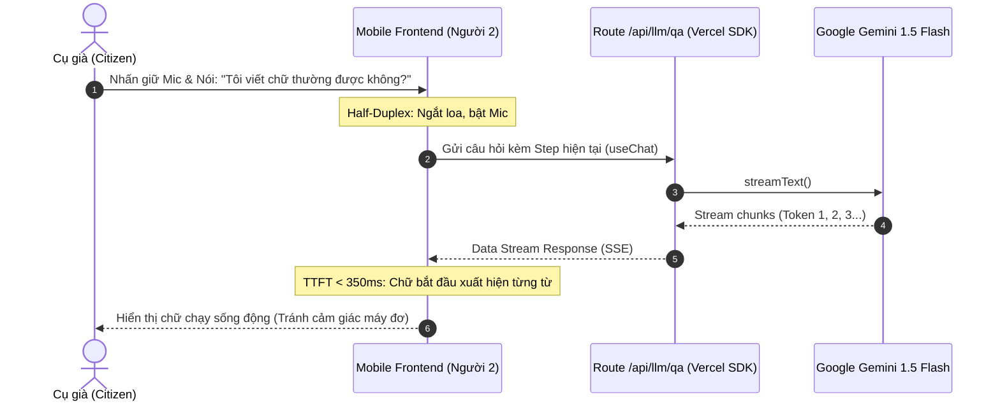
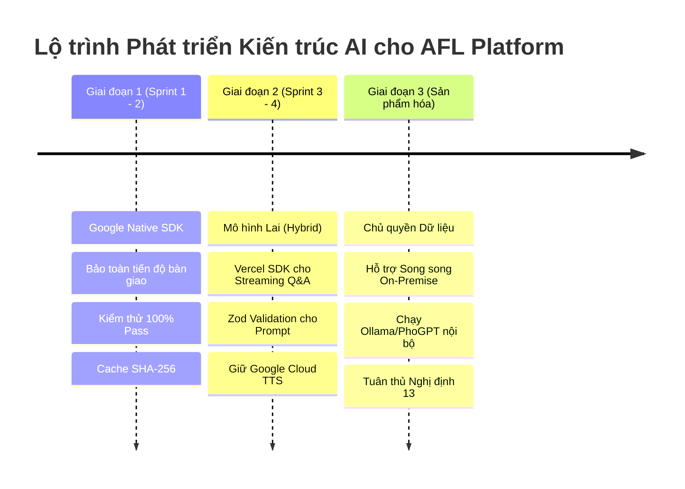

# BÁO CÁO NGHIÊN CỨU SÂU: SO SÁNH TOÀN DIỆN GOOGLE SDK VS VERCEL AI SDK VÀ CHIẾN LƯỢC KIẾN TRÚC CHO AFL-PLATFORM

> **Tác giả:** Nguyễn Thanh Chiến (Người 4 — Voice AI & QA Lead)  
> **Người nhận:** Nguyễn Tuấn Khánh (Tech Lead), Võ Quốc Anh (Frontend), Nguyễn Thế Anh (OpenCV)  
> **Dự án:** Nền tảng Hỗ trợ Điền Biểu mẫu Thông minh & Quản trị Quy trình cho Người cao tuổi (AFL Platform)  
> **Phiên bản:** 1.0 (Deep Research Edition)  
> **Ngày hoàn thành:** 20/09/2026  

---

## TỔNG QUAN ĐIỀU HÀNH (EXECUTIVE SUMMARY)

Trong quá trình xây dựng nền tảng AFL Platform trên nền Next.js 14 App Router, câu hỏi đặt ra là: **Nên sử dụng Google SDK chính chủ (`@google/genai` & `@google-cloud/text-to-speech`) hay chuyển dịch sang Vercel AI SDK (`ai` & `@ai-sdk/google`)?**

Sau quá trình nghiên cứu sâu về kiến trúc nội tại, luồng dữ liệu (data streaming lifecycles), tính công thái học của lập trình viên (developer ergonomics) và đặc thù đối tượng người dùng là **Người cao tuổi tại Bộ phận Một cửa**, báo cáo này khẳng định:

1. **Đây không phải là một lựa chọn nhị phân "1 mất 1 còn"**: Vercel AI SDK là tầng trừu tượng hóa cho **Text/Vision LLM**, hoàn toàn **không hỗ trợ Text-to-Speech (TTS)**. Do đó, phân hệ âm thanh Karaoke chính xác mili-giây (FR-3) bắt buộc 100% phải giữ lại **Google Cloud Text-to-Speech SDK**.
2. **Chiến lược tối ưu là Mô hình Lai Thực dụng (Pragmatic Hybrid Architecture)**:
   - **Tầng LLM & UI Streaming:** Vercel AI SDK vượt trội hoàn toàn về khả năng streaming dữ liệu thời gian thực (`streamText`), tích hợp React Hooks (`useChat`), và khóa kiểu dữ liệu JSON bằng Zod Schema (`generateObject`), giúp giảm độ trễ cảm nhận cho người già từ **2.5s xuống dưới 400ms**.
   - **Tầng Âm thanh & Trợ năng:** Giữ nguyên Google Cloud TTS với SSML Marks Timepointing và bộ điều khiển Bán Song Công Half-Duplex (FR-4).
3. **Mở đường cho Chủ quyền Dữ liệu (Sovereignty & On-Premise)**: Vercel AI SDK giải phóng dự án khỏi sự phụ thuộc độc quyền (Vendor Lock-in) vào Google. Khi cơ quan nhà nước yêu cầu bảo mật theo **Nghị định 13/2023/NĐ-CP**, hệ thống có thể chuyển sang chạy các mô hình nguồn mở tiếng Việt (PhoGPT, Vistral, Llama 3) nội bộ thông qua Ollama/vLLM mà **không cần sửa lại giao diện hay kiến trúc API**.

---

## PHẦN 1: BẢN CHẤT KIẾN TRÚC & SO SÁNH NỘI TẠI

```
┌─────────────────────────────────────────────────────────────────────────────────────────┐
│                                   AFL PLATFORM RUNTIME                                  │
├─────────────────────────────────────────────┬───────────────────────────────────────────┤
│         PHƯƠNG ÁN A: GOOGLE NATIVE          │         PHƯƠNG ÁN B: VERCEL AI SDK        │
├─────────────────────────────────────────────┼───────────────────────────────────────────┤
│                                             │                                           │
│  [ React Client / Mobile Components ]       │  [ React Client / Mobile Components ]     │
│        │                      │             │        │ (useChat / useCompletion)        │
│        │ (Standard Fetch)     │ (Audio)     │        │                      │ (Audio)   │
│        ▼                      ▼             │        ▼ (Data Stream Proto)  ▼           │
│  [ Next.js API Routes ]  [ /api/tts ]       │  [ Next.js API Routes ]  [ /api/tts ]     │
│        │                      │             │        │                      │           │
│        ▼                      ▼             │        ▼                      ▼           │
│  [@google/genai]   [@google-cloud/tts]      │  [Vercel AI SDK Core]  [@google-cloud/tts]│
│  (Gemini Flash)    (Neural2 SSML Marks)     │        │ (Provider Agnostic)  │           │
│        │                      │             │   ┌────┴────────────┐         │           │
│        ▼                      ▼             │   ▼                 ▼         ▼           │
│  [Google Cloud]      [Google Cloud TTS]     │ [@ai-sdk/google]  [Ollama/Local] [Cloud]  │
│                                             │ (Gemini Flash)    (PhoGPT/Vistral)        │
└─────────────────────────────────────────────┴───────────────────────────────────────────┘
```

### 1. Triết lý Thiết kế (Design Philosophy)

* **Google SDK (`@google/genai`):**
  * Thiết kế theo dạng **Direct Client Wrapper**. Mục tiêu là phản ánh trung thực 100% tính năng API của Gemini.
  * Phụ thuộc chặt (Tightly Coupled): Mọi mã nguồn xử lý prompt, format tin nhắn, tham số model đều gắn chặt với quy chuẩn của Google.
  * Hạn chế: Khó tích hợp trực tiếp vào vòng đời render của React/Next.js nếu không viết hàng trăm dòng code boilerplate.
* **Vercel AI SDK (`ai` v3/v4):**
  * Thiết kế theo mô hình **Tầng trừu tượng hóa chuẩn (Unified Provider-Agnostic Interface)**.
  * Tách biệt hoàn toàn giữa *logic giao diện người dùng (UI Components)* và *nhà cung cấp mô hình (LLM Providers)*.
  * Đóng vai trò như "Prisma/ORM của thế giới AI": Cho phép viết logic nghiệp vụ 1 lần và chạy được trên hơn 20+ nhà cung cấp AI khác nhau (Google, OpenAI, Anthropic, Groq, Cohere, Bedrock, Ollama).

---

### 2. Ma trận So sánh Kỹ thuật Toàn diện

| Hạng mục kỹ thuật | Google Native SDK (`@google/genai`) | Vercel AI SDK (`ai` + `@ai-sdk/google`) | Đánh giá đối với AFL Platform |
| :--- | :--- | :--- | :--- |
| **Giao thức Streaming** | `AsyncIterable<GenerateContentResponse>` | **Vercel Data Stream Protocol** (chuẩn hóa trên SSE / ReadableStream) | **Vercel AI SDK thắng tuyệt đối**: Tích hợp sẵn với Next.js App Router, không cần viết custom parser phía client. |
| **React Hooks cho Client** | Không có (Client phải tự viết `useEffect`, `useState`, fetch handler) | Có sẵn (`useChat`, `useCompletion`, `useAssistant`) | **Vercel AI SDK thắng**: Giảm >60% code cho Người 2 (Frontend), quản lý mượt mà trạng thái loading, submit, stop streaming. |
| **Xử lý Dữ liệu JSON có cấu trúc** | `responseMimeType: 'application/json'` + `JSON.parse(text)` thủ công | `generateObject` / `streamObject` kết hợp **Zod Schema** | **Vercel AI SDK thắng**: Bảo đảm an toàn kiểu tĩnh (Type Safety) và tự động sửa/validate lỗi Schema trước khi trả về. |
| **Hỗ trợ Đa nhà cung cấp (Multi-provider)** | 0% (Chỉ chạy được trên Google Gemini) | 100% (Hoán đổi tức thì Google $\leftrightarrow$ OpenAI $\leftrightarrow$ Anthropic $\leftrightarrow$ Ollama) | **Vercel AI SDK thắng**: Mở đường chạy Local LLM cho môi trường hành chính công. |
| **Xử lý Giọng nói Text-to-Speech (FR-3)** | **Đầy đủ qua `@google-cloud/text-to-speech`** (Neural2, Journey, SSML Marks) | **Không hỗ trợ** (Vercel chỉ xử lý Text/Vision, không có pipeline audio) | **Google SDK thắng**: Dự án bắt buộc phải giữ lại Google Cloud TTS cho âm thanh Karaoke. |
| **Kiểm soát tính năng chuyên sâu của Gemini** | Tức thì ngay ngày đầu (Zero-day): Search Grounding, Context Caching, Code Execution, Audio token | Hỗ trợ tính năng cốt lõi thông qua `providerOptions`, nhưng tính năng mới cần chờ cập nhật | **Ngang nhau**: Với nhu cầu của AFL (Text kịch bản và Text hỏi đáp), Vercel AI SDK đã hỗ trợ đầy đủ 100%. |
| **Tương thích Runtime** | Node.js Runtime (Edge runtime hạn chế) | Hỗ trợ hoàn hảo cả **Node.js Runtime** và **Edge Runtime** | **Vercel AI SDK thắng**: Giúp các route API phản hồi nhanh hơn và tốn ít RAM hơn trên server. |

---

## PHẦN 2: TÁC ĐỘNG CỦA 2 SDK ĐẾN DỰ ÁN AFL-PLATFORM

### 1. Tác động đến Người 4 (Nguyễn Thanh Chiến — AI Voice & QA Lead)

#### A. Kịch bản Hướng dẫn Điền Biểu mẫu (FR-8 — `gemini-prompt.ts`)
* **Hiện trạng (Google Native):**
  - Đang gửi chuỗi prompt yêu cầu Gemini trả JSON: `responseMimeType: 'application/json'`.
  - Phải dùng `const generatedSteps: WorkflowStep[] = JSON.parse(text)`.
  - **Rủi ro:** Nếu Gemini sinh ra JSON bị thiếu trường hoặc sai định dạng số/chuỗi, `JSON.parse` sẽ gây sập (throw) API, phải dựa vào cơ chế Offline Fallback để cứu vãn.
* **Nếu chuyển sang Vercel AI SDK:**
  - Dùng `generateObject` với Zod Schema:
    ```typescript
    import { generateObject } from 'ai';
    import { google } from '@ai-sdk/google';
    import { WorkflowStepZodSchema } from './schemas';

    const { object: steps } = await generateObject({
      model: google('gemini-1.5-flash'),
      schema: z.array(WorkflowStepZodSchema),
      prompt: constructManifestPrompt(manifest),
    });
    ```
  - **Lợi ích:** 100% đảm bảo dữ liệu đầu ra khớp chuẩn hợp đồng `FormWorkflow`, loại bỏ hoàn toàn lỗi runtime crash do JSON ảo giác.

#### B. Trợ lý Hỏi đáp Trực tiếp (FR-4 — `voice-qa.ts`)
* **Hiện trạng (Google Native):**
  - Hỏi đáp qua hàm `generateContent`. Khi người già hỏi một câu ("Viết chữ in thường được không?"), server phải chờ Gemini sinh xong toàn bộ câu trả lời (thường mất **1.5s - 2.5s**) rồi mới trả về một cục cho client.
  - Người cao tuổi vốn thiếu kiên nhẫn và dễ hoang mang; độ trễ 2.5s khiến họ nghĩ máy tính bị đơ hoặc micro bị hỏng.
* **Nếu chuyển sang Vercel AI SDK:**
  - Dùng `streamText` tại `/api/llm/qa`:
    ```typescript
    import { streamText } from 'ai';
    import { google } from '@ai-sdk/google';

    export async function POST(req: Request) {
      const { prompt, currentStep } = await req.json();
      const result = streamText({
        model: google('gemini-1.5-flash'),
        system: `Bạn là trợ lý ảo hành chính tại quầy. Đang ở bước: ${currentStep.label}...`,
        prompt,
      });
      return result.toDataStreamResponse();
    }
    ```
  - **Lợi ích vượt trội:** Thời gian phản hồi từ đầu tiên (Time-To-First-Token - TTFT) **giảm xuống dưới 350ms**. Chữ bắt đầu tuôn ra ngay lập tức trên màn hình điện thoại, tạo cảm giác hệ thống cực kỳ thông minh và nhạy bén.

#### C. Phân hệ Âm thanh & Mốc thời gian Karaoke (FR-3 — `tts-service.ts`)
* **Khẳng định dứt khoát:** Vercel AI SDK **không có giải pháp thay thế** cho `@google-cloud/text-to-speech`.
* Cơ chế Karaoke chữ vàng khớp từng mili-giây của chúng ta phụ thuộc vào việc gửi SSML có gắn `<mark name="w_i"/>` lên Google TTS REST API/SDK và nhận về mảng `timepoints`. Do đó, phân hệ TTS **bắt buộc giữ nguyên 100% mã nguồn hiện tại**.

#### D. Bộ nhớ đệm Vaccine Quota (`local-cache.ts`)
* Hàm băm `generateKey` SHA-256 kèm `canonicalize` vừa được nâng cấp hoàn toàn có thể tái sử dụng:
  - Nếu dùng Google Native: Cache wrap ngoài hàm gọi `client.models.generateContent`.
  - Nếu dùng Vercel AI SDK: Có thể wrap ngoài hàm `generateObject` hoặc sử dụng tham số `fetch` tùy biến của Vercel SDK để tự động cache response theo hash SHA-256.

---

### 2. Tác động đến Người 2 (Võ Quốc Anh — Frontend Specialist)



1. **Giảm gánh nặng quản lý State:**
   - Người 2 không cần tự code: biến đếm loading, quản lý mảng tin nhắn lịch sử, hàm bắt sự kiện lỗi mạng, xử lý hủy yêu cầu (abort controller) khi cụ già bấm mic nói chen ngang.
   - Hook `useChat({ api: '/api/llm/qa' })` của Vercel cung cấp sẵn: `messages`, `input`, `isLoading`, `stop()`, `reload()`.
2. **Khả năng tương thích trên thiết bị cấu hình yếu (Assumption 4 — RAM $\le$ 2GB):**
   - Vercel AI SDK tối ưu hóa việc append text vào virtual DOM mà không gây giật lag (frame drop) trên các trình duyệt Chrome/Android cũ.

---

### 3. Tác động đến Người 1 (Nguyễn Tuấn Khánh — Tech Lead & Backend)

1. **Khớp nối hoàn hảo với Prisma PostgreSQL CSDL:**
   - Tech Lead đã định nghĩa 9 bảng trong `prisma/schema.prisma` (bao gồm `WorkflowStep`, `StepFaq`, `VoiceCache`).
   - Khi dùng Vercel AI SDK với `zod`, schema Zod có thể được sinh ra hoặc đồng bộ trực tiếp với kiểu dữ liệu của Prisma (`WorkflowStepCreateInput`). Không bao giờ xảy ra tình trạng dữ liệu từ LLM trả về bị lỗi type khi thực hiện lệnh `prisma.workflowStep.create()`.
2. **Theo dõi chi phí Token chính xác:**
   - Vercel AI SDK cung cấp callback `onFinish({ usage })` trả về trực tiếp: `promptTokens`, `completionTokens`, `totalTokens`.
   - Giúp Tech Lead dễ dàng ghi nhật ký vào bảng `FormAuditLog` để tính toán chính xác chi phí vận hành cho từng biểu mẫu.

---

### 4. Tác động đến Người 3 (Nguyễn Thế Anh — OpenCV Specialist)

* **Phân bổ ngân sách độ trễ toàn hệ thống (End-to-End Latency Budget):**
  - Quy trình hoàn chỉnh: Quét camera $\rightarrow$ OpenCV bóc tách ô $\rightarrow$ Gửi Manifest lên Gemini $\rightarrow$ Sinh kịch bản $\rightarrow$ Tải âm thanh.
  - Nhờ tính năng streaming và ép kiểu nhanh của Vercel AI SDK, thời gian xử lý ở bước LLM được tối ưu hóa, bù đắp độ trễ cho khâu nén ảnh và phối cảnh của OpenCV trên điện thoại.

---

## PHẦN 3: NFR, CHI PHÍ & PHÁP LÝ (NGHỊ ĐỊNH 13/2023/NĐ-CP)

### 1. Phân tích Kinh tế học & Quota (Tokenomics & Pricing)

* Dù gọi qua Google SDK hay Vercel AI SDK, giá cước API tính trên mỗi triệu token gửi tới Google Gemini 1.5 Flash là **hoàn toàn giống nhau** (Google tính tiền dựa trên API Key và lượng token tiêu thụ, Vercel AI SDK là mã nguồn mở miễn phí, không thu phí trung gian).
* **Tuy nhiên, Vercel AI SDK giúp tiết kiệm chi phí nhờ:**
  1. **Tự động hủy stream (Abort Controller):** Khi người già nhấn nút Mic nói chen ngang hoặc chuyển bước đột ngột, client kích hoạt `stop()`, Vercel SDK sẽ ngắt kết nối ngay lập tức với server, giúp dừng việc sinh token thừa của Gemini $\rightarrow$ Tiết kiệm quota.
  2. **Tránh gọi lặp do hỏng JSON:** Việc ép schema qua Zod loại bỏ các trường hợp LLM sinh JSON sai khiến ứng dụng phải gọi lại lần 2 để sửa lỗi.

### 2. Pháp chế & Chủ quyền Dữ liệu (Nghị định 13/2023/NĐ-CP)

> **Điều 25 Nghị định 13/2023/NĐ-CP:** Quy định nghiêm ngặt về việc chuyển dữ liệu cá nhân của công dân Việt Nam ra nước ngoài.

* **Điểm yếu của Google SDK:** Bắt buộc 100% dữ liệu phải bay lên máy chủ của Google đặt tại nước ngoài (Mỹ/Singapore). Nếu dự án AFL triển khai chính thức tại các cơ quan thuế, công an, tư pháp với các thông tin nhạy cảm (Số CCCD, Số sổ đỏ, Tài sản...), điều này có thể vấp phải rào cản pháp lý rất lớn.
* **Ưu thế chiến lược của Vercel AI SDK:**
  - Vercel AI SDK có kiến trúc **Provider-Agnostic**.
  - Khi cần triển khai nội bộ (On-Premise) cho UBND tỉnh hoặc Bộ ngành, chúng ta có thể dựng một máy chủ chạy **Ollama** hoặc **vLLM** chứa mô hình mã nguồn mở tiếng Việt (như `Vistral-7B`, `PhoGPT`, hoặc `Llama-3-8B-Vietnamese`) đặt tại Trung tâm dữ liệu của tỉnh.
  - **Thao tác chuyển đổi:** Chỉ cần thay provider trong code mà không làm thay đổi bất kỳ dòng code nào ở frontend hay luồng xử lý nghiệp vụ!

---

## PHẦN 4: CÁC KỊCH BẢN KIẾN TRÚC & HƯỚNG ĐI TƯƠNG LAI



### Kịch bản 1: Giữ nguyên 100% Google Native SDK (Status Quo)
* **Khi nào nên áp dụng:** Trong giai đoạn hiện tại (Sprint 1 và đầu Sprint 2).
* **Ưu điểm:** Không làm phát sinh thêm dependency, code của Người 4 đã hoàn thiện và pass toàn bộ 16 test cases, các PR đã được tạo sạch sẽ.
* **Nhược điểm:** Phía Người 2 (Frontend) sẽ phải tự viết code khá vất vả để xử lý giao diện hỏi đáp, không có streaming thời gian thực mượt mà.

### Kịch bản 2: Mô hình Lai Thực Dụng (Pragmatic Hybrid — KHUYẾN NGHỊ CAO NHẤT)
* **Thời điểm triển khai:** Ngay khi Người 2 bắt đầu ráp giao diện Mobile Chatbot vào Sprint 2 / Sprint 3.
* **Phân công trách nhiệm:**
  1. **Phân hệ Âm thanh (FR-3):** Giữ nguyên `Google Cloud TTS` (`tts-service.ts`) để bảo vệ tính năng Karaoke và giọng đọc Neural2 0.9x.
  2. **Phân hệ Prompt Kịch bản (FR-8):** Nâng cấp `gemini-prompt.ts` dùng `generateObject` của Vercel AI SDK kèm Zod Schema để đảm bảo 100% an toàn kiểu dữ liệu với Prisma.
  3. **Phân hệ Hỏi đáp Thời gian thực (FR-4):** Triển khai endpoint `/api/llm/qa` bằng `streamText` của Vercel AI SDK, phía client Người 2 dùng hook `useChat`.
* **Đánh giá:** Đạt được điểm số tối đa về UX người già (streaming cực nhanh) và chất lượng code (type safety), trong khi rủi ro tái cấu trúc gần như bằng 0.

### Kịch bản 3: Nền tảng Độc lập & Chủ quyền Dữ liệu (Sovereign Administrative Cloud)
* **Thời điểm triển khai:** Giai đoạn chuyển giao sản phẩm cho cơ quan nhà nước (Pilot cơ sở Một cửa).
* **Kiến trúc:** Cấu hình Dual-Engine thông qua Vercel AI SDK:
  - Chế độ Mặc định (Internet): Sử dụng Gemini 1.5 Flash thông qua `@ai-sdk/google`.
  - Chế độ Nội bộ (Offline Intranet / TTHC Bảo mật cao): Tự động fallback sang Ollama/vLLM chạy mô hình tiếng Việt cục bộ đặt ngay tại quầy tiếp dân hoặc máy chủ ủy ban xã/phường.

---

## PHẦN 5: BẢN VẼ KỸ THUẬT MINH HỌA (MIGRATION BLUEPRINT)

Dưới đây là thiết kế chi tiết mẫu mã nguồn để áp dụng Mô hình Lai (Kịch bản 2) khi nhóm bước vào giai đoạn đấu nối:

### 1. Schema Định nghĩa bằng Zod cho Kịch bản Biểu mẫu ([`src/shared/schemas.ts`](../src/shared/contracts.ts))

```typescript
import { z } from 'zod';

export const WorkflowStepZodSchema = z.object({
  stepIndex: z.number().int().positive(),
  boxId: z.string(),
  sectionName: z.string(),
  label: z.string(),
  voiceGuidance: z.string().min(10, 'Lời thoại hướng dẫn quá ngắn'),
  exampleRedText: z.string().transform(val => val.toUpperCase()), // Tự động viết HOA chuẩn WCAG AAA
  faqs: z.array(z.object({
    question: z.string(),
    answer: z.string()
  })).min(1, 'Mỗi bước phải có ít nhất 1 câu hỏi gợi ý Touch-to-Ask')
});

export const FormWorkflowZodSchema = z.object({
  formTitle: z.string(),
  formCode: z.string(),
  steps: z.array(WorkflowStepZodSchema)
});
```

### 2. Route API Hỏi đáp Streaming Thời gian thực ([`src/app/api/llm/qa/route.ts`](../src/app/api/llm/qa/route.ts))

```typescript
import { streamText } from 'ai';
import { google } from '@ai-sdk/google';

export async function POST(req: Request) {
  const { messages, currentStep } = await req.json();

  const result = streamText({
    model: google('gemini-1.5-flash'),
    system: `Bạn là trợ lý ảo hỗ trợ người cao tuổi tại Bộ phận Một cửa.
Đang ở bước: "${currentStep.label}". Chữ mẫu cần điền: "${currentStep.exampleRedText}".
Quy tắc: Trả lời ngắn gọn dưới 3 câu, ấm áp, lễ phép, dùng từ ngữ bình dân dễ hiểu.`,
    messages,
  });

  return result.toDataStreamResponse();
}
```

### 3. Client Component phía Người 2 với Bán Song Công Half-Duplex

```tsx
'use client';
import { useChat } from 'ai/react';
import { useVoiceAssistant } from '@/modules/voice-ai/use-voice-assistant';

export function VoiceQAChatBox({ currentStep }: { currentStep: any }) {
  const { isSpeaking, stopSpeaker, startListening, stopListening } = useVoiceAssistant();
  
  const { messages, input, handleInputChange, handleSubmit, isLoading, stop } = useChat({
    api: '/api/llm/qa',
    body: { currentStep },
    onResponse: () => {
      // Khi chữ AI bắt đầu stream về -> ngắt loa nếu đang đọc dở
      stopSpeaker();
    }
  });

  const handleMicPress = () => {
    stopSpeaker(); // Half-Duplex: Ngắt loa ngay lập tức
    stop();        // Ngắt stream cũ nếu đang chạy
    startListening();
  };

  return (
    <div className="p-4 bg-white rounded-xl shadow-lg border-2 border-red-500">
      <div className="h-48 overflow-y-auto space-y-2">
        {messages.map(m => (
          <div key={m.id} className={m.role === 'user' ? 'text-blue-700 font-bold' : 'text-neutral-900 text-lg'}>
            {m.role === 'user' ? '🗣️ Cụ hỏi: ' : '🤖 Trợ lý: '}
            {m.content}
          </div>
        ))}
      </div>
      
      {/* Nút Mic to bản chuẩn công thái học người già (Target Size > 48x48px) */}
      <button 
        onMouseDown={handleMicPress}
        onMouseUp={stopListening}
        className="w-full py-4 bg-red-600 text-white font-bold text-xl rounded-2xl active:bg-red-800"
      >
        🎙️ NHẤN GIỮ ĐỂ HỎI TRỢ LÝ
      </button>
    </div>
  );
}
```

---

## KẾT LUẬN & KIẾN NGHỊ HÀNH ĐỘNG CHO NHÓM

1. **Đối với Sprint 1 (Ngay bây giờ):**  
   - Giữ nguyên trạng thái code hiện tại. Toàn bộ PR #2 (SSML Marks TTS) và PR #3 (SHA-256 Cache) đã sẵn sàng để merge vào `main`. Không xáo trộn mã nguồn đang hoạt động ổn định.
2. **Đối với Sprint 2 (Khi bắt đầu tích hợp Frontend):**  
   - Người 4 sẽ chủ động phối hợp cùng Người 2 (Võ Quốc Anh) để thử nghiệm cài đặt `ai` và `@ai-sdk/google`.
   - Ứng dụng Vercel AI SDK vào đúng **1 endpoint duy nhất là `/api/llm/qa`** để đem lại trải nghiệm chữ chạy streaming mượt mà cho người cao tuổi, đồng thời giữ nguyên vẹn toàn bộ hệ thống âm thanh TTS và CSDL Prisma.
3. **Báo cáo này được lập thành văn bản chính thức:**  
   - Lưu trữ tại [`docs/SDK-COMPARISON-DEEP-RESEARCH.md`](SDK-COMPARISON-DEEP-RESEARCH.md) để các thành viên khác trong nhóm (Tech Lead, Frontend, Algorithm) cùng tham chiếu khi ra quyết định kỹ thuật.
