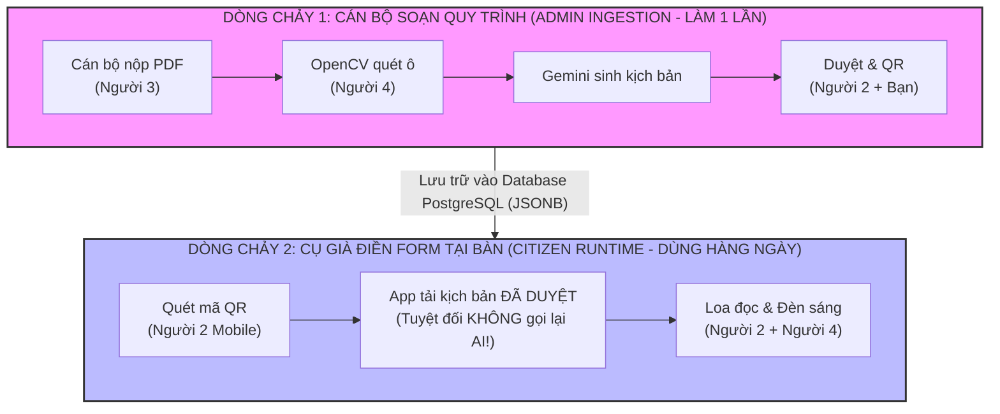
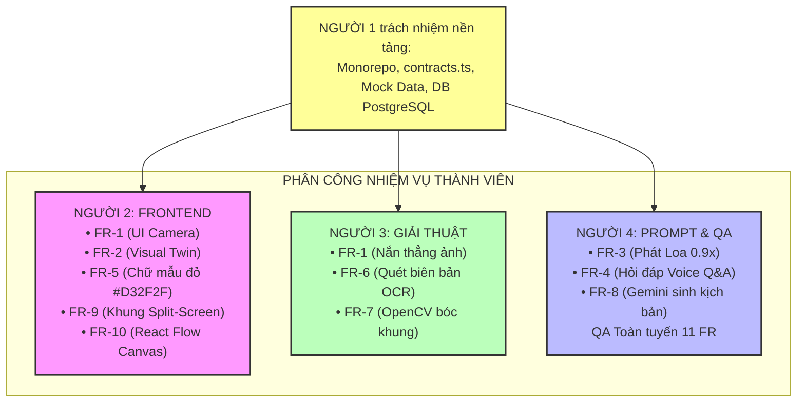

# KẾ HOẠCH PHÂN CÔNG CÔNG VIỆC & PIPELINE THỰC THI DỰ ÁN AFL
## Hệ thống Hỗ trợ Điền Biểu mẫu Thông minh & Quản trị Quy trình cho Người cao tuổi
**Mô hình Đội ngũ:** 4 Thành viên (Nền tảng IT)  
**Tài liệu quy chiếu:** [PRD (11 FRs)](PRD.md) & [Architecture Spine](ARCHITECTURE.md)  
**Phiên bản:** Hoàn thiện & Chuẩn hóa Thực thi  
**Thời gian cập nhật:** 17/09/2026  

---
## 0. THÀNH VIÊN:
* **Người 1**: Nguyễn Tuấn Khánh
* **Người 2**: Võ Quốc Anh
* **Người 3**: Nguyễn Thế Anh
* **Người 4**: Nguyễn Thanh Chiến
---
## 1. NGUYÊN TẮC CỐT LÕI: (FOUNDATION FIRST)
 **PHA 0** để dựng "Khung xương" (Walking Skeleton) cho dự án:
1. **Khởi tạo Monorepo Next.js 14:** Cấu hình sẵn TypeScript, Tailwind CSS, Prisma ORM để `npm run dev` chạy được ngay.
2. **File(`src/shared/contracts.ts`):** Quy định chính xác kiểu dữ liệu đầu vào và đầu ra giữa các module.
3. **Cung cấp dữ liệu giả lập (Mock Fixtures):**
   * File ảnh scan tờ khai mẫu: `assets/test-form.jpg`.
   * File tọa độ ô giả lập: `mock-manifest.json` (giả lập output của OpenCV).
   * File kịch bản hướng dẫn giả lập: `mock-workflow.json` (giả lập output của Gemini + Audio).
4. **Tạo công tắc giả lập (Mock Switcher):** Giúp Người 2 (Frontend) test giao diện độc lập 100% mà không bị tắc nghẽn chờ đợi backend.

---

## 2. PHÂN TÁCH RẠCH RÒI 2 DÒNG CHẢY HỆ THỐNG

Hệ thống được thiết kế theo 2 dòng chảy hoàn toàn độc lập để tối ưu hóa hiệu năng và chi phí:

* **Dòng chảy 1 (Chuẩn bị trước):** Thực hiện trên máy tính văn phòng. AI và OpenCV bóc tách biểu mẫu mẫu và chuyên viên phê duyệt trước khi phát hành.
* **Dòng chảy 2 (Vận hành thực tế):** Người cao tuổi tại quầy Một cửa quét mã QR để tải kịch bản đã lưu sẵn trong cơ sở dữ liệu. **Không hề gọi lại OpenCV hay Gemini**, giúp ứng dụng phản hồi tức thì $\le 0.5$s, chạy mượt trên mạng di động và tiết kiệm 100% chi phí API.

---

## 3. BẢN ÁNH XẠ TOÀN DIỆN 11 YÊU CẦU CHỨC NĂNG (FR MAPPING)

### CHI TIẾT TRÁCH NHIỆM NGƯỜI 1 (TECH LEAD & DB ARCHITECT)
* **Trách nhiệm nòng cốt:** Thiết kế kiến trúc, làm chủ file `contracts.ts` (Hiến pháp bất khả xâm phạm), thiết kế cơ sở dữ liệu PostgreSQL Prisma, viết sẵn Custom Hook `useStepAudio(stepId)` chuẩn Half-Duplex, cấu hình Service Worker Offline Pre-cache, điều phối tích hợp P2P và gộp code vào `main`.
* **FR-11 (Quản lý Thư viện, Sinh Mã QR & Mã Rút Gọn 3 Số, Hạn Hiệu Lực):**
  * Viết API CRUD quản lý danh mục form (`form_templates`), bổ sung trường `short_code` (Mã 3 số) và `valid_until` (Hạn hiệu lực văn bản).
  * Tích hợp thư viện tạo mã QR SVG liên kết thẳng đến biểu mẫu và xuất mẫu in A5/A4 mica dán tại bàn tiếp dân.
* **Hỗ trợ FR-6 (Bảo mật Session RAM theo Nghị định 13/2023/NĐ-CP):**
  * Xây dựng middleware lưu tạm hình ảnh CCCD và biên bản phạt trong biến bộ nhớ RAM, kích hoạt cơ chế tự hủy hoàn toàn sau 15 phút hoặc khi người dùng bấm nút [Kết thúc & Xóa sạch phiên].

---

### CHI TIẾT TRÁCH NHIỆM CỦA NGƯỜI 2 (UI MOBILE & ADMIN)
* **Vị trí cốt lõi:** Làm chủ toàn bộ phần "Nhìn" và trải nghiệm trực quan của dự án (cả phía Dân lẫn Cán bộ).
* **FR-1 & FR-11 (Mã Rút Gọn & Camera):** Ô nhập mã số 3 chữ số to đùng ($\ge 24$pt) ngay trang chủ (cho cụ tay run / cam mờ) song song với khung camera chụp scan.
* **FR-2 (Visual Twin & Normalized Highlighter):** Nhận tọa độ tỉ lệ chuẩn hóa $0.0 \to 1.0$, nhân ma trận viewport SVG vẽ đèn nháy chính xác 100% trên mọi dòng máy, không lệch pixel.
* **FR-3 (Phụ Đề Karaoke Chữ Chạy & Nút Nghe Lại):** Hiển thị chữ chạy to $\ge 20$pt đồng bộ theo giọng nói; nút [Nghe lại dòng này] $\ge 56\text{ dp}$ cố định ở thanh điều hướng.
* **FR-4 (Nút Chạm Câu Hỏi Nhanh - Touch-to-Ask):** Dựng 2-3 nút chip câu hỏi thường gặp dưới mỗi ô điền để cụ chạm 1 chạm là nghe giải đáp ngay, không bắt buộc thu âm.
* **Trợ Năng NFR-1:** Kích hoạt Web Wake Lock API (`navigator.wakeLock`) chống tắt màn hình khi cụ đang viết; nút đỏ [Xóa sạch phiên] ở góc trên.
* **FR-9 (Khung Split-Screen & Vẽ Box Thủ Công):** Dựng layout chia đôi Desktop, cung cấp công cụ click & drag vẽ/chỉnh Bounding Box thủ công khi OpenCV quét thiếu; checkbox cam kết pháp lý bắt buộc trước khi nút [Phê duyệt] sáng lên.
* **FR-10 (Sơ đồ Kéo Thả Liên Chứng Từ):** Tích hợp thư viện React Flow (`@xyflow/react`) để cán bộ kéo thả node nối trường từ Biên bản phạt vào tờ khai nộp tiền.
*  **Cơ chế hoạt động:** Bật `useMockData = true` để code và test giao diện mượt mà 100% bằng mock data, không phụ thuộc vào tiến độ của 3 và 4.

---

### CHI TIẾT TRÁCH NHIỆM CỦA NGƯỜI 3 (OPENCV WASM)
* **Vị trí cốt lõi:** Làm chủ toàn bộ phần "Toán học & Xử lý ảnh hình học cục bộ".
* **FR-1 (Nắn Thẳng Ảnh Phối Cảnh - Deskew):** Thuật toán tự động tìm 4 góc của tờ khai giấy và thực hiện phép biến đổi phối cảnh (Perspective Transform) để nắn phẳng tờ giấy; xử lý cân bằng sáng chống lóa bóng đèn.
* **FR-6 (Quét Chứng Từ Tiên Quyết):** Bóc tách các trường thông tin then chốt từ ảnh chụp Biên bản xử phạt vi phạm / Sổ đỏ (Số biên bản, Ngày lập, Số tiền phạt).
* **FR-7 (Tự Động Bóc Tách Khung Ô Biểu Mẫu Mới - Trọng tâm):**
  * Nhận file PDF/ảnh scan trắng, sử dụng Morphological Operations quét các đường kẻ ngang dọc và đường viền bảng.
  * Xuất ra bộ khung hình học `FormGeometricManifest` gồm danh sách `box_01`, `box_02`... với **tọa độ chuẩn hóa `[ymin, xmin, ymax, xmax]` ($0.0 \to 1.0$)**.
* **Cơ chế hoạt động:** Làm việc hoàn toàn trong thư mục cô lập `src/modules/opencv/`, nhận ảnh test `test-form.jpg` và kiểm thử bằng `npm run test:opencv`.

---

### CHI TIẾT TRÁCH NHIỆM CỦA NGƯỜI 4 (AI PROMPT, AUDIO & QA LEAD)
* **Vị trí cốt lõi:** Làm chủ "Bộ não ngôn ngữ, Giọng nói hai chiều & Thẩm định chất lượng".
* **FR-8 (Tự Động Sinh Kịch Bản Bình Dân & Chốt Chặn Pháp Lý):** Viết Prompt kỹ thuật (Structured JSON Mode) cho Gemini 1.5 Flash dịch nhãn hành chính thành câu thoại bình dân, tạo chữ mẫu đỏ in hoa, và sinh sẵn nội dung cho 3 nút Touch-to-Ask Chips. Đặt cờ `DRAFT_PENDING_LEGAL_CHECK`. Strict Grounding tuyệt đối không suy diễn pháp lý.
* **FR-3 (Trợ Lý Giọng Nói Đọc Hướng Dẫn 0.9x & Timestamp Karaoke):** Tích hợp Google Cloud TTS (Neural2 vi-VN) sinh file MP3 tốc độ chậm 0.9x (Bắc / Nam), xuất kèm mảng timestamp từ vựng để Người 2 chạy hiệu ứng Karaoke; đóng gói audio bundle $\le 1.5\text{MB}$ cho Service Worker cache ngoại tuyến.
* **FR-4 (Hỏi Đáp Ngữ Cảnh Bằng Giọng Nói):** Kết nối Web Speech STT on-device $\rightarrow$ Gemini Text API $\rightarrow$ TTS trả lời ngắn gọn trong $\le 1.5$s.
* **Tổng chỉ huy QA Toàn diện 11 FR:** Kiểm tra độ tương phản màu sắc, cỡ chữ, kiểm thử Web Wake Lock trên điện thoại thật, test chế độ tắt 4G xem offline cache có hoạt động trơn tru không.
* **Cơ chế hoạt động:** Làm việc trong `src/modules/voice-ai/`, tự học và tự sửa prompt thông qua hệ thống **Smart Logs** gợi ý tiếng Việt rõ ràng.

---

## 4. TỜ LỆNH HÀNH ĐỘNG CỤ THỂ (ACTION SHEETS)

| Tiêu Chí | Người 3 (OpenCV) | Người 4 (Prompt & Voice) | Người 2 (Frontend) | Người 1 (Tech Lead) |
| :--- | :--- | :--- | :--- | :--- |
| **Đầu vào (Input)** | Ảnh chụp `assets/test-form.jpg` | File `mock-manifest.json` | Công tắc `useMockData = true` | Yêu cầu PRD & Architecture |
| **Thư mục làm việc** | `src/modules/opencv/` | `src/modules/voice-ai/` | `src/components/mobile/` & `src/components/admin/` | `src/shared/`, root & Prisma DB |
| **File code chính** | `detector.ts`, `deskew.ts` | `gemini-prompt.ts`, `tts-service.ts` | `VisualTwin.tsx`, `SplitScreenGate.tsx` | `contracts.ts`, `schema.prisma` |
| **Lệnh kiểm thử** | `npm run test:opencv` | `npm run test:voice` | `npm run dev` (mở trình duyệt) | `npx prisma db push`, `npm test` |
| **Đầu ra đạt chuẩn** | Mảng JSON tọa độ `box_01...` | File `step_01.mp3` & JSON kịch bản | Giao diện hiển thị đèn sáng + nút $\ge 56$dp | Repo xanh, `contracts.ts` chuẩn |

---

## 5. TIẾN TRÌNH SPRINT (4 PHA THỰC THI)

### PHA 0: KHỞI TẠO NỀN TẢNG, "Ổ CẮM" & MOCK DATA
* Người 1 khởi tạo Monorepo Next.js, viết `src/shared/contracts.ts`, tạo sẵn `mock-manifest.json`, `mock-workflow.json` và ảnh mẫu `test-form.jpg`.
* Anh em clone repository về máy và bắt đầu làm việc ngay từ ngày thứ 2 mà không bị nghẽn.

### PHA 1: TÁC CHIẾN ĐỘC LẬP THEO PHÂN VÙNG
* **Người 2:** Bật `useMockData = true`, vẽ hoàn thiện Visual Twin Mobile (FR-2, FR-5) và dựng khung sườn Split-Screen Admin (FR-9).
* **Người 3:** Viết hoàn chỉnh thuật toán bóc tách bounding box OpenCV WASM (FR-7) và nắn thẳng ảnh (FR-1).
* **Người 4:** Viết Prompt Gemini sinh kịch bản (FR-8), tích hợp Google TTS sinh audio 0.9x (FR-3) và Web Speech STT (FR-4).

### PHA 2: BẮT TAY NỐI DÂY TRỰC TIẾP (P2P WIRING) 
*(3 thành viên ngồi cùng phòng hoặc mở Discord share màn hình để ghép nối)*
* **Ghép Cổng Admin:** Người 3 cắm kết quả OpenCV vào Cột Trái, Người 4 cắm kết quả Gemini/Audio vào Cột Phải của trang Admin do Người 2 dựng. Cả nhóm bấm thử nút [Phê duyệt].
* **Ghép Ứng Dụng Mobile:** Người 2 tắt `useMockData = false`, nhận audio thật và chữ mẫu đỏ thật từ Người 4 để hiển thị lên điện thoại.
* **FR-10:** Người 2 tích hợp React Flow kéo thả liên chứng từ trên cổng Admin.

### PHA 3: TỔNG DUYỆT HỆ THỐNG & KIỂM THỬ E2E
* Người 1 gộp code vào `main`, kết nối PostgreSQL Prisma (FR-11) và kích hoạt Session RAM tự hủy sau 15 phút.
* Cả nhóm in tờ khai giấy thật ra bàn, cầm điện thoại quét mã QR, nghe loa đọc và tự tay lấy bút mực điền thử để nghiệm thu chất lượng.
