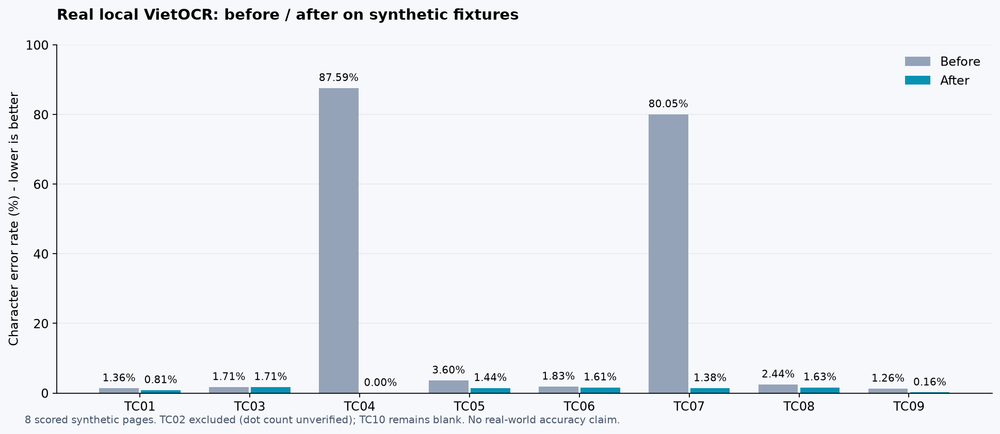
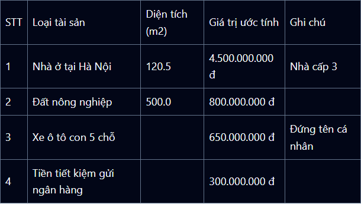

# Nghiên cứu và tối ưu OpenCV WASM + VietOCR

Ngày thực hiện: 10/10/2026. Phạm vi: tiền xử lý trong trình duyệt, phân vùng trang trong service, nhận diện dòng, chuyển metadata qua adapter/provider, xuất JSON và điều hướng sau quét.

Cập nhật tiếp theo: [tối ưu thời gian xử lý](LATENCY.md), dùng cached decoder, CNN fusion và hai batch CPU song song. Các số liệu `before.json`/`after.json` dưới đây giữ nguyên làm mốc nghiên cứu độ chính xác ban đầu.

**Kết quả đo:** CER trung bình trên cùng 8 ảnh tổng hợp giảm từ **22,48% xuống 1,09%**. Bảng mẫu được đọc đúng toàn bộ chữ, giữ đủ **25 ô, gồm 4 ô trống**. Ảnh nghiêng giảm CER từ **80,05% xuống 1,38%**. Đây là kết quả với model VietOCR local hiện có, không phải số liệu độ chính xác trên hồ sơ thực tế.

## Nguyên nhân đã xác định

1. **Mất cấu trúc trước khi OCR.** Detection cũ thu nhỏ trang xuống chiều rộng 1.200 px, dùng ngưỡng toàn cục và dilation cố định. Chữ nhỏ dễ mất nét; đường kẻ nối cả bảng thành một contour lớn. TC04 cũ chỉ còn 2 vùng, không đủ để đọc từng ô. Giới hạn 120 vùng cũng không phù hợp với trang dày chữ.
2. **Đưa nội dung vượt khả năng model dòng.** Config hiện tại dùng chiều cao 32 px và chiều rộng tối đa 512 px; decoder upstream có giới hạn độ dài. Dòng quá dài bị ép ngang, các vùng chứa nhiều dòng bị coi như một dòng. Gom batch với nhiều padding làm thay đổi kết quả của crop ngắn.
3. **Thiếu deskew tại service.** Khi gọi API toàn trang hoặc chọn clean scan, ảnh nghiêng không nhất thiết đi qua nắn ảnh trong trình duyệt. TC07 là minh chứng đo được.
4. **Sai giả định về bản sao Mat trong WASM đang cài.** Với `@techstark/opencv-js` 5, thử nghiệm xác nhận `.clone()` trả handle dùng chung pixel: sửa clone làm đổi ảnh gốc. Dùng `copyTo(new Mat())` mới tạo bản sao pixel độc lập trong các vị trí đã sửa. Điều này phù hợp với tài liệu Embind về clone handle; không suy rộng sang mọi bản OpenCV/C++.
5. **Bỏ metadata khi chuyển sang JSON.** Provider cũ luôn trả `tables: []`; đọc được chữ vẫn không bảo toàn ô trống và cột. Retry cũng chưa thể hiện vùng chỉ xuất hiện ở một lần OCR.
6. **Luồng sau quét bị điều hướng sai.** `/guide` và `/scan` không tồn tại trong ứng dụng; đã đổi sang `/citizen/guide` và `/citizen/scan`, giữ ngữ cảnh template khi có.

## Thay đổi đã triển khai

- Dùng adaptive threshold cho phát hiện chữ; tách đường kẻ dài, mảnh trước khi nối dòng. Ước lượng kích thước ký tự để chọn kernel và dùng detection tới 2.400 px, trở lại độ phân giải gốc khi chữ quá nhỏ. Crop nhận diện lấy từ pixel gốc.
- Deskew tại service bằng Hough, có kiểm tra mức đồng thuận; xoay trên canvas mở rộng nền trắng và ánh xạ tọa độ về ảnh đầu vào. Sắp vùng theo hình học, bảo toàn dòng nhỏ và vùng sát mép đã kiểm thử.
- Nhận diện lưới bảng có đường kẻ hoàn chỉnh, giữ slot trống, liên kết từng ô tới `lineIds` và nguồn chữ. Không đoán hàng tiêu đề (`TABLE_HEADER_UNVERIFIED`); từ chối suy luận lưới đều khi có separator một phần của ô gộp/bảng hỏng.
- Loại các chuỗi chấm dẫn đều khỏi **mask detection**, giữ pixel ảnh gốc cho OCR. Không sửa nội dung bằng từ điển hay tự điền trường trống.
- Tách dòng quá rộng tại khoảng trắng có thật trước khi đưa vào model; không cắt xuyên nét chữ. Batch tối đa 8, gom theo đúng chiều rộng xử lý của VietOCR và chỉ tạo tensor cho batch đang chạy. Ghép lại đúng thứ tự; confidence lấy fragment yếu nhất. Trường hợp còn vượt giới hạn rộng/độ dài trả confidence `null`.
- Crop nhiều dòng được đọc từng dòng rồi ghép về ID và tọa độ của crop gốc. Giữ zero confidence, không gán độ tin cậy giả. Ô trống không đưa vào model để tránh sinh chữ từ nền trắng.
- Adapter kiểm tra metadata bảng, ID nguồn, tọa độ và số ô; provider chuyển đầy đủ bảng và source ranges theo Unicode code point sang JSON. Vùng chỉ có trong một lần retry được đánh dấu để người dùng kiểm tra, giữ nguồn từng lần đọc.
- PNG trong suốt được ghép nền trắng; service xử lý EXIF orientation. Giới hạn 8 MB/12 triệu pixel/1.000 vùng; quá giới hạn báo lỗi rõ ràng, không cắt âm thầm. Service bận trả 429 sau thời gian chờ ngắn.
- Đổi các vị trí WASM cần sửa bản sao sang `copyTo(new Mat())`, có giải phóng Mat trong `finally`.

## Đo trước và sau

Chạy inference thật trên CPU, cùng model/config local và cùng bộ ảnh `tests/fixtures/ocr-json`. Benchmark service không dùng tiền xử lý trình duyệt hoặc adaptive retry. CER/WER so với `visibleTranscript` của fixture, chuẩn hóa NFC và khoảng trắng; không so văn bản đã được chỉnh sửa thủ công. Trung bình là **trung bình không trọng số của CER 8 trang**, không phải tỷ lệ lỗi gộp toàn bộ ký tự.

| Fixture | CER trước | CER sau | WER trước | WER sau |
| --- | ---: | ---: | ---: | ---: |
| TC01 | 1,36% | 0,81% | 4,29% | 1,84% |
| TC03 | 1,71% | 1,71% | 6,59% | 7,69% |
| TC04 — bảng | 87,59% | **0,00%** | 87,10% | **0,00%** |
| TC05 | 3,60% | 1,44% | 12,24% | 7,14% |
| TC06 | 1,83% | 1,61% | 5,88% | 4,71% |
| TC07 — nghiêng | 80,05% | **1,38%** | 100,00% | 3,53% |
| TC08 | 2,44% | 1,63% | 5,66% | 5,66% |
| TC09 | 1,26% | 0,16% | 4,83% | 0,69% |
| **CER trung bình** | **22,48%** | **1,09%** | — | — |

TC02 không được chấm CER/WER vì chưa xác minh chính xác số dấu chấm của ground truth. TC10 là trang trắng đối chứng, không tính điểm: không sinh chữ và JSON trả HTTP 422 kèm trạng thái cần kiểm tra. TC03 có WER tăng nhẹ dù CER giữ nguyên; không phải mọi ảnh đều cải thiện mọi chỉ số.

Tối ưu lần này ưu tiên đọc đầy đủ và giữ nguồn. Thời gian đo là một lượt CPU, chưa phải benchmark tốc độ có kiểm soát. Một số ảnh chậm hơn vì nhận diện nhiều vùng đúng hơn hoặc chia batch chính xác hơn; **không có kết luận toàn bộ pipeline nhanh hơn**.



Dữ liệu: [trước](before.json), [sau](after.json), [so sánh](comparison.json). `before.json` được tạo bằng code service gốc trước khi chỉnh sửa; chạy script với code hiện tại và label `before` sẽ không tái tạo baseline gốc.

## Kiểm chứng

- 55 kiểm thử OpenCV, gồm WASM thật: chữ trong bảng vẫn được phân vùng, đường kẻ mảnh được tách, nét dày và ảnh đầu vào được bảo toàn.
- 154 kiểm thử documents, gồm metadata bảng, source ranges với emoji, zero confidence, ô trống và vùng chỉ có trong retry.
- 15 kiểm thử VietOCR adapter.
- 24 kiểm thử Python, gồm trang 130 dòng, chữ nhỏ/footer, tọa độ sau deskew, slot trống, bảng có separator một phần, tách crop theo khoảng trắng và giữ parent ID.
- Kiểm tra TypeScript và build production thành công. Bộ trình duyệt có 18 kịch bản; kết quả lần chạy cuối lưu ở [verification.json](verification.json).
- HTTP local VietOCR thật → Next JSON handler: TC04 bảng khớp toàn bộ, TC07 có deskew, TC10 trắng không sinh nội dung; cả ba kiểm tra schema và bảo toàn nguồn. Xem [export-verification.json](export-verification.json) và [JSON bảng](tc04-export.json).
- Chrome thật → OpenCV WASM → Next HTTP API → VietOCR local → bảng hiển thị: 5 hàng × 5 cột, 4 ô trống, đúng `4.500.000.000 đ`, không có page error. Xem [browser-verification.json](browser-verification.json).



## Chạy lại

Từ thư mục gốc, dùng môi trường VietOCR đã thiết lập:

```powershell
npm run test:vietocr
npm run test:opencv
npm run test:documents
npx tsx --test src/modules/ocr/tests/vietocr-adapter.test.ts
npm run typecheck
npm run benchmark:vietocr -- after-rerun
```

Benchmark nạp model trực tiếp, không cần HTTP server. Có thể dùng `VIETOCR_PYTHON` để chỉ định Python khác đã cài dependencies/model. Giữ các báo cáo `before.json` và `after.json` làm mốc; dùng label mới khi đo lại.

Chạy ứng dụng và VietOCR bình thường bằng `npm run dev:all`, mở `http://127.0.0.1:3001/document-test` hoặc `/scan-document`.

Kiểm tra trình duyệt trên app đã chạy:

```powershell
$env:DOCUMENT_TEST_URL='http://127.0.0.1:3001'
npm run test:documents:browser
node scripts/verify-vietocr-browser.mjs
node --import ./scripts/register-typescript.mjs scripts/verify-vietocr-export.ts
```

Hai script `verify-vietocr-*` gọi OCR local thật, không mock model. Script export mặc định dùng `http://127.0.0.1:8000/predict`; dùng `VIETOCR_ENDPOINT` nếu chạy service ở cổng khác. Bộ 18 scenario dùng mock API để kiểm tra các trạng thái giao diện; đó là lớp kiểm chứng khác với lần inference thật ở trên.

Build kiểm chứng đã dùng thư mục riêng để không xung đột dev server:

```powershell
$env:AFL_BUILD_DIR='.next-document-json-build'
$env:AFL_BUILD_THREADS='1'
npm run build
```

## Giới hạn còn lại

Chưa có bộ hồ sơ thực tế đã gán nhãn để đo khả năng tổng quát; không khẳng định chính xác tuyệt đối trên ảnh camera, chữ viết tay, dấu đóng, ánh sáng mạnh hoặc phối cảnh nặng. Lưới hiện hỗ trợ bảng đều có đường kẻ hoàn chỉnh; bảng không kẻ, ô gộp và bảng hỏng vẫn cần kiểm tra. Reading order dùng heuristic hình học, chưa phải model hiểu bố cục nhiều cột. Trạng thái checkbox/chữ ký chưa được hiệu chỉnh thành một bộ nhận diện ngữ nghĩa mới. Confidence là xác suất của model, không phải tỷ lệ đúng đã hiệu chỉnh. Crop không có khoảng trắng an toàn có thể vẫn vượt giới hạn model và được đánh dấu confidence không xác định.

## Nguồn nghiên cứu chính

- [VietOCR chính thức](https://github.com/pbcquoc/vietocr), [predictor](https://github.com/pbcquoc/vietocr/blob/master/vietocr/tool/predictor.py), [xử lý ảnh và decoding](https://github.com/pbcquoc/vietocr/blob/master/vietocr/tool/translate.py): đối chiếu cơ chế nhận diện dòng, resize và decoder với package đang cài. Các giới hạn cụ thể trong báo cáo được xác nhận từ code/config local, không giả định mọi phiên bản giống nhau.
- [OpenCV: morphology để phát hiện đường ngang/dọc](https://docs.opencv.org/4.x/dd/dd7/tutorial_morph_lines_detection.html): cơ sở tách đường kẻ khỏi mask phát hiện chữ.
- [Emscripten Embind: cloning and reference counting](https://emscripten.org/docs/porting/connecting_cpp_and_javascript/embind.html#cloning-and-reference-counting): `clone()` tạo handle tham chiếu cùng C++ object; kết hợp kiểm thử WASM local để xác định hành vi Mat trong package đang dùng.
