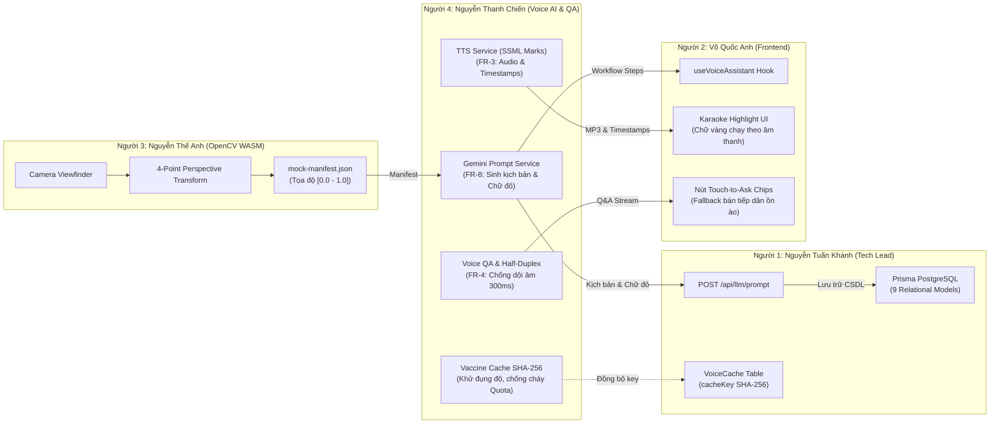

# TRUNG TÂM BÁO CÁO TIẾN ĐỘ & HOẠT ĐỘNG TOÀN DỰ ÁN AFL
## Bảng Điều Khiển Tác Chiến Đa Thành Viên (Cross-Functional Progress Dashboard)

> **Dự án:** Hệ thống Hỗ trợ Điền Biểu mẫu Thông minh & Quản trị Quy trình cho Người cao tuổi (AFL Platform)  
> **Giai đoạn:** Kết thúc Sprint 1 & Chuyển giao Tích hợp Sprint 2 (Phase 1)  
> **Cập nhật lần cuối:** 21/09/2026  

---

## 1. TỔNG QUAN PHÂN BỔ THƯ MỤC BÁO CÁO (DIRECTORY SITEMAP)

Toàn bộ các báo cáo kỹ thuật, tiến độ công việc và đề xuất nâng cấp của cả nhóm đã được phân loại độc lập theo từng thành viên và từng bước thực hiện:

```
docs/reports/
├── README.md                                 <-- Bạn đang ở đây (Dashboard tổng quan 4 người)
│
├── person-1-tech-lead/                       <-- Nguyễn Tuấn Khánh (Tech Lead / PM / Backend)
│   └── README.md                             <-- Tiến độ CSDL PostgreSQL, Prisma ORM & Kiến trúc
│
├── person-2-frontend/                        <-- Võ Quốc Anh (Frontend Specialist)
│   └── README.md                             <-- Tiến độ Giao diện Mobile, WCAG AAA, Audio Player
│
├── person-3-opencv/                          <-- Nguyễn Thế Anh (Algorithm & OpenCV Specialist)
│   └── README.md                             <-- Tiến độ Xử lý ảnh WASM, Perspective & Bounding Boxes
│
└── person-4-voice-qa/                        <-- Nguyễn Thanh Chiến (AI Voice & QA Lead)
    ├── README.md                             <-- Dashboard chi tiết tiến độ Người 4
    ├── step-01-action-plan/
    │   └── ACTION-PLAN-VOICE-QA.md           <-- [Bước 1] Kế hoạch tác chiến Sprint 1, Ma trận I/O, 11 FRs
    ├── step-02-handoff-integration/
    │   └── HANDOFF-INTEGRATION-VOICE-QA.md   <-- [Bước 2] Báo cáo bàn giao P2P & Ma trận đấu nối 3 người
    ├── step-03-ssml-timepoints/
    │   └── SSML-TIMEPOINTS-UPGRADE-REPORT.md <-- [Bước 3] Nâng cấp Google TTS SSML Marks chính xác mili-giây
    ├── step-04-cache-sha256/
    │   └── CACHE-KEY-SHA256-UPGRADE-REPORT.md<-- [Bước 4] Nâng cấp hàm băm SHA-256 & Canonicalization đệ quy
    └── step-05-sdk-deep-research/
        └── SDK-COMPARISON-DEEP-RESEARCH.md   <-- [Bước 5] Nghiên cứu sâu Google SDK vs Vercel AI SDK & Lộ trình
```

---

## 2. BẢNG MA TRẬN TIẾN ĐỘ 4 THÀNH VIÊN (TEAM PROGRESS MATRIX)

| Thành viên & Vai trò | Trách nhiệm cốt lõi | Các đầu việc đã hoàn thành | Bước công việc hiện tại | Tình trạng nghiệm thu | Thư mục báo cáo chi tiết |
| :--- | :--- | :--- | :--- | :---: | :--- |
| **Người 1: Nguyễn Tuấn Khánh**<br>*(Tech Lead & PM)* | • Kiến trúc hệ thống tổng thể<br>• CSDL PostgreSQL & Prisma<br>• Phê duyệt Pull Requests | • Thiết kế 9 models Prisma quan hệ<br>• Đồng bộ hóa môi trường `.env`<br>• Cấu hình lệnh `prisma generate` | Rà soát & Merge PR #2 và PR #3 vào `main`; chuẩn bị API lưu CSDL. | 🟢 Đúng tiến độ | [`person-1-tech-lead/`](person-1-tech-lead/README.md) |
| **Người 2: Võ Quốc Anh**<br>*(Frontend Specialist)* | • Giao diện Mobile Touch-first<br>• Tiêu chuẩn WCAG 2.1 AAA<br>• Đồng bộ Karaoke Audio UI | • Khung layout Mobile chuẩn WCAG<br>• Tích hợp dữ liệu giả lập `mock-workflow`<br>• Khung hiển thị chữ đỏ in hoa | Cắm hook `useVoiceAssistant` và đọc file `timestamps.json` để làm sáng viền ô. | 🟢 Đúng tiến độ | [`person-2-frontend/`](person-2-frontend/README.md) |
| **Người 3: Nguyễn Thế Anh**<br>*(Algorithm / OpenCV)* | • Nhận diện 4 góc phôi giấy<br>• Nắn góc xiên (Perspective)<br>• Tọa độ chuẩn hóa $[0.0 - 1.0]$ | • Chuẩn hóa hợp đồng `contracts.ts`<br>• Xuất file mẫu `mock-manifest.json`<br>• Tích hợp module `@techstark/opencv-js` | Tinh chỉnh bộ lọc Canny & `approxPolyDP` chạy mượt trên WebAssembly (WASM). | 🟢 Đúng tiến độ | [`person-3-opencv/`](person-3-opencv/README.md) |
| **Người 4: Nguyễn Thanh Chiến**<br>*(AI Voice & QA Lead)* | • Kịch bản Gemini Prompt (FR-8)<br>• Giọng đọc 0.9x & Karaoke (FR-3)<br>• Hỏi đáp Bán song công (FR-4)<br>• Kiểm toán QA 11 FRs | • Bóc tách kịch bản 9 bước tự động<br>• Nâng cấp SSML Marks mili-giây (PR #2)<br>• Nâng cấp hàm băm SHA-256 (PR #3)<br>• Nghiên cứu sâu Google SDK vs Vercel | **100% Hoàn thành Sprint 1**<br>• Voice test: 16/16 PASS<br>• Cache test: 13/13 PASS<br>• QA audit: 11/11 PASS | 💎 Hoàn tất (Sẵn sàng đấu nối) | [`person-4-voice-qa/`](person-4-voice-qa/README.md) |

---

## 3. LỘ TRÌNH ĐẤU NỐI CHÉO P2P GIỮA CÁC THÀNH VIÊN (CROSS-INTEGRATION FLOW)



---

## 4. QUY TẮC CẬP NHẬT DÀNH CHO CÁC THÀNH VIÊN KHI ĐẨY BÁO CÁO MỚI

1. **Mỗi thành viên sở hữu một thư mục riêng:**
   - Người 1: `person-1-tech-lead/`
   - Người 2: `person-2-frontend/`
   - Người 3: `person-3-opencv/`
   - Người 4: `person-4-voice-qa/`
2. **Quy ước đặt tên thư mục bước:** Đặt tên thư mục theo định dạng `step-XX-<ten-ngan-gon>/` (ví dụ: `step-01-action-plan/`).
3. **Cập nhật Dashboard:** Khi hoàn thành một bước quan trọng hoặc tạo Pull Request, thành viên cập nhật bảng tiến độ trong file `README.md` của thư mục mình và cập nhật dòng tương ứng tại file `docs/reports/README.md` này.
