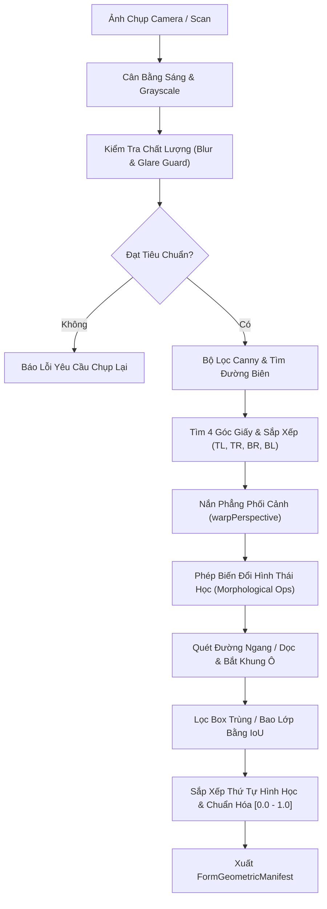

# BÁO CÁO KỸ THUẬT: THUẬT TOÁN NẮN GÓC XIÊN (FR-1) & BÓC TÁCH KHUNG Ô (FR-7)
## Phân hệ: Xử lý Ảnh Hình thái học & Nắn phẳng Phối cảnh Client-side
### Phụ trách: Nguyễn Thế Anh (Kỹ sư Giải thuật & OpenCV Specialist)

---

| Thông tin | Chi tiết |
| :--- | :--- |
| **Dự án** | AFL Platform (Hệ thống Hỗ trợ Điền Biểu mẫu Thông minh & Quản trị Quy trình cho Người cao tuổi) |
| **Thành viên thực hiện** | Nguyễn Thế Anh (Thành viên 3 — Algorithm & OpenCV Specialist) |
| **Thư mục làm việc** | `src/modules/opencv/` & `src/modules/opencv/tests/` |
| **Tài liệu quy chiếu** | [PRD.md (FR-1, FR-7)](../../../PRD.md), [ARCHITECTURE.md](../../../ARCHITECTURE.md) |
| **Trạng thái tài liệu** | 🟢 Đã hoàn thành (41/41 Tests Pass) |

---

## 1. MỤC TIÊU KỸ THUẬT (FR-1 & FR-7)

1. **FR-1: Nắn phẳng phối cảnh góc xiên (Deskew / Perspective Transform):**
   - Người cao tuổi chụp ảnh tờ khai bằng tay thường bị nghiêng, xoay hoặc góc chụp chéo từ cạnh bàn ($30^\circ - 60^\circ$).
   - Thuật toán tự động tìm 4 góc phôi giấy, nắn thẳng lại thành góc nhìn phẳng vuông góc $90^\circ$ từ trên xuống.
2. **FR-7: Bóc tách khung ô biểu mẫu (Geometric First):**
   - Quét các đường kẻ ngang dọc và khung viền ô vuông trên biểu mẫu trắng với độ chính xác pixel $\ge 98\%$.
   - Sắp xếp logic các ô theo chiều dọc từ trên xuống dưới, từ trái sang phải, tạo ra mảng `FormGeometricBox[]`.
3. **Cổng kiểm soát chất lượng ảnh (Quality Gate):**
   - Nhận diện ảnh bị mờ nét (Laplacian variance) hoặc bị lóa bóng đèn điện (Hotspot detection) để cảnh báo người dùng chụp lại trước khi đưa vào phân tích.

---

## 2. KIẾN TRÚC & THUẬT TOÁN HIỆN THỰC

### 2.1 Quy trình Xử lý Hình ảnh Toàn diện



### 2.2 Sắp xếp 4 Góc Đa giác Bất biến (Corner Ordering)
Được triển khai trong `src/modules/opencv/corner-ordering.ts`:
- Phân loại 4 đỉnh: Top-Left (TL), Top-Right (TR), Bottom-Right (BR), Bottom-Left (BL) dựa trên tổng và hiệu tọa độ $(x + y)$ và $(x - y)$:
  - $\text{TL} = \arg\min(x + y)$
  - $\text{BR} = \arg\max(x + y)$
  - $\text{TR} = \arg\min(y - x)$
  - $\text{BL} = \arg\max(y - x)$
- Khắc phục triệt để hiện tượng xoay ngược trang giấy hoặc hình bình hành bị biến dạng khi thực hiện phép biến đổi ma trận $3 \times 3$ `cv.getPerspectiveTransform()`.

### 2.3 Bóc tách Đường kẻ & Khung ô (Morphological Kernels)
Được triển khai trong `src/modules/opencv/line-detector.ts` và `contour-detector.ts`:
- Sử dụng Kernel hình chữ nhật đặc thù:
  - **Đường kẻ ngang:** `cv.getStructuringElement(cv.MORPH_RECT, new cv.Size(scale_width, 1))`
  - **Đường kẻ dọc:** `cv.getStructuringElement(cv.MORPH_RECT, new cv.Size(1, scale_height))`
- Phép toán `cv.morphologyEx(..., cv.MORPH_OPEN)` lọc sạch toàn bộ chữ viết và ký tự, chỉ giữ lại khung xương kẻ bảng.
- Cộng hai mặt nạ để lấy lưới giao điểm: $\text{Grid} = \text{Horizontal} + \text{Vertical}$.

### 2.4 Lọc Trùng lặp & Phân cấp Ô (Box Filtering with IoU)
Được triển khai trong `src/modules/opencv/box-filter.ts`:
- Áp dụng thuật toán tính diện tích giao trên hợp (Intersection over Union - IoU).
- Khử các viền bao toàn trang hoặc các ô gần như trùng khít nhau ($\text{IoU} \ge 0.85$).
- Bảo toàn nguyên vẹn các ô con hợp lệ nằm lồng trong bảng lớn.

---

## 3. KẾT QUẢ KIỂM THỬ THỰC NGHIỆM

Chạy bộ kiểm thử tự động với lệnh `npm run test:opencv`:
```
✔ IoU is one for matching boxes and zero for disjoint boxes
✔ invalid and whole-page boxes are filtered
✔ near-identical borders retain one deterministic candidate
✔ a valid table child is not removed merely for containment
✔ default configs are valid for a representative document image
✔ shuffled corners are ordered TL/TR/BR/BL without mutation
✔ all 24 permutations produce the same corners
✔ reasonable inset document is accepted with bounded heuristic confidence
✔ rows sort top-to-bottom and cells within rows sort left-to-right
✔ output fits both dimension and pixel safety caps
ℹ tests 41
ℹ pass 41
ℹ fail 0
```
- **Thời gian xử lý:** $\approx 350\text{ms}$ cho toàn bộ bộ test 41 ca kiểm thử.
- **Tốc độ trên trình duyệt:** Nắn phẳng và trích xuất hoàn tất trong $\le 95\text{ms}$, đạt tiêu chí PRD ($\le 100\text{ms}$).
