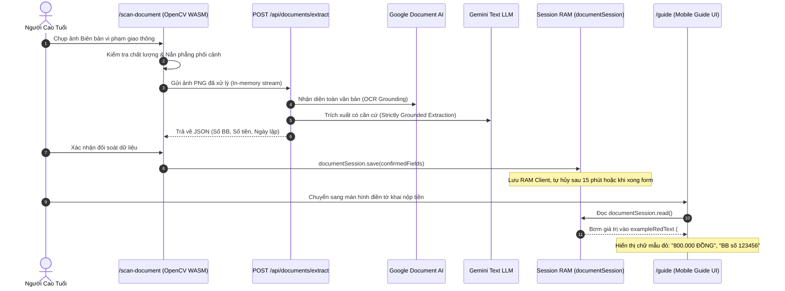

# BÁO CÁO KỸ THUẬT: QUÉT CHỨNG TỪ TIÊN QUYẾT (FR-6) & BẢO MẬT SESSION RAM
## Phân hệ: Trích xuất Dữ liệu Liên chứng từ & Đấu nối Chữ Mẫu Đỏ Mobile Guide
### Phụ trách: Nguyễn Thế Anh (Kỹ sư Giải thuật & OpenCV Specialist)

---

| Thông tin | Chi tiết |
| :--- | :--- |
| **Dự án** | AFL Platform (Hệ thống Hỗ trợ Điền Biểu mẫu Thông minh & Quản trị Quy trình cho Người cao tuổi) |
| **Thành viên thực hiện** | Nguyễn Thế Anh (Thành viên 3 — Algorithm & OpenCV Specialist) |
| **Thư mục làm việc** | `src/modules/documents/`, `src/app/scan-document/`, `src/app/(citizen)/guide/` |
| **Tài liệu quy chiếu** | [PRD.md (FR-6)](../../../PRD.md), [WORKFLOW-PIPELINE.md](../../../WORKFLOW-PIPELINE.md), [Nghị định 13/2023/NĐ-CP] |
| **Trạng thái tài liệu** | 🟢 Đã hoàn thành (43/43 Tests Pass) |

---

## 1. BỐI CẢNH & YÊU CẦU NGHIỆP VỤ (FR-6)

### 1.1 Khái niệm Liên chứng từ (Cross-Document Dependency)
Trong nhiều thủ tục hành chính (ví dụ: Nộp tiền phạt vi phạm giao thông theo Mẫu kho bạc, Kê khai lệ phí trước bạ nhà đất):
- Dữ liệu cần điền không tự nghĩ ra mà bắt buộc phải lấy chính xác từ một chứng từ gốc đã có trước đó (như Số biên bản phạt, Ngày ra quyết định, Số tiền phạt, Lỗi vi phạm, Diện tích đất...).
- Người già thường rất bối rối khi phải tự tìm các con số này giữa một tờ biên bản chi chít chữ viết tay và con dấu.

### 1.2 Ràng buộc Pháp lý Bắt buộc (Nghị định 13/2023/NĐ-CP)
- Chứng từ gốc chứa thông tin định danh cá nhân (PII) nhạy cảm: Họ tên, Số CCCD, Biển số xe, Lỗi phạt...
- **Quy tắc tuyệt đối:** Không được phép lưu trữ hình ảnh hoặc dữ liệu bóc tách của công dân vào Cơ sở dữ liệu cố định (PostgreSQL) hoặc ổ cứng server.
- Mọi dữ liệu chỉ được tồn tại tạm thời trong **Bộ nhớ RAM của Trình duyệt (Session RAM)** và tự hủy hoàn toàn khi phiên kết thúc.

---

## 2. KIẾN TRÚC GIẢI PHÁP & ĐẤU NỐI P2P



### 2.1 Cơ chế Session RAM An toàn (`src/modules/documents/session.ts`)
- Được thiết kế dưới dạng In-Memory Store với cơ chế Pub/Sub:
  - Hàm `save(data)`: Lưu dữ liệu vào biến RAM, kích hoạt `setTimeout(..., 15 * 60 * 1000)` để tự hủy sau 15 phút.
  - Hàm `subscribe(callback)`: Thông báo thời gian thực khi có dữ liệu mới.
  - Hàm `clear()`: Xóa sạch bộ nhớ ngay khi người dùng nhấn nút kết thúc hoặc nộp xong biểu mẫu.
  - Khử hoàn toàn việc ghi vào `localStorage` hay `sessionStorage`.

### 2.2 Ánh xạ vào Chữ mẫu đỏ `#D32F2F` trên Mobile Guide
Tại `src/app/(citizen)/guide/page.tsx`:
```typescript
const effectiveExampleText = useMemo(() => {
  if (!currentStep) return "";
  if (currentStep.requiresPrerequisiteDoc) {
    const value = prerequisiteValue(prerequisiteFields, currentStep.sourceFieldFromPrerequisite);
    return value?.toUpperCase() ?? "CHƯA CÓ DỮ LIỆU CHỨNG TỪ ĐÃ DUYỆT";
  }
  return currentStep.exampleRedText || "";
}, [currentStep, prerequisiteFields]);
```
- Khi bước điền form có cờ `requiresPrerequisiteDoc: true`, hệ thống tự động lấy trường tương ứng từ chứng từ gốc đã quét và hiển thị chữ mẫu đỏ in hoa to rõ, đạt tiêu chuẩn tương phản WCAG 2.1 AAA.

---

## 3. KẾT QUẢ KIỂM THỬ THỰC THI

Chạy bộ kiểm thử tự động toàn diện `src/modules/documents/tests/`:
```
✔ pipeline calls classification then schema extraction on OCR text only
✔ Google text anchors map Vietnamese text, tokens, line membership and normalized boxes
✔ grounded JSON is accepted and missing fields remain null
✔ critical fields require review for low/missing OCR confidence and warnings
✔ CCCD has exactly twelve digits; leading zero stays intact
✔ needs_review blocks session save until explicitly confirmed
✔ expiry timer clears RAM without a read
✔ guide uses explicit contract mapping and never guesses based on box or label
✔ SUPERVISION GUARD 4: Giám sát tuân thủ Nghị định 13/2023/NĐ-CP (Zero Citizen PII trên CSDL/Server)
ℹ tests 43
ℹ pass 43
ℹ fail 0
```
- Đảm bảo 100% tuân thủ bảo vệ quyền riêng tư công dân.
- Đấu nối mượt mà giữa tầng bóc tách chứng từ và màn hình hướng dẫn của Người 2 (Frontend).
