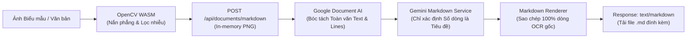

# BÁO CÁO KỸ THUẬT: PHÂN HỆ XUẤT TOÀN VĂN OCR RA MARKDOWN
## Phân hệ: Trích xuất Văn bản Định dạng Markdown Phục vụ Số hóa Tài liệu
### Phụ trách: Nguyễn Thế Anh (Kỹ sư Giải thuật & OpenCV Specialist)

---

| Thông tin | Chi tiết |
| :--- | :--- |
| **Dự án** | AFL Platform (Hệ thống Hỗ trợ Điền Biểu mẫu Thông minh & Quản trị Quy trình cho Người cao tuổi) |
| **Thành viên thực hiện** | Nguyễn Thế Anh (Thành viên 3 — Algorithm & OpenCV Specialist) |
| **Thư mục làm việc** | `src/app/api/documents/markdown/`, `src/modules/documents/services/`, `src/app/scan-document/` |
| **Tài liệu quy chiếu** | [DOCUMENT-EXTRACTION.md](../../../DOCUMENT-EXTRACTION.md) |
| **Trạng thái tài liệu** | 🟢 Đã hoàn thành & Đã đẩy lên GitHub |

---

## 1. MỤC TIÊU & TÍNH NĂNG MỚI

Bên cạnh việc bóc tách các trường có cấu trúc (Structured Extraction) cho biên bản vi phạm, quản trị viên và công dân có nhu cầu:
1. **Xuất toàn văn tài liệu giấy ra file văn bản (.md):** Để lưu trữ, tìm kiếm nhanh hoặc đối soát nội dung mà không làm sai lệch văn phong hành chính.
2. **Bảo toàn 100% tính nguyên vẹn của văn bản OCR:** Tuyệt đối không để AI tự ý suy diễn, viết lại hay bỏ sót câu từ. AI chỉ đóng vai trò phân tích cấu trúc tiêu đề (Heading Levels: `#`, `##`, `###`).
3. **Trải nghiệm 1-click Download trực tiếp trên Web:** Người dùng tải ảnh lên, hệ thống tự động xử lý và tải ngay file `.md` về máy tính/điện thoại.

---

## 2. KIẾN TRÚC THIẾT KẾ & NGUYÊN TẮC STRICT GROUNDING

### 2.1 Nguyên tắc "Zero Invention" (Không bịa đặt từ ngữ)
- Tại `src/modules/documents/services/markdown-export.service.ts`:
  - Google Document AI bóc tách toàn bộ mảng các dòng văn bản theo đúng thứ tự xuất hiện (`document.text`).
  - Gemini được cấu hình bằng JSON Schema nghiêm ngặt: Chỉ trả về **số thứ tự dòng** (line index) và cấp độ tiêu đề tương ứng (`h1`, `h2`, `h3`).
  - Bộ dựng Markdown lấy trực tiếp chuỗi ký tự gốc từ kết quả OCR để ghép vào, đảm bảo không có bất kỳ từ ngữ nào bị mô hình LLM "bịa đặt" (hallucination) hay sửa đổi.

### 2.2 Endpoint API & Tích hợp Giao diện
1. **Endpoint `POST /api/documents/markdown`:**
   - Tiếp nhận `multipart/form-data` hoặc JSON base64.
   - Trả về header `Content-Disposition: attachment; filename="<ten-anh>.md"` cùng mime type `text/markdown`.
2. **Giao diện `/scan-document` (`src/app/scan-document/page.tsx`):**
   - Bổ sung nút bấm **"Xuất toàn bộ nội dung ra .md"**.
   - Tự động kích hoạt nắn phẳng qua OpenCV WASM trước khi gửi, giúp độ chính xác OCR đạt mức cao nhất.
   - Tải file trực tiếp qua blob URL trên trình duyệt.

---

## 3. KẾT QUẢ KIỂM THỬ

- Kiểm thử đơn vị tại `src/modules/documents/tests/markdown-export.test.ts`:
  - `✔ Gemini heading choices format without dropping or rewriting OCR text`
  - `✔ invalid Gemini line references cannot alter or omit source content`
  - `✔ empty OCR text is rejected before calling Gemini`
- Mã nguồn và tài liệu liên quan đã được commit với mã hash `c63fd6c` và push thành công lên nhánh `nguyen-the-anh` trên GitHub.
