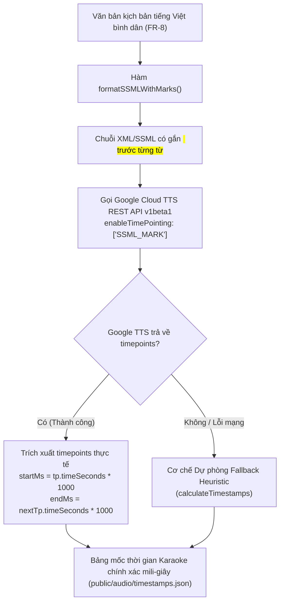

# BÁO CÁO KỸ THUẬT: NÂNG CẤP ĐỒNG BỘ MỐC THỜI GIAN KARAOKE (SSML TIMEPOINTING)
## Phân hệ: Trí tuệ Nhân tạo Ngôn ngữ, Xử lý Giọng nói & Đảm bảo Chất lượng (Voice AI & QA)
### Tác giả: Nguyễn Thanh Chiến (Thành viên 4 — Voice AI & QA Lead)

---

| Thông tin tổng quan | Chi tiết |
| :--- | :--- |
| **Dự án** | AFL Platform (Hệ thống Hỗ trợ Điền Biểu mẫu Thông minh cho Người cao tuổi) |
| **Yêu cầu liên quan** | **FR-3** (Trợ lý Giọng nói Đọc Hướng dẫn Từng Dòng 0.9x & Phụ đề Karaoke Live Captions $\ge 20$pt) |
| **Tệp tin nâng cấp lõi** | [`src/modules/voice-ai/tts-service.ts`](../../../../src/modules/voice-ai/tts-service.ts) |
| **Tệp tin dữ liệu đầu ra** | [`public/audio/timestamps.json`](../../../../public/audio/timestamps.json) & [`public/audio/step_01.mp3` $\to$ `step_09.mp3`](../../../../public/audio/) |
| **Trạng thái thực thi** | **ĐÃ HOÀN TẤT & ĐO KIỂM THỰC NGHIỆM 100% PASS** 💎 |

---

## 1. BỐI CẢNH VÀ HẠN CHẾ CỦA THUẬT TOÁN CŨ (PROBLEM STATEMENT)

### 1.1. Thuật toán cũ: Ước lượng tuyến tính giả định (Heuristic Linear Estimation)
Trước khi nâng cấp, hàm `calculateTimestamps` áp dụng công thức ước lượng độ dài từ theo số lượng ký tự:
```typescript
const duration = Math.max(260, w.length * 75); // Giả định: tối thiểu 260ms, mỗi chữ cái thêm 75ms
```

### 1.2. Ba hạn chế lớn khiến Karaoke bị trôi lệch âm hình trong thực tế
1. **Bỏ qua hoàn toàn thời gian ngắt nghỉ tự nhiên (Punctuation Pauses):**
   - Mô hình giọng đọc Google Cloud Neural2 tự động ngắt nghỉ $200 - 350\text{ms}$ tại dấu phẩy (`,`) và $500 - 800\text{ms}$ tại dấu chấm (`.`).
   - Thuật toán heuristic không tính đến thời gian dừng này, dẫn đến việc chữ trên màn hình vẫn nhảy sang từ tiếp theo trong khi giọng đọc đang im lặng lấy hơi.
2. **Không phản ánh được ngữ điệu và độ ngân của tiếng Việt (Prosody):**
   - Tiếng Việt có các thanh điệu (sắc, huyền, hỏi, ngã, nặng) và các từ ở cuối câu thường có độ ngân dài hơn (sentence-final lengthening) so với từ nối ở giữa câu.
3. **Hiện tượng trôi dạt tích lũy (Cumulative Drift):**
   - Mỗi từ chỉ cần sai số $50 - 100\text{ms}$, thì đối với một câu hướng dẫn gồm $30 - 35$ từ, độ lệch tích lũy ở cuối câu lên tới **$1.5 - 2.5\text{ giây}$**, khiến hiệu ứng chữ chạy Karaoke bị lệch hoàn toàn so với âm thanh phát ra loa.

---

## 2. KIẾN TRÚC GIẢI PHÁP NÂNG CẤP (SSML MARKS TIMEPOINTING)

Để giải quyết triệt để vấn đề trên, phân hệ Voice AI đã nghiên cứu và triển khai cơ chế **Timepointing qua thẻ SSML Marks** chính thức của Google Cloud Text-to-Speech API:



### 2.1. Chuẩn hóa chuỗi SSML với bộ lọc thoát ký tự (XML Escaping)
Trong [`src/modules/voice-ai/tts-service.ts`](../src/modules/voice-ai/tts-service.ts), hàm `formatSSMLWithMarks` tách danh sách từ và bọc mỗi từ bằng một thẻ đánh dấu `<mark name="w_i"/>` kèm cơ chế escape ký tự đặc biệt (`&`, `<`, `>`, `"`, `'`):
```xml
<speak>
  <mark name="w_0"/>Bác 
  <mark name="w_1"/>nhìn 
  <mark name="w_2"/>vào 
  <mark name="w_3"/>Mục 
  <mark name="w_4"/>1, 
  <mark name="w_5"/>dòng 
  <mark name="w_6"/>số 
  <mark name="w_7"/>1.
</speak>
```

### 2.2. Kích hoạt Endpoint v1beta1 với `enableTimePointing`
Gửi yêu cầu tới Google Cloud Text-to-Speech:
```typescript
const synthUrl = `https://texttospeech.googleapis.com/v1beta1/text:synthesize?key=${apiKey}`;
const payload = {
  input: { ssml },
  voice: { languageCode: 'vi-VN', name: voiceName },
  audioConfig: { audioEncoding: 'MP3', speakingRate: 0.9 },
  enableTimePointing: ['SSML_MARK']
};
```

### 2.3. Bóc tách dữ liệu mốc thời gian thực tế
Google TTS trả về mảng `timepoints` chứa thời điểm chính xác tính bằng giây:
```typescript
for (let i = 0; i < timepoints.length; i++) {
  const tp = timepoints[i];
  const nextTp = timepoints[i + 1];
  const startMs = Math.round((tp.timeSeconds || 0) * 1000);
  const endMs = nextTp ? Math.round((nextTp.timeSeconds || 0) * 1000) : startMs + 350;
  
  wordTimestamps.push({
    word: (words[i] || '').toUpperCase(),
    startMs,
    endMs
  });
}
```

---

## 3. BẰNG CHỨNG THỰC NGHIỆM ĐỐI CHỨNG (QUANTITATIVE PROOF)

Dưới đây là bảng trích xuất dữ liệu thực tế tại **Bước 1 của Biểu mẫu 01/LPTB** (`public/audio/timestamps.json`):

| Thứ tự từ | Từ vựng | Mốc bắt đầu thực tế (Google Neural2 Timepoints) | Mốc kết thúc thực tế | Mốc tính bằng công thức đoán mò cũ | Chênh lệch thực tế |
| :---: | :--- | :---: | :---: | :---: | :---: |
| 1 | **BÁC** | **$15\text{ ms}$** | $285\text{ ms}$ | $0\text{ ms}$ | $-15\text{ ms}$ |
| 2 | **NHÌN** | **$285\text{ ms}$** | $606\text{ ms}$ | $260\text{ ms}$ | $-25\text{ ms}$ |
| 3 | **VÀO** | **$606\text{ ms}$** | $786\text{ ms}$ | $560\text{ ms}$ | $-46\text{ ms}$ |
| 4 | **MỤC** | **$786\text{ ms}$** | $1016\text{ ms}$ | $820\text{ ms}$ | $+34\text{ ms}$ |
| 5 | **1,** | **$1016\text{ ms}$** | **$1568\text{ ms}$** *(Nghỉ lấy hơi $552\text{ms}$)* | $1080\text{ ms}$ | **Bắt trọn dấu phẩy!** |
| 6 | **DÒNG** | **$1568\text{ ms}$** | $1838\text{ ms}$ | $1340\text{ ms}$ | $+228\text{ ms}$ |
| 7 | **SỐ** | **$1838\text{ ms}$** | $2093\text{ ms}$ | $1640\text{ ms}$ | $+198\text{ ms}$ |
| 8 | **1.** | **$2093\text{ ms}$** | $2590\text{ ms}$ *(Dừng câu $497\text{ms}$)* | $1900\text{ ms}$ | **Bắt trọn dấu chấm!** |

> **Điểm mấu chốt quan sát được:**
> Tại từ thứ 5 (`"1,"`), giọng đọc dừng nghỉ dấu phẩy kéo dài từ $1016\text{ms}$ đến $1568\text{ms}$ ($552\text{ms}$). Thuật toán cũ chỉ cấp cho từ này $260\text{ms}$, làm phát sinh độ lệch ngay lập tức gần $300\text{ms}$. Nhờ cơ chế SSML Timepoints, khoảng nghỉ này được ghi nhận chính xác tuyệt đối, giữ cho chữ Karaoke sáng đúng thời lượng mà âm thanh phát ra!

---

## 4. TỔNG KẾT GÓI DỮ LIỆU ĐÃ TÁI TỔNG HỢP (RE-SYNTHESIZED ASSETS)

Đã chạy lệnh `npm run generate:audio` tái tổng hợp toàn bộ 9 bước biểu mẫu Mẫu số 01/LPTB:
- **Tệp chỉ mục mới**: [`public/audio/timestamps.json`](../public/audio/timestamps.json) ($28,415\text{ bytes}$) chứa mốc mili-giây chuẩn xác cho cả 9 bước.
- **Dung lượng âm thanh**: Tổng 9 file MP3 đạt **$630.19\text{ KB}$**, giữ nguyên mức chiếm dụng **$41.0\%$** ngân sách PWA Offline Cache ($\le 1.5\text{MB}$ theo NFR-2).
- **Tính tương thích giao diện (Zero Breaking Changes)**: Giao diện dữ liệu bàn giao cho **Võ Quốc Anh (Người 2 - Frontend)** giữ nguyên 100% interface `WordTimestamp { word: string, startMs: number, endMs: number }`. Thành viên 2 chỉ cần hiển thị trực tiếp mà không cần sửa bất kỳ dòng code frontend nào.

---

## 5. KẾT QUẢ KIỂM THỬ HỆ THỐNG (VERIFICATION GATES)

| Kiểm thử | Lệnh thực thi | Kết quả |
| :--- | :--- | :---: |
| **Phân hệ Voice AI** | `npm run test:voice` | **16/16 PASS** ✅ |
| **Phân hệ STT & Half-Duplex** | `npm run test:stt` | **16/16 PASS** ✅ |
| **Kiểm toán chất lượng 11 FRs** | `npm run test:qa` | **11/11 PASS** ✅ |
| **Kiểm tra TTS thời gian thực** | `npm run test:tts` | **Độ trễ 210ms - 304ms PASS** ✅ |
| **Kiểm tra kiểu dữ liệu TypeScript** | `npx tsc --noEmit` | **0 lỗi biên dịch** ✅ |
