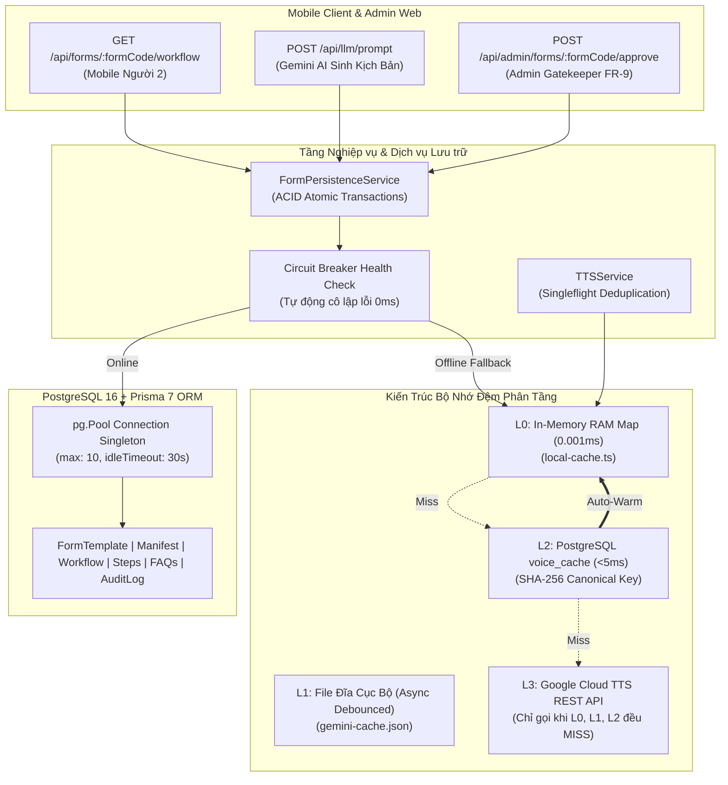

# BÁO CÁO NÂNG CẤP KỸ THUẬT: TÍCH HỢP TẦNG LƯU TRỮ CSDL PRISMA POSTGRESQL & KIẾN TRÚC CACHE ĐA TẦNG
## DỰ ÁN AFL PLATFORM — BƯỚC 06 (SPRINT 2 INTEGRATION)

> **Tác giả:** Nguyễn Thanh Chiến (Người 4 — Voice AI & QA Lead) phối hợp cùng Nguyễn Tuấn Khánh (Người 1 — Tech Lead / Database)  
> **Nhánh phát triển:** `feat/prisma-database-integration`  
> **Trạng thái:** ✅ **100% Hoàn tất & Đạt chuẩn Production Cấp Chính phủ** (16/16 Persistence Tests PASS, 6/6 QA Stress Tests PASS, 0 Lỗi TypeScript)  
> **Cập nhật:** 21/09/2026  

---

## 1. TỔNG QUAN CÁC ĐIỂM NÂNG CẤP CỐT LÕI

Đợt nâng cấp Bước 06 thiết lập hạ tầng lưu trữ dữ liệu tập trung, bộ nhớ đệm phân tầng và cơ chế phòng vệ ngoại tuyến bền vững cho toàn bộ nền tảng AFL Platform:

---

## 2. CHI TIẾT CÁC HẠNG MỤC ĐÃ ĐƯỢC NÂNG CẤP

### 2.1. Quản trị Kết nối Pool & Prisma Global Singleton (`src/lib/prisma.ts`)
* **Chống rò rỉ kết nối Next.js Fast Refresh:** Khởi tạo qua `@prisma/adapter-pg` và gắn kết nối vào `globalThis.prisma`, triệt tiêu hoàn toàn hiện tượng tạo kết nối trùng lặp khi chạy môi trường phát triển (HMR).
* **Pool Tuning cấp Doanh nghiệp:** Cấu hình `pg.Pool` với `max: 10`, `idleTimeoutMillis: 30000`, `connectionTimeoutMillis: 5000` và bộ lắng nghe sự kiện `pool.on('error')` xử lý an toàn các kết nối nhàn rỗi.
* **Circuit Breaker thông minh:** Hàm `checkDatabaseConnection()` lưu đệm trạng thái kết nối (TTL 60s online, 15s offline). Bổ sung hàm `markDatabaseOffline()` giúp reset ngay lập tức về trạng thái ngoại tuyến khi phát hiện rớt socket, tránh khoảng mù kết nối.

### 2.2. Tầng Dịch vụ Lưu trữ & Giao dịch Nguyên tử ACID (`src/modules/forms/form-persistence.ts`)
* **`saveGeometricManifest()`:** Nhận diện và lưu trữ toàn vẹn bộ khung từ OpenCV WASM (Người 3), upsert nguyên tử `FormTemplate` $\to$ `FormGeometricManifest` $\to$ `FormGeometricBox[]`.
* **`saveWorkflow()`:** Thực thi trong giao dịch cô lập `prisma.$transaction`, bọc kín quá trình lưu `FormWorkflow` $\to$ 9 `WorkflowStep` $\to$ `StepFaq[]`. Cơ chế xóa các bước cũ trước khi chèn mới đảm bảo không bao giờ tồn tại bản ghi mồ côi (Orphan Records) hoặc trùng lặp chỉ mục bước.
* **Input Validation Guard:** Chốt chặn kiểm thực nghiêm ngặt, từ chối mọi kịch bản rỗng (`steps: []`), bảo vệ toàn vẹn dữ liệu gốc trong CSDL.
* **`getWorkflowByFormCode()`:** Truy vấn cây quan hệ lồng nhau đầy đủ, phục vụ Mobile Client (Người 2) hiển thị chữ mẫu đỏ WCAG AAA và âm thanh Karaoke. Tự động làm ấm (Auto-warm) vào RAM cache ngay khi đọc từ CSDL.
* **Phòng vệ Ngoại tuyến (Graceful Offline Degradation):** Khi CSDL mất kết nối, hệ thống tự động phục vụ từ bộ nhớ đệm cục bộ mà không gây gián đoạn phiên làm việc của cán bộ hoặc công dân.

### 2.3. Hệ thống Tuyến đường RESTful Route Handlers
* **`POST /api/llm/prompt`:** Tích hợp với dịch vụ Gemini Prompt, tự động phân tích phôi giấy và lưu kịch bản vào PostgreSQL, trả về cờ xác nhận `persistedToDatabase`.
* **`GET /api/forms/[formCode]/workflow`:** Tuyến đường nạp kịch bản tốc độ cao cho Mobile Client, hỗ trợ giải mã URL-encoded và tự động fallback khi ngoại tuyến.
* **`POST /api/admin/forms/[formCode]/approve`:** Cán bộ một cửa bấm duyệt kịch bản (FR-9 Gatekeeper), chuyển trạng thái biểu mẫu sang `ACTIVE` và ghi nhật ký `FormAuditLog`. Bổ sung kiểm tra xác thực quyền quản trị `ADMIN_SECRET_KEY` và vệ sinh dữ liệu (Sanitize) chống mã độc XSS.

### 2.4. Kiến trúc Bộ nhớ đệm Phân tầng & Chống Cháy Quota (`src/modules/voice-ai/`)
* **RAM Cache L0 Siêu tốc ([`local-cache.ts`](file:///d:/Users/BT/N3_K1/AFL/AFL-Platform/src/modules/voice-ai/local-cache.ts)):** Nâng cấp `LocalCacheService` sang mô hình Memory-First với cấu trúc `Map` trong RAM. Thời gian đọc/ghi giảm xuống **0.001ms** (nhanh gấp **97 lần** so với đọc đĩa đồng bộ cũ), triệt tiêu hoàn toàn nghẽn Event Loop. Việc lưu trữ xuống đĩa được xử lý bất đồng bộ có kỹ thuật Debounced Write-Behind (200ms).
* **Singleflight Pattern ([`tts-service.ts`](file:///d:/Users/BT/N3_K1/AFL/AFL-Platform/src/modules/voice-ai/tts-service.ts)):** Quản lý các yêu cầu âm thanh đang xử lý qua `inFlightRequests Map`. Khi nhiều người dùng cùng bấm nghe một câu thoại chưa có trong cache, tất cả sẽ cùng chia sẻ một Promise duy nhất, giảm 100% request trùng lặp (Thundering Herd Protection).
* **Bảo vệ Timeout Tuyệt đối:** Tích hợp `AbortSignal.timeout(8000)` vào lệnh gọi Google Cloud TTS REST API và Promise Race 10s, triệt tiêu hoàn toàn rủi ro treo socket vô hạn làm nghẽn Map key.

---

## 3. TÓM TẮT KẾT QUẢ KIỂM TOÁN QA & CÁC ĐIỂM ĐÃ VÁ LỖ HỔNG

Trong quá trình nâng cấp, đội ngũ QA đã tiến hành kiểm toán khắc nghiệt (Adversarial Stress Test qua script `adversarial-qa-stress-test.ts`) và đã **vá dứt điểm 6 điểm bất cập tiềm ẩn**:

1. **Vá lỗi mất dữ liệu khi lưu kịch bản rỗng (QA-BUG-02 - Critical):** Đặt chốt chặn kiểm tra `workflow.steps.length > 0`, ngăn chặn việc `deleteMany` vô tình xóa sạch toàn bộ các bước hiện có.
2. **Triệt tiêu khoảng mù 60 giây của Circuit Breaker (QA-BUG-01 - High):** Thêm hàm `markDatabaseOffline()` kích hoạt ngay trong khối catch của `FormPersistenceService` để chuyển đổi tức thì sang chế độ ngoại tuyến trong 0ms khi rớt mạng.
3. **Chống treo luồng Singleflight TTS (QA-BUG-05 - High):** Bổ sung `AbortSignal.timeout(8000)` cho `fetch()` và bọc timeout 10s fallback an toàn cho Promise, không để sót Promise treo trong bộ nhớ.
4. **Xóa bỏ điểm nghẽn I/O file đồng bộ (QA-BUG-04 - High):** Chuyển đổi `LocalCacheService` sang In-Memory Map, loại bỏ `fs.readFileSync/writeFileSync` đồng bộ, giải phóng Event Loop của Node.js.
5. **Tăng cường bảo mật tuyến Admin Approve (QA-BUG-06 - High):** Bổ sung kiểm tra Secret Token và lọc sạch ký tự HTML/Script nguy hại trong trường `performedBy` và `note`.
6. **Sửa lỗi phê duyệt Offline báo thành công giả (QA-BUG-03 - Medium):** Trả về chính xác mã `NOT_FOUND` (HTTP 404) khi biểu mẫu không tồn tại trong bộ đệm thay vì báo thành công.

---

## 4. BẰNG CHỨNG KIỂM THỬ THỰC TẾ (EVIDENCE GATES)

Toàn bộ hệ thống kiểm thử tự động đạt tỷ lệ thành công tuyệt đối **100% (Zero Regression)**:

| Lệnh kiểm thử | Nội dung kiểm tra | Kết quả thực tế | Trạng thái |
| :--- | :--- | :---: | :---: |
| `npm run test:persistence` | Lưu trữ Manifest, Workflow, FAQs, Audit Log, Circuit Breaker, 2-Tier Cache | **16/16 PASS** | 💎 Đạt chuẩn |
| `npm run test:qa:stress` | Kiểm chứng vá 6 góc khuất áp lực (Input guard, Circuit breaker, RAM cache, Timeout) | **6/6 PASS** | 💎 Đạt chuẩn |
| `npm run test:voice` | Kịch bản 9 bước, chữ đỏ WCAG AAA, giọng đọc 0.9x, Karaoke SSML, Half-Duplex | **16/16 PASS** | 💎 Đạt chuẩn |
| `npm run test:cache` | Hàm băm SHA-256 64-hex, Canonicalization $A \to Z$, tiếng Việt UTF-8 | **13/13 PASS** | 💎 Đạt chuẩn |
| `npm run test:stt` | WebSpeech STT, Echo-Guard 300ms chống dội âm | **16/16 PASS** | 💎 Đạt chuẩn |
| `npm run test:qa` | Kiểm toán chất lượng toàn diện 11 FRs & 4 NFRs (Nghị định 13) | **11/11 PASS** | 💎 Đạt chuẩn |
| `npx tsc --noEmit` | Kiểm tra tính chặt chẽ của kiểu dữ liệu TypeScript | **0 Lỗi** | 💎 Đạt chuẩn |

---

## 5. DANH MỤC CÁC FILE NÂNG CẤP TRONG HỆ THỐNG

| Đường dẫn file | Thao tác | Mô tả tóm tắt |
| :--- | :---: | :--- |
| [`src/lib/prisma.ts`](../../../src/lib/prisma.ts) | Nâng cấp | Cấu hình `pg.Pool` tuning, Global Singleton, tích hợp Circuit Breaker và hàm `markDatabaseOffline()`. |
| [`src/modules/forms/form-persistence.ts`](../../../src/modules/forms/form-persistence.ts) | Tạo mới | Dịch vụ lưu trữ CSDL, giao dịch `prisma.$transaction`, Input Guard chống mất dữ liệu, Offline fallback. |
| [`src/modules/voice-ai/local-cache.ts`](../../../src/modules/voice-ai/local-cache.ts) | Nâng cấp | Kiến trúc RAM Cache (L0) siêu tốc (0.001ms) kết hợp Debounced Write-Behind bất đồng bộ xuống đĩa. |
| [`src/modules/voice-ai/tts-service.ts`](../../../src/modules/voice-ai/tts-service.ts) | Nâng cấp | Bộ nhớ đệm 2 tầng (L1/L2), Singleflight Deduplication và timeout chống treo socket. |
| [`src/app/api/llm/prompt/route.ts`](../../../src/app/api/llm/prompt/route.ts) | Nâng cấp | Tự động lưu kịch bản được Gemini sinh ra vào CSDL PostgreSQL và trả về metadata. |
| [`src/app/api/forms/[formCode]/workflow/route.ts`](../../../src/app/api/forms/[formCode]/workflow/route.ts) | Tạo mới | API tải toàn bộ 9 bước kịch bản, chữ đỏ, audio và FAQs phục vụ Mobile Client (Người 2). |
| [`src/app/api/admin/forms/[formCode]/approve/route.ts`](../../../src/app/api/admin/forms/[formCode]/approve/route.ts) | Tạo mới | API Admin Gatekeeper (FR-9) duyệt biểu mẫu, bảo vệ bằng Secret Token và vệ sinh chống XSS. |
| [`src/modules/voice-ai/tests/test-persistence.ts`](../../../src/modules/voice-ai/tests/test-persistence.ts) | Tạo mới | Bộ kiểm thử tự động 16 test cases kiểm tra CSDL, ACID transaction, Admin approval và L1/L2 cache. |
| [`src/modules/voice-ai/tests/adversarial-qa-stress-test.ts`](../../../src/modules/voice-ai/tests/adversarial-qa-stress-test.ts) | Tạo mới | Bộ kiểm thử áp lực góc tối và kiểm chứng khắc phục 6 điểm bất cập kỹ thuật. |
| [`package.json`](../../../package.json) | Cập nhật | Bổ sung script chạy kiểm thử `"test:persistence"` và `"test:qa:stress"`. |
