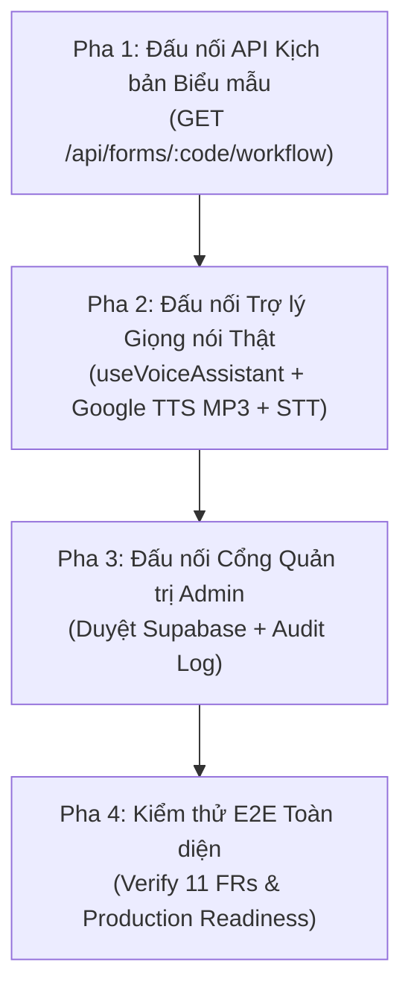

# BẢN KẾ HOẠCH HÀNH ĐỘNG: ĐẤU NỐI ĐỒNG BỘ FRONTEND VÀ BACKEND API
## DỰ ÁN AFL PLATFORM — GIAI ĐOẠN KHỚP NỐI TRỰC TIẾP (P2P WIRING & PRODUCTION INTEGRATION)

> **Tác giả:** Nguyễn Thanh Chiến (Người 4 — Voice AI & QA Lead)  
> **Thời điểm lập:** 27/09/2026  
> **Mục tiêu:** Chuyển dịch toàn bộ phân hệ Frontend từ dữ liệu giả lập (Mock Data & LocalStorage) sang kết nối trực tiếp với hệ thống Backend API thật, CSDL Supabase PostgreSQL và AI Services (Gemini Flash & Google Cloud TTS).

---

## 1. PHÂN TÍCH THỰC TRẠNG HIỆN TẠI (CURRENT STATE & GAP ANALYSIS)

### 1.1. Hiện trạng Phân hệ Backend & AI (Người 1 & Người 4)
* **CSDL Supabase Cloud:** Đang hoạt động `🟢 ONLINE`, đã đồng bộ 9 bảng models Prisma.
* **Hệ thống API đã sẵn sàng sản xuất:**
  * `GET /api/forms/[formCode]/workflow`: Truy vấn kịch bản 9 bước, tọa độ bounding box chuẩn hóa `[0.0 - 1.0]`, chữ mẫu đỏ in hoa và danh sách câu hỏi FAQs từ Supabase.
  * `POST /api/tts`: Tổng hợp giọng đọc tiếng Việt 0.9x Neural2 (Bắc/Nam), trả về file MP3 thật và mốc thời gian Karaoke mili-giây.
  * `POST /api/llm/qa`: Tiếp nhận câu hỏi âm thanh/văn bản của người dân, Gemini Flash trả lời súc tích $\le 40$ từ theo đúng ngữ cảnh bước đang điền.
  * `POST /api/admin/forms/[formCode]/approve`: Chốt duyệt kịch bản, chuyển trạng thái sang `ACTIVE` và ghi nhật ký `FormAuditLog`.
  * `POST /api/llm/prompt`: Tiếp nhận Manifest từ OpenCV, Gemini Flash tự động sinh câu thoại bình dân.
* **Bộ kiểm thử tự động:** `npm run test:local` và `npm run test:persistence` đạt **100% PASS**.

### 1.2. Hiện trạng Phân hệ Frontend (Người 2 - Vừa merge PR #6)
* **Giao diện & Trải nghiệm (UI/UX):** Đã hoàn thiện rất đẹp, đáp ứng tiêu chuẩn WCAG 2.1 AAA (font to $\ge 18\text{pt}$, nút bấm $\ge 48\text{px}$, Visual Twin nắn phẳng, Scrubber trượt bước, Split-screen Review).
* **ĐIỂM NGHẼN KỸ THUẬT (VẤN ĐỀ CẦN GIẢI QUYẾT):**
  1. **Luồng dữ liệu tĩnh:** Toàn bộ trang `/guide`, `/scan`, `/admin/library`, `/review/[id]` chỉ nạp dữ liệu từ các file JSON tĩnh trong `assets/mock-data/` và `LocalStorage`.
  2. **Âm thanh giọng đọc:** Đang sử dụng hàm `window.speechSynthesis` mặc định của trình duyệt (giọng máy robot), bỏ qua hoàn toàn các file âm thanh chất lượng cao Google Cloud TTS Neural2.
  3. **Tương tác Micro:** Nút bấm Micro trên giao diện chỉ là hiệu ứng CSS (đổi màu đỏ, đổi chữ "ĐANG LẮNG NGHE..."), chưa hề bật micro thu âm thật và chưa gửi câu hỏi lên API `/api/llm/qa`.
  4. **Hook cốt lõi bị bỏ quên:** Hook `useVoiceAssistant` (chứa logic Bán song công Half-Duplex, chống dội âm 300ms Echo-Guard) chưa được nhúng vào bất kỳ màn hình nào.
  5. **Quy trình Admin chưa vào CSDL:** Khi Admin tải form mới, màn hình dùng `setTimeout` giả lập quét laser; khi bấm "Phê duyệt", màn hình gọi `/api/admin/publish` ghi file JSON cục bộ thay vì gọi API chuẩn ghi nhận vào CSDL Supabase.

---

### 1.3. Ma trận Đối chiếu Khoảng cách (Gap Matrix)

| Chức năng | Kỳ vọng thiết kế (PRD / Architecture) | Thực trạng Frontend hiện tại | Mức độ chênh lệch |
| :--- | :--- | :--- | :---: |
| **Nạp kịch bản công dân** | Gọi `GET /api/forms/[formCode]/workflow` từ CSDL Supabase | Đọc từ `localStorage` $\rightarrow$ fallback `getMockWorkflow()` file JSON tĩnh | 🔴 **100% Mock** |
| **Phát giọng đọc (FR-3)** | Phát file Google TTS MP3 0.9x Neural2, kèm hiệu ứng Karaoke chữ vàng | Dùng `window.speechSynthesis` (Web Speech robot), prop `audioUrl` bị bỏ không | 🔴 **100% Mock** |
| **Hỏi đáp giọng nói (FR-4)** | Nhấn giữ Mic thu âm (STT) $\rightarrow$ gọi `POST /api/llm/qa` $\rightarrow$ AI trả lời | Nút mic chỉ đổi màu CSS, không thu âm, không gọi API | 🔴 **100% Mock** |
| **Chống dội âm (Half-Duplex)** | Loa phát thì mic khóa; bấm mic thì loa tắt; trễ an toàn 300ms Echo-Guard | Chưa có (Dùng biến state `isListening` độc lập) | 🔴 **Chưa tích hợp** |
| **Cổng duyệt Admin (FR-9)** | Gọi `POST /api/admin/forms/[formCode]/approve` ghi nhận CSDL & Audit Log | Gọi `/api/admin/publish` ghi file JSON cục bộ vào thư mục `assets/` | 🟡 **Ghi đĩa cục bộ** |

---

## 2. KẾ HOẠCH THỰC HIỆN ĐẤU NỐI CHI TIẾT (ACTION PLAN)

Kế hoạch được chia thành **4 giai đoạn tuần tự**, đảm bảo không làm gián đoạn giao diện hiện có và luôn có cơ chế phòng vệ ngoại tuyến (Graceful Offline Fallback):



---

### 📌 PHA 1: Đấu nối API Kịch bản Biểu mẫu cho Công dân (Ưu tiên cao nhất)

* **Tệp tác động:** [`src/app/(citizen)/guide/page.tsx`](file:///d:/Users/BT/N3_K1/AFL/AFL-Platform/src/app/(citizen)/guide/page.tsx)
* **Mục tiêu:** Chuyển đổi từ đọc mock tĩnh sang tải trực tiếp từ CSDL Supabase.
* **Nội dung thực hiện:**
  1. Khi trang tải với `templateId` (ví dụ `01-LPTB` hoặc `tpl_01_lptb`):
     * Gửi request `GET /api/forms/[formCode]/workflow`.
     * Nếu API trả về `200 OK`: Cập nhật `workflow` từ dữ liệu sống của CSDL.
     * Lưu snapshot vào `localStorage` làm bản đệm ngoại tuyến.
  2. **Cơ chế Fallback an toàn:** Nếu máy mất mạng hoặc API trả về lỗi (`503` / `404`), tự động fallback về `localStorage` hoặc file mock tĩnh mà không làm vỡ màn hình của người già.

---

### 📌 PHA 2: Đấu nối Trợ lý Giọng nói Thật & Bán Song Công (FR-3, FR-4)

* **Tệp tác động:** [`src/components/mobile/VoiceAssistantPanel.tsx`](file:///d:/Users/BT/N3_K1/AFL/AFL-Platform/src/components/mobile/VoiceAssistantPanel.tsx)
* **Mục tiêu:** Kích hoạt âm thanh chuẩn Google Cloud TTS 0.9x và micro hỏi đáp thực tế.
* **Nội dung thực hiện:**
  1. **Tích hợp hook [`useVoiceAssistant`](file:///d:/Users/BT/N3_K1/AFL/AFL-Platform/src/modules/voice-ai/hooks/use-voice-assistant.ts):**
     * Thay thế hoàn toàn hàm `speakText` chạy bằng giọng robot của trình duyệt.
     * Sử dụng đối tượng `Audio` chuẩn để phát file MP3 từ `audioUrl` (`/audio/step_01.mp3` $\dots$).
     * Fallback sang `window.speechSynthesis` chỉ khi file audio không tồn tại.
  2. **Kích hoạt Micro thật (Push-to-Talk):**
     * Khi người dùng nhấn giữ nút Mic (`onMouseDown` / `onTouchStart`):
       * Kích hoạt `startListening()` thu âm giọng nói tiếng Việt qua Web Speech API.
       * Ngắt ngay lập tức loa đang phát (Quy tắc Half-Duplex 1).
     * Khi người dùng thả nút Mic (`onMouseUp` / `onTouchEnd`):
       * Dừng thu âm `stopListening()`.
       * Gửi câu hỏi văn bản lên `POST /api/llm/qa` với mã biểu mẫu và vị trí bước hiện tại.
       * Hiển thị câu trả lời của AI và tự động phát qua loa.
  3. **Touch-to-Ask khi quầy bị ồn:**
     * Khi chạm vào các chip câu hỏi FAQ nhanh: Gọi trợ lý phát lời giải đáp rõ ràng.

---

### 📌 PHA 3: Đấu nối Cổng Quản trị Admin & CSDL (FR-9, FR-11)

* **Tệp tác động:**
  * [`src/app/(admin)/review/[id]/page.tsx`](file:///d:/Users/BT/N3_K1/AFL/AFL-Platform/src/app/(admin)/review/[id]/page.tsx)
  * [`src/app/(admin)/library/page.tsx`](file:///d:/Users/BT/N3_K1/AFL/AFL-Platform/src/app/(admin)/library/page.tsx)
* **Mục tiêu:** Mọi thao tác xuất bản của Admin phải được ghi nhận vào Supabase PostgreSQL kèm lịch sử kiểm định.
* **Nội dung thực hiện:**
  1. **Nút "Phê duyệt & Xuất bản":**
     * Thay thế việc chỉ gọi `/api/admin/publish` ghi file JSON cục bộ bằng việc gọi:
       ```http
       POST /api/admin/forms/[formCode]/approve
       Authorization: Bearer <ADMIN_SECRET_KEY>
       Body: { "reviewConfirmed": true, "performedBy": "Cán bộ Một cửa", "note": "Phê duyệt ban hành chính thức" }
       ```
     * Chuyển trạng thái biểu mẫu trên Supabase sang `ACTIVE`.
  2. **Thư viện Biểu mẫu (`library/page.tsx`):**
     * Tải danh mục mẫu biểu thực tế từ CSDL để hiển thị đúng số phiên bản (`v1`, `v2`), số bước và trạng thái thực (`ACTIVE`, `DRAFT`).

---

### 📌 PHA 4: Kiểm thử E2E Toàn diện & Nghiệm thu (Verification & QA Sign-off)

* **Các kịch bản kiểm thử bắt buộc:**
  1. **Kịch bản Luồng Công dân:**
     * Quét mã / Truy cập `/guide?templateId=01-LPTB` $\rightarrow$ Tải thành công kịch bản 9 bước từ Supabase.
     * Chuyển bước $\rightarrow$ Loa phát file âm thanh Google TTS 0.9x thật.
     * Bấm giữ mic nói *"Khoản này tính thuế thế nào?"* $\rightarrow$ AI trả lời trong $\le 1.5$s.
     * Ngắt kết nối mạng $\rightarrow$ Hệ thống tự động chuyển sang đọc từ Cache mượt mà.
  2. **Kịch bản Luồng Quản trị:**
     * Admin chỉnh sửa bước $\rightarrow$ Bấm [Phê duyệt] $\rightarrow$ Bảng `form_audit_logs` trên Supabase có bản ghi mới.
  3. **Kiểm tra chất lượng mã:**
     * `npx tsc --noEmit`: 0 lỗi.
     * `npm run test:local`: 100% PASS.
     * `npm run build`: Thành công 100%.

---

## 3. LỊCH TRÌNH THỰC HIỆN DỰ KIẾN

| Giai đoạn | Nội dung công việc | Thời gian ước tính | Trách nhiệm |
| :---: | :--- | :---: | :--- |
| **Bước 1** | Đấu nối API Kịch bản `GET /api/forms/[formCode]/workflow` vào `guide/page.tsx` | 30 phút | Người 4 & Người 2 |
| **Bước 2** | Nhúng hook `useVoiceAssistant`, kích hoạt Audio Player MP3 và Micro STT vào `VoiceAssistantPanel.tsx` | 45 phút | Người 4 (Lead) |
| **Bước 3** | Đấu nối nút Phê duyệt `POST /api/admin/forms/[formCode]/approve` vào `review/[id]/page.tsx` | 30 phút | Người 4 & Người 1 |
| **Bước 4** | Kiểm thử End-to-End trên trình duyệt, đo đạc độ trễ và nghiệm thu | 30 phút | Người 4 (QA Lead) |

---

> [!TIP]
> **Đề xuất bước thực hiện ngay tiếp theo:**
> Bắt đầu ngay với **Bước 1** và **Bước 2** để giao diện công dân (`/guide`) có thể phát được giọng đọc thật từ Google Cloud TTS và nạp kịch bản sống từ Supabase Cloud.
