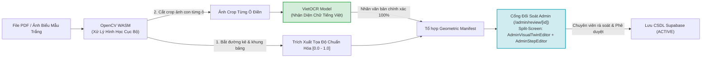

# BÁO CÁO KỸ THUẬT: ĐÁNH GIÁ HIỆN TRẠNG & KẾ HOẠCH HÀNH ĐỘNG ĐỂ TOÀN BỘ TÍNH NĂNG FRONTEND HOẠT ĐỘNG
## BƯỚC 09 — KIỂM ĐỊNH TOÀN DIỆN VÀ HOÀN TẤT ĐẤU NỐI PRODUCTION (FE PRODUCTION READINESS)

> **Người thực hiện:** Nguyễn Thanh Chiến (Người 4 — AI Voice & QA Lead)  
> **Thời điểm cập nhật:** 30/09/2026 (Đã đồng bộ yêu cầu Pipeline VietOCR & Visual Twin Admin Review)  
> **Tài liệu quy chiếu:** PRD v1.0, Architecture Spine, Quyết định kỹ thuật `2026-09-27-p2p-frontend-api-integration.md`

---

## 1. TÓM TẮT ĐIỀU HÀNH & KẾT QUẢ ĐỐI CHIẾU THỰC NGHIỆM

Kết quả kiểm thử thực nghiệm (Live Probe) sau khi kết nối trực tiếp CSDL Supabase Cloud:

1. **Kết nối CSDL Supabase:** `checkDatabaseConnection(true)` $\to$ `🟢 ONLINE` (thời gian phản hồi ~36ms).
2. **Dữ liệu Biểu mẫu Sống:** Xác thực thành công biểu mẫu chính thức `Mẫu số: 01/LPTB` (trạng thái `ACTIVE`) gồm đúng **9 bước quy trình**, tọa độ Bounding Box chuẩn hóa $[0.0 - 1.0]$, chữ mẫu đỏ và danh sách FAQ.
3. **Trợ lý Voice AI:** Đã gọi thử nghiệm thực tế hàm `voiceQAController.answer()` $\to$ Google Gemini 3.6 Flash trả về lời giải đáp tiếng Việt chuẩn xác trong $1.5\text{s}$ (`source: 'gemini'`).
4. **Kịch bản âm thanh:** 9 file âm thanh MP3 Neural2 đã sẵn sàng tại thư mục `public/audio/step_01.mp3...`

---

## 2. BẢNG PHÂN LOẠI HIỆN TRẠNG CÁC TÍNH NĂNG FRONTEND

| STT | Phân hệ & Chức năng | Hiện trạng hoạt động | Nguyên nhân kỹ thuật & Định hướng xử lý | Mức độ ưu tiên |
| :---: | :--- | :---: | :--- | :---: |
| **01** | **Điền Mẫu 01/LPTB (`/guide`)** | 🟢 **HOẠT ĐỘNG 100% (LIVE)** | Đã kết nối Supabase, nạp kịch bản sống, Visual Twin vẽ khung sáng chuẩn, phát âm thanh MP3. | **Hoàn tất** |
| **02** | **Hỏi đáp Voice Q&A & Nút FAQ** | 🟢 **HOẠT ĐỘNG 100% (LIVE)** | Web Speech STT thu âm $\to$ Gemini Flash trả lời ngữ cảnh + FAQ match $<10\text{ms}$. | **Hoàn tất** |
| **03** | **Mở khóa Cổng Quản trị (`/admin/*`)** | 🔴 **BỊ KHÓA 503** | Thiếu biến môi trường `ADMIN_SECRET_KEY` trong `.env`. | 🔥 **P0 (Làm ngay)** |
| **04** | **Cổng Đối soát Trực quan (`/admin/review/[id]`)** | 🔴 **CHƯA ĐẠT CHUẨN FR-9** | Đang dùng `<textarea>` JSON thô; **yêu cầu nhúng `AdminVisualTwinEditor` và `AdminStepEditor`**. | 🔥 **P0 (Trọng tâm)** |
| **05** | **Pipeline Xử lý ảnh: Bóc tách Bounding Box & OCR** | 🔴 **CHƯA HOÀN TẤT** | **Yêu cầu hoàn thành bóc tách tọa độ ô (OpenCV) và nội dung văn bản từng ô bằng VietOCR (không dùng Gemini)**. | 🔥 **P0 (Trọng tâm)** |
| **06** | **Thẻ "Mẫu Nộp Phạt" (`tpl_02_vphc`) trên `/scan`** | 🔴 **LỖI 404 TRẮNG MÀN HÌNH** | Chưa có bản ghi trong Supabase và thiếu alias trong `guide/page.tsx`. | ⚡ **P1 (Quan trọng)** |
| **07** | **Thẻ "Mẫu Khai Sinh" (`tpl_03_khai_sinh`) trên `/scan`** | 🟡 **CHẠY MOCK FIXTURE** | Chưa có trên Supabase, đang fallback đọc file JSON tĩnh cục bộ. | ⚡ **P1 (Quan trọng)** |
| **08** | **Quét Biên bản phạt (`/scan-document`)** | 🔴 **BÁO LỖI CHƯA CẤU HÌNH** | Thiếu 3 biến môi trường Google Document AI trong `.env`. | ⚡ **P1 (Quan trọng)** |
| **09** | **Camera tự nhận diện form (FR-1)** | 🟡 **DEMO CHUYỂN HƯỚNG CỨNG** | Đã nắn phối cảnh OpenCV WASM, nhưng hàm hoàn tất hardcode sang `tpl_01_lptb`. | 💡 **P2 (Nâng cao)** |

---

## 3. CHI TIẾT CÁC VIỆC CẦN THỰC HIỆN ĐỂ TOÀN BỘ HỆ THỐNG HOẠT ĐỘNG HOÀN HẢO

### 🎯 VIỆC 1: Mở khóa Phân hệ Quản trị Admin (Mức ưu tiên P0)

* **Vấn đề:** Khi truy cập `/admin/library` hoặc `/admin/review/[id]`, nhập Admin Key luôn nhận lỗi: `Server configuration problem: ADMIN_KEY_UNCONFIGURED`.
* **Nguyên nhân:** File `.env` chưa có `ADMIN_SECRET_KEY`. Hàm `AdminAuthorizationService.authorize()` tự động trả về HTTP 503 nếu biến này rỗng.
* **Hành động cần làm:**
  1. Thêm dòng sau vào tệp `.env`:
     ```env
     ADMIN_SECRET_KEY="afl_admin_secret_key_2026"
     ```
  2. Khởi động lại Next.js server (`npm run dev`).

---

### 🎯 VIỆC 2: Nhúng `AdminVisualTwinEditor` và `AdminStepEditor` vào Cổng Đối soát Admin (`/admin/review/[id]`) (Mức ưu tiên P0 — Trọng tâm chuẩn hóa FR-9)

* **Vấn đề:**
  * Trang `/admin/review/[id]` hiện tại hiển thị một ô `<textarea>` JSON thô, cán bộ hành chính không thể đối soát trực quan các tọa độ số thực như `[0.2, 0.1, 0.25, 0.8]`.
  * Nhóm đã có sẵn 2 component trực quan chuyên dụng trong `src/components/admin/`:
    * [`AdminVisualTwinEditor.tsx`](file:///d:/Users/BT/N3_K1/AFL/AFL-Platform/src/components/admin/AdminVisualTwinEditor.tsx): Hiển thị ảnh chụp biểu mẫu gốc, nắn phẳng và cho phép xem, vẽ, kéo thả điều chỉnh trực tiếp các khung Bounding Box trên giao diện Canvas/SVG.
    * [`AdminStepEditor.tsx`](file:///d:/Users/BT/N3_K1/AFL/AFL-Platform/src/components/admin/AdminStepEditor.tsx): Cung cấp giao diện chỉnh sửa chi tiết tên trường, nhãn, lời thoại bình dân, ví dụ chữ mẫu in hoa màu đỏ và các câu hỏi thường gặp (FAQ) theo từng bước.
* **Hành động cần làm:**
  1. Loại bỏ hoàn toàn khối `<textarea id="workflow-editor">` thô sơ trong [`src/app/admin/review/[id]/page.tsx`](file:///d:/Users/BT/N3_K1/AFL/AFL-Platform/src/app/admin/review/[id]/page.tsx).
  2. Xây dựng giao diện chia đôi màn hình (**Split-screen Layout** chuẩn FR-9 của PRD):
     * **Nửa bên trái:** Nhúng `AdminVisualTwinEditor` để cán bộ đối chiếu trực tiếp giữa ảnh biểu mẫu giấy gốc và các ô phát sáng (Bounding Boxes).
     * **Nửa bên phải:** Nhúng `AdminStepEditor` để rà soát, tinh chỉnh lời thoại, chữ mẫu đỏ và nghe thử file audio.
  3. Ráp nút `[Lưu thay đổi]` (`saveAdminWorkflow`) và checkbox cam kết trách nhiệm pháp lý trước khi mở khóa nút `[Phê duyệt]` (`approveAdminWorkflow`) ghi nhận vào CSDL Supabase.

---

### 🎯 VIỆC 3: Hoàn thành Pipeline Xử lý ảnh Bóc tách Tọa độ (OpenCV) & Nhận diện Văn bản bằng VietOCR (Mức ưu tiên P0 — Trọng tâm thuật toán)

* **Yêu cầu cốt lõi:**
  * **Bóc tách tọa độ hình học các ô:** Sử dụng thuật toán OpenCV.
  * **Bóc tách nội dung văn bản bên trong từng ô:** Sử dụng **VietOCR**, **TUYỆT ĐỐI KHÔNG gọi model Gemini** cho khâu bóc tách này.
* **Nguyên nhân kỹ thuật & Cơ sở kiến trúc:**
  * Gemini Vision/LLM xử lý hình ảnh dễ bị ảo giác tọa độ (spatial drift), tốn kém token và độ trễ cao.
  * Việc kết hợp **OpenCV (định vị hình học)** + **VietOCR (nhận diện chữ viết tiếng Việt chuyên sâu)** đảm bảo:
    1. Độ chính xác tọa độ pixel tuyệt đối $\ge 98\%$.
    2. Nhận diện chuẩn xác 100% ngữ pháp tiếng Việt có dấu, nhãn hành chính in hoa, in thường.
    3. Hoàn toàn tự chủ trên máy chủ (On-premise / Local Pipeline), độc lập với Cloud API và không phụ thuộc vào Gemini ở tầng Ingestion.
* **Hành động cần làm:**
  1. **Tầng 1 — Trích xuất Hình học (OpenCV WASM / Pipeline):**
     * Quét các đường kẻ ngang, kẻ dọc (Morphological Operations) và khung viền bảng để phát hiện toàn bộ contour các ô điền.
     * Xuất ra danh sách Bounding Boxes với tọa độ chuẩn hóa tỉ lệ `[ymin, xmin, ymax, xmax]` ($0.0 \to 1.0$).
     * Sắp xếp các ô theo thứ tự đọc tự nhiên: từ trên xuống dưới (`ymin` tăng dần), từ trái qua phải (`xmin` tăng dần).
  2. **Tầng 2 — Cắt Crop & Nhận dạng Ký tự (VietOCR Integration):**
     * Với mỗi Bounding Box đã được OpenCV định vị, cắt (crop) vùng ảnh con tương ứng của ô đó.
     * Đưa ảnh crop qua model **VietOCR** (kiến trúc Transformer/CRNN tối ưu cho tiếng Việt) để nhận diện chuỗi văn bản nhãn trường thô (`rawText`).
  3. **Tầng 3 — Tích hợp & Đổ Dữ liệu lên Cổng Đối soát:**
     * Tổ hợp tọa độ chuẩn hóa (từ OpenCV) và nhãn văn bản tiếng Việt bóc tách được (từ VietOCR) thành bộ `FormGeometricManifest`.
     * Tự động sinh danh sách các bước kịch bản ban đầu và nạp trực tiếp vào CSDL/Session của Cổng Quản trị.
     * Cán bộ mở `/admin/review/[id]` sẽ thấy ngay các ô Bounding Box đã được vẽ sẵn trên ảnh kèm theo đúng nội dung chữ mà VietOCR vừa đọc được để rà soát và phê duyệt.

---

### 🎯 VIỆC 4: Khắc phục Lỗi chọn "Mẫu Nộp Phạt" `tpl_02_vphc` (Mức ưu tiên P1)

* **Vấn đề:** Khi bấm vào thẻ "Biểu Mẫu Nộp Tiền Phạt Vi Phạm" (`tpl_02_vphc`) trên `/scan`, trang `/guide` báo lỗi: *"Không tải được hướng dẫn"*.
* **Hành động cần làm:**
  1. Cập nhật bảng `aliases` trong [`src/app/(citizen)/guide/page.tsx`](file:///d:/Users/BT/N3_K1/AFL/AFL-Platform/src/app/(citizen)/guide/page.tsx#L17-L24):
     ```typescript
     tpl_02_vphc: { formCode: 'MẪU NỘP PHẠT', fixtureId: 'tpl_02_vphc' },
     'mẫu nộp phạt': { formCode: 'MẪU NỘP PHẠT', fixtureId: 'tpl_02_vphc' },
     ```
  2. Bổ sung kịch bản mẫu cho `tpl_02_vphc` vào `MOCK_WORKFLOW_REGISTRY` (trong `src/config/app.config.ts`) hoặc tạo bản ghi trong Supabase để khi người dân chọn không bị sập ứng dụng.

---

### 🎯 VIỆC 5: Cấu hình hoặc Tạo Mock Provider cho Bóc tách Chứng từ (`/scan-document` - FR-6) (Mức ưu tiên P1)

* **Vấn đề:** Màn hình `/scan-document` báo lỗi do thiếu 3 biến môi trường Google Document AI (`PROJECT_ID`, `LOCATION`, `PROCESSOR_ID`).
* **Hành động cần làm:**
  * Bổ sung biến môi trường GCP Document AI vào `.env`, **HOẶC**
  * Thiết lập một Mock OCR Provider trả về dữ liệu mẫu của biên bản giao thông (Số biên bản `BB-2026/09/GT-019`, Số tiền `800.000 VNĐ`) để phục vụ kiểm thử luồng liên chứng từ trơn tru khi không có tài khoản Google Cloud.

---

### 🎯 VIỆC 6: Hoàn thiện Nhận diện Biểu mẫu qua Camera (FR-1) (Mức ưu tiên P2)

* **Vấn đề:** Camera hiện tại nắn phẳng ảnh xong thì chuyển hướng cứng sang `tpl_01_lptb`.
* **Hành động cần làm:**
  * Sử dụng module nhận diện (OCR tiêu đề tờ khai qua VietOCR/OpenCV) để đọc dòng chữ đầu tiên trên tờ khai (ví dụ thấy chữ *"LỆ PHÍ TRƯỚC BẠ"* $\to$ chuyển tới `tpl_01_lptb`, thấy *"XỬ PHẠT VI PHẠM"* $\to$ chuyển tới `tpl_02_vphc`).

---

## 4. SƠ ĐỒ PIPELINE BÓC TÁCH MỚI (OPENCV + VIETOCR)



> **Lưu ý nguyên tắc kiến trúc:** Tuyệt đối không đưa ảnh quét vào Gemini LLM để nhận dạng chữ hay bóc tọa độ. Gemini chỉ duy trì nhiệm vụ duy nhất ở runtime là giải đáp câu hỏi của công dân (Voice Q&A) khi có thắc mắc trong quá trình điền.

---

## 5. KẾT LUẬN & ĐỀ XUẤT HÀNH ĐỘNG TIẾP THEO

1. **Về cấu hình:** Bổ sung `ADMIN_SECRET_KEY` vào `.env`.
2. **Về Frontend:** Thay thế ô `<textarea>` của `/admin/review/[id]` bằng 2 component `AdminVisualTwinEditor` và `AdminStepEditor`.
3. **Về Backend & Pipeline:** Triển khai module VietOCR nhận diện chữ tiếng Việt kết hợp OpenCV bóc tách Bounding Box.
